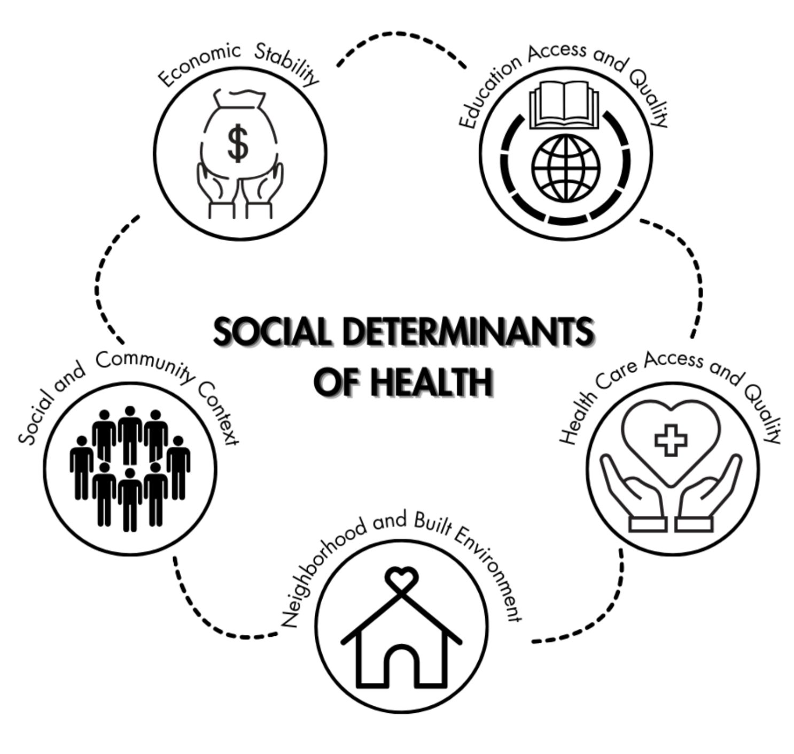
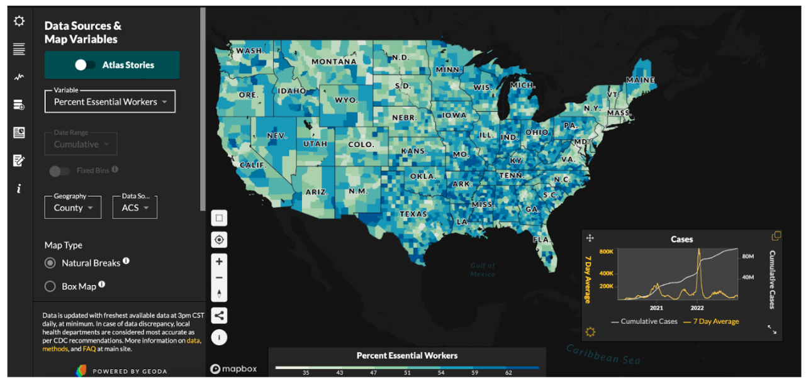
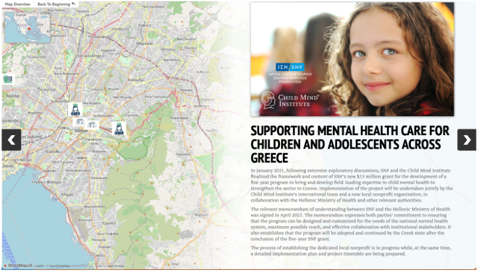
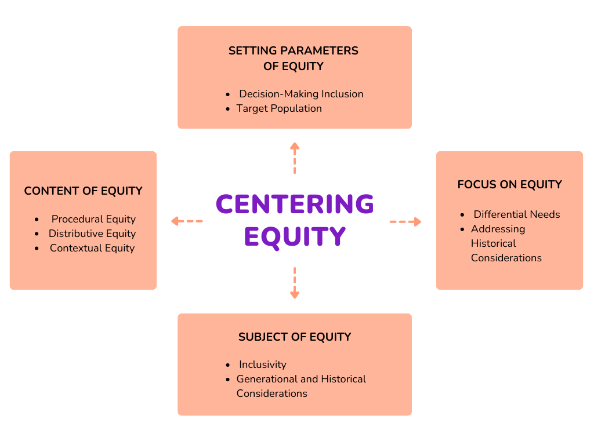
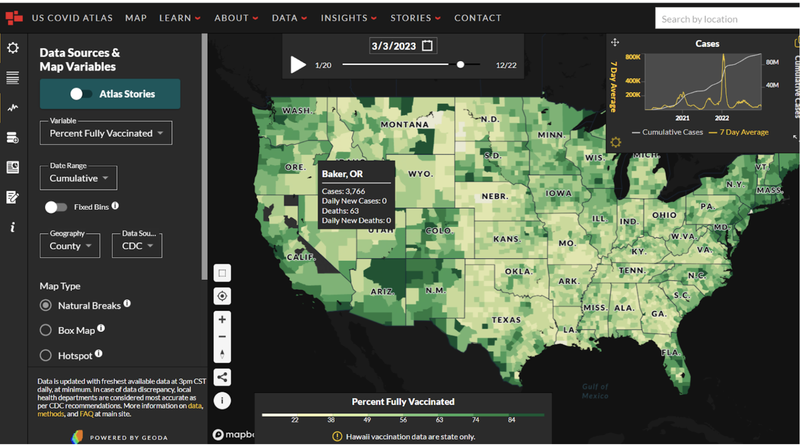

# Introduction

## SDOH & Place 

When we talk about the factors that shape our health, it's not just about biology or lifestyle—it's about where we live and the complex tapestry of history, society, and economy that frames our lives. The [social determinants of health (SDOH)](https://www.cdc.gov/about/sdoh/index.html) encompass a range of historical, social, cultural, and economic factors that significantly impact the well-being of individuals and their communities. These social determinants of health (SDOH) aren't just statistics; they're stories of communities and the places we call home, varying from one street to the next. They're about whether we have parks over parking lots, fresh food on shelves, and whether our neighborhoods are marked by support or segregation.

{width=80%} 

Academics, activists, government agents, and policymakers have employed data visualizations to examine the connections between places and the social determinants of health (SDOH). For example, they have utilized dashboards to study the impact of COVID-19 on vulnerable communities. They implemented [participatory mapping](https://www.cdc.gov/pcd/issues/2020/20_0123.htm) to advocate for policy-based interventions, and deployed [story maps](https://uploads.knightlab.com/storymapjs/ddf1b1212ec9c9aac4bebe45196b367d/hi-update-english/index.html) to promote health initiatives. To produce these data visualizations, health researchers and advocates mobilize a wide array of conceptual frameworks and diverse technical skill sets. Moreover, data visualizations in public health do not only analyze the relationship between places and SDOH. They promote health equity: "a state in which everyone has a fair and equitable opportunity to achieve their highest level of health" (CDC's Office of Health Equity, 2022).

## Dynamic Data Visualizations 

Visualizing public health data isn't just about the 'what'—it's about the 'so what?' It's about crafting digital narratives that anyone can access, understand, and use to make a difference. These visual tools are our digital megaphones and meeting places—they bring us together, keep us informed, and push us towards action. [Data visualizations](https://www.ahrq.gov/data/visualizations/index.html#:~:text=AHRQ's%20interactive%20data%20visualization%20tools,coverage%2C%20and%20emergency%20department%20visits.) in public health that advance equity are digital tools designed to provide accessible and comprehensive data related to public health indicators, focusing on reducing health disparities and promoting equity among different populations. These tools often combine various data sources and visualization techniques to present information in a user-friendly and easily understandable format.

Data visualizations can be used by community members and organizations, research groups, policymakers, and more to empower individuals to better access and mobilize social determinants of health (SDOH) data and advance [health equity](https://www.cdc.gov/healthequity/whatis/index.html).
Within the realm of public health, maps, dashboards, and interactive web applications can be created to foster fairness through an inclusive design that accommodates diverse user groups and their varying degrees of health equity. These tools are not only visually appealing and easy to comprehend, they also provide valuable insights. They adapt to the needs of different social actors by combining well-suited graphics, animations, and audio-visual elements. They even offer networking tools (e.g., messaging boards) for seamless data exchange and user interaction. These interactive features also serve to promptly update users about any alterations.

The Stavros Niarchos Foundation from Greece produced a storymap to present their current health initiatives (source: https://uploads.knightlab.com/storymapjs/ddf1b1212ec9c9aac4bebe45196b367d/hi-update-english/index.html)

### Is there app for that?

++ Viz will be used interchangeable with app and decision support... explain

## Centering Equity
The concept of equity in public health data visualizations goes beyond mere stylistic enhancements to aid in comprehension or research. It extends to encompass connections to pertinent resources and diverse language options, for example, empowering communities with information, processes, and agency to transform, advocate for, and influence residents, neighborhoods, and broader political, economic, and social structures towards healthier systems.

Let's dive deeper into how we can make data visualizations not just informative, but also inclusive and impactful. You see, it's not all about graphs and numbers. By weaving in stories and multimedia—like videos and interactive media streams—we open up a world where data talks to everyone, not just to those who love statistics.

Imagine a dashboard that not only shows you the trends but also tells you the stories behind the numbers. It's designed with real people in mind, adapting to a variety of preferences—whether you’re someone who loves a good narrative or someone who digs deep into the data.

However, we've got to acknowledge that sometimes, our public health systems fall short. They miss the mark on painting the full picture of health disparities. That’s why, when we're talking about Place & SDOH, we need to put equity at the heart of our work—from the word go, right through to the final pixel of the design. It's not just a 'nice-to-have'; it's a must-do for visualizations that truly resonate with and serve all communities.

### Equity Orientation 

The [equity orientation in a public health data system](https://www.ncbi.nlm.nih.gov/pmc/articles/PMC9508440/) involves several key components that must be outlined to address health disparities and promote equitable outcomes effectively. 

These components include:

#### Setting Parameters of Equity:
- Decision-Making Inclusion: The process of setting parameters for equity should involve diverse stakeholders, including representatives from marginalized communities, to ensure that the perspectives and needs of all affected populations are considered.
- Target Population: It is crucial to identify the specific populations and communities that are the focus of efforts to improve equity. This includes recognizing vulnerable groups that historically experience disparities in health outcomes.

#### Focus on Equity:
- Differential Needs: An equity-oriented approach acknowledges that different populations have varying needs and histories. It recognizes the importance of tailoring interventions to address these disparities rather than assuming that a one-size-fits-all approach will be sufficient.
- Addressing Historical Considerations: An equity-oriented system acknowledges historical injustices and systemic discrimination that have contributed to current health disparities. It seeks to redress these past injustices and provide opportunities for affected communities to improve their health and well-being.

#### Subject of Equity:
- Inclusivity: The subject of equity encompasses all individuals and communities facing health disparities, including marginalized and underserved groups.
- Generational and Historical Considerations: An equity-oriented data system takes into account intergenerational and historical factors that have contributed to health disparities. It recognizes that current health outcomes are influenced by past policies and practices.

#### Content of Equity:

- Procedural Equity: This aspect of equity focuses on ensuring that the decision-making processes and procedures are perceived as fair and transparent. It involves involving affected communities in the planning, implementation, and evaluation of health interventions.
- Distributive Equity: Distributive equity concerns how social welfare and resources are distributed to meet the needs of different populations. It aims to allocate resources in a way that reduces health disparities and provides equitable access to healthcare and other essential services.
- Contextual Equity: This aspect acknowledges that pre-existing social conditions (such as poverty, discrimination, and access to resources) influence equity. An equity-oriented data system considers these contextual factors when designing interventions to address health disparities effectively.

Centering Equity (source: https://www.ncbi.nlm.nih.gov/pmc/articles/PMC9508440/, graphic created by Kamaria Barronville).

## Types of Applications 

Throughout this module, we've concentrated on exploring your objectives, recognizing prospective stakeholders, and delving into the spatial data at your disposal for your research. As we progress, we will now examine how these three features converge when it comes to choosing an appropriate spatial visualization. To facilitate this, we will introduce four distinct types of visualizations for investigating social determinants of health: Asset maps, dashboards, thematic maps, and story maps. 

Alright, you’ve got your goals and your team – now, let's talk about bringing it all to life with the right kind of map. It’s like choosing the perfect outfit for the right occasion; each type of spatial visualization has its moment to shine when exploring the social determinants of health. Let's browse through the wardrobe: Asset maps, dashboards, thematic maps, and story maps – each has its own flair.

### Asset Maps 
These are like your community's highlight reel, showcasing everything from the vibrant parks and schools to the people who make your area tick. They're about celebrating what's there, not just what's missing, and sparking conversations about building on those strengths.

{width=80%} 

[Asset mapping] (https://ajph.aphapublications.org/doi/full/10.2105/AJPH.2011.300351 involves engaging with community members, stakeholders, and local organizations to gather information and collaboratively build the map. The process can be facilitated through surveys, interviews, focus groups, and public meetings. The resulting asset map is a visual tool that provides a comprehensive view of the community's strengths, potential partnerships, and areas where support and resources are available. The assets included in an asset map can be diverse and encompass various categories, such as:
- Physical Assets: These include tangible resources like parks, schools, hospitals, community centers, libraries, public transportation, and other infrastructure elements.
- Human Assets: Human resources within the community, such as skilled individuals, volunteers, community leaders, and organizations' staff, are valuable assets.
- Social Assets: Social assets refer to the networks, relationships, and social capital present in the community, including support systems, cultural groups, and community organizations.
- Economic Assets: These include businesses, local enterprises, job opportunities, and other economic resources that contribute to the community's well-being.
- Cultural Assets: The cultural assets encompass the traditions, heritage, arts, and cultural events that enrich the community's identity and cohesion.
- Environmental Assets: Natural resources, green spaces, environmental initiatives, and sustainable practices are considered environmental assets.

Asset Maps empower communities, steer strategic planning, and guide resource allocation. They're about networking and flipping the script to a more positive community narrative.

### Data Dashboards: {-}
Imagine your health community's stats brought to life in real-time – a dashboard that's part control panel, part story, helping everyone from officials to neighbors make sense of the numbers.

In public health, [data dashboards] (https://www.ruralhealthinfo.org/assets/4472-19438/lessons-learned-dashboard-norc-brief.pdf) are digital tools that provide visual representations of key health-related data and indicators. Here’s an example of a dashboard that highlights users stories, [New Video Series: Moving from Data to Action | City Health Dashboard] (https://www.cityhealthdashboard.com/blog-media/1501). These dashboards are specifically designed to present public health data in a user-friendly and easily understandable format, enabling stakeholders, policymakers, researchers, and the general public to access and interpret critical information about population health. 

{width=80%}  

Data dashboards in public health typically include the following features:
- Health Indicators: Dashboards display a variety of health indicators, such as disease rates, mortality rates, vaccination coverage, hospitalization rates, environmental health data, and other relevant metrics.
- Geospatial Data: Many public health dashboards utilize spatial data to present geostatistical analysis in real-time, allowing users to understand health patterns and disparities across different geographic regions.
- Time Series Data: Dashboards often provide data over time, allowing users to observe trends, track changes, and identify seasonal patterns in health outcomes.
- Demographic Disaggregation: Public health data dashboards may disaggregate data by demographic characteristics, such as age, gender, race, ethnicity, and socioeconomic status. This helps identify disparities and understand how health outcomes vary among different population groups.
- Comparisons and Benchmarks: Dashboards may include the ability to compare health outcomes across regions, states, or countries, as well as against national or global benchmarks.
- Data Sources and References: Transparent dashboards typically provide information about the sources of data, data collection methods, and references to ensure data credibility.
- Interactivity: Interactive elements allow users to customize the dashboard, apply filters, and explore data based on their specific interests and questions.
- Alerts and Notifications: Some dashboards include alerting features to notify users about significant changes in health indicators or emerging health threats.
- Data Dashboards keep a pulse on public health, from tracking diseases to zooming in on health equity. They're transparent, interactive, and always on the lookout with alerts.

### Story Maps: {-} 
A [story map] (https://ica-abs.copernicus.org/articles/3/245/2021/ica-abs-3-245-2021.pdf) in public health is a powerful and interactive tool that combines maps, text, images, and multimedia elements to tell a compelling narrative about health-related issues, initiatives, or research. These are your digital storybooks, weaving maps with tales and images that take you on a journey through health challenges and triumphs. It allows public health professionals to present complex data, trends, and information in a visually engaging and accessible manner, making it easier for a wide range of audiences to understand and connect with the subject matter. 

{width=80%}  

Key features and uses of story maps in public health include:
- Data Visualization: Story maps use maps and data visualizations to illustrate health-related trends, patterns, and disparities across geographic regions. This can include disease prevalence, access to healthcare, environmental health risks, and other relevant data.
- Narrative Communication: Story maps are structured to present information in a storytelling format. Public health professionals can use narrative elements to explain the context, significance, and implications of the data, helping the audience grasp the larger story behind the statistics.
- Health Education and Promotion: Story maps are an effective educational tool to raise awareness about public health issues, promote healthy behaviors, and disseminate health-related information to the public.
- Community Engagement: Story maps can engage communities in public health initiatives by presenting data and insights in a way that is relevant and relatable to specific geographic areas or demographics.
- Policy Advocacy: Public health professionals can use story maps to advocate for specific policy changes by visualizing the impact of current policies and proposing evidence-based solutions.
- Environmental Health: Story maps can be used to communicate information about environmental health hazards, pollution, and their impact on public health. They can also showcase initiatives aimed at improving environmental conditions and public health outcomes.
- Outbreak Response and Preparedness: Story maps can be utilized during disease outbreaks to track the spread of infections, identify hotspots, and inform response efforts.
- Health Equity and Disparities: Story maps can highlight health disparities and inequities across different communities and populations, drawing attention to areas with the most significant health challenges and the need for targeted interventions.

Story Maps turn data into engaging tales, educate, and rally communities. They're advocates, educators, and responders all in one.

### Thematic Maps: {-}
Here's where we paint with data, using colors and symbols to show patterns like disease spread or healthcare access across different places. [Thematic maps] (https://www.cdc.gov/dhdsp/maps/gisx/resources/thematic-maps.html) in public health are maps that use visual symbols, colors, and patterns to represent specific health-related data or themes within a geographic area. Thematic maps are valuable tools in public health for conveying complex information in a spatial context, allowing researchers, policymakers, and the public to quickly understand and interpret health-related data.

Thematic maps in public health are used for a variety of purposes, including:
- Visualizing disease prevalence and distribution
- Identifying health disparities across different regions or demographic groups
- Monitoring disease outbreaks and patterns
- Assessing access to healthcare services and resources
- Evaluating the impact of public health interventions and policies
- Communicating public health information to the general public and stakeholders

{width=80%}  

Thematic Maps get straight to the point, showing you who and where are affected by health issues, helping to direct attention and resources effectively.

#### Activity 1.4: {-}

After exploring the four spatial visualizations (e.g., story maps, thematic maps, dashboards, and asset maps), it is essential to reflect on their advantages and limitations. Create a list of three advantages and three limitations for each of the four visualizations that we reviewed in this module.

For example, you could focus on which visualization is better suited for displaying a place's historical health trends, analyzing the impact of a pandemic, or explaining the results of a public policy? Which visualization requires some experience with statistics and coding, and which one requires experience with the humanities and storytelling?

