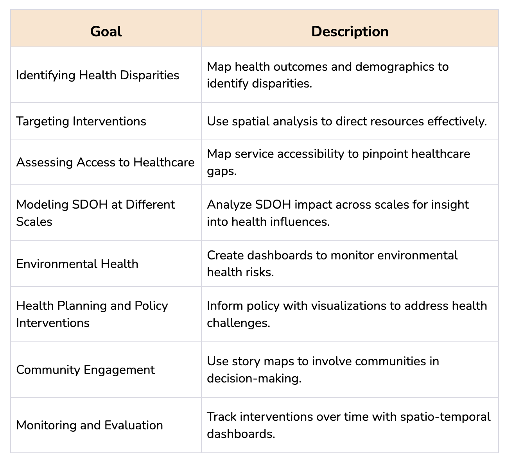
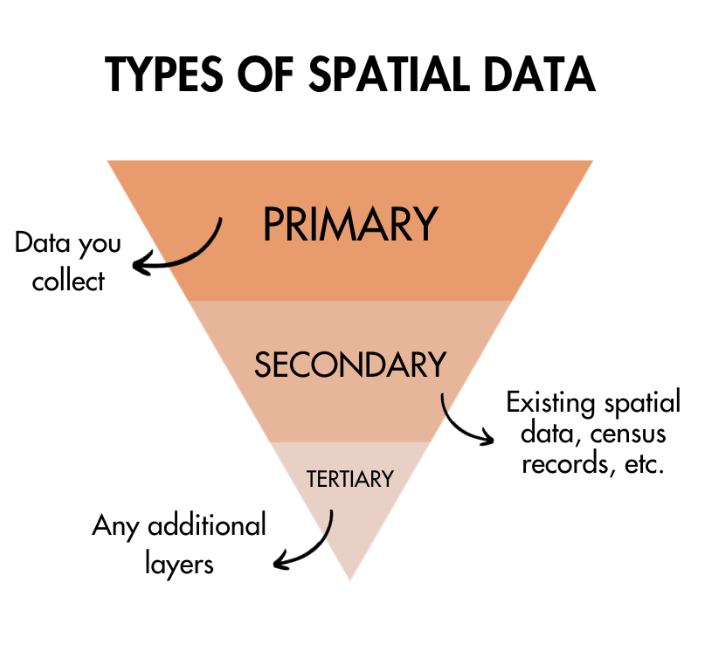

# Project Scoping 

## Environment Setup 

By the end of this module, you will: 

- X spatial data visualizations in public health
- X your stakeholders’ needs
- Select the best spatial visualization type for your project 

Think of spatial data visualizations as your bridge to meaningful conversations in public health. Nevertheless, crafting insightful maps, dashboards, or other spatial representations can be challenging, due to both technical and methodological hurdles. The path to creating an effective spatial data visualization does not commence with software usage; rather, it initiates with stakeholder meetings, annotations, and sketches. Therefore, the primary objective of this module is to encourage you to invest time in thinking about your potential visualization and considering the individuals who will reap its benefits. 

Annotations, sketches, and meeting summaries can be handwritten in a notebook or digitally generated on a computer. We recommend creating a journal for this toolkit to annotate and store your notes. Your toolkit journal will assist you in organizing your thoughts, creating new content, making sketches, saving code, writing notes from meetings, and reflecting on your mapping process. Indeed, the production of relevant visualizations related to SDOH is a lengthy and complex process that requires creativity, organization, and technological skills. Your journal can be an invaluable companion on your journey.

### Required Tools {-}

For this module, you need your toolkit journal: 

- Notebook and writing utensil or
- Note-taking or sketching app (if you prefer digital annotations) 

Some of our team members prefer drawing on post-it notes, tablets, digital apps, or wall-sized pieces of paper. Take your pick and go with it!

## What's the Point?

The goal of this project will be to develop some place-based data viz/app/decision support that will integrate social determinants of health and an equity framework.

But, what will you, do, specifically — and why? Let's run through some core questions.

**Where** is your application? Is it within a city, neighborhood, or across an entire country? 

- Greater *spatial coverage* does not necessarily mean that your project will get more complex. It may be easier to grab data for all communities within a city from a data portal, for example, than extract data for a single neighborhood. Having more areas available for comparison can also be useful.

- Greater *spatial resolution* does tend to make projects more complicated, on the other hand. You want to explore state policies for 50 states? No problem. Want to grab census tract data for the entire country (all 77,000)? This will limit your visualization options, as some software approaches will be able to handle it with ease, whereas others not all. 

**Who** is your application *about* — a specific population, defined by their residence and/or some social, economic, or other characteristic? And, **Who** is your application *for*? Who will actually be using your application? How and why are they different?

- Data may not be available for all places and populations. For example, COVID-19 data by race and ethnicity is still not disaggregated below the state-level for all counties in the U.S (!). You may need to start with your ideal, and then work towards what's actually doable.

- As this toolkit will encourage more than once, it is helpful to work with persons who will actually use the application, to increase its meaning and utility. At the same time, it is also helpful to work with persons who the data is about, as lived experiences will provide invaluable understanding, depth, and insight into the project of interest. 

**When** is your application — are you focused on the most recent datasets you can find, or are you interested in data over many time periods? And, how will the application itself be changed or updated over time? 

- Consider the sustainability and long-term maintenance needs of your project. Where will it be in five years? Would it be okay for the application to exist as a time capsule for a project completed, or do you prefer it to have data updated regularly?

**What** actions should/could result from your application? Are they reasonable, feasible, and time-bound? 

- Do you intend for your interactive asset map of cooling centers to be used by community members during a heat event to find refuge? Are you trying to inspire action from policymakers after exploring your data dashboard of modeled map findings and statistics on health disparities? 

- It is common to start with too ambitious a goal, that will slowly get refined over the project's course of implementation. Try to be realistic and honest when assessing what your final project could do.

**Why** is it important? **Why** should people care?

- This is often the most important question, and the one least formulated in early stages of the process. Something may be interesting and meaningful to you, but may not be important to others. Or it may be very obvious to you and your peers, but the thought hasn't occurred to others in a different discipline or domain. Be specific and intentional in setting this objective, and do the research. 

Put these together to generate an overview goal statement for your project. Include the primary question you’re trying to answer. This may change throughout the process, but should be changed to be refined further, rather than expanded in scope.  

Think of the start of your project as setting out on a road trip. First, you need to map out where you want to go. What do you hope to discover along the way? Your visualization techniques are like choosing the right vehicle for the journey—each has its strengths for different terrains. Your goals will evolve as you travel, finding new paths to explore. But it all starts with a clear destination in mind.

## Refining Goals for SDOH 

Taking your project a step further, dig deeper into how your application can address SDOH directly. Which common approach or technique is the most pertinent to your goals? Consider the following ideas:

- **Identifying Health Disparities**: You can employ spatial visualizations to identify areas with disproportionate health burdens and disparities. For example, by mapping health outcomes and demographic data from the census, it could become evident which communities or populations experience higher rates of diseases or poor health, shedding light on potential health inequities.

- **Targeting Interventions**:  Another option is performing spatial analyses to target interventions and resources to areas with the greatest need. By creating asset maps, you could aid public health advocates to direct their efforts, and allocate resources to address health disparities and promote equity.

- **Assessing Access to Healthcare**:  You can produce maps to evaluate the accessibility of healthcare services across different regions. These cartographies identify areas with limited access to medical facilities or services, which is crucial in understanding barriers to healthcare for marginalized populations and addressing health disparities.

- **Modeling SDOH at Different Scales**: You can produce geostatistical analyses to model how social determinants of health (SODH) affect communities at different scales. By studying and mapping these factors, you may better understand how social conditions influence health outcomes and equity.

- **Environmental Justice**: You could create a dashboard to assess environmental health risks and exposures. By combining graphs, maps, and tables you may identify areas with environmental hazards that disproportionately affect specific communities, contributing to health disparities.

- **Health Planning and Policy Interventions**: Your maps can inform stakeholders in their efforts to create effective policies. By deploying various spatial visualizations, you can support interventions targeting specific health challenges in various communities, ultimately promoting health equity.

- **Community Engagement**: Story maps or collaborative mapping projects may facilitate community engagement by providing social experience insights. These representations allow community members to participate in decision-making, voice their concerns, and collaborate with public health officials to design interventions that address their unique needs and concerns.

- **Monitoring and Evaluation**: Spatio-temporal dashboards are effective tools to monitor the effectiveness of interventions over time. By comparing health outcomes before and after implementing interventions, public health officials can assess whether disparities are decreasing and health equity is improving.

{width=90%} 

### Content of Equity

Think back to the equity framework introduced in the first module. While each component is critical to any application built to understand and communicate SDOH, the **Content of Equity** component can be another useful tool for building into your goals.

- **Procedural Equity:** This aspect of equity focuses on ensuring that the decision-making processes and procedures are perceived as fair and transparent. It involves involving affected communities in the planning, implementation, and evaluation of health interventions.

- **Distributive Equity:** Distributive equity concerns how social welfare and resources are distributed to meet the needs of different populations. It aims to allocate resources in a way that reduces health disparities and provides equitable access to healthcare and other essential services.

- **Contextual Equity:** This aspect acknowledges that pre-existing social conditions (such as poverty, discrimination, and access to resources) influence equity. An equity-oriented data system considers these contextual factors when designing interventions to address health disparities effectively.

You can be explicit in how your application may address equity by focusing on one or more of these aspeccts.
 
### Activity 1.1 {-}
Take a look at these three real-world projects. In your own words, sketch out their goals. Do they align with any of the SDOH application goals we've mapped above? What content of equity (procedural, distributive, or contextual) do they address?

- [Data and Stats | Tulsa Health Department](https://www.tulsa-health.org/community-health/data-stats/north-tulsa-medical-provider-and-pharmacy-asset-map)

- [United States of Health Dashboard | McKinsey & Company](https://www.mckinsey.com/industries/public-sector/our-insights/us-public-health-dashboard)

- [Heart Disease Death Rates Aged 35 and older, Total Population | cdc.gov](https://www.cdc.gov/dhdsp/maps/national_maps/hd_all.htm)

Next, update your own goal statement based on ideas in this section. What are your SDOH and Equity goals?

## Defining Stakeholders 
Once you've got your project's goals on the horizon, it's time to look at who's journeying with you. Collaboration and stakeholder identification are vital components of any project that aims to achieve equity. Whether it's a non-governmental organization, a research group within a university, or a government agency, stakeholders bring diverse perspectives and expertise to the table. Similarly, communities, activists, and advocates can also play a significant role in your project's success. 

Early identification of stakeholders is key to building trust and solidarity, which is a time-consuming but necessary process. By working together with your stakeholders, you can produce an impactful SDOH project. 

### Motivations {-}
Here’s how this alliance can shape your journey:

- Understanding Diverse Perspectives: Stakeholders come from various backgrounds and sectors, each bringing unique insights that can challenge and enrich your project's approach to health. A government official might understand policy implications, while a local activist might provide a grassroots perspective on community health challenges.
- Data Gathering and Validation: Collaborators are crucial in both collecting and validating SDOH data. They ensure that the information reflects real-world conditions and is relevant to the communities affected. Researchers can provide rigorous methodologies, while community members can offer qualitative insights that ground the data in lived experiences.
- Expanding the Network: Engaging with stakeholders allows for the expansion of your network. Each stakeholder may introduce you to other relevant parties, broadening the reach and potential impact of your project. This can lead to discovering untapped resources or finding new avenues for support and advocacy.
Exploring New Contexts: Stakeholders can act as guides through unfamiliar territories, both metaphorically in the project domain and literally in the community spaces. They help navigate the cultural, social, and political landscapes that shape health outcomes.
- Innovative Co-Design: Utilizing User-Centered Design principles, stakeholders become co-creators in developing spatial visualizations that represent SDOH. Their input ensures that the end products are not only technically sound but also culturally sensitive and user-friendly.
- Forging Partnerships: Collaboration can lead to long-term partnerships that extend beyond the life of a single project. These relationships can build a foundation for future initiatives, creating a sustainable impact on public health.
Revising Project Goals: Stakeholders often provide new insights that can lead to a reframing of project goals. What begins as a narrow focus on a particular health issue might evolve into a more holistic approach that considers a wider range of social factors.
- Ensuring Equity: By involving a diverse group of stakeholders, the project is more likely to address equity in a meaningful way. Equity is not just about equal access, it's also about designing interventions that acknowledge and address power imbalances and historical contexts that contribute to health disparities.

In Module 2, we will delve deeper into employing User-Centered Design to engage stakeholders effectively. The aim will be to ensure that every step of the project, from conception to implementation, is done in collaboration with those who have a vested interest in the outcomes, guaranteeing that the resulting initiatives are equitable, impactful, and sustainable.

### Activity 1.2 {-}

Review these two projects and identify their stakeholders. Explain what is their role in each project.

[Urban Youths Go 3000 Miles: Engaging and Supporting Young Residents to Conduct Neighborhood Asset Mapping | AJPH] (https://ajph.aphapublications.org/doi/full/10.2105/AJPH.2011.300351)
[Food assets for whom? Community perspectives on food asset mapping in Canada] (https://www.tandfonline.com/doi/full/10.1080/17549175.2021.1918750)

## Assess Your Strengths

Each project will require **domain expertise** and **technical capacity**. [[ explain both]] 

Which is your strength, and which will you need to skill up to further support for project implementation? 

For example: 

- If your project is about building an asset map to support populations experiencing food insecurity, you may be a food bank volunteer who has worked directly with populations impacted, live in the community, and also would be using the application with collaboration from the regional food pantry network. In this case, you have extensive domain expertise and knowledge that will be more enriched than most web app developers, assuming you are not a developer for your day job. For this project, your goal will be to scale up your technical capacity within the constraints of your setting. 

- On the other hand, perhaps you are a graduate student who has been coding statistical models for your work, and are interested in adding more social impact to your work. You’re used to learning new programming languages for new projects, and have a high technical capacity, but are not embedded within the community you want to build an asset map for. For this project, your goal will be to scale up your understanding of equity based frameworks, learning more about community experiences, as well as researching the topic further to build your domain expertise. 

After assessing your strengths, go back to your list of stakeholders and update as needed. Note that as your expand your stakeholder team, your project may update according to shared goals and visions of team members. As a result, your team will work through the assessment process more than once. This iterative process is expected.

## Assess Project Needs
Project Needs will include data, computer services, time, and attitude. To assess this, you will need to survey your motivation and paint points, as well as technical, financial, people, and time resources. Consider sustainability at this stage… 

## Establish Deliverables

++ application action goals:
- Access to information (ex. Drop-down selection, click for pop-up window, scrollytelling)
- User-prompted input (ex. Slider, number entry)

++ SMART goals/similar? 

## Establish Process

### Rule of 3
++ data preparation, analysis, application development (recommend that just 1 is intensive)

### Project Manage
- Generate a timeline, and break out tasks
- How will you manage & document your process?
- Communications plan between team members & stakeholders?

### Agile Processes
- 

[[ likely pare this down, move some to data assessment above, and some of the rest to later module? ]]

After understanding the significance of refining objectives and finding stakeholders, it is crucial to take into account one of the essential elements in your project--the spatial component. This toolkit underscores the fact that social determinants of health encompass more than personal genetics or healthy habits. According to the World Health Organization, social determinants of health refer to the conditions in which people are born, grow, live, work, and age (https://health.gov/healthypeople, accessed 11 October, 2023 ). By adopting a spatial view of SDOH, we can research how communities are affected by the places they inhabit. For instance, we can evaluate their access to health care, transportation, recreation, and green areas. On the other hand, some communities may be exposed in their neighborhoods to crime, racism, and pollution. By mobilizing spatial visualizations, we can identify and address these inequalities.

The spatial data we need for our visualizations can be quite different. While censuses and databases can provide a starting point, it's important to understand their nature - what they include and what they leave out, who generates them (whether it's the public or private sector), and what their intended purpose is. Scrutinizing spatial data is critical to start conceiving your spatial visualization.
Think of spatial data as your high-powered lens zooming in on a community's heartbeat. It lets you see beyond the surface to the underlying structures—like healthcare reach, parks, and transport. And yes, it also uncovers the shadows of crime, discrimination, and pollution. In your SDOH project, you can typically use three types of spatial data: primary, secondary, and tertiary. In the following section, we will provide a brief description of each of these types of data.

{width=80%} 

- Primary Spatial Data: Primary spatial data refers to the data that you can collect either personally or through a sensor/machine which you or your stakeholders have previously installed. There are several examples of spatial visualizations of SDOH made with primary data. Some researchers have used online interviews or questionnaires to analyze their experiences in their neighborhood. Other researchers have placed sensors to map air quality in cities. The use of Global Positioning Systems (GPS) or smartphones is another way to generate primary data.

- Secondary Spatial Data:  You may encounter challenges when gathering SDOH primary spatial data, as it can be a time-consuming and costly endeavor. As a result, SDOH researchers, mapmakers, and advocates frequently turn to various secondary resources, such as spatial databases and census records, to inform their spatial representations. Typically, these files consist of digital layers that are prepared for seamless incorporation into a GIS or web mapping application. However, you can also work and manipulate non-spatial data in your project. Notable sources for such data include both profit and non-profit databases, government census information, and even digitized or scanned paper maps.

- Tertiary Spatial Data: In the realm of SDOH spatial visualizations, there exists a third option–your map(s) may access other maps’ spatial data. Tertiary spatial data are spatial layers that have been previously or currently utilized in other cartographies and are readily accessible for integration into a Geographic Information System (GIS) or web mapping applications. When engaging with stakeholders experienced in health mapping, it's worth inquiring whether they possess any spatial layers that could prove beneficial for your project. 

It is key to emphasize that data can often be tainted by biases and errors. As a result, the methods used to gather, aggregate, or model spatial data can have adverse effects on the quality of our data visualizations. It is of utmost importance to meticulously scrutinize various forms of data, whether they are qualitative (e..g, interviews or questionnaires), quantitative (e.g., databases), or mixed (e.g., surveys). A valuable starting point for data analysis involves assessing metadata within databases or interview questions. Further insights into this subject will be explored in subsequent sections of this toolkit.

### Project Tip: {-}
In your project, there's no need to limit yourself to just one kind of data. In fact, it's not only possible but often necessary to mix and match different sources and types of spatial data to craft compelling SDOH spatial visualizations.

### Activity 1.3: {-}
Review these projects below and identify what type of data they use. In your opinion, what other types of data could they use to enrich their visualizations? 

[Using Asset Mapping to Identify Health Needs of a Latinx Population in Rural Virginia] (https://scholarscompass.vcu.edu/cgi/viewcontent.cgi?article=1396&context=uresposters)
[US Social Determinants of Health Atlas - Map of the Month] (https://carto.com/blog/visualizing-health-data-social-factors)

#### Project Tip: 

Module 1 is just the beginning of a process. To keep progressing, it's essential to always look for inspiration and stakeholders. Take some time to explore various web maps, dashboards, atlases, magazines, and academic articles. Then, list the ones you find appealing in your journal. Even if they are spatial visualizations that have nothing to do with health, try to imagine how you can use their design to study SDOH.

#### Module 1 Activity: {-}

Think of a problem you want to solve. Write down your purpose and objectives by clearly stating why you want to solve this problem and what you hope to achieve. Who is your target audience? 

Next, make a list of your potential stakeholders. How would you contact your stakeholders and why would they be interested in collaborating with you? Would you be part of an ongoing project or propose a new one?

The format for this exercise is flexible and exploratory. You can opt to create lists of objectives, draw diagrams, write a structured plan, or engage in a free-writing exercise.

The primary aim of this task is to develop a foundation to begin exploring spatial data for your project.It's important to note that your final prototype might diverge significantly from what you record in this entry, and that's perfectly acceptable. Remember, the process of using SDOH spatial data for visualizations is a dynamic process.

#### Summary of Module 1 {-}

In Module 1, the focus is on goal setting for a spatial visualization project related to social determinants of health (SDOH) in public health. Here's a summary of the key points:

Objectives (1.1):
- Clarifying project goals is the initial step.
- The choice of visualization techniques is closely tied to project objectives.
- General goals include identifying health disparities, targeting interventions, assessing access to healthcare, modeling SDOH at different scales, evaluating environmental health, informing health planning and policy, engaging the community, and monitoring and evaluating interventions.

Stakeholders (1.2):

- Collaboration and stakeholder identification are essential for achieving equity.
- Stakeholders can be organizations, researchers, government agencies, communities, activists, and advocates.
- Early identification of stakeholders builds trust and solidarity.

Spatial Data (1.3):
- Social determinants of health encompass conditions in which people are born, grow, live, work, and age.
- Spatial data is crucial for understanding how communities are affected by their environments.
- Three types of spatial data are primary (collected personally), secondary (from databases and census records), and tertiary (previously used in other maps).

Data Visualizations (1.4):
- Four types of spatial visualizations are discussed: asset maps, data dashboards, story maps, and thematic maps.
- Asset maps focus on community strengths and resources.
- Data dashboards present health-related data in a user-friendly format.
- Story maps combine maps, text, images, and multimedia for storytelling.
- Thematic maps use visual symbols to represent specific health-related data or themes within a geographic area.

The module also encourages exploring external resources and encourages participants to think about their own project's purpose, objectives, target audience, and potential stakeholders. It emphasizes that Module 1 is the beginning of a dynamic process in the journey of using spatial data for SDOH visualizations in public health.
