---
---

# Human Centered Design

:::objective
**Objectives**

In this module, you will: 

- Describe the fundamental concepts of Human-Centered Design

- Analyze various design elements (e.g., graphic icons, layout, text fonts)

- Create a user interface prototype

:::

Picture yourself not just as a creator, advocate, policymaker, or researcher but also as a storyteller and a listener. In this module, you're going to learn the ropes of Human-Centered Design (HCD)—it's all about making sure our designs click with the very people they're meant for. We're talking about a real connection.

> The primary objective of a successful data visualization method should be to meet the needs of the individuals who will be using it.

This entails understanding their objectives in using web applications, their situations, and their familiarity levels. It's essential to determine the design approaches that would most effectively cater to these requirements. Not planning appropriately can lead to revising the design which would eventually slow you down from releasing the application you have in mind. Therefore, a crucial first step of any data visualization planning process is to identify the users and understand what they want out of the visualization. 

## Design Methods

Let's dive into the world of design methodologies, where each approach brings something special to the table. Our star player here is **Human-Centered Design (HCD)**, a method that puts people at the heart of the design process. HCD is all about getting into the users' shoes, understanding what they need and want, and then crafting solutions that hit the mark. But that's not the whole story. We're also going to peek into some other relevant and overlapping design methods, each with its flavor:

<!-- ```{r table-simple, echo=FALSE, message=FALSE, warnings=FALSE, results='asis'} -->
<!-- require(pander) -->
<!-- panderOptions('table.split.table', Inf) -->
<!-- my.data <- " Type          | Description  -->
<!--  Human-Centered Design (user-focused design approach)          | An approach to problem-solving that starts with people and ends with innovative solutions tailored to suit their needs. It involves understanding the perspective of the users for whom you're designing, generating a range of ideas, and iteratively testing and refining solutions  -->
<!--  Participatory Design (collaborative design approach)          | A process that involves all stakeholders, especially users, in the design process. The aim is to ensure that the designed product meets the needs and expectations of the users. It often involves workshops, user interviews, and collaborative sessions where users actively contribute ideas and feedback.  -->
<!--  Design Thinking (problem-solving framework)          | A non-linear, iterative process used to understand users, challenge assumptions, redefine problems, and create innovative solutions to prototype and test. It comprises five phases: Empathize, Define, Ideate, Prototype, and Test. This approach encourages questioning, experimentation, observation, and innovation.  -->
<!--  Universal Design (accessibility-focused design approach)          | Involves creating products and environments that are accessible and usable by all people, to the greatest extent possible, without the need for adaptation or specialized design. It emphasizes simplicity, intuitiveness, and accommodating a wide range of individual preferences and abilities.  -->
<!--  Experience Design (user experience-focused design approach)          | Focused on the quality of the user experience and culturally relevant solutions. It goes beyond the product itself to include all aspects of the user's interaction with a company, its services, and its products. " -->

<!-- df <- read.delim(textConnection(my.data),header=FALSE,sep="|",strip.white=TRUE,stringsAsFactors=FALSE) -->
<!-- names(df) <- unname(as.list(df[1,])) # put headers on -->
<!-- df <- df[-1,] # remove first row -->
<!-- row.names(df)<-NULL -->
<!-- pander(df, style = 'rmarkdown') -->
<!-- ``` -->
<!-- </br> -->

<details markdown='1'><summary>**Human-Centered Design**</summary>
Type: User-focused design approach</br/>
An approach to problem-solving that starts with people and ends with solutions tailored to suit their needs. It involves understanding the perspective of the users for whom you're designing, generating a range of ideas, and iteratively testing and refining solutions.
<br/><br/></details>

<details markdown='1'><summary>**Participatory Design**</summary>
Type: Collaborative design approach<br/>
A process that involves all stakeholders, especially users, in the design process. The aim is to ensure that the designed product meets the needs and expectations of the users. It often involves workshops, user interviews, and collaborative sessions where users actively contribute ideas and feedback.
<br/><br/></details>

<details markdown='1'><summary>**Design Thinking**</summary>
Type: Problem-solving framework<br/>
A non-linear, iterative process used to understand users, challenge assumptions, redefine problems, and create innovative solutions to prototype and test. It comprises five phases: Empathize, Define, Ideate, Prototype, and Test. This approach encourages questioning, experimentation, observation, and innovation.
<br/><br/></details>

<details markdown='1'><summary>**Universal Design**</summary>
Type: Accessibility-focused design approach<br/>
Involves creating products and environments that are accessible and usable by all people, to the greatest extent possible, without the need for adaptation or specialized design. It emphasizes simplicity, intuitiveness, and accommodating a wide range of individual preferences and abilities.
<br/><br/></details>

<details markdown='1'><summary>**Experience Design**</summary>
Type: User experience-focused design approach<br/>
Focused on the quality of the user experience and culturally relevant solutions. It goes beyond the product itself to include all aspects of the user's interaction with an organization, its services, and its products.
<br/><br/></details>


## Human-Centered Design

Human-Centered Design (HCD) is a well-researched framework that provides a set of guidelines and processes to ensure that designs cater to the desires, abilities, and contexts of their potential end users. Our focus is on HCD as it guides the designer in you to to empathize with users, understand their needs, wants, and experiences, and create designs that engage and adapt to the context of their real lives. Employing HCD can also reduce the risk of negative outcomes and enhance user well-being.

Applications of HCD principles have generated a design process that shares the following three steps:

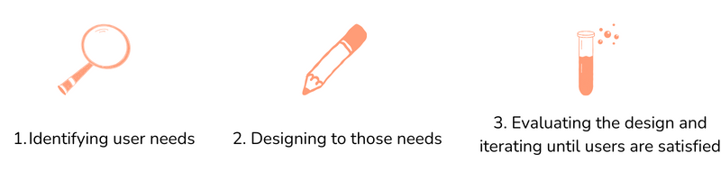{width=95%}

Throughout these steps, the designer will constantly 'diverge' their ideas to think wide and open while 'converge' their scope and prototype with focus.

### Identifying User Needs {-}
The first step of the HCD process is to understand what a user hopes to accomplish and the conditions that will allow them to do so. 

To determine user needs, inclusive workshops are an effective way of bringing users into the design process and empowering them to share their goals for the tool as well as their particular concerns and contexts that might shape their use of the application. The success of these workshops depends on how well the participants represent a potentially **diverse end-user group**: to best understand the true breadth of needs to be considered, users of all different backgrounds, experience levels, and goals must be given equal opportunity to provide insight.

Establishing common terminology with workshop participants is necessary as they may not be familiar with application design or data discovery. Therefore, certain functionalities must be explained with examples to allow participants to articulate what sorts of features they may benefit from.

Workshops can be organized in a way that is feasible and comfortable for all:

<details markdown='1'><summary>**Virtual workshop**</summary>
Virtual meetings (over Zoom, for example) are an effective way to hold these workshops. Virtual meetings allow for a broader spectrum of users to participate. In these meetings, it is recommended to include multimodal communication, such as a mix of presentations, live discussions, polling, and a chat function. This ensures that participants with varying levels and preferences of engagement get an opportunity to speak their minds.
<br/><br/></details>

<details markdown='1'><summary>**In-person workshop**</summary>
If you’re lucky that all your users are available for an in-person workshop, then using a whiteboard, sticky notes, and other stationery is recommended.
<br/><br/></details>

Free online platforms are available to enable a collaborative brainstorming session to determine user needs, be it virtual or in-person. FigJam and Miro, for example, are free online collaboration tools that allow users to brainstorm and organize ideas, allowing for real-time interactive sessions between team members.

:::activity
**Activity**

Making User Personas

One of the most effective ways to get started with identifying user needs is to create details around each *user persona*. This way, you can not only test the assumptions that you make about your personas but also see how far you can ideate on their potential needs. The primary object is to understand the personas by gaining a deep understanding of their **needs, preferences, behaviors, and goals.** This understanding is crucial for developing the application in the direction that resonates with their needs. 

During the exercise, personas are looked at from a more humanized lens that helps build empathy as it is easier to relate to a fictional character representing a real user than to an abstract persona. We recommend using the User Persona FigJam template to collaborate and build a meaningful set of user personas, for which steps are provided:

<details markdown='1'><summary>**Step 1: Accessing FigJam and load the User Persona FigJam template**</summary>

1. Go to the [Figma website](https://www.figma.com/) and sign in or create a new account. - If you don't have an account, click on "Sign Up" to create a new account. Follow the on-screen instructions to complete the registration process. You can choose a free account, but if you have the chance, pick the academic account since it provides more perks. 

2. Once you sign up, Figma will lead you to your personal workspace. Under Teams (left part of the screen), select “Create new team.” Name your new team as you like, we will name it “Place Project.” You can skip adding your collaborators and choose the starter option.  

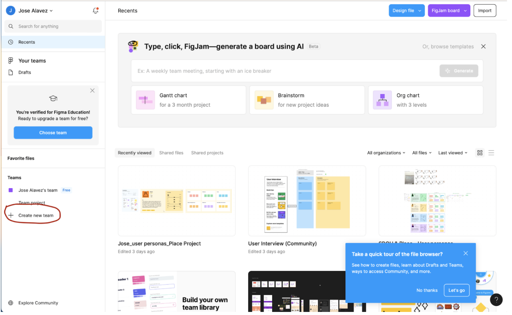{width=90%} 

3. Once you have your new team, access the [User Persona FigJam template](https://www.figma.com/community/file/1027357893837345723/user-persona) webpage and click on the "open in Figjam" button. This action will open the template into your own work space.

<br/></details>

<details markdown='1'><summary>**Step 2: Edit the User Persona Template**</summary>

1. Once the template is open, you'll see a canvas with predefined sections for different aspects of a user persona (e.g., demographics, goals, frustrations). Take a few minutes to explore this template. You can zoom into specific sections. 

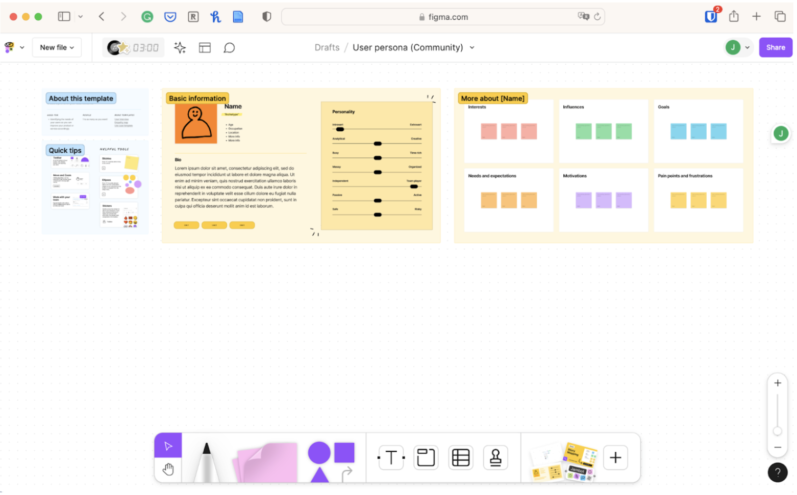{width=90%} 


2. You will see the name of the file on the top of the canvas. The default name is "User persona (community)" Click on the arrow and choose “rename.” You may name your new file "Place Project - User Personas," but you can pick your own name. Click on the arrow once again and pick “move to project” and move your file under the team you created on Step 1.2 of this guide. 
   
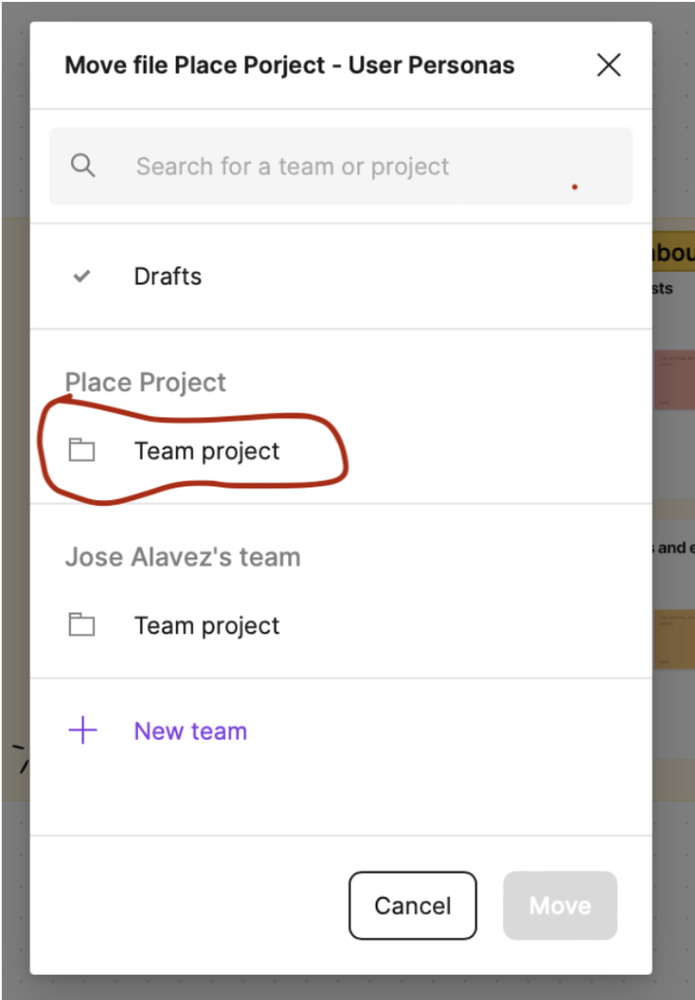{width=90%} 

3. Now that your file is in the correct project, click on each section on the canvas to edit the text and add details relevant to your potential user personas. You may change the image of your personas, change their personality traits by moving the sliders, and write on the sticky notes their interests, motivations, goals, pain points and frustrations etc. 

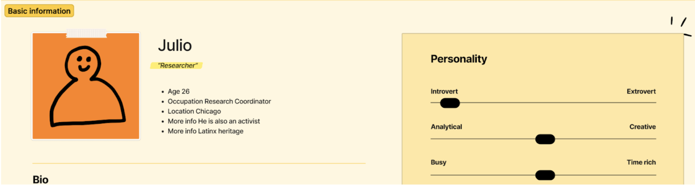{width=90%} 

4. You can also use the drawing tools, sticky notes, and connectors (below of the screen) to enhance the visual representation of your user personas.

5. You can also copy and paste different elements of this template. For example, right click on the "Basic Information Section," paste it on the canvas and move this section just below your first persona. Do the same with the "More about'' section. Now, you can have multiple personas with different skills, motivations, and personalities. 

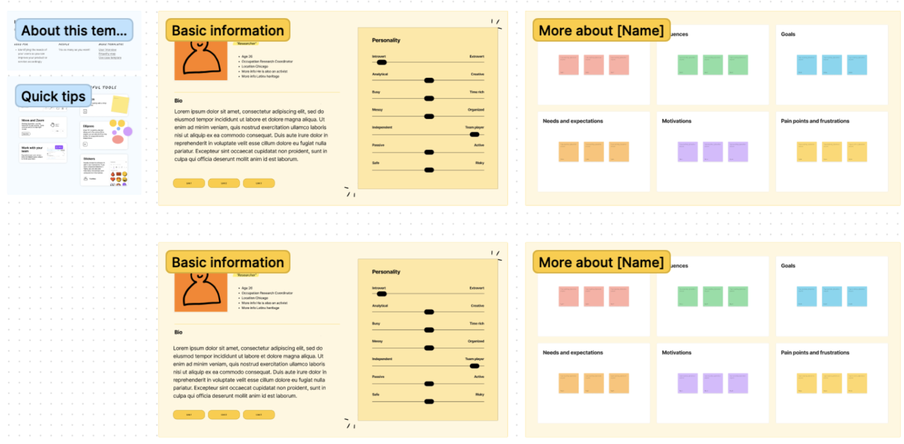{width=90%} 

6.  FigJam automatically saves your work, but it's a good practice to save manually the version history as well. Perhaps you may want to come back to a previous version of your template. Click on the main menu icon in the top-left corner and choose "file" then select "Save to version history" and follow the instructions. 

</br></details>

<details markdown='1'><summary>**Step 3: Collaborate with Others**</summary>

1. FigJam is designed for collaboration. Click on the "Share" button in the top-right corner to invite some of your colleagues of the Place Project Fellowship to provide you feedback in real-time. You can use their emails or provide them with a link to your canvas. 

2. You may use sticky notes to communicate and work together in order to refine your user personas. However, another way to do it is by clicking on the "Add comment" (e.g., speech globe) icon at the top of the canvas, selecting where you want to add the comment on the canvas and writing it. 

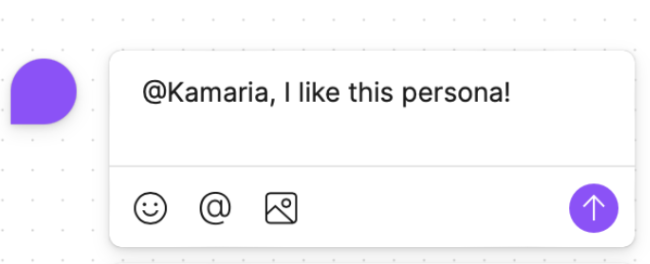{width=90%} 

</br></details>

<details markdown='1'><summary>**Step 4: Save and Export**</summary>

If you need to share the user personas outside of FigJam, you can export the file by clicking on the “Main Menu" icon, selecting "File" and "Export as" to choose your desired format (PDF, JPG. PNG etc).

</br></details>

<details markdown='1'><summary>**Step 5: Iterate and Refine**</summary>

1. User personas are dynamic, and your project may evolve. Use FigJam to iterate and refine your user personas as needed.

2. Collaborate with your team at the Place Project  to gather feedback and make improvements to ensure the personas accurately reflect your target audience.

3. On your own try to create at least three potential User Personas for your project and share it with your Place Project colleagues. Also do not forget to provide some feedback to them.

Congratulations! You've successfully used a FigJam template to create user personas for your project. Feel free to explore other FigJam features to enhance your collaborative design process.

</br></details>

:::


### Designing to User Needs {-}

The next step of the HCD process is to determine a web application design that will meet user needs. An application's user interface is a key element of design for developers to consider.

#### Organize Functions {-}
To involve users in the process of creating the application interface, **card sorting** is one effective method of participatory design, in which users are given note cards representing application functions and are asked to arrange them in ways they would find most easily to navigate on a web page. Creating a full list of functions that will help users meet their goals, such as the ability to query a dataset using keywords, or zoom in on particular locations in a map, is a helpful first step of this process.

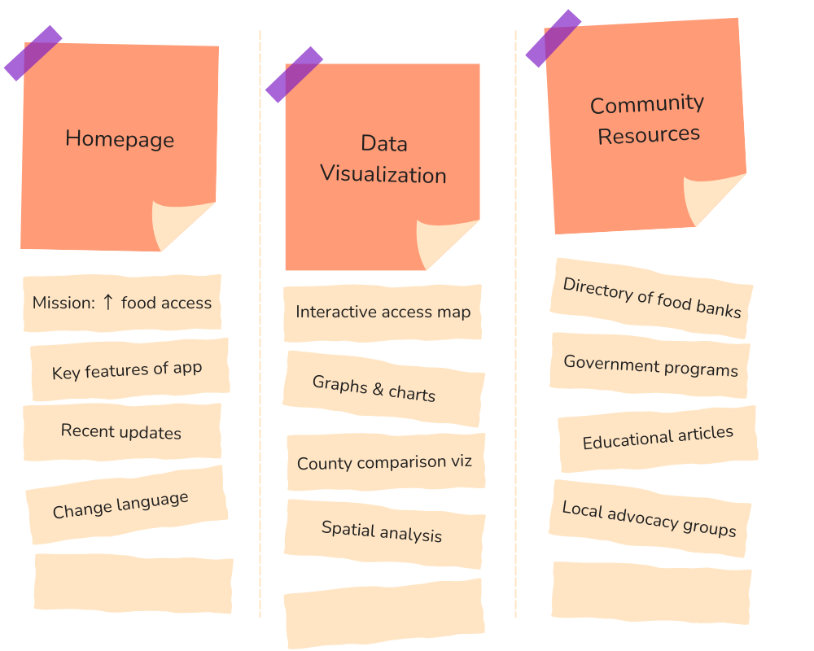{width=90%} 

During the card sorting activity, don't hesitate to create, remove, or edit cards that may be suggested by the users. This technique often serves as a guidance for taking the next step, but you should feel free to adapt and improvise as needed. Application developers should also consider how data will be organized into meaningful categories. For health equity applications, for example, it is often useful to divide data by demographics.


#### Design Aesthetics {-}
The design of graphic icons, buttons, window layouts, symbols, text fonts, and color schemes is also crucial to this step. Researchers have identified certain principles of design that seem to be broadly visually appealing and successful. These include:

- Navigation tools should be highly visible, intuitive, & consistently placed

- Writing should be presented in readable blocks

- Text should be easy to read and appropriate size, color, and font

- Elements should be organized in an understandable structure denoted by meaningful headings

- Images should be relevant, clear, and properly sized

Overall layout should be minimalist, uncluttered, and balance color with an effective use of white space.

#### Design Tools {-}

Starting with design tools, using a pen and paper for making paper prototypes offers a great starting point. This allows for rapidly translating ideas into tangible and shareable prototypes, helping make quick iterations.

Alternatively or additionally, you could opt to make low or mid-fidelity prototypes. Low-fidelity prototypes are rudimentary representations of design concepts, helping explore and communicate ideas without delving into specifics. On the other hand, mid-fidelity prototypes offer a more refined depiction of the final product. Here are some simple to use low-fidelity design tools:

- [MockFlow](https://mockflow.com/): MockFlow is a versatile web tool ideal for creating wireframes, user flows, and prototypes with its intuitive drag-and-drop interface, facilitating seamless collaboration among team members.

- [Wireframe.cc](https://wireframe.cc/): Wireframe.cc offers a minimalist approach to wireframing, allowing users to quickly sketch out ideas and concepts in a clean and straightforward manner, making it perfect for rapid ideation and iteration.

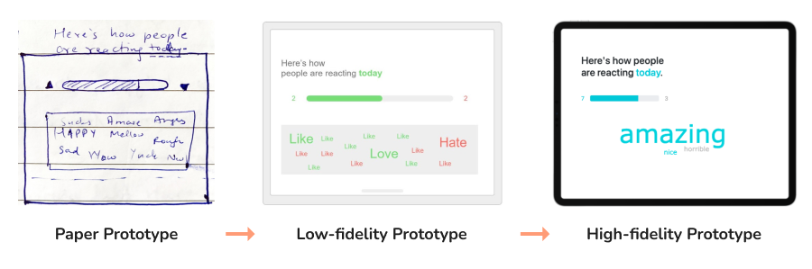{width=100%}

Moving further, high-fidelity prototypes mirror the end product closely in terms of design, interactions, and functionality. Making these require more time and resources to develop. There are a variety of tools freely available on the internet to collaboratively design high-fidelity user interface prototypes. Several options include:

- [Figma](https://www.figma.com/): A collaborative design tool often used for user interface design. Figma is entirely browser-based and includes many helpful design tools, adaptable templates, and allows for real-time collaboration.

- [Wondershare Mockitt](https://mockitt.wondershare.com/home.html): Similar to Figma, Mockitt includes a wide variety of design tools, but may be an easier platform to use for design beginners.

- [Quant-UX](https://www.quant-ux.com/): Quant-UX is an open-source design tool similar to the above platforms, but includes features that allow for usability testing and analysis.

:::activity
**Activity**

Mocking up a Mockup

Choose one of the above design tool platforms and create a free account. Walk through their getting-started steps to learn how to use the platform. If you find the platform confusing or limiting, try out another and compare. Also, visit design mockup websites such as [Dribbble](https://dribbble.com/) and [Behance](https://www.behance.net/) to search for creative inspiration on user interface design.
:::


### Evaluation and Iteration {-}

The next step of the HCD process is to evaluate how usable, accessible, and satisfying the initial web application design is for users. To do so, it is crucial to solicit feedback through user testing and evaluation. An effective method of evaluation is to have users test out a prototype of the design and give feedback on their experience.

#### Heuristic Evaluation {-}

Before bringing the users back in the loop, there is plenty of testing you can do yourself to ensure usability of your application. Heuristic evaluation is often considered as a fast and inexpensive method to highlight usability issues early on. The analysis can also be optionally done with users that may involve observing and taking more granular feedback. Following are 10 usability heuristics that can help you to quickly evaluate your application:

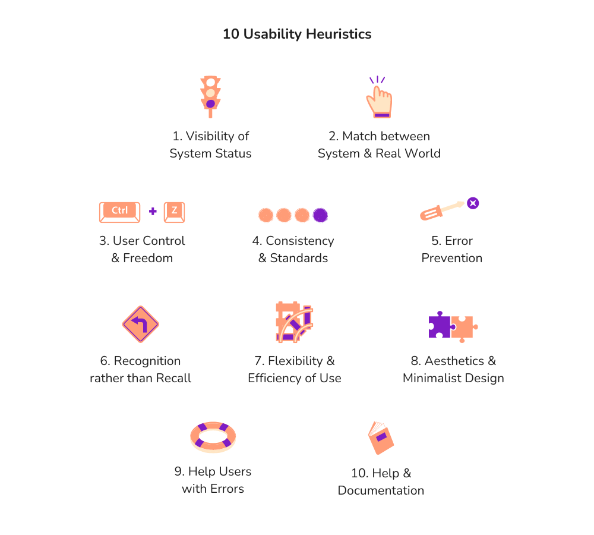{width=100%} 
<details markdown='1'><summary>**More details on each Heuristic**</summary>
```{r table-simple, echo=FALSE, message=FALSE, warnings=FALSE, results='asis'}
require(pander)
panderOptions('table.split.table', Inf)
my.data <- "Heuristic | Description

Visibility of System Status | Keep users constantly updated on what the system is doing. Offer clear feedback on their actions and system responses promptly, ensuring they're always aware of the current state.

Match between System & Real World	| Speak the user's language and organize information in a way that mirrors how they think and operate in the real world. Use familiar terms and conventions to guide users through the interface seamlessly.

User Control & Feedback | Empower users to navigate the system with ease and confidence. Provide intuitive ways for users to backtrack or exit undesirable states or actions, giving them a sense of control and freedom over their interactions.

Consistency & Standards	| Maintain uniformity throughout the interface, ensuring that similar elements behave predictably and are represented consistently. Adhere to established design patterns and standards to create a cohesive and intuitive user experience.

Error Prevention | Design the system to anticipate and prevent user errors whenever possible. Implement safeguards such as confirmation dialogs to mitigate the risk of unintended actions and provide a safety net for users to catch mistakes before they happen.

Recognition rather than Recall | Present information and options in a way that reduces the cognitive load on users, minimizing the need for them to recall details from memory. Make relevant cues and instructions readily visible to guide users through their interactions effortlessly.

Flexibility & Efficiency of Use | Cater to users of varying skill levels by offering shortcuts or customization options to streamline their tasks. Allow users to tailor their experience to suit their preferences, making interactions more efficient and accommodating their individual needs.

Aesthetic & Minimalist Design	| Strive for simplicity and elegance in the interface, focusing on essential elements while eliminating unnecessary clutter. Create a visually pleasing environment that enhances usability by directing users' attention to what matters most.

Help Users with Errors | Communicate errors clearly and constructively, using plain language to explain the problem and offering actionable solutions to resolve it. Guide users through the error-recovery process smoothly, helping them troubleshoot and recover with confidence.

Help & Documentation | Provide accessible and user-friendly help resources for users seeking assistance. Offer clear, concise documentation that addresses common questions and concerns, empowering users to find answers and guidance whenever they need it."

df <- read.delim(textConnection(my.data),header=FALSE,sep="|",strip.white=TRUE,stringsAsFactors=FALSE)
names(df) <- unname(as.list(df[1,])) # put headers on
df <- df[-1,] # remove first row
row.names(df)<-NULL
pander(df, style = 'rmarkdown')
```
</br></details>

:::activity
**Activity**

Rapid-fire Heuristics Evaluation

Spend 5 minutes conducting a usability heuristics analysis on your preferred website or application, utilizing the provided heuristics. **Pay attention to the details.** Then, expand this exercise to another website, repeating the evaluation process. Look for similarities or differences between the two. For a deeper understanding, focus on applications similar to those you're interested in creating. 

This activity offers valuable insights into heuristic application and user experience, aiding in the enhancement of your own application design.
:::

#### Interviews & Surveys {-}

The best form of feedback is the one coming straight from your users. Evaluations can be conducted live by bringing a group of users together for in-person or remote interviews by having them think aloud as they navigate through your application. They could also share their qualitative feedback using a focus group setting. On the other hand, conducting online surveys can help gather quantitative feedback.

Across evaluations, it is important to administer a set of background questions to understand users' demographics, their roles or occupations, and their overall goals to understand how individuals across different contexts differ in how usable they find the web application. The questions users are asked should allow you to evaluate the extent to which the application meets established user needs and the extent to which the application is usable.

<details markdown='1'><summary>**Interviews**</summary>

Interviews demand thorough planning and execution, whether conducted face-to-face or remotely.

A helpful strategy is to structure questions logically. Begin with broader inquiries to encourage participants to think broadly. As the conversation progresses, gradually transition to more specific questions. When wrapping up, ensure there's space for open-ended inquiries, allowing participants to share anything not covered. Interviews include a range of questions covering the following aspects:

- Introduction: Background, primary responsibilities or tasks, ways to interact

- Needs & Pain Points: Main challenges, recent experience, frustrations, specific features

- Usage & Experience: Frequency, likes and dislikes

- Feedback: Rate overall satisfaction, improvements expected, anything else, likely to recommend?

These questions can serve as a starting point for conducting user interviews, but it's essential to adapt and refine them based on your application and the goals you have for the interview.

Furthermore, incentives can be essential for securing interview sign-ups. Consider consulting your organization or manager to explore potential compensation methods for participants' time.

</br></details>

<details markdown='1'><summary>**Surveys**</summary>

Surveys are generally the least resource-intensive method of evaluation. When designing a usability survey, it is crucial to ask questions that will shed light on how usable, enjoyable, and effective individuals find the tool. These surveys can include a mix of multiple-choice, ratings, and open-response questions. Examples include:

- What are your main objectives when using this tool? Were you able to meet those goals?

- What features do you use most?

- How easily navigable did you find the interface? Was it visually appealing?

- What would you like to see change (or stay the same) about the tool?

There are many online platforms to create surveys:

- Google Forms is a free, easy-to-use tool that allows for unlimited questions and offers a full range of question types. Google Forms will not analyze the data collected.

- Qualtrics is a more powerful tool for survey design and can generate a quantitative analysis of the data. Qualtrics includes a free option, however, there is a steeper learning curve to creating these surveys than a tool like Google Forms.

- Using printed sheets with survey questions can also work if the setup is in-person.
Based on the survey respondents and their level of comfort, their responses may need to be recorded anonymously.

</br></details>

:::pitfall
**Pitfall**

Neglecting IRB Guidelines

Beware of potential pitfalls when gathering feedback. Ensure that your chosen method aligns with IRB or institutional approval guidelines for research involving human subjects. Neglecting this could lead to privacy breaches or ethical concerns. Additional measures like encryption and secure data storage may be necessary to safeguard sensitive information. It's always good to check before proceeding.
:::

#### Iteration {-}

Following evaluation, you should revise the application accordingly, and re-evaluate and redesign until user needs are sufficiently satisfied. Constantly keeping in touch with stakeholders and users make it easier to design for them. Lastly, try accommodating as much feedback but don't let it come in the way of you from moving forward to the next steps.

## Good Design

Human-Centered Design (HCD) is all about putting users first, but at the end of the day, its core objective remains aligned with broader design principles.  Whether you stick strictly to HCD methods or embrace a more adaptable approach, the overarching goal is to produce designs of high caliber that really work for users. Ultimately, the aim is to deliver a positive user experience. The following are key attributes that are associated with good design:

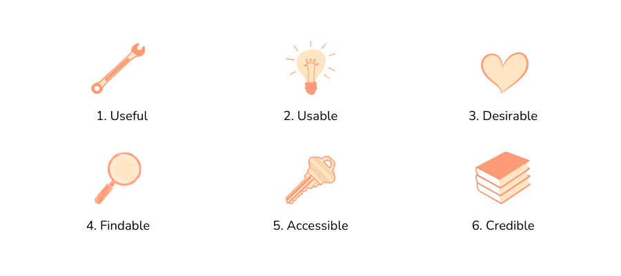{width=100%}

```{r table-simples, echo=FALSE, message=FALSE, warnings=FALSE, results='asis'}
require(pander)
panderOptions('table.split.table', Inf)
my.data <- "Attribute | Description

Useful | It must be original and meet a specific need

Usable | The application should be straightforward to navigate

Desirable | Images, branding, other elements should create an emotional connection

Findable | Content should be easy to find within the site and from external sources

Accessible | The content must be accessible to individuals with disabilities

Credible | Information provided should be trustworthy and believable to the user
"

df <- read.delim(textConnection(my.data),header=FALSE,sep="|",strip.white=TRUE,stringsAsFactors=FALSE)
names(df) <- unname(as.list(df[1,])) # put headers on
df <- df[-1,] # remove first row
row.names(df)<-NULL
pander(df, style = 'rmarkdown')
```

## Resources {-}

- [Stakeholder Engagement Toolkit for Evidence Building](https://www.datafoundation.org/stakeholder-engagement-toolkit-for-evidence-building-introduction) - The Data Foundation
- [How to create a persona](https://www.figma.com/resource-library/how-to-create-a-persona/) - Figma
- [Card Sorting: The Ultimate Guide](https://www.interaction-design.org/literature/article/the-pros-and-cons-of-card-sorting-in-ux-research) - Interaction Design Foundation
- [10 Usability Heuristics for User Interface Design](https://www.nngroup.com/articles/ten-usability-heuristics/) - Nielsen Norman Group
- [Design-Pattern Guidelines: Study Guide](https://www.nngroup.com/articles/design-pattern-guidelines/) - Nielsen Norman Group
- [How to Conduct Focus Groups](https://www.interaction-design.org/literature/article/how-to-conduct-focus-groups) - Interaction Design Foundation
