---
---

# Spatial Data Wrangling 

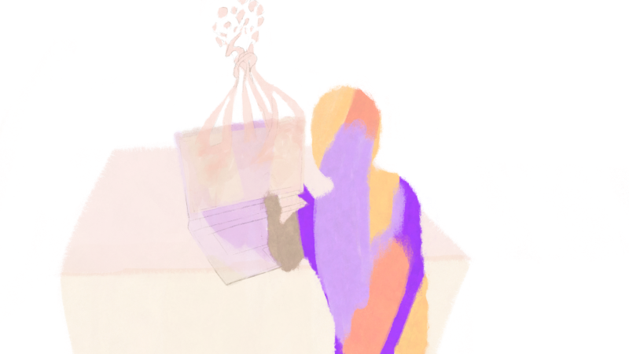{width=100%}

:::objective
**Objectives**

In this module, you will:

* Introduction to spatial data concepts and operations
* Convert CSV lat/long to spatial points and geocode address
* Overlay points with boundary data, merge SDOH data, visualize as thematic map
* Gain insight into SDOH data resources
:::

You've spent some time visioning your project goals, breaking down specific needs, and connecting with potential users of the application. Once you've done these things, you're ready to take on the data at hand, and start wrangling.

What sort of data will you be working with? Some examples could include:

- **Resource or asset data**: This could be a spreadsheet of locations including their names, description, category, and address. For data wrangling, you'll want to set this dataset up as a .CSV format to start. This may be used as a primary dataset for an asset map.

- **Tabular, statisical, or "flat-file" data**: This could be a CSV, TXT, or XLSX format dataset filled with details on income, education, or housing estimates by county. It could be data on health outcomes, with each row corresponding to a different time point. You may have downloaded it directly from a data portal, or extracted from the Census. You may use this data for thematic maps, dashboards, and more.

- **Multi-media data**: This could be photographs, videos, or stories that you have geo-tagged to specific locations. It can be used for story maps, and more.

Because we're working with place-based SDOH data, that means learning how to handle *spatial data.* (This may involve converting non-spatial data to spatial data.) Working with spatial data is like working with regular data, plus entirely new dimensions. The data formats are different, and you'll need different tools to work with it. 

## Environment Setup

:::tools
**Tools**

*Download the Activity Datasets*

While you will use your own data for your project, practice with ours. Please download and unzip this file to get started: [SDOHPlace-DataWrangling.zip](https://github.com/healthyregions/sdohplace-toolkit/raw/main/data/SDOHPlace-DataWrangling.zip)
:::

Which computing environment should you work with spatial data? It's up to you — there are many options to choose from today. Our toolkit focuses on free and opensource tools, and/or tools that are widely available with low cost. In this chapter, we'll work with *QGIS*, *Excel*, and *GeoDa.* In the Appendix, you'll find the same activities using *R programming* scripts.

:::tools

**Tools**

For this module, you need the following installed on your machine. A recent, stable version is sufficient; note that versions will be updated regularly, so you'll need to learn to update, manage, and troubleshoot as you go. 

- **QGIS**: QGIS is a free, opensource geographic information system that can be used to create, map, and analyze geospatial data. Download QGIS [here](https://qgis.org/en/site/).
- **Excel**: Excel is a spreadsheet software that can store, organize, and analyze data sets. Use a free online version [here](https://www.microsoft.com/en-us/microsoft-365/free-productivity-apps#free-benefits).
- **GeoDa**: GeoDa is a free, open-source GIS tool, designed to be an introductory tool for spatial data science. Download GeoDa [here](https://geodacenter.github.io/).

If you prefer to code, or want to practice coding, go to the [Appendix](https://toolkit.sdohplace.org/04-dataR.html) to learn the same materials using the R Programming Language. 
:::

Throughout, you'll learn the tool you're using isn't as important as your ideas, concepts, and goals. You can merge data, run a buffer analysis, and make a map using ESRI, QGIS, R, Python, Spatial SQL or any other number of software or coding languages. Your goal is to learn what you want to do, understand why you need to do it, and learn & discover as you go.

That being said, data wrangling takes up **at least 80%** of a traditional GIS/spatial analysis project. Don't underestimate the time needed to resolve challenges, and practice patience.

### Installing & Working with Software {-}

All three software that you'll be introduced to have extensive documentation to help users understand the tools available to them and troubleshoot issues they come across. This documentation can be found [here](https://www.qgis.org/en/docs/index.html) for QGIS, [here](https://support.microsoft.com/en-us/excel) for Excel, and [here](https://geodacenter.github.io/documentation.html) for GeoDa.

In addition to these official documentation sources, search engines are your best friend. Gravitate toward answers on community-driven forums like [Stack Overflow](https://stackoverflow.com/) or [GIS Stack Exchange](https://gis.stackexchange.com/), because someone else will have likely experienced your problem before. Searching the issue you run into or the error message that you receive is likely to bring up a forum thread of people who worked to resolve the same issue.

:::tip

**Tip**

- If possible, it's best to copy/paste specific error messages (or "stack traces") from your software into search engines to find the most relevant result.
- *Google* tends to be the most common search engine used by developers, so may be most likely to give you the result you need.
- Sometimes information like local file paths or user names can be printed into error messages. Be sure to keep these out of content that you post to forums!
:::

Another important aspect in working with this software is file management. Decide before you start a project what your file management strategy will be, and where everything will be stored. Generally when you open a dataset in GIS software, you are only creating a pointer to the locally stored files, not copying the data into the project. This means that if a file gets moved mid-project, the software will be unable to access the data, and you'll have to re-add it to the project. Some file formats, like shapefiles, consist of multiple files that must always be kept in the same folder together. **A robust file management approach will save you time and frustration in the long run.**

:::tip
**Tip**

Mac users will need to override a security setting to download QGIS. Once you have installed QGIS, you will need to go to Security and Privacy in System Preferences. There, you will find a message that “1 GDAL Complete.pkg” was unable to be opened. Select “Open Anyway.” You may need to do this for multiple packages depending on the version of QGIS you download. 

If you still have issues opening QGIS after this, Stack Overflow is a great resource for troubleshooting GIS software issues.
:::

## Intro to Spatial Data 

Spatial data is essential for understanding the world around us, as it combines information with specific locations. This type of data is vital because it allows us to see how information changes with location. Without the geographical component, we're left with just a list, not a spatial analysis or map that can guide decisions or provide insights.

Understanding these aspects of spatial data is crucial, especially as we delve into more complex analyses. Whether it's navigating through the components of a shapefile or exploring data in R, having a grasp on these concepts can help tackle the challenges that come with spatial data analysis.

### Spatial Data Types {-}

Spatial data is generally divided into two broad categories: **vector** and **raster** data. Vector data holds "features" using points, lines, or polygons whereas raster data can be satellite imagery or other pixelated surfaces.

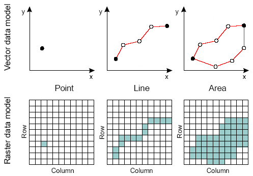{width=70%}

We mainly use vector data for our purpose. For example, a group of clinics can be geocoded and converted to points, whereas zip code boundaries are represented as polygons. Note that spatial data is not just locations and shapes, but also attributes. So points on a map correspond to associated details for each clinic provider, and may also include fields like “name”, “services”, and more. 

For example, a park can be represented as a polygon or a point. Linked with each park, we can have information regarding their names, sizes, types of plants, open hours, and other various features. These attributes can be stored in a data table, along with their spatial inforamtion, in a shapefile, or a spatial file loaded in your R environment.

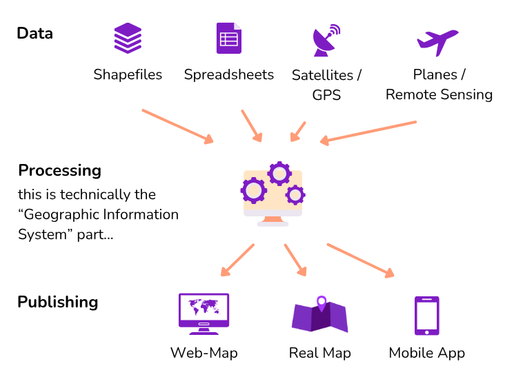{width=70%}

### More Types of Data {-}

While we focus on tabular spatial data in this introductory module, you may work with multiple types of data in your SDOH project that is linked to place. Another of thinking about this is considering spatial data as primary, secondary, or tertiary. In the following section, we will provide a brief description of each of these types of data.

Primary Spatial Data
Primary spatial data refers to the data that you can collect either personally or through a sensor/machine which you or your stakeholders have previously installed. There are several examples of spatial visualizations of SDOH made with primary data. Some researchers have used online interviews or questionnaires to analyze their experiences in their neighborhood. Other researchers have placed sensors to map air quality in cities. The use of Global Positioning Systems (GPS) or smartphones is another way to generate primary data.  

Secondary Spatial Data
You may encounter challenges when gathering SDOH primary spatial data, as it can be a time-consuming and costly endeavor. As a result, SDOH researchers, mapmakers, and advocates frequently turn to various secondary resources, such as spatial databases and census records, to inform their spatial representations. Typically, these files consist of digital layers that are prepared for seamless incorporation into a GIS or web mapping application. However, you can also work and manipulate non-spatial data in your project. Notable sources for such data include both profit and non-profit databases, government census information, and even digitized or scanned paper maps.  

Tertiary Spatial Data
In the realm of SDOH spatial visualizations, there exists a third option–your map(s) may access other maps’ spatial data. Tertiary spatial data are spatial layers that have been previously or currently utilized in other cartographies and are readily accessible for integration into a Geographic Information System (GIS) or web mapping applications. When engaging with stakeholders experienced in health mapping, it's worth inquiring whether they possess any spatial layers that could prove beneficial for your project.   

It is key to emphasize that data can often be tainted by biases and errors. As a result, the methods used to gather, aggregate, or model spatial data can have adverse effects on the quality of our data visualizations. It is of utmost importance to meticulously scrutinize various forms of data, whether they are qualitative (e..g, interviews or questionnaires), quantitative (e.g., databases), or mixed (e.g., surveys). A valuable starting point for data analysis involves assessing metadata within databases or interview questions. Further insights into this subject will be explored in subsequent sections of this toolkit.

In your project, there's no need to limit yourself to just one kind of data. In fact, it's not only possible but often necessary to mix and match different sources and types of spatial data to craft compelling SDOH spatial visualizations.

:::activity

**Activity** 

Review these projects below and identify what type of data they use. In your opinion, what other types of data could they use to enrich their visualizations? 

[Using Asset Mapping to Identify Health Needs of a Latinx Population in Rural Virginia](https://scholarscompass.vcu.edu/cgi/viewcontent.cgi?article=1396&context=uresposters)
[US Social Determinants of Health Atlas - Map of the Month](https://carto.com/blog/visualizing-health-data-social-factors)
:::

### Spatial Data Formats {-}

Just like you may store text in an MS Word document or a PDF, there are many different formats used to store vector spatial data. Keep in mind that file extensions are very important -- it is often how people refer to different file formats.

Perhaps the simplest format is a comma-separated value, or **CSV**, file. This is a plain text format for table storage that can be opened and exported from MS Excel, or even just a simple text editor. What can make a CSV a "spatial" data format is the presence of columns that represent coordinate locations for each row in the table. These columns could be latitude, longitude coordinates, or a single column could hold a different coordinate format like Well-Known Text (WKT). A CSV file name will end in `.csv`, though you may also see `.tsv`, for "tab-separated values".

Another common spatial data format is the **shapefile**. A shapefile is actually a suite of multiple files, all with the same name but each with a different extension. There must be three files present at a minimum, `.shp`, `.shx`, `.dbf`, though typically you will have 4-7 files, other common extensions being `.prj`, `.cpg`, etc. These files must always be kept together, so make sure you zip up a shapefile if you are sending it to someone else!

We will also use a format called **GeoJSON**, `.geojson` or sometimes just `.json`, and you may also hear about GeoPackages, `.gpkg`, though we won't be using that format in this module.

|Format|Pros|Cons|
|---|---|---|
|CSV - `.csv`|Human-readable data Edit in MS Excel or text editor|Inefficient for large datasets|
|Shapefile - `.shp`, `.shx`, `.dbf`, etc.|Robust and performant Can use any CRS|10-character attribute name limit Sidecar files can be confusing!|
|GeoJSON - `.geojson`|Human-readable data Edit in text editor|Inefficient for large datasets|

:::activity 

**Activity** 

*Open a Vector Data File in QGIS*

There are multiple ways to add a vector dataset to a QGIS project. First, open QGIS and create a blank document. Next, use one of these methods:
- Navigate to **Layer** > **Add Layer** > **Add Vector Layer**, and then find the `chicagotracts.shp` file in your file system.
- Use the Browser panel to navigate your file system, and drag `chicagotracts.shp` into the map view.
- In your standard file explorer, navigate to the `chicagotracts.shp` file, then drag and drop it directly into your QGIS project.
    - In your file system you will see all shapefile sidecar files, be sure to use the `.shp` file when you drag it into QGIS.

You will now see a new layer in your **Layers** panel. To "style" the layer (change the colors and symbols that are used to represent it), you can either:

- Right-click on the layer and choose **Properties...**, then go to the **Symbology** tab.
- Go to **View** > **Toolbars** and enable the **Layer Styling** toolbar.
    - This toolbar provides direct access to the symbology for the currently selected layer, no need to open the Properties window!

**Challenge**: Repeat the same activity using GeoDa, a spatial statistical software.

[*Open a Vector Data File in R*](https://toolkit.sdohplace.org//04-dataR.html#intro-to-spatial-data-1)
:::

:::activity 
**Activity** 

*Add a Basemap in QGIS*

The easiest way to add a basemap to your QGIS project is through the **QuickMapServices** plugin. To install this plugin:

1. Go to **Plugins** > **Install and Manage Plugins...**
2. Search for and select `QuickMapServices`
3. Click **Install**

Once installed, it's best to add the extra "contributed pack" to this plugin, in order to get more basemap options.

1. Go to **Web** > **QuickMapServices** > **Settings...**
2. Go to the **More services** tab, and click **Get contributed pack**

Depending on your version of QGIS you may have different base map options, but all versions should at least have OSM Standard. Select this to add the base map.

**Warning**: Do not use Google or Bing basemaps in published work, it is generally against their terms of service.

**Challenge**: Repeat the same activity using GeoDa, a spatial statistical software.
:::

## Coordinate Reference Systems

The “spatial” part of spatial data is coordinates. For example, you may have a dataset of hospitals: the location of each feature will be represented by a latitude/longitude coordinate pair. If you have a dataset of county boundaries, each corner, or "vertex" of every shape will be represented by a coordinate as well. The fact that spatial data stores coordinates is the only thing that makes it "special."

However, there are many different ways of storing coordinates (not only latitude/longitude as you may assume) which is what brings us to the concept of a “coordinate reference system” (CRS), which is exactly what it sounds like: a reference system for interpreting coordinates.

{width=70%}

:::tip
**Tip**

*EPSG Codes*
In the 1980s the European Petroleum Survey Group began a registry of coordinate reference systems, and this database is now a standard registry: All common coordinate reference systems have their own EPSG code.
:::

There are two basic categories of coordinate reference systems: **Geographic (GCS)** and **Projected (PCS)**.

A **GCS** is fairly straightforward, because its coordinates are latitude/longitude "decimal degrees" that look like `44.0208693`, `-92.4841652`. There are just a few common geographic coordinate systems, and the only thing that differentiates them is a slightly different mathematical model of the globe, called a "datum". The most common one is **WGS84** (EPSG: 4326), though you may also see **NAD83** (EPSG: 4269), which is slightly more accurate for North America. For our purposes, we don't need to worry much about the difference between these two.

GeoJSON datasets should only store data in WGS84.

If you're not sure what CRS a latitude/longitude coordinate value is in a dataset you pulled from a data portal, there is a good chance it will be EPSG:4326! Once challenge with this CRS is that the distance is in degrees, not miles or kilometers. To use spatial data for distance or geometric calculations, you'll need to transform to a different CRS that that uses different unit of distance...

A **PCS** on other hand is “projected,” meaning that it is not only based on a datum, but on top of that it uses a **map projection**. Map projections are different methods for flattening the globe (or portions of it) so it can be displayed on a 2-dimensional plane (in other words, a map!). When a geospatial dataset is stored in a projected CRS, it doesn’t actually use latitude/longitude coordinates at all–it uses X/Y coordinates based on the flattened plane that the projection defines.

Robust spatial data formats, like Shapefiles and GeoPackages, are able to store data in any CRS, either geographic or projected.

:::tip

**Tip**

*Summary of Geographic vs. Projected CRS*

- A Geographic Coordinate Reference System interprets coordinates as latitude/longitude positions on the globe.
    - Units: degrees
    - Examples: **WGS84** (EPSG: 4326), **NAD83** (EPSG:4269)
- A Projected Coordinate Reference System interprets coordinates as x, y positions within a given map projection.
    - Units: feet or meters (defined by CRS)
    - Examples: **Web Mercator** (EPSG:3857), **NAD83 / UTM Zone 16** (EPSG: 26916), **NAD83 / Illinois East (ftUS)** (EPSG:3435)

**Always use a projected coordinate system if you are making any distance-related calculations on your spatial data.**
:::

#### Why use Projected Coordinate Reference Systems for Spatial Data? {-}

You may be wondering: Why isn’t all spatial data just stored as latitude/longitude coordinates? The short answer is simply “measurement.” In order to perform any geographic calculations--length of roads, area of districts, distance from hospitals, etc.--you will need to use a projected CRS.

This is because every CRS is defined by the units that its coordinates are stored in, meaning that if your CRS uses latitude/longitude coordinates (like WGS84) your units are degrees. However, degrees are terrible for distance measurements because, for example, one degree of longitude along the equator is 69 miles, but around Chicago it’s just 51.

A projected CRS, having flattened the Earth (or a portion of it) represents a grid system that is not based on degrees but on feet or meters. Therefore, the X/Y coordinates that a projected dataset stores are just the number of feet (or meters) away from the origin of the projection (like a Cartesian coordinate system in algebra). With your data in the appropriate projected CRS for your region, you are ready to make meaningful calculations.

:::tip
**Tip**

*Coordinate Reference Systems in QGIS*

QGIS applies coordinate reference systems at two different levels, and it is important to understand the difference between these levels.

- At the **individual layer level**, QGIS says: *What CRS should be used to interpret this particular dataset?*
Generally, a dataset will properly reports its CRS and no action is needed. However, you can right-click on a layer and use **Layer CRS >** to assign a different CRS to it. This does not change the underlying data, just how it is interpreted.
    - If a layer has no CRS assigned to it, a `?` symbol will appear next to its name and QGIS will default to interpreting is through the project-level CRS.
- At the **project level**, QGIS says: *What CRS should be used to display the layers in this project?* By default, QGIS will choose the CRS of the first layer that you add to a project.
    - You can change the project’s CRS in Project > Properties… > CRS, or through the small button in the bottom right that displays the current CRS.

As long as each layer’s CRS is correctly assigned, GIS software will properly align datasets with different coordinate reference systems, and even allow you to display those datasets in a different projection altogether.

**One of the most common problems people have with spatial data is not knowing what CRS to use with their data!**
:::

#### Common Projected Coordinate Reference Systems {-}

One projected CRS you are already used to seeing is a modern adaptation of the Mercator projection, commonly called **Web Mercator** (EPSG:3857). Every interactive web map--Google, Apple, Uber, Lyft, etc.--uses this projection, because it covers the whole world and has a handful of other advantages. However, this projection is not very good for calculations because it greatly magnifies the size of land masses as you approach the north and south pole.

Instead, we need to use a projected CRS that is designed for a smaller region within which our dataset is located. In the US we commonly use a series of projected CRSs called UTM Zones which are based on the NAD83 datum and the Universal Transverse Mercator projection, for example **NAD83 / UTM Zone 16** (EPSG: 26916) covers Chicago. Another common set of CRS definitions in the US is the State Plane series. Chicago sits within the area best covered by **NAD83 / Illinois East (ftUS)** (EPSG:3435). 

To find a CRS, we recommend using **Google** -- seriously! Google "EPSG Illinois ft" if you want to identify a CRS that is appropriate for the Chicago region as an example, and using an appropriate distance metric for further analysis. Doing this, you'll find that EPSG:3435 emerges as a top choice. 

:::activity 

**Activity** 

*Reproject Data in QGIS*

If you have spatial data that uses a geographic CRS, like a GeoJSON file, then you will need to transform or reproject that data to a projected CRS in order to use it for any distance-related spatial analysis. Try the following in QGIS:

1. Load the `chicagotracts` dataset by dragging and dropping the `chicagotracts.shp` file into a new blank document.
2. Right-click on the layer in the **Layers** panel.
    - Observe: In **Layer CRS**, QGIS has properly chosen EPSG:4326 (WGS84) to interpret this dataset.
    - Note: By clicking **Set to...** or **Set Layer CRS...** you can tell QGIS to use a different CRS for this layer. *No need to do this in this case!*
    - Choose: Click **Export > Save Features As...** to open the data save dialog box.
3. Pick ESRI Shapefile as the output format.
4. Browse to an appropriate folder and name your export `chicagotracts-3435`.
5. Use the CRS dropdown to select `NAD83 / Illinois East (ftUS)`.
    - If this CRS is not in the dropdown, use the Select CRS button to open a more detailed dialog box.
    - Filter for `NAD83 / Illinois East (ftUS)` and find the appropriate CRS in Projected > Universal Transverse Mercator...
6. Leave all other settings as they are, click **Ok** to save the dataset.
    - The new dataset will be in your selected CRS.
    
[*Reproject Data in R*](https://toolkit.sdohplace.org//04-dataR.html#coordinate-reference-systems-1)
:::

## Converting to Spatial Data

A common goal in SDOH research is to work address-level data, known as *points* or *events* (when considering time) in spatial analysis research. This could refer to resources in a community. Before we can run any analytics on the resource location data, we need to convert resource addresses to spatial data points, which can be then used to calculate access metrics.

Locations, when measured as points, can include things like:

- **Health providers**: Hospitals, Clinics, Pharmacies, Mental health providers, Medication for opioid use disorder providers
- **Area resources**: Grocery stores & Supermarkets, Playgrounds, Daycare centers, Schools, Community centers
- **Area challenges**: Crime, Superfund sites, Pollution-emitting facilities

Points can also represent people, like individual patients residing in an area. Because individual locations for persons is protected health information, we’ll focus on point data as resources in the chapter. However, you can reuse the approach in this workshop to wrangle patient-level data the same way in a secure environment, under the guidance of your friendly IRB ethics board.

Let's start with an example where the spatial coordinate information has already been embedded within the data set as latitude and longitude information.

### CSV to Spatial Data

Comma separated (CSV) files are not a spatial data format. To be used for spatial analysis or mapping they will need to be converted to a spatial data format, such as a `GeoJSON` or `shapefile` data format. As long as a CSV contains spatial data like coordinates, GIS software should allow you to save CSV data as a new spatial data file. 

There are multiple options for converting CSV files to spatial data. For this type of conversion, you’ll want a CSV file with coordinate information (e.g. longitude and latitude) in separate fields. It's possible that coordinates recorded using a different CRS that is not long/lat, though we'll use a classical example here.

Your CSV may have:

- One field for **longitude** (which will be read as the **x** coordinate)
- One field for **latitude** ( which will be read as the **y** coordinate)

Using a GIS or coding platform, you'll assign the coordinate values and indicate the CRS being used. If you're not sure what the CRS is and it's a long/lat value, try EPSG:4326 as the most commont. You made need to troubleshoot if this is not the correct CRS for your dataset by inspecting documentation for the data. 

Always open a CSV to inspect it before trying to convert it. Verify longitude and latitude are in separate fields, and those fields are correctly labeled. Then, inspect afterwards! Make sure the points are plotting where you expect them. Common errors during this step is mixing up the long/lat, or assigning the wrong CRS.

:::activity
**Activity**

*Convert CSV to Spatial Data Format in QGIS*

Step 1: Open a CSV File

- Open your CSV file via Layer -> Add Layer -> Add Delimited Text Layer. We’ll use `Affordable_Rental_Housing_Developments.csv` for this exercise. 
- You will be prompted to indicate which fields in your CSV contain longitude and latitude (or some other X/Y coordinate system), as well as the CRS, which will likely (although not always!) be EPSG:4326 if not otherwise noted. Select the appropriate fields, then hit OK. 

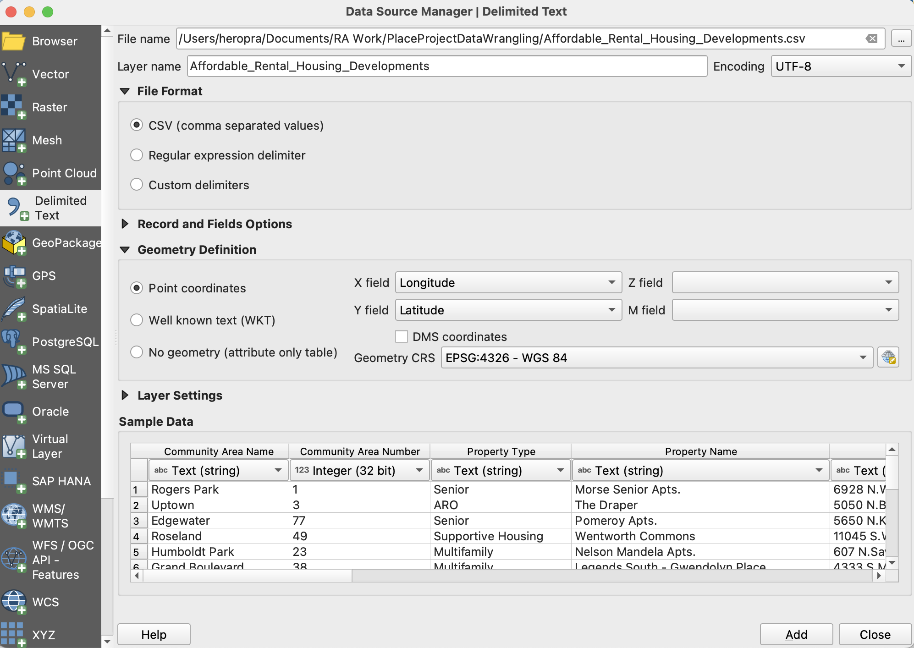

- A map of your data will be generated. 

 

Step 2: Add a Basemap

Add a basemap to inspect that your data has loaded properly. If you've mixed up longitude and latitude, your data points may be on the other side of the world!

 

Step 3: Save in a Spatial Data Format

Right click the layer and go to Export -> Save Features As. When you select a file path, you will be prompted to select a file format. Select GeoJSON and the appropriate file path. Once you save, you should have a new GeoJSON file. You could have saved this file using any other spatial format, too!

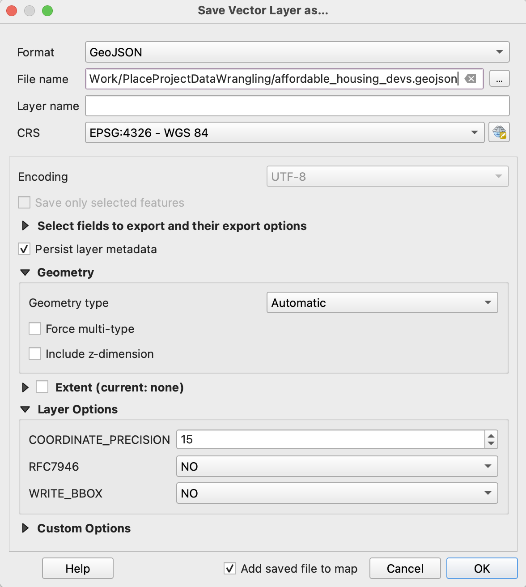 

 

**Challenge:** Open a CSV as a spatial data file in GeoDa, then save as a shapefile.

[*Convert CSV to Spatial Data Format in R*](https://toolkit.sdohplace.org//04-dataR.html#convert-csvs-to-spatial-data-1)

:::

### Geocode Addresses

What if your original dataset only has addresses? In that case, you'll need to geocode your data to identify coordinates for spatial data transformation.

Addresses are not spatial data. They are real-world representations of spatial data, but GIS software will not be able to map them without further information. Geocoding is the process of converting addresses into geographic coordinates using a known coordinate reference system (CRS). We can then use these coordinates (ex. longitude, latitude) to spatially enable data. 

#### Using Topologies {-}

Geocoding services use [topologies](https://www.opengeomatics.ca/topology-and-geocoding.html#geocoding) to assign street addresses along streets. Different services have differing degrees of topology quality; some are updated regularly, and others may have fewer updates, so precision may not be the same. Many services will give you a match score to let you know how closely the address matched their information. 

How precise does your measure need to be? Do you want to reject matches with <90% uncertainty? Some services will not have this option available. If you're at a university or institutional setting, you may have access to geocoding services with more precise topologies, like ESRI or Google proprietary geocoding products. The examples used in this textbook use an open topology that will provide reasonable accuracy for many areas. 

:::tip
**Tip**

If you are geocoding [protected health information (PHI)](https://cphs.berkeley.edu/hipaa/hipaa18.html), you may not use web-based geocoding service. Check with your instution to access a server-based, offline, HIPPA-compliant geocoding service.  
:::

#### Data Preparation for Geocoding {-}

After determining the geocoding service you'll use, plan for an intensive data cleaning and preparation stage. Read the service documentatioon to understand how data must be formatted. You will likely need to split your address field as different address, city, state, and zip code values. 

Geocoding tools may be having an issue reading some addresses due to formatting issues in the CSV. Suite or apartment numbers, for example, may cause tools to be unable to geocode addresses. Only include the street address in the address column of your CSV. If you want to retain apartment or suite numbers, include them in a separate column in your CSV. Another common issue is an address being miswritten in your CSV file. 

Even something as small as an extra apostrophe can prevent an address from being geocoded properly. Many cities have also addresses that are duplicates or are very similar. Providing  the most information you can is the best way to resolve this issue. Geocoding tools can use street address, city, state, and country information to geocode addresses. If you do not already have all of this information in your original CSV, add it and try geocoding again.

:::activity

**Activity**

*Geocode with QGIS*

For this exercise, download `chicago_methadone_nogeometry.csv`, a data set of methadone centers in Chicago that only includes center names and addresses.

Step 1: Geocode with MMQGIS

To geocode addresses in QGIS, first you will need to install the plugin MMQGIS. Go to Plugins -> Manage and Install Plugins. Search MMQGIS, and install it. 

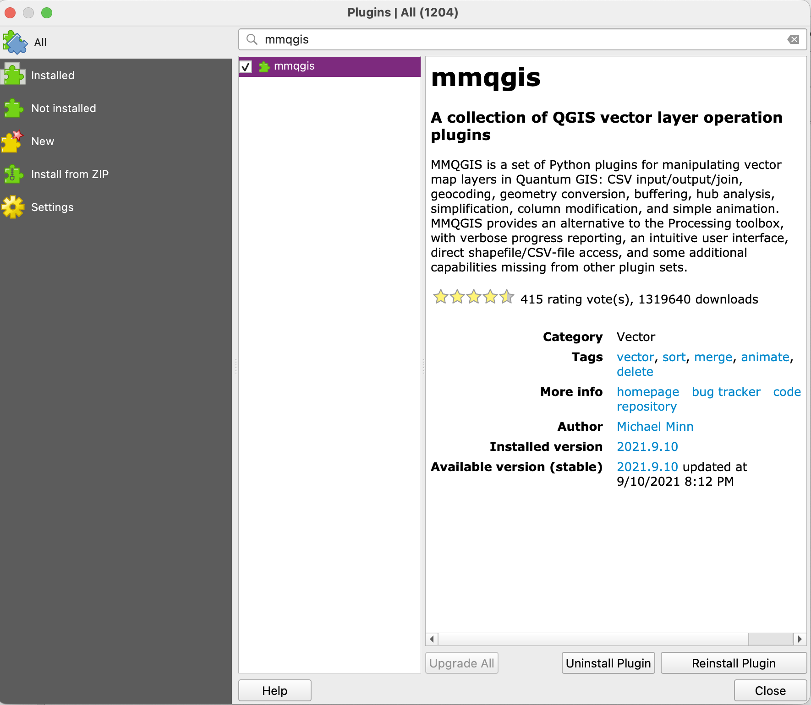 

Once installed, the plugin should be visible on the toolbar across the top. Select MMQGIS -> Geocode -> Geocode CSV with Web Service.

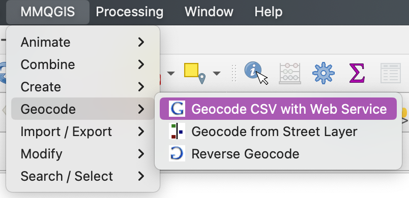 

Upload your CSV file. Confirm the correct fields are being read, choose your web service (OpenStreetMap is the open source option), name your output files and select the file formats. Hit apply, and the addresses should appear as points, and a spatial data file should have been generated and appear on the left side of your screen as a new layer.

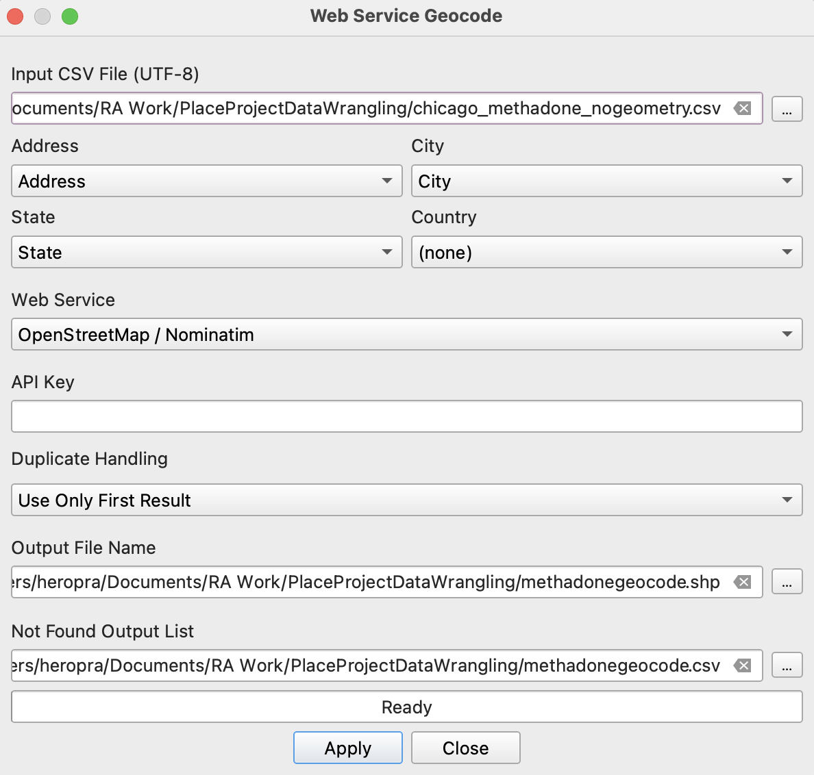

 

Step 2: Inspect your Data

Once all your addresses are appearing, inspect them to ensure that everything has geocoded properly. Add a basemap to quickly visually inspect your data points. From the layers sidebar, right click your geocoded spatial data file and select Zoom to Layer(s). If any data points lie outside your expected spatial extent, this will quickly alert you to that issue. 

Inspect the layer attribute table to determine the source of any issues. Right click your geocoded layer and select Open Attribute Table. In addition to the information from your CSV, QGIS will have generated a few more pieces of information, including the full address and lat/long. Taking a look at this information for any points that did not properly geocode can help you discover where the issue may be in your original CSV. 

 

Once everything has geocoded properly, you’ll have a spatial data file ready to use in other software.

[*Geocoding in R*](https://toolkit.sdohplace.org//04-dataR.html#geocode-addresses-1)

:::

## Merge data sets

Merging data sets is a vital skill for analyzing health data from an SDOH perspective. SDOH data and health data will often be in separate data sets, but use the same geographic scale, such as zip code or census tract. Being able to merge these kinds of data sets together using that scale is important to the ease of performing analysis with your data.

You will likely be merging data in flat files, like statistical datasets and Census records, to a spatial boundary corresponding to some administrative boundary. The new spatial dataset, a shapefile or GeoJson, is your master dataset that retains all of the original data, spatial boundaries, and new data you're merging in. 

Place literally serves as your "key" to join the data together.

### Reshape Data {-} 

Data sets often don’t come in GIS-friendly formats. Flat files may be separated vertically among multiple variables (long format) rather than horizontally along a single identifying variable (wide format). While long format is considered a standard for "tidy" data and the standard in epidemiological research, it's not efficient for GIS purposes. To merge data to boundaries for mapping and some spatial analysis, we'll have to reshape from long to wide format. Knowing how to reshape data efficiently will make you a master data wrangler.

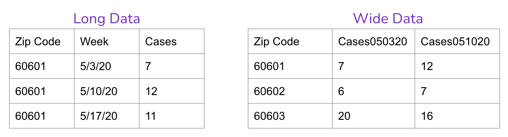

You can use pivot tables in Excel to reshape your data, or your favorite coding approach. Reshaping data is a pain, but important for subsequent research! 

:::activity

**Activity**

*Long to Wide with Excel*

**File:** `COVID-19_Cases__Tests__and_Deaths_by_ZIP_Code.csv` 

To create a wide data set with the cumulative cases for each week for each zip code, create a pivot table in Excel. 

Step 1: Create a Pivot Table

- Open the CSV as an excel file, and open a new sheet. 
- Go to Insert -> Pivot Table. 
- Select the data you wish to include; in this case, we want the cumulative case data, so select columns A-F from the original excel sheet. 
- Make sure the pivot table will be placed in the new excel sheet, and hit OK. 

 

Step 2: Add Your Data

The pivot table will open with the selected data, which can be sorted into rows, columns, values, and filters. 
- In this example, the zip codes should be our rows, so choose Zip Code from the selection and drag it into Rows. 
- We want our columns to be organized by week, so drag either Week Number, Week Start, or Week End into the Columns. 
- You’ll notice these variables split into multiple categories when dragged into a pivot table field. Use the information icon at the side of each category unwanted information. 
- Finally, drag Cases - Cumulative into the Values to fill out the table.

 

Step 3: Clean Up Your Table

Pivot tables often generate columns and rows that are unnecessary for our purposes. These extra columns and rows could make it difficult for spatial software to read your CSV later.

- Use the drop down menu for Row Labels or Column Labels to remove any unwanted rows or columns, such as Grand totals and the first row that includes Sum of Cases and Column Labels.  
- Rename the column containing zip codes. 

 

Your nearly completed pivot table will look something like this:

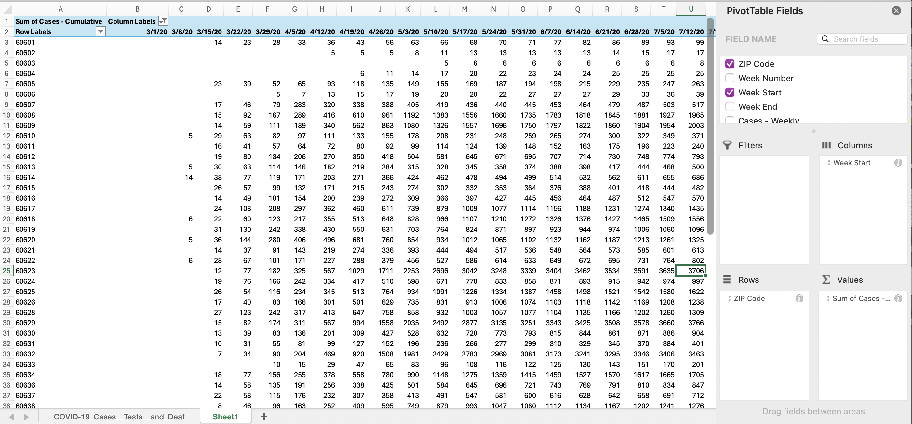

Update the column names to include the variable and date together for bonus points (ex. "Cases_050320"). Note that if you will later merge to a shapefile, you'll need to stick under 10 characters for variable names.

Save the sheet as a new CSV by going to File -> Save As. It's ready for merging!

**Note**: You can also select variables of interest as a subset of the data using QGIS or GeoDa.

[*Reshaping Data in R*](https://toolkit.sdohplace.org//04-dataR.html#reshape-data-1)
:::

### Join by Attribute {-}

One of the most common spatial data tasks is merging. First, we merge by attribute, meaning the "key" to join two datasets exists as an exising column name. That may be a zip code, neighborhood, or county ID. For this step, you want to ensure you have a 1:1 match, meaning that your flat file data includes data for each geographic area only once. If not, go back to the "reshape data" section, rinse, and repeat!

#### Geographic Identifiers {-}

You will come across data with various different boundaries, such as county, zip code, and census tracts. Each of these boundaries have a unique identification code. In the U.S., that could be a  Federal Information Processing System (FIPS) code, or numbers which uniquely identify geographic areas. These are types of **Geographic Identifiers**, also known as GEOID's for short. 

Some of the most common administrative/legal and statistical geographic entities with unique GEOIDs include states, counties, congressional districts, core based statistical areas (metropolitan and micropolitan areas), census tracts, block groups and census blocks. Sometimes a census tract may be identified by its full 11-digit FIPS code, and other times, the data provider may only include the last 6 digits.  Learn more about [GEOIDs at the U.S. Census](https://www.census.gov/programs-surveys/geography/guidance/geo-identifiers.html) for tips. Some cities, like New York and Chicago, have developed additional neighborhood boundaries that aggregate census tracts. 

#### Merging to Spatial Data {-}

To merge your data to a geographic area, you'll need to find the geographic spatial boundary or corresponding spatial data. You can search the Census for the specific area of interest, and select your year vintage (ex. "Illinois tracts in 2010"). You could also search using carefully selected keywords in your town's Data Portal (ex. "Chicago tract boundaries"), or using Google as a search engine (ex. "Milwaukee census tract .shp"). Note that tract boundaries changed in 2020 (and generally every decade), so learning how to work with a Census crosswalk may take more time and learning in your journey.

After inspecting your spatial dataset, ensure you know the GEOID of the variable that will be your key. Inspect the dataset you are joining, and identify the corresponding key. We recommend joining to the spatial dataset, not the other way around, to preserve data quality. Inspect any rows that were lost after joining during merges.

:::activity
**Activity**

*Merge SDOH data to Zip Codes in GeoDa*

Here, we’ll merge data sets with a common variable using GeoDa. Merging the cumulative case data set you created in the last section to zip code spatial data will allow you to map the case data. You’ll be merging the case data and spatial data using the zip codes field of each dataset. 

Step 1: Clean Zip Code Data

We've cleaned our covid case data already, but you’ll notice that the zip codes are repeated in the zip code data set, and needs to be cleaned before we can continue with merging the data. 

- Select one row for each zip code and save the selection as a new geojson, ChiZipCleaned. 

You’ll notice that two zip codes have repeats that are not exactly alike. This is because these two zip codes have small exclaves, and so are listed separately since they are separate polygons. However, having the repeated zip code will create problems when merging the data, and the exclaves are small enough not to be relevant for our analysis. Only choose the rows with a larger area for these two zip codes.

 

Step 2: Merge Data

- Open ChiZipCleaned.geojson. 
- Go to Table -> Merge. 
- Select the cumulative case data set. 
- Under parameters, select Merge by key values, with zip selected for current table key and Zip Code selected for import table key. 
- Move over all data columns you want to see in this merged data set.

Tip: you do not need to include Zip Code since this field is being used to merge the two data sets, including it will only duplicate zip codes in the resulting data set.

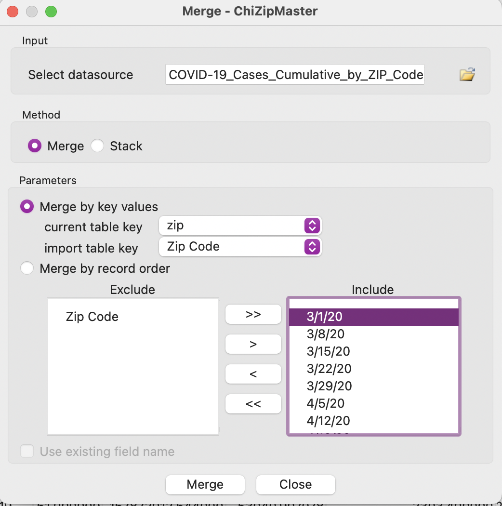

 

**Challenge:** Do the same process using QGIS.

[*Merge by Attribute in R*](https://toolkit.sdohplace.org//04-dataR.html#join-by-attribute-1)
:::

:::tip
**Tip**

*Using Zip Codes* 

Zip codes are often the smallest area resolution available for many health researchers, due to privacy concerns. However, zip codes correspond to postal service routes, are not meaningful administrqtive units, and can mask data insights at the neighborhood level as a result. Associations that may appear if using tract-level data could be hidden at the zip code level. Be careful, and understand your limitations!

The Census provides Zip Code Tabulation Areas (ZCTAs), which are similar to but not exactly the 5-digit Zip Codes people think of when referencing their postal address. Furthermore, full 9-digit Zip Codes change regularly. For precision, consider using the [HUD Crosswalk](https://www.huduser.gov/portal/datasets/usps_crosswalk.html) to transform your zip code year to a census tract. 
:::

### Join by Location {-}

Sometimes, you won't have a boundary key! How will you know which parks fall into which census tract? Or what about selecting neighborhoods with commuter train infrastructure?

A spatial join is defined as merging data based on location. Both datasets are spatially enabled, and likely overlap each other. The data from one dataset (that you're joining) gets "stuck" to the dataset you're merging to. Both data should be in the same CRS.

Add spatial joins to data to analyze the relationships data sets may have with each other. This tool allows you to merge certain aspects of data sets, such as joining descriptive statistics about one data sets relation to the other.

:::activity
**Activity**

*Add a Spatial Join*

We’ll create a spatial join with affordable housing development data and ChiZipCleaned.geojson. In this case, we’ll add the number of affordable housing developments in each zip code to the zip code data set.

Step 1: Join Attributes

Go to Processing -> Toolbox and search for Join Attributes. For this exercise, select Join attributes by location (summary). Set the following parameters:

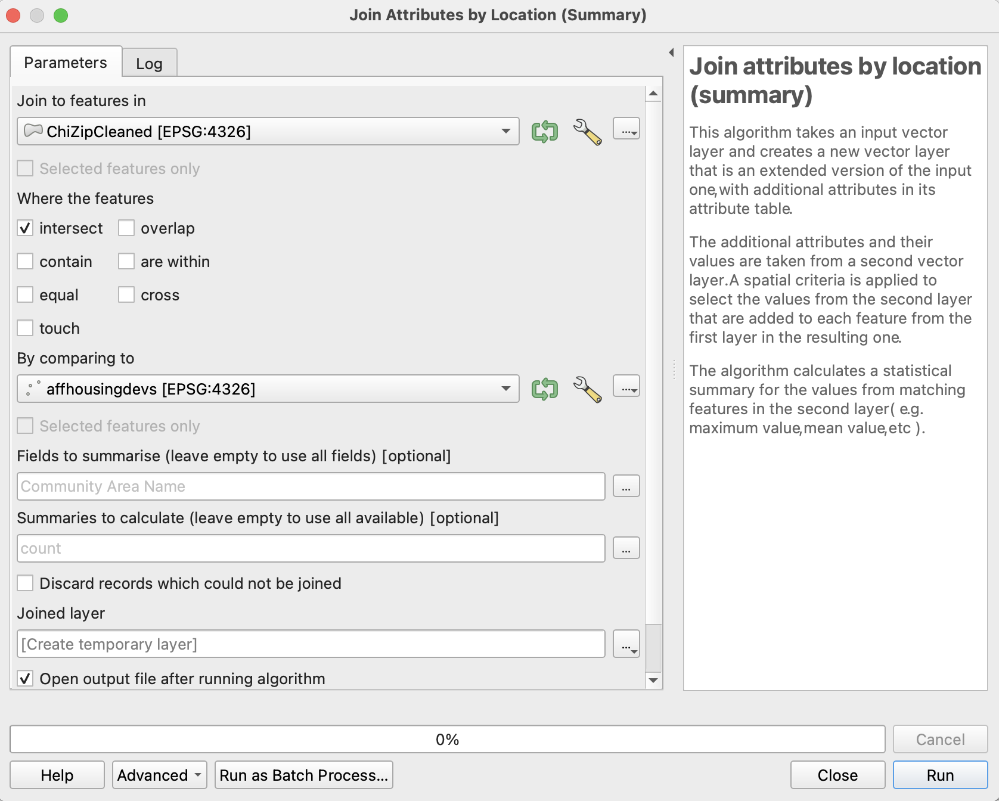

These parameters are set on the premise that we want a count of the affordable housing developments contained within each zip code. A new joined layer will be mapped on top of your current layers. 

 

Step 2: Map the Joined Data

The new layer generated by the spatial join will default to a single symbol map, not providing any useful visual information about the spatial join.

- Change the symbology by right clicking and going to Properties -> Symbology.
- Change the symbology from Single Symbol to Graduated with the value Community Area Name_count. 

Try changing the color ramp, mode, and number of classes. The resulting joined layer may look similar to the one below.

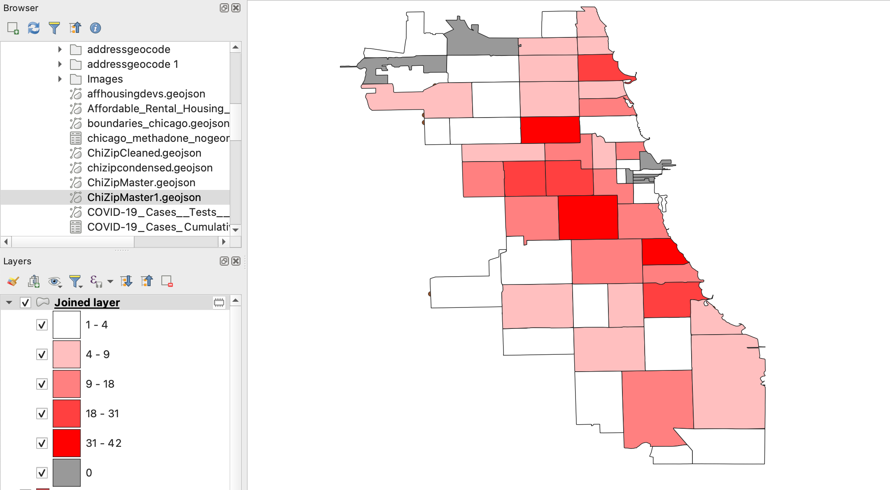

*Note: In order for null values to appear, you may need to first set symbology to graduated colors, then change it to Rule-based. Add a field with the rule set to Else rather than Filter. Then change colors and arrange as you wish.* 

 

[*Merge by Location in R*](https://toolkit.sdohplace.org//04-dataR.html#join-by-location-1)
:::

:::pitfall
**Pitfall**

*Invalid Geometries*

In some cases, QGIS may struggle to read the geometries of your data. This can cause spatially dependent tools, like the Join function, to not be able to run properly. Depending on the scale of this issue, and your goals, you may want to move past this problem instead of fixing it. If this is the case, you can set the Invalid feature filter, found under the layer’s Advanced Options when creating the spatial join, to Skip Features with Invalid Geometries and complete the rest of the run.
:::

## Inspect Data 

Inspect data, both through spatial and non-spatial means, when starting a new project, after each step of data processing, and when complete. That means all the time! This helps verify that all data wrangling to this point has occurred properly. 

In the next module, we'll dive into the details of this further, moving past inspection to cartography anddata analytics.

### Thematic Maps {-}

To inspect data from a spatial perspective, create a series of choropleth maps. A choropleth map is a thematic map that utilizes shades, textures, and colors to depict data values in specific geographic areas. Choropleth maps are useful for rapidly discerning spatial data patterns. However, these patterns may vary depending on the chosen data classification method.

### Map Overlay {-}

Overlay multiple data sets to investigate how they correspond to one another. Open the data sets you are interested in and order your layers appropriately to get an initial view of potential relationships between data sets.

:::activity
**Inspect Data with Different Methods**

Generate Choropleth Maps in GeoDa

Open ChiZipCleaned.geojson. From the Map option on the toolbar, you can select a variety of choropleth map options using different variables or breaks for your data. 

Select a mapping method and a variable to map. Inspect your data by comparing how different data break methods present the same variables, and how the spatial patterns of different variables compare. 

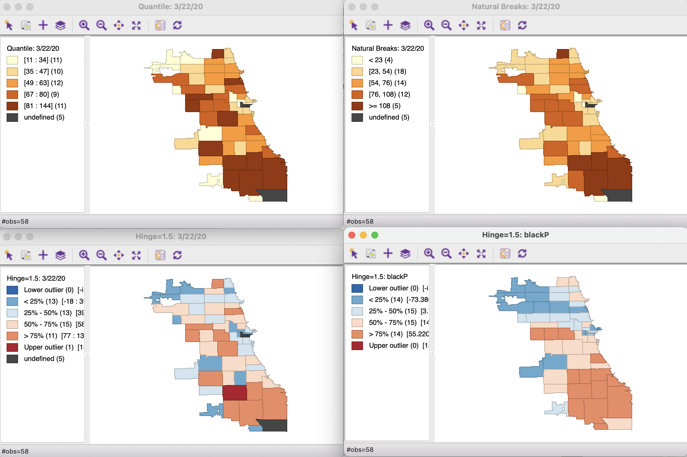

 

Overlay Data in GeoDa

With the Chicago zip code data already loaded in GeoDa, add a layer of point data with Affordable_Rental_Housing_Developments.csv. 

- From the map view, select Add Map Layer. 
- Select the affordable housing data set, set the lat/long fields, and hit OK. 
- If you do not see the housing data, go to Map Layer Settings. Make sure the layer is turned on and ordered first.

Once you add it to one map, you should be able to find it as a layer in each subsequent map you make with these data sets for the duration of your mapping session.

Note: the first row does not have lat/long data and may impede GeoDa from mapping the rest of the affordable housing data set. If you have this problem, try removing this row from the CSV.

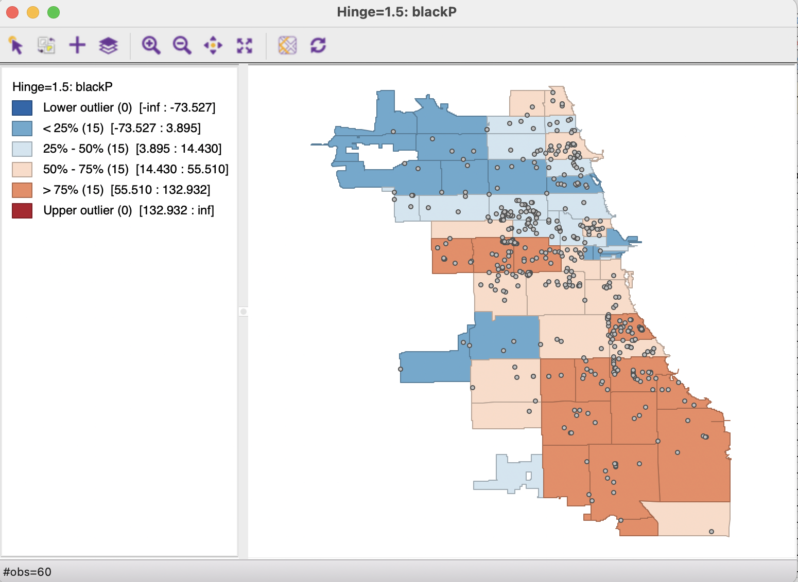

 

Overlay Data in QGIS

Let’s overlay zip code boundary data with affordable housing point data.

- Load ChiZipCleaned.geojson into QGIS. 
- Add Affordable_Rental_Housing _Development.csv by going to Layer -> Add Layer-> Delimited Text Layer.
- Navigate to the file, and ensure all fields indicate the correct data source in order to display the data properly.

Adjust the color, transparency, size, and borders of each layer by right clicking the layer and going to Styles -> Edit Symbol. The affordable housing data can also be saved as a spatial data set at this point, by right clicking on the layer and navigating to Save Features As. 

 

[*Inspection in R*](https://toolkit.sdohplace.org//04-dataR.html#inspect-data-1)

:::

## Finding Data

In this module, we provided sample data to work with. When you're looking for your own data to integrate, you'll need to do some research to find what you need. Here are some tips of places to search:

- City, County, and State Data Portals. Look for your area of interest using search terms like "tracts" or "zip code" to find aggregate data ready for joining.

- The Social Vulnerability Index dataset by CDC includes cleaned American Community Survey that is easy to extract and merge with your spatial data.

- While U.S. Census data is available at Census.gov, finding data may be more efficient using third party platforms like IPUMS/NHGIS or Social Explorer. We also recommend the tidycensus package in R (see Appendix Resources for details).

- Additional aggregated products to check out include: EJScreen, the City Health Dashboard, County Health Rankings, the Opportunity Atlas, the Neighborhood Atlas, and more.

- Learning how to use the "turbo-pass" Open Street Map plugin in QGIS, or R corresponding library, will give you access to a public version of digitized infrastructure (e.g. streets, parks) and resources (e.g. supermarkets, schools) across the globe. Some areas have better coverage than others.

When determining which data to include, consider using a conceptual model to guide your variable selection. The socio-ecological model of health or risk environment models, for example, identify specific indicators that you may want to fold in.

## Video Walkthrough

Here is a walkthrough of the module in video format. This presentation is provided by the author(s) of the module for your thorough understanding, so grab a cup of coffee and follow along:

  <iframe class="responsive-iframe" src="https://www.youtube.com/embed/m8efSl7HzAI?si=j0BPpScPyp_QIX1h" title="YouTube video player" frameborder="0" allow="accelerometer; autoplay; clipboard-write; encrypted-media; gyroscope; picture-in-picture; web-share" referrerpolicy="strict-origin-when-cross-origin" allowfullscreen></iframe>

## Resources {-}
For a deeper dive on topics discussed in this chapter, please check out the following. If you have a resource to add, feel free to suggest one by submitting an [issue](https://github.com/healthyregions/sdhoplace-toolkit/issues) to our toolkit repository.

- [Open Geomatics](https://www.opengeomatics.ca/topology-and-geocoding.html#geocoding) 
