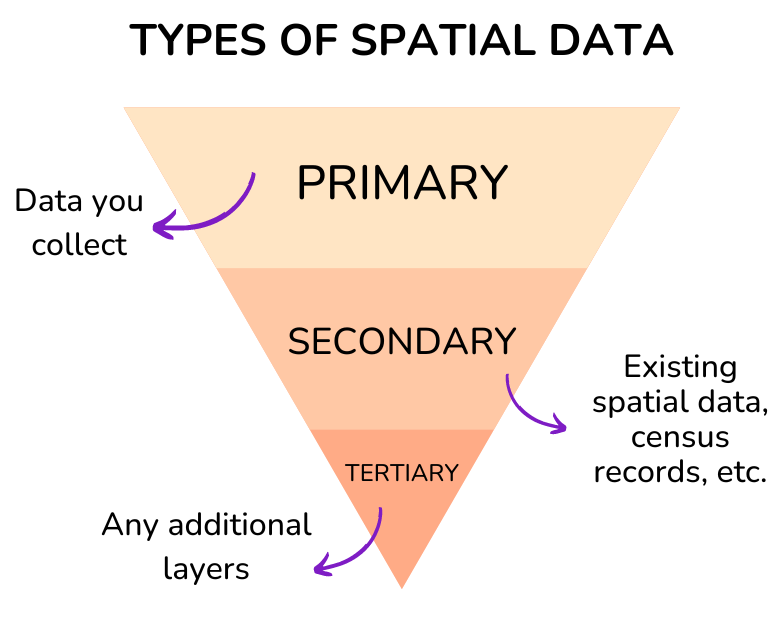

---
---

# Data Wrangling

:::objective
**Objectives**

In this module, you will:

* Expand your understanding of the social determinants of health and equity
* Learn how spatial data visualizations are used in public health   
* Define four main types of web mapping applications

By the end, you should have an idea of which type of spatial data visualization type you plan to work with for your project.
:::

## Intro to Spatial Data

## Projections

The Earth is an irregular ellipsoid, rather than a perfect sphere. As a result, many ways of visualizing the Earth, in whole or in part, have been developed. A Coordinate Reference System (CRS) communicates what method should be used to flatten or project the Earth’s surface onto a 2-dimensional map. Different CRS imply different ways of projections and can generate substantially different visualizations. For example, the following are some world maps using different projections:

pic from slide 13 intro2spatialmed

In addition to projections that optimize for global accuracy, there are many regional projections. For instance, NAD83 (North American Datum 1983) is divided into several UTM (universal transverse mercator) zones across the continent. So when projecting a dataset of Illinois, for example, the most appropriate NAD83 projection would be NAD83 UTM zone 16N. Projection names have also been standardized to EPSG codes. The projection NAD83 UTM zone 16N is EPSG:26916.

Many datasets available online, and GeoJSON files as a general rule, default to the projection EPSG:4326, a global projection used by GPS. Changing projections can be critical for improving accuracy for your project, and making sure your layers are being displayed using the same information. Always search the internet to determine what projection is most appropriate for your project, and to find the corresponding EPSG code.

For this exercise we’ll use QGIS to change the projection of a spatial dataset. 
*Note: Mac users will need to override a security setting to download QGIS. Once you have installed QGIS, you will need to go to Security and Privacy in System Preferences. There, you will find a message that “1 GADL Complete.pkg” was unable to be opened. Select “Open Anyway.” You may need to do this for multiple packages depending on the version of QGIS you download. If you still have issues opening QGIS after this, Stack Overflow is a great resource for troubleshooting GIS software issues.* 

## stuff
testing
- What is Spatial Data

- Inspection - viewing tables & data itself

- Projections & Coordinate Reference Systems

- CSV to Spatial Points

- Merging spatial data (area-level)

- Reshaping data

- Calc new spatial variables?

[[ likely pare this down, move some to data assessment above, and some of the rest to later module? ]]

After understanding the significance of refining objectives and finding stakeholders, it is crucial to take into account one of the essential elements in your project--the spatial component. This toolkit underscores the fact that social determinants of health encompass more than personal genetics or healthy habits. According to the World Health Organization, social determinants of health refer to the conditions in which people are born, grow, live, work, and age (https://health.gov/healthypeople, accessed 11 October, 2023 ). By adopting a spatial view of SDOH, we can research how communities are affected by the places they inhabit. For instance, we can evaluate their access to health care, transportation, recreation, and green areas. On the other hand, some communities may be exposed in their neighborhoods to crime, racism, and pollution. By mobilizing spatial visualizations, we can identify and address these inequalities.

The spatial data we need for our visualizations can be quite different. While censuses and databases can provide a starting point, it's important to understand their nature - what they include and what they leave out, who generates them (whether it's the public or private sector), and what their intended purpose is. Scrutinizing spatial data is critical to start conceiving your spatial visualization.
Think of spatial data as your high-powered lens zooming in on a community's heartbeat. It lets you see beyond the surface to the underlying structures—like healthcare reach, parks, and transport. And yes, it also uncovers the shadows of crime, discrimination, and pollution. In your SDOH project, you can typically use three types of spatial data: primary, secondary, and tertiary. In the following section, we will provide a brief description of each of these types of data.

{width=80%} 

- Primary Spatial Data: Primary spatial data refers to the data that you can collect either personally or through a sensor/machine which you or your stakeholders have previously installed. There are several examples of spatial visualizations of SDOH made with primary data. Some researchers have used online interviews or questionnaires to analyze their experiences in their neighborhood. Other researchers have placed sensors to map air quality in cities. The use of Global Positioning Systems (GPS) or smartphones is another way to generate primary data.

- Secondary Spatial Data:  You may encounter challenges when gathering SDOH primary spatial data, as it can be a time-consuming and costly endeavor. As a result, SDOH researchers, mapmakers, and advocates frequently turn to various secondary resources, such as spatial databases and census records, to inform their spatial representations. Typically, these files consist of digital layers that are prepared for seamless incorporation into a GIS or web mapping application. However, you can also work and manipulate non-spatial data in your project. Notable sources for such data include both profit and non-profit databases, government census information, and even digitized or scanned paper maps.

- Tertiary Spatial Data: In the realm of SDOH spatial visualizations, there exists a third option–your map(s) may access other maps’ spatial data. Tertiary spatial data are spatial layers that have been previously or currently utilized in other cartographies and are readily accessible for integration into a Geographic Information System (GIS) or web mapping applications. When engaging with stakeholders experienced in health mapping, it's worth inquiring whether they possess any spatial layers that could prove beneficial for your project. 

It is key to emphasize that data can often be tainted by biases and errors. As a result, the methods used to gather, aggregate, or model spatial data can have adverse effects on the quality of our data visualizations. It is of utmost importance to meticulously scrutinize various forms of data, whether they are qualitative (e..g, interviews or questionnaires), quantitative (e.g., databases), or mixed (e.g., surveys). A valuable starting point for data analysis involves assessing metadata within databases or interview questions. Further insights into this subject will be explored in subsequent sections of this toolkit.

### Project Tip: {-}
In your project, there's no need to limit yourself to just one kind of data. In fact, it's not only possible but often necessary to mix and match different sources and types of spatial data to craft compelling SDOH spatial visualizations.

### Activity 1.3: {-}
Review these projects below and identify what type of data they use. In your opinion, what other types of data could they use to enrich their visualizations? 

[Using Asset Mapping to Identify Health Needs of a Latinx Population in Rural Virginia] (https://scholarscompass.vcu.edu/cgi/viewcontent.cgi?article=1396&context=uresposters)
[US Social Determinants of Health Atlas - Map of the Month] (https://carto.com/blog/visualizing-health-data-social-factors)
