---
---

# Research Design & Analysis

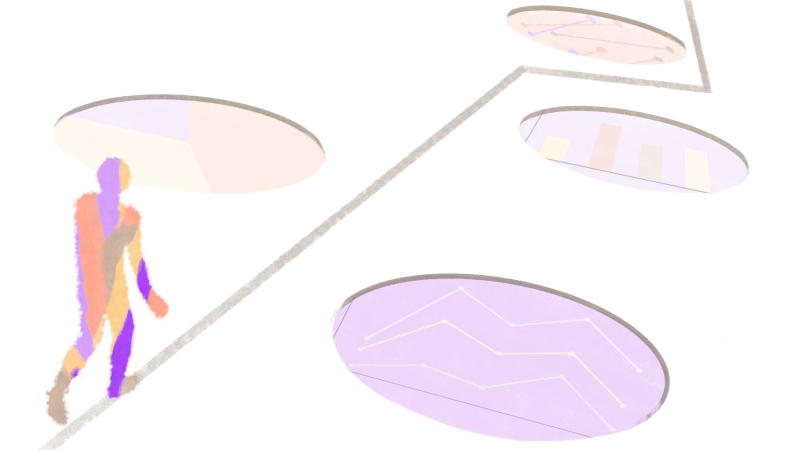{width=100%}

:::objective
**Objectives**

In this module, you will: 

- Gain insight into the different spatial analysis techniques applicable to SDOOH research
- Delve into potential pitfalls and limitations in spatial analysis of SDOH data
- Identify cartographic design principles for effective communication

:::

Spatial analysis and design mapping techniques have become indispensable tools in the study of Social Determinants of Health (SDOH).  This module provides an overview of spatial analysis methods in the SDOH context, highlighting common pitfalls and best practices in cartographic design. By understanding how health outcomes geographically correlate with socioeconomic and environmental factors, we can identify health disparities and guide effective interventions. Additionally, we'll then examine the limitations and challenges of spatial analysis in the SDOH context.

Finally, the module will focus on cartographic design principles, stressing the importance of effectively communicating through maps. We will delve into using color schemes, symbology, and other mapping elements to accurately present and visually enhance spatial data related to SDOH.

:::tools
**Tools**

*Download the Activity Datasets*

While you will use your own data for your project, practice with ours. Please download and unzip this file to get started: [SDOHPlace-ResearchDesignAnalysis.zip](https://github.com/healthyregions/sdohplace-toolkit/blob/main/data/SDOHPlace-ResearchDesignAnalysis.zip)

This dataset includes data prepped and merged in the previous module.
:::

## Research Design

You've got data, a goal, and an app on the horizon -- How can you ensure that your understanding of the data is accurate, complete, and representational? Do you need to transform your data into new variables to get a better picture first? Do you need to visualize your data in new ways, or prepare for a more advanced analytical model? 

There are multiple pitfalls you'll want to avoid when design your analysis. In the following overview of **Mindsets & Spatial Reasoning,** spatial data scientist [Julia Koschinsky](https://spatial.uchicago.edu/directory/Julia-Koschinsky) reviews how to think about the process of analyzing data and how to set up the problem and research design. 

```{r table-pitfalls, echo=FALSE, message=FALSE, warnings=FALSE, results='asis'}
require(pander)
panderOptions('table.split.table', Inf)
my.data <- "  Move Away From        | Move Towards
  **Confirmation Bias:** Looking to confirm pre-existing beliefs with data | Expect that, as humans, we’ll be fooling ourselves.Focus on finding what’s wrong.
  Maps and spatial analysis will confirm the expected, which is fine … | … but what is more interesting is to discover something unexpected, something surprising, beyond what we already knew before we started the analysis. What is the added value of doing the spatial analysis?
  **Fixed mindset:** Only technical people can learn spatial data analysis | **Growth mindset:** Class and toolkit assumes that everyone can learn this
  Inductive or deductive reasoning, or 'data-driven' or 'model-driven' thinking that lets the data speak on its own. | Exploratory Spatial Data Analysis & Spatial Reasoning as abductive/iterative reasoning. These approaches go back and forth between potential explanations and evidence to update both in lockstep.
  Focus on description, for ex., where’s the cluster or access gap? | Focus on explanation and falsification: Why is the cluster there? Is the cluster real (not random)?
  Analyzing data with a classic exploratory or temporal analysis, ignoring the spatial dimension even though it’s relevant. | Spatial methods to explicitly analyze location, distance, and spatial interaction
  Assuming maps are always objective | Recognizing that maps are often used to exercise power and to manipulate.."
set.caption("")
df <- read.delim(textConnection(my.data),header=FALSE,sep="|",strip.white=TRUE,stringsAsFactors=FALSE)
names(df) <- unname(as.list(df[1,])) # put headers on
df <- df[-1,] # remove first row
row.names(df)<-NULL
pander(df, style = 'rmarkdown')
```


Correlation is not causation. A good exploratory data analysis, however, can help you gather evidence and make a case for next steps. What are some considerations for your research design? 

- **Data Integrations:** Do you have the right data combined and harmonized for analysis & viewing? 

- **Spatial Scale:** What is the scale of the phenomenon you are trying to understand -- and the scale of your data? If they're not the same, be careful of making errors in interpretation. 

- **New Variable Calculations:** Do you need to generate new measures that may be more precise? 

- **Data Limitations:** How was the data you have collected? Are there any biases or issued you need to consider when interpreting findings? What's missing?  

- **Methodologies Used:** Most methods will return some result -- that doesn't make them the correct or useful. Are you using the right methods for your data, and that also address data limitations?

- **Model Interpretation:** Did you interpret your results with data, scale, and methodological considerations in mind? For example, be weary of drawing conclusions on individuals from population-level data. That's the [ecological fallacy](https://mgimond.github.io/Spatial/pitfalls-to-avoid.html#ecological-fallacy).

::: pitfall

**Potential Pitfall**

The **Modifiable Areal Unit Problem (MAUP)** is a significant issue in spatial analysis that arises when results of statistical analysis are affected by the scale or the zoning of the area units used in the study. Essentially, it reflects the idea that the same set of data can lead to different conclusions depending on how the data is grouped geographically. 

This problem is particularly relevant in disciplines like geography, epidemiology, and urban planning. For a deeper understanding of MAUP, its implications, and strategies to mitigate its effects, [here's a comprehensive resource](https://gisgeography.com/maup-modifiable-areal-unit-problem/) that offers detailed insights. You may also watch this informative [video](https://uchicago.hosted.panopto.com/Panopto/Pages/Viewer.aspx?id=512fd409-0b51-4d24-b43e-b1030168712b) from GIS Librarian [Robert C. Shepard](https://www.lib.uchicago.edu/about/news/meet-rob-shepard-new-gis-librarian/) from University of Chicago. 

:::

## Defining your Position

In exploring cartography and spatial analysis, it's crucial to challenge their perceived objectivity. Traditionally viewed as neutral tools, unaffected by the biases of their creators, recent studies, especially from feminist and global South perspectives, have started to challenge this view. They reveal how data often overlooks marginalized communities, how maps can perpetuate colonialist views, and how the choice of colors and symbols might oversimplify diverse human experiences.

Therefore, it's essential to rethink our approach to maps and analyses, recognizing that they are not impartial mirrors of reality. When conducting analyses or creating maps, we should ask ourselves critical questions: Who is collecting the data I use, and for what purpose? Which narratives are my analyses emphasizing? Whose interests does the software I use serve – is it a commercial product or open-source? How do factors like our gender, race, ethnicity, economic status, sexuality, and nationality influence our approach to cartography?

A way forward involves examining our privileges, recognizing the types of discrimination we face—or don’t face—and considering how our experiences influence our mapping efforts. Listening becomes a crucial skill. Mapping should go beyond mere argumentation and become a tool for inquiry. We must critically examine our own maps and data, paying attention to who is represented and, importantly, who is left out. Engaging with stakeholders is a key part of this process.

Additionally, we should strive to give a voice within our analyses to those directly impacted by our maps rather than speaking for them. Being mindful of our cartographic language is vital; like words, maps convey narratives.

::: tip

**Tip**

Take time to reflect on these points and jot them down in your journal. Regularly revisit these thoughts and refer back to Module 1 of this toolkit, recognizing that mapping is an evolving, iterative process.
:::

### Reflective Mapping

Remember, mapping is more than just inputting data into software; it involves thoughtful reflection. This process should take into consideration the context and significance of the data, ensuring that your maps tell an accurate and meaningful story. By carefully selecting and analyzing your variables, and critically examining the resulting spatial patterns, your maps can become powerful tools for understanding and communicating complex social and health-related phenomena.

In modern spatial epidemiology, it’s critical to not take associations at face value. For instance, health disparities are often driven not by race itself but by systemic racism. Analyzing only a specific racial or ethnic group isn’t sufficient. Thus, investigating a multitude of variables and cultivating a curiosity to understand these complex intersections is crucial for meaningful knowledge discovery. This approach allows for a more nuanced understanding of the interplay between various factors and health outcomes, ultimately contributing to more effective public health strategies and interventions.


## Calculating Spatial Variables

While the previous module focused on spatial data wrangling techniques to develop new harmonized datasets and variables, there are many more approaches to refining measurements of the environment. 

For example, spatial access to a resource can be calculated using multiple approaches. Let's consider approximating a neighborhood as a census tract. Access to the resource could be measured as:

- Total number of resources within the census tract
- Total number of resources within a mile of the census tract
- Total number of mile-wide resource buffers intersecting the tract
- Percentage of the census tract covered by a mile-wide resource buffer
- Drive, bike, or walk time from the center of tract to nearest resource
- Total number of resources within a mile per 1,000 people in the census tract
- Gravity model score measuring spatial access to resoure using a distance decay function, total capacity at resource, and population in demand

Which one is best? It will depend the data available, your skills and interest in calculations, and more importantly, the underlying phenomenon of interest. How often do persons access the resource? What travel behavior is used? 

For density based measures (like total number of resources per area), use the spatial join function froom the last module, and summarize by area. This is also termed as a "point in polygon" operation. For additional proximity-based metrics like buffer and distance calculations, read on. For more complex access modeling techniques, check out the advanced metric resources at the end of the module.

### Buffers

Creating buffers and calculating distances are vital techniques for understanding relationships between geographic features and identifying potential spatial patterns or associations.

Buffers are polygons created at a specified distance around input features, like points, lines, or other polygons. They are useful for analyzing the proximity of health-related phenomena to specific locations.

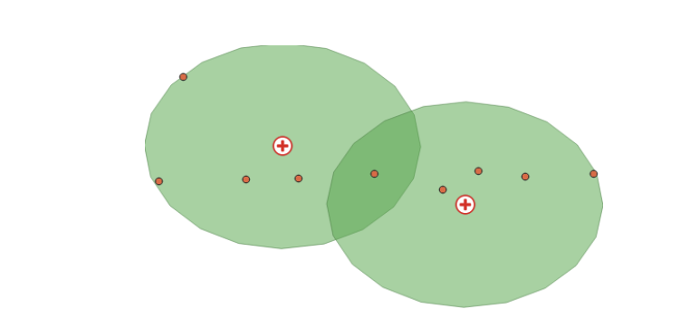


For example, you can create a buffer of a half-mile radius around a public health clinic to analyze the census tracts within that area. Another application is generating a buffer around a hospital to identify the population within a certain distance or assessing the impact of pollution from a factory on nearby schools or residential areas.

To create a buffer in GIS software or coding, you specify a fixed or variable distance value. Fixed-distance buffers are constant radius polygons around input features, while variable-distance buffers can vary based on an attribute value.

::: activity

**Activity**

*Buffer Analyses: Calculate Farmers Market Service Areas*

Grab the data for this activity and the following ones [here](https://github.com/healthyregions/sdohplace-toolkit/blob/main/data/SDOHPlace-ResearchDesignAnalysis.zip).

This activity focuses on utilizing data from Chicago's farmers' markets, specifically the `farmers_markets_2012` dataset. Farmers' markets are vital for health and well-being, providing access to fresh, locally-grown produce and supporting sustainable food systems. They offer diverse, nutritious food options, often at affordable prices, and foster community connections and local agriculture support. The presence and density of farmers' markets in a neighborhood significantly influence residents' food accessibility.

<details markdown='1'><summary>Start a New Project </summary>

- Open QGIS and create a new project. Save it as “Chicago Farmers Markets 2012”.
- Add the shapefile: `farmers_markets_2012.shp`.

</br></br></details>

<details markdown='1'><summary>Creating Buffers</summary>

- Go to the Vector menu > Geoprocessing Tools > Buffer(s).

- In the dialog box, choose "farmers_markets_2012" as the input layer.Ensure you are using the correct Coordinate Reference System (CRS).

- Enter the buffer distance (e.g., 0.5 miles) and select the appropriate unit from the Unit drop-down menu.

- *Tip:* The distance unit is based on the CRS of the input layer. If you're not using the correct CRS, the default unit may be in degrees. Refer to Module 4 if you encounter issues.

- Keep default settings for segments, join style, and miter limit. Initially, leave the "dissolve result" box unchecked to maintain separate buffer zones.

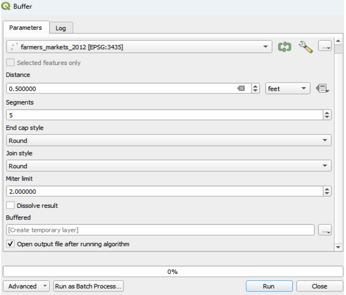

</br></br></details>


<details markdown='1'><summary>Running the Buffer Tool</summary>

- Click "Run" to execute the Buffer tool. A new buffered layer is added to your project.
- In the Layers Panel, arrange the point feature (farmers markets) above the buffered polygon for better visualization.
- *Tip:* Observe how the buffers overlap or remain separate, depending on the distance you chose.


</br></br></details>


<details markdown='1'><summary>Dissolving Overlapping Areas</summary>

- -Reopen the Buffer dialog box, go to Parameters, and check the box for "dissolve result".
- Click "Run" again. A new layer with dissolved overlapping areas is added.
- Close the Buffer dialog box.
- Remove the initial overlapping buffer layer and keep the dissolved buffer layer to organize your layers
- *Tip*: Organize your layers for clarity, such as renaming layers, removing unwanted ones, or toggling layer visibility.

</br></br></details>

Through this activity, you will understand the spatial distribution of farmers' markets in Chicago and their impact radius, which is crucial for assessing community access to fresh food. The buffer analysis illustrates the physical reach of these markets, offering insights into potential areas needing more access to fresh produce.

::: 

### Nearest Resource
Calculating distances involves measuring straight-line (Euclidean) or network (along paths or roads) distances between features.In health geographies, this might include assessing accessibility to healthcare facilities or analyzing the spatial distribution of disease cases relative to risk factors. Examples include calculating the Euclidean distance from residential locations to the nearest healthcare facility or measuring the network distance along roads to determine travel time to hospitals. 

It’s important to choose the right measurement method (Euclidean or network) based on the research question and the nature of the features.

::: activity

**Activity** 

*Minimum Distance Calculations*

In this part of the exercise, we're interested in determining the straight-line distance from residential locations, such as census tracts, to the nearest farmers market. The "Distance to nearest hub (line to hub)" tool in QGIS can be used to calculate the distance between the center of an origin feature (e.g., centroids of Census Tracts) and its nearest destination feature (e.g., farmers market).

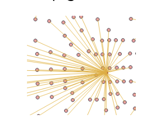

<details markdown='1'><summary>Accessing the Tool</summary>

- In QGIS, open the Toolbox by going to Processing.
- Search for and select "Distance to Nearest Hub (line to hub)" under Vector analysis.

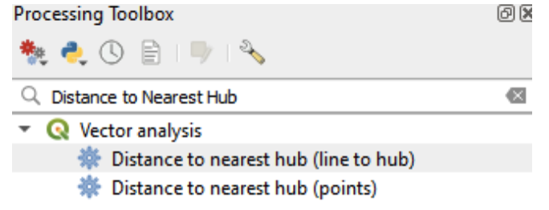

</br></br></details>

<details markdown='1'><summary>Setting Up the Tool</summary> 

- In the processing dialog box, set "Source Point layer" to "Chicgotracts_Centroids".
- For "Destination hubs layer", select "farmer’s market_2012".
- Choose your preferred measurement unit (e.g., miles) in the "Measurement unit" field.
- Leave other settings as default.

</br></br></details>


<details markdown='1'><summary>Running the Tool</summary> 

- Click "Run". A new layer ("hub distance") will be added to your project. Close the dialogue box.
- Open the attribute table of the new layer to view the computed hub distances (HubDist).
      
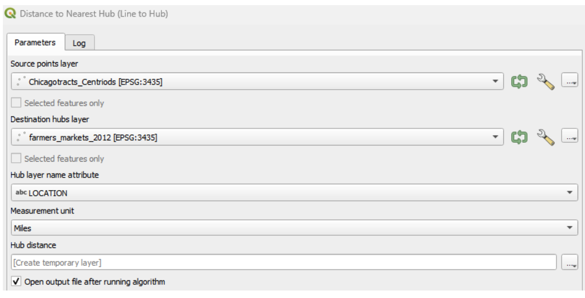

</br></br></details>

<details markdown='1'><summary>Analyzing Access to Facilities</summary> 

- Examine the attribute table to identify if there are any facilities (e.g., farmers markets) that lack good access. Consider the implications of these findings for community access to fresh produce.
    
</br></br></details>

<details markdown='1'><summary>Using Extract within Distance Tool</summary> 

- Another useful tool is the "Extract within distance" under vector selection in the geoprocessing toolbox.
- This can be used to extract tract centroids that are within a specified maximum distance (e.g., 1 mile) from the input features (e.g., farmers markets).

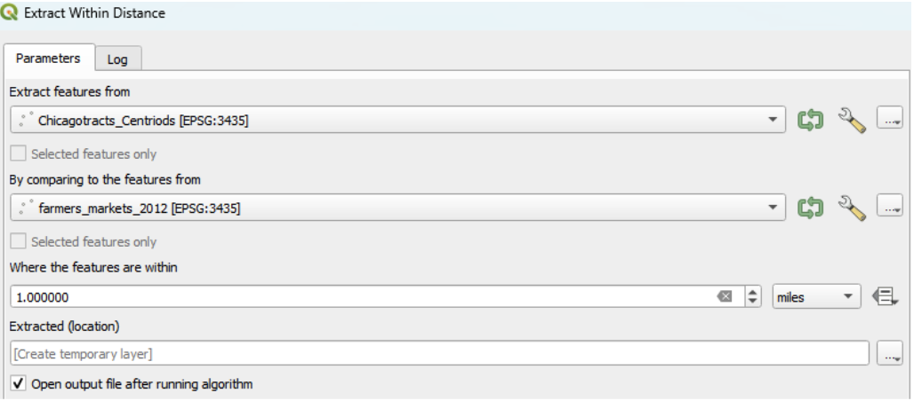

</br></br></details>

Through these exercises, you will gain insights into the accessibility of fresh produce from various residential areas in Chicago, which is crucial for understanding the availability of healthy food options across the city. This analysis can inform urban planning and policy decisions to improve access to essential amenities like farmers markets.

:::


## Exploratory Data Analysis 

Exploratory Data Analysis (EDA) serves as the compass for spatial analysts navigating through the vast seas of data. It's a pivotal phase in your analytical journey, akin to charting a course before setting sail. EDA illuminates the landscape of spatial datasets, revealing patterns, anomalies, and relationships that might otherwise remain hidden. Through visualizations, statistical summaries, and spatial queries, analysts delve into the intricacies of the data, unraveling its mysteries and gaining insights that inform subsequent spatial analyses and decision-making processes. In essence, EDA is the compass that guides spatial analysts in their quest to uncover the hidden treasures buried within geographic information.

Exploratory *Spatial* Data Analysis includes techniques to describe and visualize spatial distributions, identify non-typical locations (known as spatial outliers), discover patterns of spatial association (e.g. spatial clusters) and suggest different spatial "regimes" and other forms of spatial non-stationarity. 

Each spatial pattern has a different story, or phenomenon driving its pattern. A polluting factory may influene someone's health who is living across the street, based on proximity -- in spatial terms, this may be a pattern of **spatial dependence**. Alternatively, or in addition to, residents near polluting sources may be more likely to have lower incomes based on complex, decades-long deinvestment processes, resulting in **spatially heterogenous** distribution of health outcomes.

By exploring the data available to us, we can begin to understand what those drivers are -- or at the very least, rule some out, and update our thinking. Because our brains our wired to find patterns (even if they're not there), we can use math and good research design gather evidence.

### Univariate and Bivariate Analyses

A solid EDA/ESDA approach starts with one (univariate) or two (bivariate) variables at a time. The data views we take may be non-spatial, setting up classical figures and charts, and/or spatial, using thematic mapping techniques. We'll highlight some approaches here, but recommend a deeper dive with a standard statistics course. Here are some things to look for:

- **Descriptive statistcs**: Summarize data as tables, calculating population summaries, total number of areal units included, and include testing statistics. Stratify by different spatial regimes (e.g. urban vs rural) or groupings (quantiles), as they are uncovered in later analyses. Follow STROBE reporting guidelines for summaries (e.g. median and IQR vs. average and SD). Beware of missing data, so report data included in your tables and notes.
- **Visualize your data**: It goes without saying, but we must -- visualize your data! Examine histograms, scatter plots, thematic maps, and more and explore relationships. Software like *GeoDa* was designed for brushing and linking to explore trends further.
- **Models at the End**: Avoid working with biased data and mis-specified models by waiting to run your regression & other anlaytical models. Ensure your data is high quality and at least understand the limitations and biases. In traditional EDA, a confirmatory analysis follows.

First let's explore scatter plots as a classic approach, and then dive into spatial data with statistical mapping techniques. 

#### Scatter Plots

Scatter plots are invaluable for visualizing relationships between Scatter plots can uncover possible correlations (both positive and negative) or patterns between socioeconomic factors and health indicators.

**Understanding Correlations in Scatter Plots**

- *Positive Correlation:* This is observed when data points in a scatter plot align along an upward diagonal line. It suggests that as one variable increases, the other variable tends to increase as well.

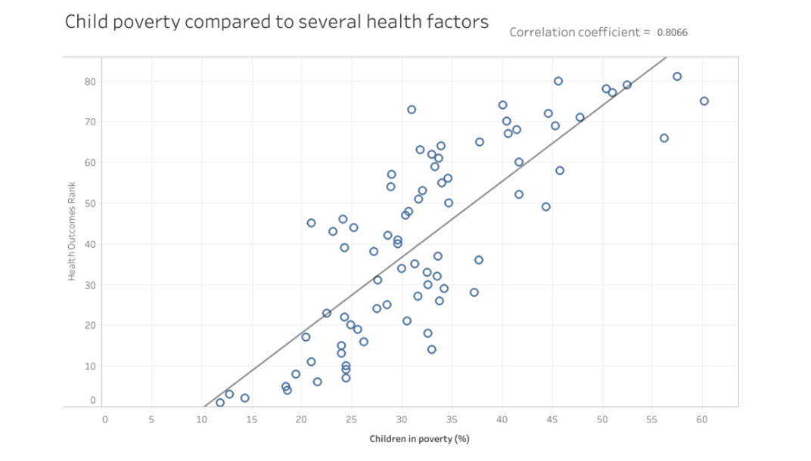


- *Negative Correlation:* Seen when data points align along a downward diagonal line, indicating that one variable decreases as the other increases.

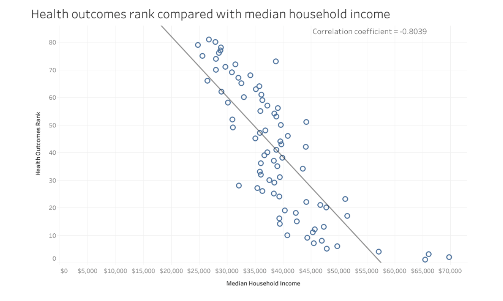

Interpreting these correlations offers insights into potential links between SDOH factors and health outcomes, guiding targeted interventions and policy-making. However, it's important to remember that correlation does not equate to causation. Always complement scatter plot analyses with additional analysis, theories, and concepts to ensure a comprehensive understanding of the data and its implications.

::: activity

**Activity**

*Creating Scatter Plots in GeoDa*

Scatter plots in GeoDa are useful for examining linear relationships between two variables:

<details markdown='1'><summary>Setting Up the Scatter Plot</summary>

- To start, select "Explore" > "Scatter Plot".
- In the "Scatter Plot Variables" dialog, choose a variable for the "Independent Var X" (e.g., age Over 65) and another for the "Dependent Var Y" (e.g., disability status).
- In this example, we're exploring the relationship between the population over 65 years and disability status. It’s generally good practice to place the variable you’re most interested in as the Y (dependent) variable.

</br></br></details>

<details markdown='1'><summary>Customizing and Analyzing the Scatter Plot</summary>

- Once the scatter plot is generated, you can right-click on it to access various functions, such as changing the color or saving the image.
- Examine the plot to assess the relationship between the two variables. Look for patterns such as a positive or negative correlation, or no apparent correlation.

</br></br></details>
::: 

### Statistical Mapping

Statistical mapping is the art and science of visually representing spatial data through the lens of statistical analysis. It's a powerful tool that transforms raw data into insightful maps, providing a tangible means of understanding spatial patterns and distributions. 

#### Data Classification

At the heart of statistical mapping lies data breaks classification, a fundamental technique used to categorize continuous data into distinct intervals or classes. These classes are defined based on statistical measures such as quantiles, standard deviations, or natural breaks in the data distribution. 

<details markdown='1'><summary>Quantiles</summary> 

- Observations are grouped into bins that each have the same number of observations, the so-called quantiles. The number of observations in each bin is equal, but the range for each bin is not.
- This statistical method is easy for the map reader to understand as it offers a straightforward approach by distributing equal observations across categories. For instance, with 30 counties divided into six categories, there would be five counties per category.
- This method works well when the data distribution is normal. 
- The problem with quantiles is that ties in data rankings can complicate quantile maps, leading to uneven class sizes. Also, outliers are lost when equal numbers of data values are in each class.

</br></br></details>

<details markdown='1'><summary>Equal Intervals</summary> 
- Organizes observations into categories that divide the range of the variable into equal interval bins.
- This classification divides the data into segments of equal range, such as intervals of 10. The user defines the number of intervals (20, 30, 40, etc), and the data is segmented accordingly. 
- Equal intervals are easy to read and understand; but it can be misleading in that no information is given on the distribution of the data within each distinct class. Thus, this method may not be ideal for skewed distributions or when outliers are present, as 

</br></br></details>

<details markdown='1'><summary>Natural Breaks (Jenks)</summary>  
- Natural breaks focus on the inherent groupings within the data, clustering similar values together while emphasizing the differences between categories. 
- Uses a nonlinear algorithm to group observations such that the within-group homogeneity is maximized 
- This method suits data not normally distributed and is particularly effective for highlighting extreme values. However, the number of observations in each category can be highly unequal.

</br></br></details>

<details markdown='1'><summary>Standard Deviation</summary> 
- The Standard Deviation method showcases the variation of a feature’s attribute from the mean, identifying outliers and emphasizing how values differ from the mean. 
- This classification is useful when understanding the relationship to the mean is crucial, such as in studies of population density or economic indicators. 
- This method does not work well with heavily skewed or non-normally distributed data.

</br></br></details>

<details markdown='1'><summary>Box Plot</summary> 
- The Box Plot (i.e.,Whisker Plot) classification visualizes data distribution through quartiles and outliers, extending the quantile approach with additional categories to separately identify lower and upper quartiles. 
- It provides a quick means to spot outliers and general spatial trends within the dataset.

</br></br></details>

By grouping similar values together, data breaks classification simplifies complex datasets, making them more interpretable and facilitating the communication of spatial patterns and trends to a diverse audience.

#### Choropleth Maps

A choropleth map is a thematic map that utilizes shades, textures, and colors to depict data values in specific geographic areas. Choropleth maps are useful for rapidly discerning spatial data patterns. However, these patterns may vary depending on the chosen data classification method (e.g.,Quantiles, Natural Breaks, Equal Intervals, Box Plot, Standard Deviation)


Having addressed the subjectivity of maps, let's delve into choropleth maps, a key tool in the exploratory spatial analysis of Social Determinants of Health (SDOH). Choropleth maps are instrumental in examining health geographies and SDOH, using different shades or colors to depict varying values or rates of specific variables across geographic areas, such as counties, census tracts, or ZIP codes.

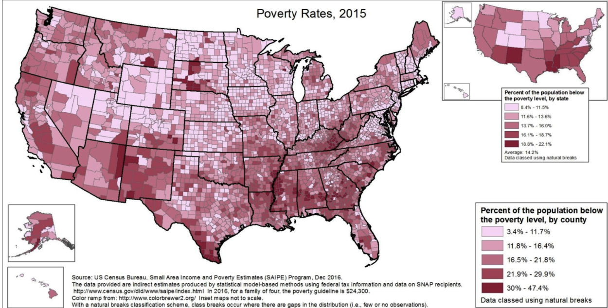

Choropleth maps can help us to start revealing spatial patterns and disparities in various health and socioeconomic indicators related to SDOH. These representations can pinpoint areas with high rates of chronic diseases, like diabetes or heart disease, and enable visual comparisons with factors like education, access to healthcare facilities, and social exclusion.

Moreover, choropleth maps are excellent for exploring potential correlations between SDOH and health outcomes. They can, for example, show how regions with limited access to healthy food options and green spaces might correlate with higher obesity rates. This visual data can inform targeted interventions and resource allocation, addressing social determinants in specific areas effectively.

Choropleth maps are also invaluable in communicating complex data to policymakers, public health officials, and community members. By visually representing intricate datasets in an accessible format, these maps can spark discussions around health disparities, resource distribution, and health equity. Given their capability to illustrate spatial patterns and the relationship between SDOH and health outcomes, choropleth maps are a vital resource for researchers, policymakers, and community organizations aiming to promote health equity and tackle the root causes of health disparities.

::: activity

**Activity** 

*Mapping the Pandemic with Choropleths*

During the COVID-19 pandemic, choropleth maps became crucial for health geographers, visually representing the virus's spread and highlighting hotspots and regional disparities. These maps, tracking trends over time, provided a deeper understanding of the pandemic's progression, supporting targeted interventions and policy-making. They not only made the pandemic's impact tangible but also emphasized the significance of spatial analysis in public health crises and showcased the practicality of geographic data visualization in research and decision-making contexts.

Now, let's create some maps to analyze the COVID-19 pandemic. We'll use QGIS for this tutorial, chosen for its flexibility in creating choropleth maps and its status as free, open-source software. 

**Note:** Other software options like R (see appendix) and GeoDa are also suitable for this task. Additionally, ArcGIS Pro and Carto are viable options, but remember they are proprietary and require a fee.

<details markdown='1'><summary>Opening a New Project in QGIS</summary>

- Start by opening a new project in QGIS.
- In the Layers panel, drag and drop the "COVID-19_pivot.xlsx" spreadsheet, as outlined in section 4.5 of this toolkit. If you don't have it, find it in the Zip folder at the start of this module.
- Joining your spreadsheet with a boundary shapefile:
Similar to the process in Module 4, join the "COVID-19_pivot.xlsx" with the boundary shapefile of Chicago's Zip codes, named “Chicago_Zipcodes.shp”.
Add “Chicago_Zipcodes.shp” to your layer panel.
- To access the join option, right click on “Chicago_Zipcodes.shp”, go to properties and select “join”. Lastly, select the “ plus icon.” 
Similar to GeoDa, you will need to specify: “the spreadsheet or layer you want to join” (e.g., COVID-19_pivot.xlsx), and the join and target fields (e.g., “zip”). Then click Okay.
- Check the attribute table on “Chicago_Zipcodes.shp.” You will see the fields from "COVID-19_pivot.xlsx" are there!
- Lastly, right click on “Chicago_Zipcodes.shp.” Select “Duplicate layer.” Right-click the new layer, Select “rename, and name it  “Chicago_COVID-19”.
Tip: If you need to review and better understand this step, go back to Module 4. 

</br></br></details>


<details markdown='1'><summary>Applying Symbology</summary>

- In the Layers panel, right-click on “Chicago_COVID-19” and select Properties, then Symbology.
- Change the top tab from Single Symbol to Graduated.
- Under the "Value" tab, select "Sum of Cases - Weekly".
- Set the Mode to “Natural Breaks (Jenks)” and Classes to “4”.
- Click Classify, Apply, and Ok. You've now created a map of the Sum of Cases of COVID-19 during a week in 2020 in Chicago.

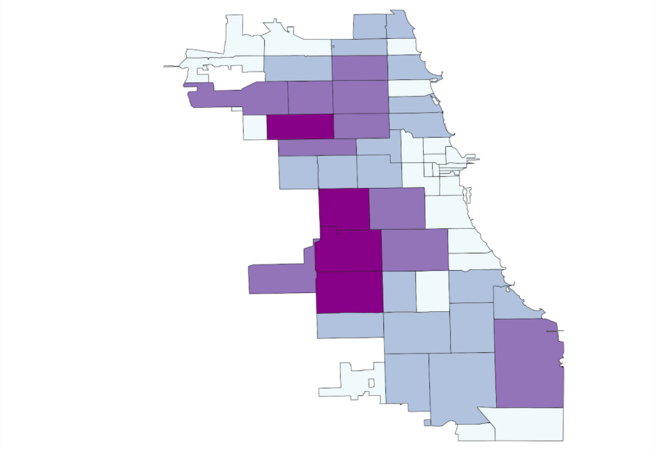

</br></br></details>


<details markdown='1'><summary>Exploring Different Classification Methods</summary>

- From the Map option in the toolbar, explore different choropleth map options using various variables or data breaks (e.g., quantile).
- Select a classification method, set the Categories (e.g., 4), and click apply.
- Examine your maps, comparing how different data break methods display the same variables and how spatial patterns vary between different variables.

</br></br></details>

<details markdown='1'><summary>Mapping Multiple Variables Simultaneously</summary>

- To investigate multiple maps at once, use the GeoJason file “ChiZipCleaned” that you organized in Module 4.
- Create different choropleth maps using various variables from the attribute table. For example, map the percentages of Asian (asianP), Black (blackP), Hispanic/Latinx (HispP), White (WhiteP), and populations over 65 (Over65p). Use Natural Breaks and 4 classes, similar to your previous COVID-19 map.

From the exploratory results, where darker colors indicate higher population density and gray signifies data absence, we observe that cumulative COVID-19 outcomes for one week in September 2020 seem to correlate geographically with the Latinx/Hispanic community in Chicago.

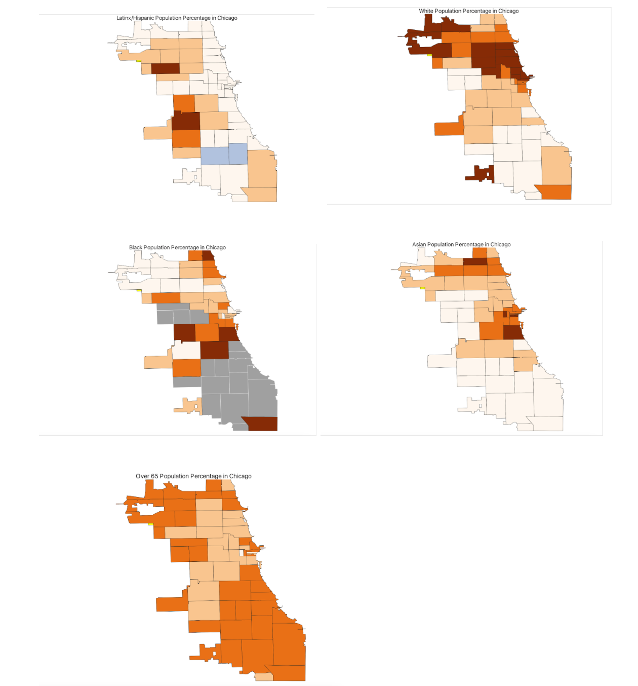

</br></br></details>

To refine your analysis further, consider introducing additional variables. Options might include the percentage of essential workers, varying age groups, or internet access. Integrating health outcomes such as asthma or hypertension rates at a similar scale could also offer deeper insights.

:::

#### Cartograms 

Cartograms offer a distinctive way to analyze and display Social Determinants of Health (SDOH) data. They differ from traditional choropleth maps by altering the size of geographic areas based on a statistical variable like population.

This technique provides a clearer depiction of disparities in SDOH across regions, highlighting areas more significantly impacted by adverse social and economic conditions.

Although cartograms can distort geographic shapes and boundaries, they effectively communicate complex SDOH data, helping policymakers and the public understand underlying inequities and the necessity for focused interventions.

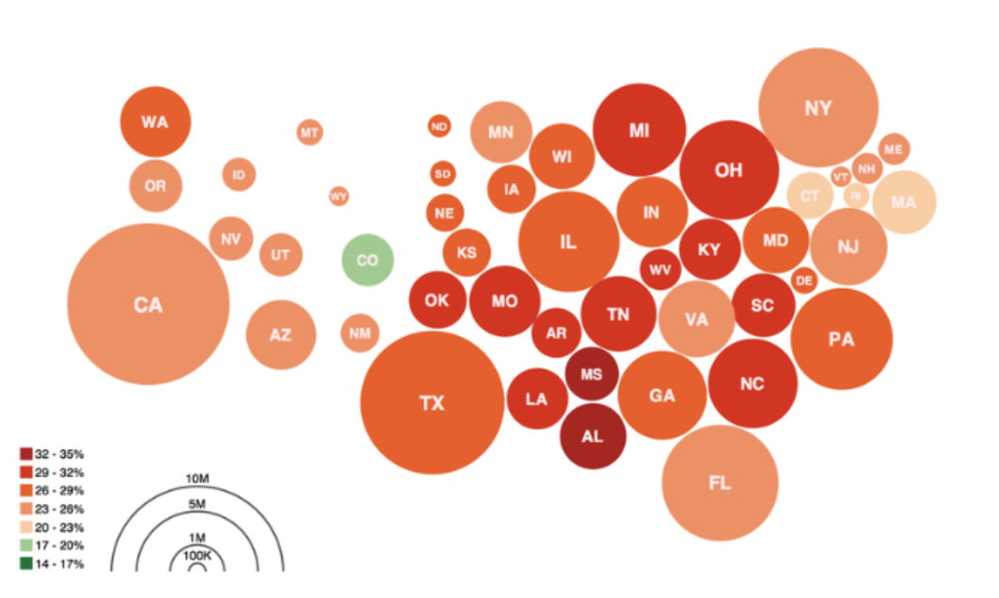


::: activity

**Activity**

*Cartograms in GeoDa*

To create a cartogram in GeoDa, which visually emphasizes specific variables, follow these steps:

<details markdown='1'><summary>Creating the Cartogram</summary>
      
- Open ChiZipCleaned in “GeoDa”
-  Select "Map" from the menu, then click on "Cartogram".

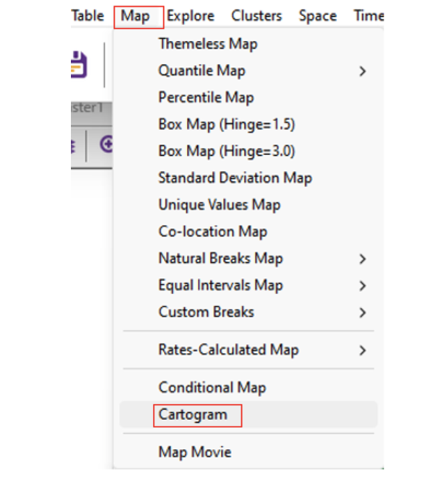

- In the "Cartogram Variables" dialog box, you'll find two columns: "Circle Size" and "Circle Color". For a simpler interpretation, select the same variable for both columns (e.g., age 18-64). 

- *Tip:* While you can choose different variables for circle size and color, this might make the cartogram more complex and potentially confusing.

</br></br></details>

<details markdown='1'><summary>Finalizing the Cartogram</summary>

- Click "OK" to generate the cartogram. This will create a map where the size of the circles represents the selected variable, providing a visual emphasis on areas with higher or lower values.

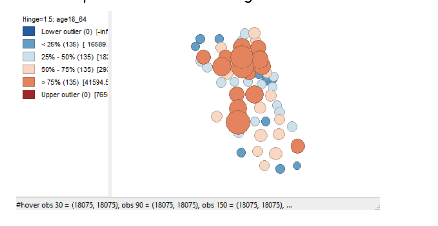

</br></br></details>

:::

### Multivariate Data Analysis

In this first steps of Exploratory Spatial Data Analysis, you may investigate data patterns one or two variables at a time to uncover relationships. Moving towards multivariate analyses, looking at multiple variables at once, can give insight into the complex processes driving the phenomenon you're interested. 

With this move, we may often begin to understand correlations across multiple variables. For example, historic segregation and decades of de-investment have tremendously influenced geodemographic patterns in Chicago.

In modern spatial epidemiology, associations must never be taken at face value. For example, we know that it is not “race” but “racism” that drives multiple health disparities – simply looking at a specific racial/ethnic group is not enough. Thus exploring multiple variables and nurturing a curiosity to understand these complex intersections will support knowledge discovery.

While we won't go through examples in depth beyond a simple thematic map panel, explore resources available to you to examine multivariate ESDA as well as increasingly complex modeling approaches.

## Cartographic Principles 

Having honed your skills in data wrangling and spatial analysis, it's time to focus on effectively communicating your findings in Social Determinants of Health (SDOH) through cartography. This phase is vital: the choices you make regarding colors, scales, and legends will significantly influence how your audience interprets your maps. In this final section, we'll discuss how to create clear and impactful SDOH maps.

Cartographic design principles form a framework of guidelines and best practices to create informative and visually appealing maps. They are key to ensuring maps not only convey spatial information accurately but are also easy to understand and aesthetically pleasing. While designing SDOH maps poses challenges, it's a crucial skill. We encourage you to delve deeper into cartographic design by exploring additional resources provided in this module.

:::tip

**Tip** 

As recommended by [Cynthia Brewer](https://www.esri.com/en-us/esri-press/browse/designing-better-maps-a-guide-for-gis-users) attempt to address the following questions at this point. Don't worry if you're uncertain of the answer, you can always revisit the previous modules for guidance.

- Who will be reading your maps? (module 3)
- What information will be mapped? (module 4)
- What are the time and budget constraints on your map production? (module 2)
- Will your map be coordinated with written text, videos, graphics, or other data visualizations? Do you have time to create or curate them? (module 2)
:::

### Effective SDOH map design entails several critical elements

#### Audience Consideration {-}

Tailor your map design to your audience's needs and preferences. Different audiences have varying abilities to interpret visual data. For instance, maps for healthcare professionals might include detailed spatial patterns and statistical analyses, whereas maps for the general public should focus on clarity and ease of understanding.
Revisit your user personas (module 3) and consider their motivations and challenges regarding cartography.
For example, The City of Chicago (see below) created a COVID-19 vaccine centers asset map for the general public.

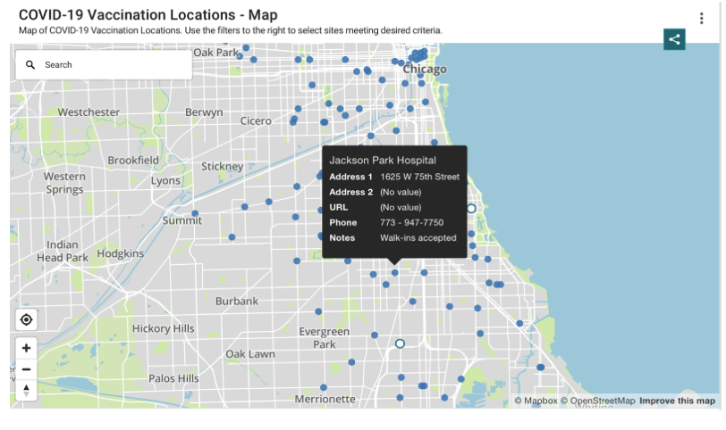

ESRI (see below) created a dashboard for health professionals related to vaccine distribution during the pandemic. 

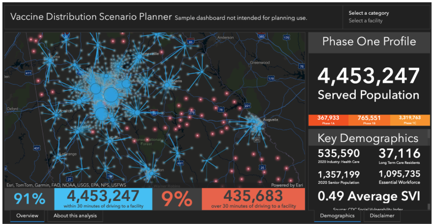

#### Visual Hierarchy {-}

Establish a visual hierarchy to guide viewers through the most important aspects of your data. This can be achieved using color, size, contrast, and the placement of map elements.
For example, ChiVes, an environmental justice dashboard may use bold colors to highlight critical areas, supported by descriptive text and a well-positioned legend.

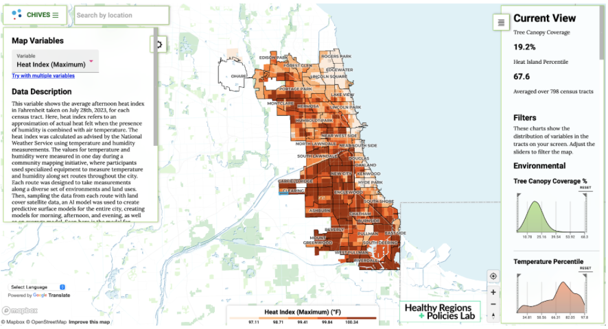


#### Balance and Visual Arrangement {-}

Achieve balance in your map to ensure no element dominates excessively and each component is visually proportionate.
Organize elements logically and harmoniously, considering spatial relationships, grouping related features, and creating a clear flow for the viewer's eye.

The body-territory map (cuerpo-territorio) crafted by the Latinx collective Iconoclasistas serves as an exemplary showcase of balance and visual arrangement. Illustrating the detrimental impact of various industries on communities across South America, the map achieves balance by symmetrically delineating different regions and dividing them with the silhouette of a woman. Moreover, the title and sequential numbering naturally guides viewers through the map from top to bottom, facilitating intuitive reading of the cartography.

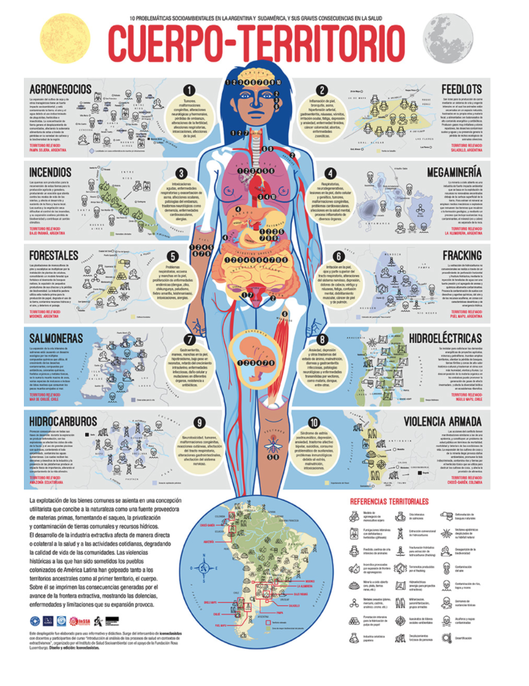


#### Simplicity {-}
Embrace simplicity for clear communication. Clear, uncluttered maps with essential elements are more accessible and easier for viewers to understand.
Focus on presenting the core message with precise use of color, symbols, and labeling.

The Anti-eviction Mapping Project developed a straightforward yet impactful dashboard illustrating evictions in LA County during the COVID-19 pandemic. Users can easily navigate through the data by utilizing the bar chart. By using the bar chart, the map displays eviction rates for each month throughout the pandemic.

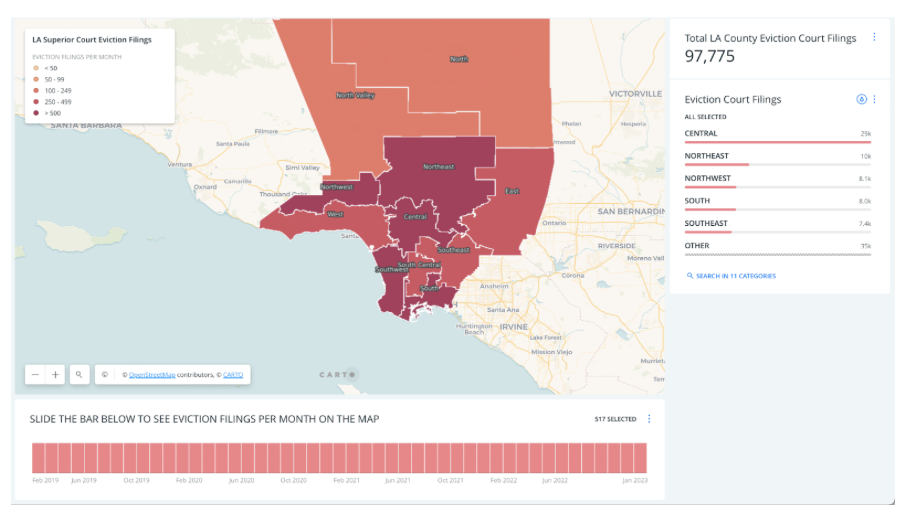


Throughout these principles, the key is to present your SDOH data in a manner that is not just informative but also engaging and accessible to your intended audience. Each design decision, from the choice of color scheme to the positioning of elements, plays a role in how effectively your map communicates its message.


### Key Elements of Spatial Data Visualizations {-}

Effectively conveying spatial information in maps requires careful consideration of various elements. These elements include symbols, colors, typography, and layout, each playing a crucial role in guiding the viewer’s understanding of the geographic context and the presented data. Symbols visually represent spatial features; colors differentiate categories or highlight patterns; typography ensures legibility and informativeness of labels and annotations; and layout determines spatial relationships and influences visual hierarchy. Strategic incorporation of these elements enables cartographers to create maps that are not only aesthetically pleasing but also informative and intuitive to interpret.

#### Title {-}
A map’s title should succinctly convey its main theme or message. It should include the theme (What?), the location (Where?), and the temporal scale (When?). A clear and informative title sets the context for the map.

**Tip:** Make the title larger and bolder than other text to draw attention.

#### Legend {-}
The legend is a key component that decodes the symbols, colors, and patterns used on your map. It should be clear, concise, and understandable.

**Tip:** Place the legend near the map body and maintain a consistent color scheme and symbol style throughout your map series for coherence.

#### Scale Bar {-}
The scale bar visually represents the relationship between map distances and real-world distances. It's essential for accurately grasping the mapped area's geographic extent and proportions.

**Tip:** Choose a scale bar style that complements your map's design, including both metric and imperial units if possible.

#### Data Source and Projection Information  {-}

Providing data sources and projection information enhances your map's transparency and credibility, allowing viewers to understand the data’s origins and any potential map projection distortions or limitations.

**Tip:** Include clear citations for data sources and projection information in a designated map area.

#### North Arrow {-}

A north arrow, though not always necessary, can be helpful for orientation, especially in unfamiliar areas or when the map projection alters traditional alignments.

**Tip:** If used, ensure the **north arrow** is visible and distinct from other map elements, and choose a simple design that fits the map's overall aesthetic.


::: activity
**Activity**

*Rapid-Fire SDOH Mapping Critique*

- Spend 10 minutes critiquing a Social Determinants of Health map, focusing on elements like the title, legend, scale bar, and data sources.
- Think about the audience, hierarchy, balance, simplicity, and visual arrangement.
- Then, analyze another SDOH map, noting similarities or differences in design and effectiveness.
- Reflect on the clarity and informativeness of these elements, considering the context (what, where, when), the effectiveness of the legend, the appropriateness of the scale bar, the utility of the north arrow, and the clarity of data sources and projections.
:::

#### The Munsell Color System:

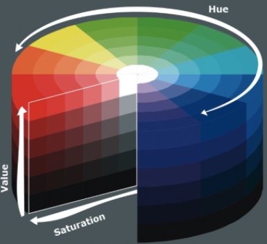


The [Munsell Color System](https://munsell.com/about-munsell-color/how-color-notation-works/), a model for describing and communicating color, is crucial in map design. It categorizes color into three dimensions: hue, value, and chroma, aiding in systematic color selection and specification. In mapping, it helps in color selection, achieving contrast, creating color harmony, and ensuring accessibility. For example, [Colorbrewer 2.0](https://colorbrewer2.org/#type=sequential&scheme=BuGn&n=3) provides options suitable for colorblind individuals.

::: activity
**Activity**

*SDOH Mapping with the Munsell Color System*

- Analyze SDOH data and assign Munsell colors to different factors.
- Develop a map legend explaining each color and its significance.
- Apply these colors to a map, creating a thematic representation of SDOH in a specific area.
- Evaluate the map’s effectiveness and adjust as necessary.
- Share and discuss your findings, interpreting the relationships between SDOH factors and geographic distribution.

This activity will enhance your understanding of applying the Munsell Color System in representing complex SDOH data, creating effective and meaningful maps that highlight community health risks or inequalities.
:::

## References {-}

- [GeoDa Documentation](https://geodacenter.github.io/documentation.html) remains an ESDA standard to uncover dozens of techniques for discovery.

- Brewer, C. (2016). Designing Better Maps: A Guide for GIS Users, 2nd Edition. ESRI press.

- D'ignazio, C., & Klein, L. F. (2023). Data feminism. MIT press.

- [Center for Spatial Data Science (2024). Scientific Reasoning in Spatial Data Science Education Project. University of Chicago: Center for Spatial Data Science.](https://spatial.uchicago.edu/education/scientific-reasoning)

- Krygier, J., & Wood, D. (2016). Making maps: a visual guide to map design for GIS. Guilford Publications.

- Peterson, G. N. (2020). GIS cartography: a guide to effective map design. CRC Press.


