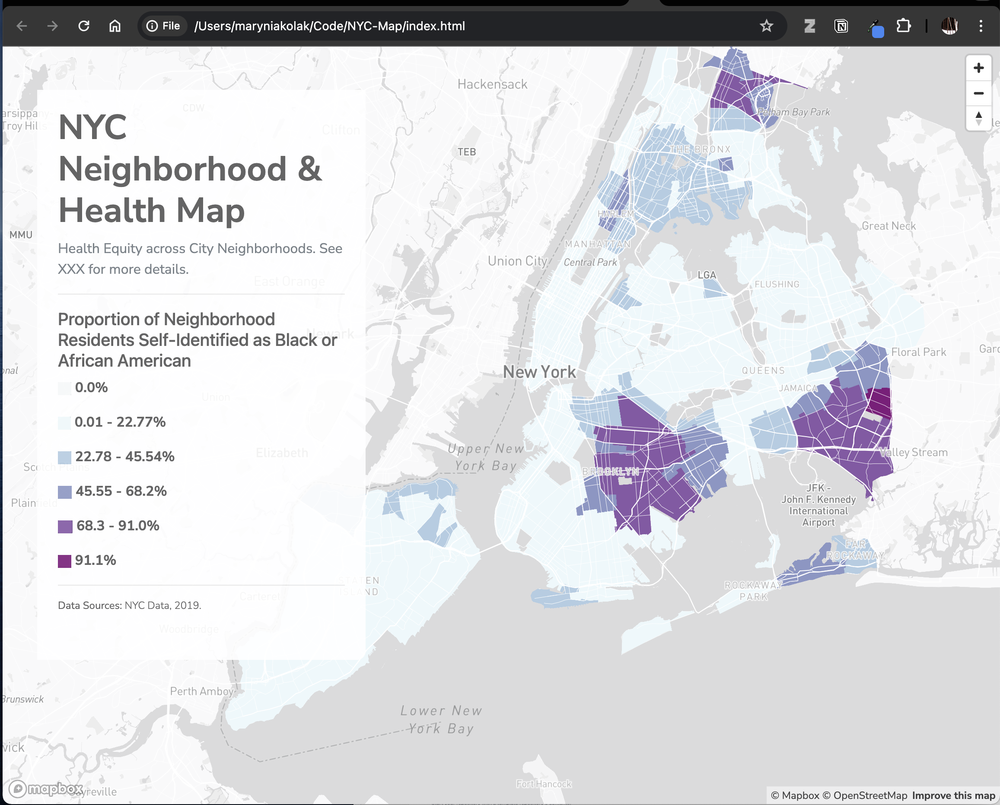

---
output:
  html_document:
    code_folding: hide
---

# Coding for app development

## Getting Started with Github and Github Pages

In these exercises we'll begin working with a code sharing platform called [Github](https://github.com) that is used by software developers, researchers, and hobbyists all around the world. With a free account on Github, you are able to upload code bases and datasets into public repositories, allowing other people to see your work, contribute to it, or build from it.

One especially useful tool that the platform provides is called Github Pages, a mechanism that allows you to turn any single repository into a publicly accessible website for free. Github Pages is a perfect way to create a personal website, blog, or portfolio site, but we can also use it to host and serve simple web maps and visualizations. The following tips will help you get started with Github.

### What is a Repository?

A repository is any collection of code or data that is stored together as a unit. For example, the entire code base for [Moodle](https://github.com/moodle/moodle), or [covid-19-data] downloads from the NY Times.

### Understanding Github's URL Structure - Naming is important!

Github is organized with a simple hierarchy: Account > Repository Name, where accounts can be either individual users, or organizational accounts. For example, our HeRoP lab organization is [healthyregions](https://github.com/healthyregions) which means that our repository "sdohplace-toolkit" (this toolkit!) is located at [https://github.com/healthyregions/sdohplace-toolkit](https://github.com/healthyregions/sdohplace-toolkit).

### Creating an Account

When you choose a username, pick something simple that can be shared easily, because, as described above, your username will be in public urls all the time. Additionally, when you publish a repository with Github Pages, that user name will become part of the URL for your page.

## Leaflet Map with CSV and GeoJSON data

Leaflet is a very popular open source mapping library used to create interactive web maps. Leaflet is written in JavaScript, a programming language that runs in all web browsers, so creating a map with Leaflet will involve at least a bit of looking at and modifying code--HMTL, CSS, and JavaScript which are the foundational components of any webpage.

:::tip
**Tip**

Our example builds from [Leaflet Maps with CSV Data](https://handsondataviz.org/leaflet-maps-with-csv.html) from [HandsOnDataViz](https://handsondataviz.org/), a fantastic collection of guides and recipes for data visualization by Jack Dougherty and Ilya Ilyankou that focus on using open source and accessible technologies. We strongly encourage you to explore all of their other content as well!
:::

Generally speaking, libraries like Leaflet create web maps by defining an area of a web page, like a canvas, and then loading various geospatial data into that area, allowing users to pan, zoom, inspect, and interact with the content. In this example, we will create and publish a very simple web map using prepared CSV and GeoJSON datasets. At the end of the exercise, you should be able to swap these datasets out with your own, and have a basic understanding of how to modify Leaflet code.

We will do all of our file storage and editing directly in [Github](https://github.com), which will also allow us to immediately make our map publicly visible.

To get started, head to our template repository: [https://github.com/healthyregions/leaflet-asset-map](https://github.com/healthyregions/leaflet-asset-map).

1. Click the **Use this template** button to create a copy of this repository in your own GitHub account.
2. Configure Github Pages using the Static HTML workflow
    - In **Settings** > **Pages** set the **Source** dropdown to **Github Actions**
    - Choose the **Static HTML** option and click **Configure**
        - Don't make any changes to the code you see yet, just click **Commit changes..**
    - Wait a few seconds and visit https://<username>.github.io/leaflet-asset-map. You should see a zoomable map with markers on it.
3. Upload your own CSV or GeoJSON file to the data directory.
    - Make sure your CSV has columns that hold Latitude and Longitude values for each feature.
4. Follow the examples in example.html to add your own layers to the main map in index.html.

For more information on customization, see [Leaflet documentation](https://leafletjs.org).

For valid icon names, see [ionic.io/ionicons/v2](https://ionic.io/ionicons/v2). Click an icon, and use the name you see without including the ion- prefix.

## Thematic Map with HTML & CSS

### Getting Started {-}

You have soome experience working with Github *within* Github, the website. Now let's bring it to your own computer! 

- Set up a Code folder on your computer somwhere that is easy to navigate. This will store your Github coding projects.
- Download [Github Desktop](). Direct it to upload new repositories to this folder.
- Download a coding editor software for your computer. Popular ones are [Visual Studio](https://code.visualstudio.com/) or [Sublime Text](https://www.sublimetext.com/). When it doubt, google and research on your own! 

You could also use RStudio/Posit cloud, but it may not be optimized for all coding systems.

#### Start a New Repository  {-}

In Github (the website), create a New Repository. Give it a name, a description, and make it public. In this case, we're calling our project "NYC-Map". Add a "README" file to leave more details and descriptions for yourself later. Click on "Create Repository" at the bottom of the page.


Next, click on the big green button, "Code", and select "Open in Github Desktop.

{width=95%}


You are *cloning the repository* you just made, and adding a copy to your own computer. Select the right path to access your coding project.


### Start Coding

- Open up your coding project folder. You'll see the README file that was initialized in the Repo.

- In your code editing software, create a new file, and name it "index.html."


### Basics of an HTML page

In our very simple application, we will use the basics of an html page: the head and body.

- In the `head`, we'll add some metadata like the title of our map. Additionally, crucial libraries for styling and functionalities will be loaded in as CSS and Javascript (JS) links. 

- In the `body`, we'll prepare to bring in two divs, or "divisions." One will be a map div, that calls the mapbox basemap we made in an earlier module. The other will overlay a transparent panel that will serve as our legend. We add a heading 1 level title, "NYC Map" to start.

Learn more about the basics of HTML using free online educational tools like [W3 Schools](https://www.w3schools.com/html/html_basic.asp). For now, it's okay to just copy and paste the information below.

<details markdown='1'><summary>Show HTML App Code</summary>
```{r eval=FALSE}

<!DOCTYPE html>
<html>

<head>

	<meta charset="utf-8" />

	<title>NYC Map </title>

	<meta name="viewport" content="initial-scale=1,maximum-scale=1,user-scalable=yes" /> 

	<!-- CSS only -->
	<link rel="stylesheet" href="https://stackpath.bootstrapcdn.com/bootstrap/4.5.0/css/bootstrap.min.css" integrity="sha384-9aIt2nRpC12Uk9gS9baDl411NQApFmC26EwAOH8WgZl5MYYxFfc+NcPb1dKGj7Sk" crossorigin="anonymous">
	<link href="https://api.mapbox.com/mapbox-gl-js/v2.14.1/mapbox-gl.css" rel="stylesheet">
	<link href="main-style.css" rel="stylesheet">
	<link rel="preconnect" href="https://fonts.googleapis.com">
	<link rel="preconnect" href="https://fonts.gstatic.com" crossorigin>
	<link href="https://fonts.googleapis.com/css2?family=Nunito+Sans:opsz,wght@6..12,200;6..12,300;6..12,400;6..12,700&family=Roboto+Slab:wght@400;500&display=swap" rel="stylesheet">

	<!-- JS only -->
	<script src="https://stackpath.bootstrapcdn.com/bootstrap/4.5.0/js/bootstrap.min.js" integrity="sha384-OgVRvuATP1z7JjHLkuOU7Xw704+h835Lr+6QL9UvYjZE3Ipu6Tp75j7Bh/kR0JKI" crossorigin="anonymous"></script>
	<script src="https://api.mapbox.com/mapbox-gl-js/v2.14.1/mapbox-gl.js"></script>

	<style> 
		body { margin: 0; padding: 0; } 
		#map { position: absolute; top: 0; bottom: 0; width: 100%; }; 
	</style> 

</head>


<body> 

	<div class="panel">
  
        <h1 > NYC Map </h1>
    	
	</div>

	<div id='map'> </div> 

</body>
```
</br></br></details>

To render the html page, simple drag and drop the .html file from your folder on your computer into a web browser. Right now, there should be nothing except a title, "NYC Map" -- we've just loaded in some libraries, and that's it!

#### Add your Mapbox Map {-}

Using the code snippet provided from Mapbox, we can add our basemap. Add this script after the map div, and within the body section.

<details markdown='1'><summary>Show Mapbox Script </summary>
```{r eval=FALSE}
	<script> 

        <!-- Temp -- Need to push to Github Environmental Secret -->
        mapboxgl.accessToken = 'pk.eyJ1IjoiY2Rpc2NlbnphIiwiYSI6ImNsbzhwb25rYjAyeGYya21rd20xZ3U1ZHgifQ.5tbPqubrrKekGR12uOHN_Q';
    
            var map = new mapboxgl.Map({ 
            container: 'map', 
            style: 'mapbox://styles/cdiscenza/clvmny7ym06yv01nug1kbefwd', 
            zoom: 10,  
            minZoom: 5.3,                                               
            center: [-74.03638858449402 , 40.68048994718785]                         
    
         }); 
    
    
        // Add zoom and rotation controls to the map.
        var nav = new mapboxgl.NavigationControl();
            
            map.addControl(nav, 'top-right');
            
    </script>
          
```
</br></br></details>

Refresh your app in your web browser! It should look like this: 

{width=95%}

:::pitfall
**Pitfall**

In this example, we are exposing an API token. This is not good practice!  Add more here...

::::

### Add a Panel Legend 

We're going to hack out a legend. The official way to do this can be found via a [mapbox tutoria](https://docs.mapbox.com/help/tutorials/choropleth-studio-gl-pt-2/). Here, let's generate a temporary option with less fuss. lUsing our panel and HTML, we'll add a description of the data we have in our map.

#### Add custom CSS {-}

Generate a new file in your coding project called "main-style.css". Copy and past the following code, and save.

<details markdown='1'><summary>Show Custom CSS Code </summary>
```{r eval=FALSE}

.panel {
    position: absolute;
    top: 50px;
    left: 40px;
    width: 380px;
    max-height: 660px; 
    opacity: .9;
    background: #fff ;
    color: #545454;
    padding: 20px 24px 12px 24px;
    height: 85%;
    overflow-x: hidden;
    overflow-y: auto;
    outline: none;
    z-index: 9092;
    border-radius: 0px 0px 10px 0px;
  }

h1 {
  font-family: 'Nunito Sans', serif;
  font-weight: 900;
}

p {
  font-family: 'Nunito Sans', sans-serif;
    font-weight: 400;

}

p.temp {
  font-family: 'Nunito Sans', serif;
    font-weight: 300;
    font-size: 12px;
    line-height: 1.2;

}

a {
  font-family: 'Nunito Sans', sans-serif;
  color: #2f5aa8;

}
```
</br></br></details>

#### "Hack" a Legend {-}

Go back to your Mapbox account, and record the intervals of each bin of your choropleth map. Take a screenshot of each corresponding color swatch; then, rename those swatched, and add to a new folder called "images" in your coding project folder.

{width=40%}

This is a prototype -- not a final project! The goal is to get something working quickly, and it may not be pretty when you open the hood. But, it's possible to get a working app with some HTML, CSS, and grease!

#### Add to your Panel {-}

In your main index file, you can now add more content to your panel. Give the map panel some additional helper text using the "text-muted" class, and add horizontal lines using the `<hr>` tag to keep it classy. Use the legend swatches, resized, and update the corresponding interval. 

<details markdown='1'><summary>Show index.html Panel Code </summary>
```{r eval=FALSE}

	<div class="panel">
    	
        <h1 > NYC Neighborhood & Health Map </h1>
    	
    	<p class="text-muted"> Health Equity across City Neighborhoods. See XXX for more details. </a> </p>

    	<hr>

        <h5> Proportion of Neighborhood Residents Self-Identified as Black or African American </h5>

    	<p><b> 0.0% </p>

        <p><b> 0.01 - 22.77% </p>

        <p><b> 22.78 - 45.54% </p>

        <p><b> 45.55 - 68.2% </p>    	
        
        <p><b> 68.3 - 91.0% </p>

        <p><b> 91.1% </p>

    	<hr>

    	<p class="temp"> <b>Data Sources:</b> NYC Data, 2019. </p>

    	
	</div>
```
</br></br></details>

### Finalize and Push 

Run the app in your browser as you go to ensure you can troubleshoot any bugs that come up. 



<details markdown='1'><summary>Final index.html Code </summary>
```{r eval=FALSE}

<!DOCTYPE html>
<html>

<head>

	<meta charset="utf-8" />

	<title></title>

	<meta name="viewport" content="initial-scale=1,maximum-scale=1,user-scalable=yes" /> 

	<!-- CSS only -->
	<link rel="stylesheet" href="https://stackpath.bootstrapcdn.com/bootstrap/4.5.0/css/bootstrap.min.css" integrity="sha384-9aIt2nRpC12Uk9gS9baDl411NQApFmC26EwAOH8WgZl5MYYxFfc+NcPb1dKGj7Sk" crossorigin="anonymous">
	<link href="https://api.mapbox.com/mapbox-gl-js/v2.14.1/mapbox-gl.css" rel="stylesheet">
	<link href="main-style.css" rel="stylesheet">
	<link rel="preconnect" href="https://fonts.googleapis.com">
	<link rel="preconnect" href="https://fonts.gstatic.com" crossorigin>
	<link href="https://fonts.googleapis.com/css2?family=Nunito+Sans:opsz,wght@6..12,200;6..12,300;6..12,400;6..12,700&family=Roboto+Slab:wght@400;500&display=swap" rel="stylesheet">


	<!-- JS only -->
	<script src="https://stackpath.bootstrapcdn.com/bootstrap/4.5.0/js/bootstrap.min.js" integrity="sha384-OgVRvuATP1z7JjHLkuOU7Xw704+h835Lr+6QL9UvYjZE3Ipu6Tp75j7Bh/kR0JKI" crossorigin="anonymous"></script>
	<script src="https://api.mapbox.com/mapbox-gl-js/v2.14.1/mapbox-gl.js"></script>

	<style> 
		body { margin: 0; padding: 0; } 
		#map { position: absolute; top: 0; bottom: 0; width: 100%; }; 
	</style> 

</head>


<body> 

	<div class="panel">
    	
        <h1 > NYC Neighborhood & Health Map </h1>
    	
    	<p class="text-muted"> Health Equity across City Neighborhoods. See XXX for more details. </a> </p>

    	<hr>

        <h5> Proportion of Neighborhood Residents Self-Identified as Black or African American </h5>

    	<p><b> 0.0% </p>

        <p><b> 0.01 - 22.77% </p>

        <p><b> 22.78 - 45.54% </p>

        <p><b> 45.55 - 68.2% </p>    	
        
        <p><b> 68.3 - 91.0% </p>

        <p><b> 91.1% </p>

    	<hr>

    	<p class="temp"> <b>Data Sources:</b> NYC Data, 2019. </p>

    	
	</div>

	<div id='map'> </div> 

	<script> 

        <!-- Temp -- Need to push to Github Environmental Secret -->
        mapboxgl.accessToken =   'pk.eyJ1IjoiY2Rpc2NlbnphIiwiYSI6ImNsbzhwb25rYjAyeGYya21rd20xZ3U1ZHgifQ.5tbPqubrrKekGR12uOHN_Q';
    
            var map = new mapboxgl.Map({ 
            container: 'map', 
            style: 'mapbox://styles/cdiscenza/clvmny7ym06yv01nug1kbefwd', 
            zoom: 10,  
            minZoom: 5.3,                                               
            center: [-74.03638858449402 , 40.68048994718785]                         
    
         }); 
    
    
        // Add zoom and rotation controls to the map.
        var nav = new mapboxgl.NavigationControl();
            
            map.addControl(nav, 'top-right');

            
    </script>


</body>

</html>
```
</br></details></br></br></details>

<details markdown='1'><summary> Push local code up back to Github's main servers. </summary>
- Go back to Github Desktop. Add a short comment (ex. "push initial map"), Commit to Main, and then Push to Origin.

{width=95%}
</br></details></br></br></details>

<details markdown='1'><summary> Confirm things worked, and serve your map </summary>

Return to Github's website repository. You'll see your updates live on the Github site. Finally, use what you learned previouslly to serve your map using Github Pages. 
</br></details></br></br></details>

When you're ready, work through additional [Github Tutorials]() to get more familiar with the "push and pull" process of working with code this way. This is just the beginning!

### Resources {-}
- Learning HTML & CSS: 
- Learning Javascript: 
- Learning Mapbox GL: 
- Learning Github ProcessesL: 


## Dashboards with R Shiny

### Getting Started {-}

Once you have a solid sense of R (see previous modules and recommended tutorials), you may be ready to make your first app! To develop an application quickly, we use the `shiny` package. Shiny is a web application framework for R that makes it easy to build interactive web apps straight from R. This particular application allows users to explore various demographic metrics through interactive maps and charts.

```{r eval=FALSE}
install.packages("shiny")
```


We recommend going through the [beginner lessons on Shiny applications](https://shiny.posit.co/r/getstarted/shiny-basics/lesson1/index.html) at Posit before diving into your app development directly. Get familiar with the basics, practice, and explore different example apps for ideas. 

{width=95%}

As you go through these, resist the urge to try to incorporate everything into your own app. Follow the design-thinking process, user input, and diagrams you built in previous modules!

A Shiny app can be contained in a single script, `app.R`, which will have the following three components:

- a user interface object

- a server function

- a call to the `shinyApp` function

### User Interface

You can define the layout of your application using the user inferface, defining what goes where, how it looks, and what events are triggered. Upon loading the site, a default plot may be triggered to be oupit. A user may also select specific items within the user interface, like a variable from a drop-down panel, or sliding a slider. 

Using the [example](https://shiny.posit.co/r/getstarted/shiny-basics/) from Shiny's official tutorial, copy and paste the following into a new file you'll save as `app.R` in a folder on your computer. 

To run within RStudio, click the "Knit" icon at the top of your code.

```{r class.source = 'fold-hide', eval=FALSE}
library(shiny)
library(bslib)

# Define UI ----
ui <- page_sidebar(
)

# Define server logic ----
server <- function(input, output) {
}

# Run the app ----
shinyApp(ui = ui, server = server)
```

Following the same example, add a title to your application, a sidebar, and a main section. In this example, we'll make a an on SDOH indicators in NYC.

```{r class.source = 'fold-hide', eval=FALSE}
library(shiny)
library(bslib)

# Define UI ----
ui <- 
  page_sidebar(
    title = "NYC SDOH App",
    sidebar = sidebar("sidebar"),
    "main contents"
  )

# Define server logic ----
server <- function(input, output) {
}

# Run the app ----
shinyApp(ui = ui, server = server)
```

Next, let's add a drop down variable selection for a variable of interest we'd like to explore in the app. For example, we may want to examine data by self-identified race and ethnicity, as reported by neighborhood via the Census. We'll add a drop-down widget, and "helper text" to explain what the user should do.

Try to do this on your own first. Then, check the code below! 

<details markdown='1'><summary>Show Code</summary>
```{r class.source = 'fold-hide', eval=FALSE}
library(shiny)
library(bslib)

# Define UI ----
ui <- 
  page_sidebar(
    title = "NYC SDOH App",
    sidebar = sidebar(
      
      helpText("Select different variables from the dropdown menus to explore the data."),
      
      selectInput("color", "Self-Identified Race & Ethnicity:",
                  choices = c("Percent Black" = "pctblack",
                              "Percent Hispanic" = "pcthisp",
                              "Percent White" = "pctwhite"),
                  selected = "pctblack"),
    ),
  )

# Define server logic ----
server <- function(input, output) {
}

# Run the app ----
shinyApp(ui = ui, server = server)
```
</br></br></details>

Ensure you're running each time that you add, edit, or change anything. This helps with the troubleshooting process! By now, your application will be looking like this:

{width=95%}

Continue to explore the different layouts, widgets, themes, and options available to you in the Shiny documentation.

### Server

When we're running the application, we're actually using our computer as the server. Let's connect our dropdown to data we'll load in -- NYC data -- and use the user selection to generate a map. 

We recommend getting the script to work in an R script on its own before plugging in, to confirm that it will work the way you need it to. De-bugging can be tricky in more complex applications, so anything you can do to support your process will be beneficial.

We'll jump a few steps ahead, to show what the full set up can look like for adding a map that is linked to user input:

<details markdown='1'><summary>Show Full App Code</summary>
```{r eval=FALSE}
library(shiny)
library(leaflet)
library(sf)
library(plotly)
library(dplyr)

# Load data ----
nyc_data <- st_read("NYC_nbrhd_data.geojson", quiet = TRUE)
nyc_data <- st_make_valid(nyc_data)
map_data <- st_transform(nyc_data, crs = 4326)

# Define UI ----
ui <- 
  page_sidebar(
    title = "NYC SDOH App",
    sidebar = sidebar(
      
      helpText("Select different variables from the dropdown menus to explore the data."),
      
      selectInput("color", "Self-Identified Race & Ethnicity:",
                  choices = c("Percent Black" = "pctblack",
                              "Percent Hispanic" = "pcthisp",
                              "Percent White" = "pctwhite"),
                  selected = "pctblack")),
      
      mainPanel(
        ## Add a map
        (leafletOutput("map", width = "100%")
        )))
  
# Define server logic ----
server <- function(input, output, session) {
    
    # Map output for Racial Demographics
    output$map <- renderLeaflet({

      valid_data <- map_data[!is.na(map_data[[input$color]]), ]
      
      pal <- colorQuantile("PuBuGn", valid_data[[input$color]], n = 5)
      
      leaflet(valid_data) %>%
        addProviderTiles(providers$CartoDB.Positron) %>%
        addPolygons(
          fillColor = ~pal(valid_data[[input$color]]),
          fillOpacity = 0.7, weight = 1, color = "white",
          popup = ~paste(NTAName, "<br>",
                         paste(input$color, ":", round(valid_data[[input$color]], 2), "%"))
        ) %>%
        setView(lng = -73.935242, lat = 40.730610, zoom = 10)
    })
  }

# Run the app ----
shinyApp(ui = ui, server = server)
```
</br></br></details>

Which renders the following:

{width=95%}

Inspect how the map output call was added to the UI. In the server function, the map data is slightly cleaned (from debugging in a script on its own), and a color palette is indicated using a ColorBrewer selection. Then, we use leaflet to visualize the variable selected by the user. We have found that leaflet is more responsive than tmap when using Shiny apps, though be sure to explore new options on your own!

### Expand Your Prototype

It's easier to get a basic prototype up and running. Now the fun and frustrating part begins! Start editing, updating, refining, and getting closer to your final goal. Multiple updates are included in these refinements of our expanded prototype across UI and Server settings, including:

- Addition of new tabs with addtional variables, visualizations, and content about the project.

- Integration of a new Shiny library, 'shinythemes'. After exploring how to add and update a new theme, the library was installed, and a call made in the final part of the application. (Hint: look for the 'yeti' theme in the final code.) Get more ideas at [Shiny Themes](https://rstudio.github.io/shinythemes/).

- Improvements on performance via lots of 'tinkering' and testing. A slow scatterplot was fixed by removing the spatial components of the dataset, using the `st_drop_geometry()` call in the `sf` framework. A list of neighborhood names was made alphabetical. And so much more... 

Look for some of the "easter eggs" in code snippets below, and see how you can improve and refine further! The app could get even more fine-tuned, "reactive" (and less reptitive in coding output), and styled further.

#### Updated User Interface {-}

In our extension, we want the final UI organize into three main tabs, allowing users to interactively explore different facets of the NYC neighborhood data. For this example, we'll try using tabs instead of a sidebar. Try blending both styles, and keeping the bootstrap library used in our initial example as a challenge.

##### Tab 1: Map & Racial Demographics {-}

In the first tab, we'll features a map and a demographic chart, with controls for selecting demographic variables and neighborhoods. Here are the explanation for some functions that we used below:

- `selectInput` for variable of interest: Allows users to select which `variable` statistic to visualize on the map.
- `selectInput` for neighborhood: Enables users to pick a specific neighborhood for detailed demographic breakdown in the chart.
- `leafletOutput` and `plotlyOutput`: Reserved spaces in the UI for displaying the map and the chart respectively.


<details markdown='1'><summary>Show Tab 1 UI Code </summary>
```{r eval=FALSE}
tab1_ui <- tabPanel("Self-Identified Race & Ethnicty",
                    sidebarLayout(
                      sidebarPanel(
                        p("Select different variables from the dropdown menus to explore the data."),
                        selectInput("race", "Self-Identified Race & Ethnicity:",
                                    choices = c("Percent Asian & Pacific Islander" = "pctapi",
                                                "Percent Black" = "pctblack",
                                                "Percent Hispanic" = "pcthisp",
                                                "Percent White" = "pctwhite",
                                                "Percent Other Identified Race" = "pctother"),
                                    selected = "pctblack"),
                     
                        selectInput("neighborhood", "NYC Neighborhood:",
                                    choices = str_sort(nyc_data$NTAName),
                                    selected = "Pelham Bay-Country Club-City Island"),
                        
                        helpText("Data source: NYC Neighborhood Data"),
                        
                        br(),
                        
                        h3("Racial & Ethnic Disparities"),
                        
                        p("Extensive research has shown that racial and ethnic disparities in 
                        quality of care and use of services exist and persist in the United States.
                        Disparities may emerge from unequal access to health care, critical resources
                        such as health foods, housing, and transportation."),
                        br(),
                        p("Explore racial and ethnic population distributions by NYC neighborhood in this tab,
                        and then explore socioeconomic and health trends acrosos the rest of the applications.
                        Identify locations for further analysis."),
                        
                        helpText("Read More: The Commonwealth Fund 2024 State Health Disparities Report")
                        ),
                        
                      mainPanel(
                        fluidRow(leafletOutput("map"),
                                 br(),
                        fluidRow(plotlyOutput("racialDemoChart"))
                        ))
                      )
                    )
```
</br></br></details>

##### Tab 2: Socioeconomic Demographics {-}

Similar in structure to Tab 1, now let's create the Tab 2, which focuses on socioeconomic indicators such as poverty levels and rent burden.

<details markdown='1'><summary>Show Tab 2 UI Code </summary>
```{r eval=FALSE}
tab2_ui <- tabPanel("Socioeconomic Demographics",
                    sidebarLayout(
                      sidebarPanel(
                        selectInput("color_socio", "Demographic variable:",
                                    choices = c("Percent in Poverty" = "pctpov",
                                                "Rent < 30% of Income" = "rent.30",
                                                "Rent < 50% of Income" = "rent.50"),
                                    selected = "pctpov"),
                        selectInput("neighborhood_socio", "Select Neighborhood:",
                                    choices = str_sort(nyc_data$NTAName),
                                    selected = "Pelham Bay-Country Club-City Island"),
                        
                        helpText("Data source: NYC Neighborhood Data"),
                        
                        br(),
                        
                        h3("Socioeconomic Disparities"),
                        
                        p("Nulla suscipit, purus ac varius sagittis, velit lorem condimentum ipsum, sit amet auctor sem tellus a leo. Aenean faucibus hendrerit diam non rutrum. Proin nec nisi dolor. Nam egestas dolor sapien, eget pellentesque neque tincidunt nec. Phasellus mattis pulvinar tincidunt. Phasellus eget condimentum nisl. Praesent dapibus dui elit, id fringilla quam interdum vel. Praesent vestibulum nulla et rutrum ornare. Donec cursus felis dui, et auctor nisi pulvinar ac. Suspendisse placerat ex sed arcu semper volutpat. Donec commodo consequat ornare. Aenean est lectus, semper at luctus sit amet, bibendum vitae augue. Donec risus felis, commodo eget tristique vitae, imperdiet in risus."),
                        
                        helpText("Read More: Include text here ")
                      ),
                      mainPanel(
                        fluidRow(leafletOutput("map_socio"),
                                 br(),
                        fluidRow(plotlyOutput("socioDemoChart"))
                        )
                      )
                    )
)
```
</br></br></details>

##### Tab 3: Severe Maternal Morbidity & Preterm Birth Rates {-}

In Tab 3, we want to introduces more health-related variables, displaying a map and a scatter plot. The scatter plot takes time to load, so further de-bugging may be necessary. Try alternate libraries, styles, and new approaches to refine further.

<details markdown='1'><summary>Show Tab 3 UI Code </summary>
```{r eval=FALSE}
tab3_ui <- tabPanel("Severe Maternal Morbidity & Preterm Birth Rates",
                    sidebarLayout(
                      sidebarPanel(
                        selectInput("color_health", "Health variable:",
                                    choices = c("Severe Maternal Morbidity Rate" = "smmrate",
                                                "Preterm Birth Rate" = "ptbrate"),
                                    selected = "smmrate"),
                        
                        helpText("Data source: NYC Neighborhood Data"),
                        
                        br(),
                        
                        h3("Maternal Health Outcomes"),
                        
                        p("Pellentesque nisl ipsum, bibendum non porttitor eget, lobortis sit amet arcu. Aliquam et erat nec nisi fermentum aliquet non a massa. Mauris vel sapien justo. Sed fermentum sed purus ut fringilla. Aliquam pulvinar, ligula ac ornare rutrum, est ipsum tristique metus, non imperdiet nibh ligula id elit. Proin ac dui in ligula finibus facilisis. Quisque at vulputate nulla, sit amet varius nunc. In eu cursus quam. In diam est, tristique sit amet nunc nec, vehicula hendrerit odio. Phasellus est turpis, vulputate eu suscipit sit amet, semper at enim. Vivamus sit amet risus leo. Vestibulum porttitor feugiat ipsum, ut volutpat erat pharetra quis. Suspendisse interdum ultrices nisi vel finibus. Aliquam lobortis sed arcu eget ornare."),
                        
                        helpText("Read More: Include text here ")
                      ),
                      mainPanel(
                        fluidRow(leafletOutput("map_health"),
                                 br(),
                        fluidRow(plotlyOutput("healthScatterChart"))
                        )
                      )
                    )
)
```
</br></br></details>

##### Tab 4: About {-}

Finally, we also want to include a Tab 4 that provides contextual information about the application, explaining its purpose and the data source.

We are making a prototype, so use some "Lorem Ipsum" placeholder language that we can update in the future.


<details markdown='1'><summary>Show Tab 4 About Code </summary>
```{r eval=FALSE}
tab4_ui <- tabPanel("About",
                    sidebarLayout( 
                      sidebarPanel(
                        
                        h3("Data"),
                        
                        p("Mauris vel sapien justo. Sed fermentum sed purus ut fringilla. Aliquam pulvinar, 
                          ligula ac ornare rutrum, est ipsum tristique metus, non imperdiet nibh ligula id 
                          elit."), 
                                                           br(),
                          
                        
                        h3("Methodology"),
                        
                        p("Proin ac dui in ligula finibus facilisis. Quisque at vulputate nulla, sit
                          amet varius nunc. In eu cursus quam. In diam est, tristique sit amet nunc nec, 
                          vehicula hendrerit odio. "),
                        
                        helpText("Read More: Include text here ")
                      ),
                      mainPanel(
                        fluidRow( 
                        
                          h2("Motivations & Background"),
                          p("Phasellus est turpis, vulputate eu suscipit sit amet, 
                          semper at enim. Vivamus sit amet risus leo. Vestibulum porttitor feugiat ipsum, 
                          ut volutpat erat pharetra quis. Suspendisse interdum ultrices nisi vel finibus. 
                          Aliquam lobortis sed arcu eget ornare."),
                                
                                br(),
                        
                          h2("Study Findings"),
                          p("Phasellus est turpis, vulputate eu suscipit sit amet, 
                            semper at enim. Vivamus sit amet risus leo. Vestibulum porttitor feugiat ipsum, 
                            ut volutpat erat pharetra quis. Suspendisse interdum ultrices nisi vel finibus. 
                            Aliquam lobortis sed arcu eget ornare."),
                        
                        br(),
                        
                        h2("Team"),
                        p("Phasellus est turpis, vulputate eu suscipit sit amet, 
                          semper at enim. Vivamus sit amet risus leo. Vestibulum porttitor feugiat ipsum, 
                          ut volutpat erat pharetra quis. Suspendisse interdum ultrices nisi vel finibus. 
                          Aliquam lobortis sed arcu eget ornare."),
                        
                        br(),
                        
                        h2("Questions? Contact Us."),
                        p("Email person@person.com for more information."),
                        
                        ))))

```
</br></br></details>


#### Define Server Logic

After define the user interface, we will move on to define the server logic. It processes user inputs from the UI and updates the outputs (maps and charts). It dynamically reacts to user interactions such as selecting a neighborhood or a demographic variable.

##### Server Logic for Tabs {-}

Now, we will create server code to handle the dynamic visualization of racial demographics within New York City neighborhoods in Tab 1. It renders an interactive map and a bar chart based on user inputs, showing the distribution of different racial groups. The map highlights neighborhoods with varying demographic densities, while the bar chart provides detailed statistics for a selected neighborhood.

The server functions for other tabs follow a similar structure but focus on different data attributes. So, let's define the server logic for other three tabs.

<details markdown='1'><summary>Show Tab 1 Server Code </summary>
```{r eval=FALSE}
tab1_server <- function(input, output, session) {
  
  # Map output for Racial Demographics
  output$map <- renderLeaflet({
    
    valid_data <- nyc_data[!is.na(nyc_data[[input$race]]), ]
    pal <- colorQuantile("viridis", valid_data[[input$race]], n = 5)
    
    leaflet(valid_data) %>%
      addProviderTiles(providers$CartoDB.Positron) %>%
      addPolygons(
        fillColor = ~pal(valid_data[[input$race]]),
        fillOpacity = 0.7, weight = 1, color = "white",
        popup = ~paste(NTAName, "<br>",
                       paste(input$race, ":", round(valid_data[[input$race]], 2), "%"))
      ) %>%
      
      addLegend(
        position = "bottomright",
        pal = pal,
        values = valid_data[[input$race]],
        title = "% of population"
      )  %>%
      
      setView(lng = -73.935242, lat = 40.730610, zoom = 10)
  })
  
  # Racial Demographics chart
  output$racialDemoChart <- renderPlotly({
    chart_data <- nyc_data[nyc_data$NTAName == input$neighborhood, ]
    
    # Extract data and remove "geometry" column
    racial_data <- st_drop_geometry(chart_data)
    
    racial_data <- racial_data[, c("pctblack", "pcthisp", "pctwhite", "pctapi", "pctother")]
    
    racial_data <- t(racial_data)
    racial_data <- as.data.frame(racial_data)
    racial_data <- cbind(Race = rownames(racial_data), Percentage = racial_data[, 1])
    rownames(racial_data) <- NULL
    
    plot_ly(data = as.data.frame(racial_data), x = ~Race, y = ~Percentage, type = 'bar', color = ~Race) %>%
      layout(title = paste("Racial Demographics -", input$neighborhood),
             xaxis = list(title = "Race"),
             yaxis = list(title = "Percentage", range = c(0, 100), tickvals = seq(0, 100, 20)))
  })
}
```
</br></br></details>

<details markdown='1'><summary>Show Tab 2 Server Code </summary>
```{r eval=FALSE}
tab2_server <- function(input, output, session) {
  
  # Map output for Socioeconomic Demographics
  output$map_socio <- renderLeaflet({
    
    valid_data <- nyc_data[!is.na(nyc_data[[input$color_socio]]), ]
    pal <- colorQuantile("viridis", valid_data[[input$color_socio]], n = 5)
    
    leaflet(valid_data) %>%
      addProviderTiles(providers$CartoDB.Positron) %>%
      addPolygons(
        fillColor = ~pal(valid_data[[input$color_socio]]),
        fillOpacity = 0.7, weight = 1, color = "white",
        popup = ~paste(NTAName, "<br>",
                       paste(input$color_socio, ":", round(valid_data[[input$color_socio]], 2), "%"))
      ) %>%
      
      addLegend(
        position = "bottomright",
        pal = pal,
        values = valid_data[[input$color_socio]],
        title = "% of population"
      )  %>%
      
      setView(lng = -73.935242, lat = 40.730610, zoom = 10)
  })
  
  # Socioeconomic Demographics chart
  output$socioDemoChart <- renderPlotly({
    chart_data <- nyc_data_df[nyc_data_df$NTAName == input$neighborhood_socio, ]
    
    # Extract data and remove "geometry" column
    socio_data <- st_drop_geometry(chart_data)
    
    socio_data <- socio_data[, c("pctpov", "rent.30", "rent.50")]
    
    socio_data <- t(socio_data)
    socio_data <- as.data.frame(socio_data)
    socio_data <- cbind(Category = rownames(socio_data), Percentage = socio_data[, 1])
    rownames(socio_data) <- NULL
    
    plot_ly(data = as.data.frame(socio_data), x = ~Category, y = ~Percentage, type = 'bar', color = ~Category) %>%
      layout(title = paste("Socioeconomic Demographics -", input$neighborhood_socio),
             xaxis = list(title = "Category"),
             yaxis = list(title = "Percentage", range = c(0, 100), tickvals = seq(0, 100, 20)))
  })
}
```
</br></br></details>

<details markdown='1'><summary>Show Tab 3 Server Code </summary>
```{r eval=FALSE}
tab3_server <- function(input, output, session) {
  
  # Map output for Health Demographics
  
  output$map_health <- renderLeaflet({
    
    valid_data <- nyc_data[!is.na(nyc_data[[input$color_health]]), ]
    pal <- colorBin("viridis", valid_data[[input$color_health]], pretty = FALSE, n = 5)
    
    leaflet(valid_data) %>%
      addProviderTiles(providers$CartoDB.Positron) %>%
      addPolygons(
        fillColor = ~pal(valid_data[[input$color_health]]),
        fillOpacity = 0.7, weight = 1, color = "white",
        popup = ~paste(NTAName, "<br>",
                       paste(input$color_health, ":", round(valid_data[[input$color_health]], 2)))
      ) %>%
      
      addLegend(
        position = "bottomright",
        pal = pal,
        values = valid_data[[input$color_health]],
        title = "Rate per X,000 persons"
      )  %>%
      
      setView(lng = -73.935242, lat = 40.730610, zoom = 10)
  })
  
  # Health Demographics scatter plot
  
  output$healthScatterChart <- renderPlotly({
    
    plot_ly(nyc_data_df, x = ~smmrate, y = ~ptbrate, text = ~NTAName, type = 'scatter') %>%
      layout(title = "Severe Maternal Morbidity vs Preterm Birth Rates",
             xaxis = list(title = "Severe Maternal Morbidity Rate", zeroline = TRUE),
             yaxis = list(title = "Preterm Birth Rate", zeroline = TRUE))
  })
}
```
</br></br></details>

The goal in the third tab is to generate an interactive scatter plot to exist alongside the choropleth map selection. Here's a preview of what the final application page will look like:


#### Run the Application 

Combine all tabs into a single UI object. In a final step, we combine the server logic for all tabs and define the overall UI layout to launch the application. 

<details markdown='1'><summary>Show UI Summary Code </summary>
```{r eval=FALSE}
ui <- fluidPage(
  titlePanel("NYC Neighborhood Demographics"),
  tabsetPanel(
    tab1_ui,
    tab2_ui,
    tab3_ui,
    tab4_ui
  )
)
```
</br></br></details>

<details markdown='1'><summary>Show Server Summary Code </summary>
```{r eval=FALSE}
# Combine server logic for all tabs
server <- function(input, output, session) {
  tab1_server(input, output, session)
  tab2_server(input, output, session)
  tab3_server(input, output, session)
}

# Run the application
shinyApp(ui = ui, server = server)
```
</br></br></details>

The final application will render as the following. Inspect the full code [here](), and continue to refine to improve your prototype.


This Shiny application offers an interactive exploration of demographic data across New York City neighborhoods. Users can interactively analyze racial and socioeconomic information through dynamically updated maps and charts. The application highlights how R and Shiny can be used to build engaging and informative data visualizations.

### More Shiny Resources: {-}

- Try out new themes with x and x
- Quarto
- Once you're happy with your final application, it's time to serve it! Check out tutorials like X and X to make it public


