---
---

# App Development

:::objective
**Objectives**

In the module, you will:

- Explore various options for creating your map

- Create web maps using the suggested applications
:::

In this module, you will learn fundamental skills for creating asset maps, thematic maps, story maps, and data dashboards on a variety of free and/or open source platforms. Each section will include an exercise that will help you put into practice what you learn, highlighting the strengths of each map type and how they can be used to tell a well-rounded narrative with data. These exercises use data relevant to maternal health disparities in New York City and Georgia. All data required to complete each exercise can be found at [github link]. A reference file with information on variables and data sources is included.

Below is a figure that should be familar to you. You saw this in module 1! It's all coming full circle now. 

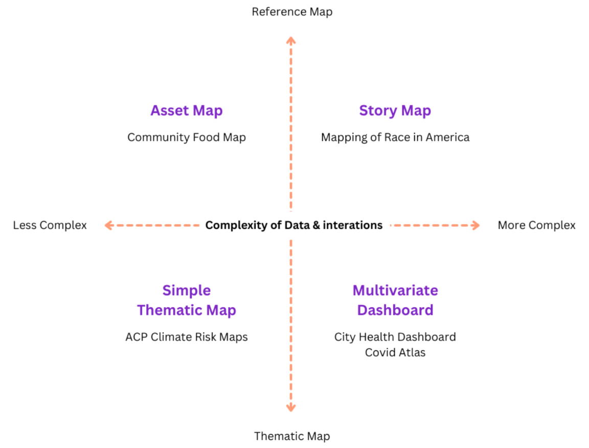{width=95%}

:::tip
**A Note on the Software**

In this module, we’ll be introducing a number of no-code or low-code mapping software available. We’ll introduce their technical capabilities and drawbacks through each section, but there are other aspects to consider when deciding which software to use. While almost all software we’ve introduced in previous modules has been open source, many software options we’ll introduce today are free versions of paid services. These free versions may not have the full range of capabilities of the paid versions, or there may be usage limits that need to be kept in mind when choosing which software is best for your project. 
:::

| App Type           | Map Type         | Description                                                                                                                    |
|--------------------|------------------|--------------------------------------------------------------------------------------------------------------------------------|
| Asset Map          | uMap             | A web-based mapping program using OpenStreetMap, no coding required. Allows importing data for asset mapping.                   |
|                    | Leaflet with CSV | A popular open-source mapping library for creating interactive web maps. Involves some JavaScript coding for customization.   |
| Thematic Map       | ArcGIS Online    | A free version of ArcGIS for creating thematic maps. Allows customization of data display and symbology for various variables. |
|                    | Mapbox GL        | Useful for creating base maps and interactive thematic maps. Requires some basic coding for embedding in web pages.           |
| Story Map          | ArcGIS Online    | Offers flexible story map software with the ability to integrate various data visualizations and media elements.               |
|                    | Knight Lab       | Provides a straightforward, free tool for creating story maps with basic functionality. Can be integrated into existing web pages. |
| Data Dashboard    | Tableau Public   | Allows for the creation of interactive data dashboards with map visualizations, bar graphs, and filter actions.              |
|                    | R Shiny          | Enables building interactive web applications with R, suitable for creating customized data dashboards including maps.         |

## Asset Map Development 

{width=70%}

An asset map, commonly used in the public health field, is a point map of resources. It can be used to identify where resources are, and where gaps in availability exist. They may be simple, but can be quite effective for both understanding and presenting information about resource distribution. When paired with other mapping tools, they can tell us a lot about the types of communities that have access to various resources compared to those without access.

In this section, we’ll introduce two options for asset mapping, uMap and Leaflet. Both are free and open source. We’ll use a dataset of hospitals in New York City to introduce these software options.

### uMap {-}
uMap is a web based mapping program that uses OpenStreetMap to allow users to create maps. It has a simple interface, and no coding is necessary. 

Create an account on [uMap](https://umap.openstreetmap.fr/en/)

- Log in or create an account with any of the providers listed. Once logged in, you are ready to create a map.
  

Click “Create a map” in the top right corner.

- Familiarize yourself with the toolbar. Below is a quick cheat sheet.

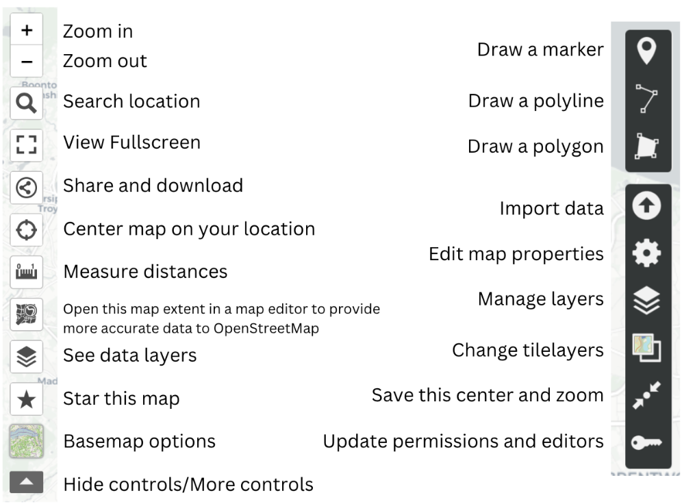{width=70%}

  

Import .csv file

- Click "Import data" to import “NYChospitals.csv” from the zip file linked at the start of the module.

- Then press the “Import” button.

:::tip
**Tip**

Points, lines, and polygons can be manually added to the map. Data can also be imported as a file, as a url, or pasted into the import tab. Multiple files can either be imported simultaneously to the same layer, or one by one to different layers. 

Additionally, uMap defaults to whatever layer you’ve most recently imported, so be sure that you are adding a new file to a new layer rather than replacing an existing file if you work with multiple layers in the future. 

Lastly, shapefiles are not compatible with uMap, you should instead prepare GeoJSONs if you add any.
:::

Your map should look something like this:

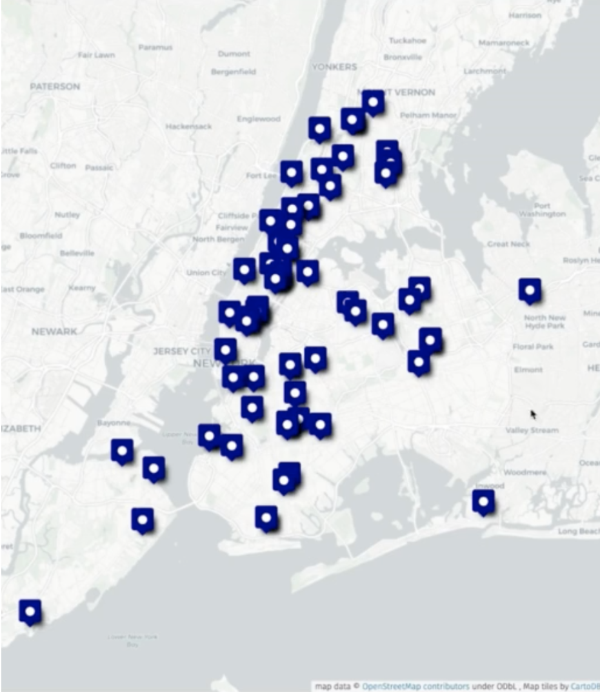{width=60%}

  

Edit layers
 

- Click “Manage layers” on the right side of the toolbar and select the "Edit" on the right side of the toolbar to edit “Layer Properties”

:::tip
**Tip** 

Any edits will now be applied to all features. From this panel, you can change the color, shape, or symbol of the icon denoting your features. You can also change how a user interacts with features, such as whether they have to hover over a feature for a label to appear.
:::

*Optional: Selecting a feature (any point, line or polygon) will allow you to edit or delete it individually.* 

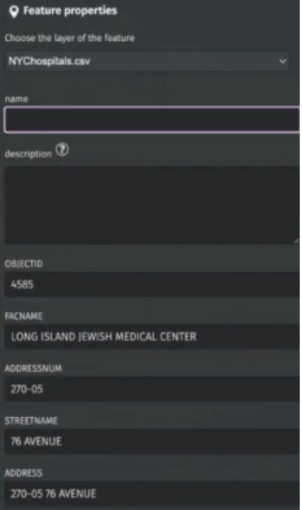{width=40%}

- Select "Edit" to edit and it will bring up the “Feature Properties” tab. Scroll to the bottom of the “Features Properties” tab to edit the feature icon and interaction.

*Optional: Basemaps in uMap are somewhat limited, but there are a few options that can be found on the left hand toolbar by clicking "Basemap options". You may need to expand the toolbar to find these options* 

  

Additional data

- Add additional data (nyc-community-centers.geojson, nyc-day-care.geojson, and nyc-bjc.geojson) to create a map with multiple resources relevant to maternal health and support. 

- Edit Layer Properties to make each layer’s icons visually distinct.

  

Save your map

- First change the name and/or description by clicking Edit map properties". 

- Once you change the name, click on the “Save” button at the top right corner. 

- You’ll be given a URL, along with the option to download.

:::tip
**Tip**

Descriptions will need to be written using HTML formatting, but selecting the help button next to the description box will bring up all the relevant text formatting needed to do this properly. 
:::

  

:::activity
**Extension Exercise**

Want additional practice? Create an asset map of Georgia counties participating in the Home Visiting Program pilot using the file **counties_ga.csv**. Add **counties_ga.geojson** to add county boundaries. Considering adding additional data to create a more comprehensive asset map.

As you create an asset map, consider the following questions: 

- Are there areas with many hospitals/resources?

- Are there areas with few or no hospitals/resources?

- What areas do you think could use more hospitals/resources?

- What may keep a population from utilizing a hospital/resource in their area?

- How might focusing solely on hospital/resource locations not tell the entire story?

:::

**Looking Forward**

In the asset map section, you explored how to identify and visualize spatial distributions of resources, facilities, or infrastructure within your area of interest.  As you continue your exploration, delve deeper into specific themes or variables by transitioning to thematic mapping in the next section. 

## Thematic Map App Development

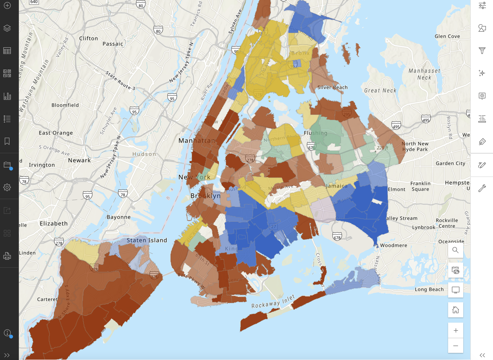{width=70%}

A thematic map in public health is a map that uses visual symbols, colors, and patterns to represent specific health-related data or themes within a geographic area. Data & interaction complexity generally remain more simplified, encouraging the user to inspect visualized patterns. Interactions may include selecting different variables for different maps, or clicking on an area to get information in a pop-up window. Here, we’ll introduce ArcGIS Online and Mapbox GL as two free thematic mapping options, while creating a thematic map of an SDOH or maternal health outcome variable(s) in NYC.

### ArcGIS Online {-}

ArcGIS Online is a free version of ArcGIS, a popular mapping software. Due to it being a free version, there are restrictions around usage, specifically that ArcGIS Online can only be used for non-commercial use. Keep this in mind as you decide which software to use for thematic mapping.

Access ArcGIS Online

- Open a web browser and go to https://www.arcgis.com/.

- Log in with your credentials or create a free account if you do not have one.

  

Start a New Map

- Click on “Map” in the toolbar at the top of the home page to open a blank map.

  

Add Data Layers

- Click on the “Add” button and select “Add Layer from URL” to connect a URL, or “Add Layer from File” to upload a file.

- For the tutorial, upload the NYC SDOH data (NYC_nbrhd_data) as a GeoJSON file. Make sure all the Add Layer information is correct before adding it to the map.

- Click Create and Add to Map

  

Modify the Basemap

- Select the "Basemap" option on the left-hand sidebar to change the underlying map style. Choose from various styles like satellite or streets to better suit your data visualization needs.
<video controls width="100%">
  <source src="./images/AGOSMbasemap.mp4" type="video/mp4" />
  Not supported
</video>

  

Customize Data Display

- Go to ‘Styles’ on the right-hand sidebar to select which variable(s) you wish to display.

- Under Choose Attributes. Click “+ Field” to add your variables. For this activity, we’ll add “pctblack” (for percent black). Click Add. 

- Underneath, choose your symbology, which is the method of visually representing your variable data (e.g., color, size).

- Click on ‘Style Options’ to edit aspects of your chosen symbology like color, classification method, and transparency.

- Enhance Map with Additional Features (optional):

:::tip
**Tip** 

If you display multiple variables at once, symbology options will adjust to allow for relationships between these variables to be displayed. One of the strengths of ArcGIS Online is how straightforward it can be to display multiple variables in a thematic map. However, it is still limited and it may not always be appropriate to try to use a thematic map to display multiple variables at once. In general, best practice would be to create a new field of the relationship you’re interested in during the data wrangling process so it stands as its own variable.

- Add additional variables by click the “+ Field” option. For example, add “pctwhite,” “pcthisp,” “pctapi,” and “pctother.”

- Click “Style Options,” go to Field Name, and you can edit how the name shows up on the legend.

- Use ‘Labels’ and ‘Pop-ups’ to display more information about each asset, which might not be visible through symbology alone.

- Click on ‘Add Sketch’ to manually add points, lines, polygons, or text labels to your map, creating a new feature layer.

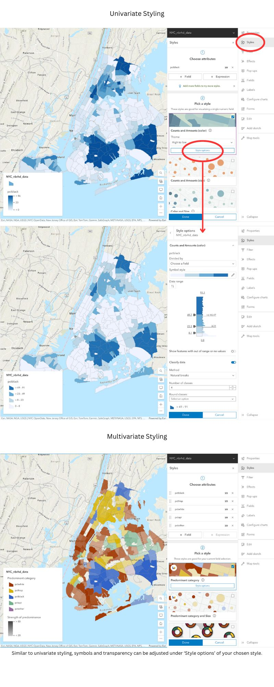{width=80%}

:::

  

Edit Features (optional)

- To modify an existing sketch, select the sketch feature layer and choose "Properties" to make changes.

  

 Save Your Map

- Save your work by clicking on the save icon in the left-hand sidebar, ensuring you do not lose any changes.

  

### Mapbox GL {-}

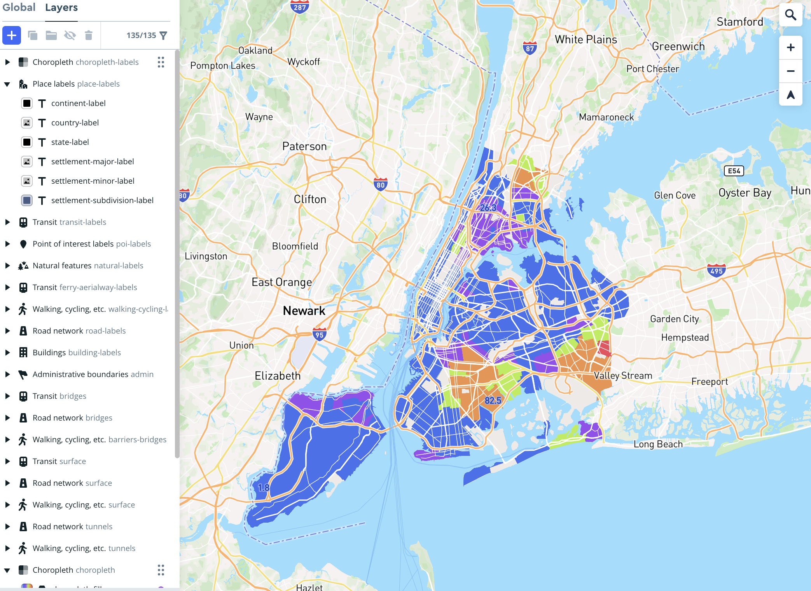{width=70%}

Mapbox GL is useful for creating base maps for larger projects, or standalone interactive thematic maps. In this section, we’ll walk through using Mapbox to create both. As a standalone interactive map, Mapbox does require some basic code to embed your map in your webpage, but code templates are available. 

#### Simple Basemap {-}

Start a New Map

Visit Mapbox and sign in or create an account if you haven't already.
From your account page, choose “Create a map in studio” and then select “New Style”.
You can start with a template, a blank map, or use a color palette derived from an image by choosing "Style with image". For this activity, start with “Classic Template.” Then click “Streets.”

  

Add Features

:::tip
**Tip** 

For the “Blank” map option, click the purple “+” at the top left to add feature layers, then click “Components.” This includes administrative boundaries, points of interest, natural features, and road networks.
For the “Classic Template,” most of the layers you may want are already added.
:::

:::tip
**Tip**

Consider the label density for each feature to maintain a balance between clarity and information density. Place labels, Points of interest, Natural features, and Road network all have label density options.
:::

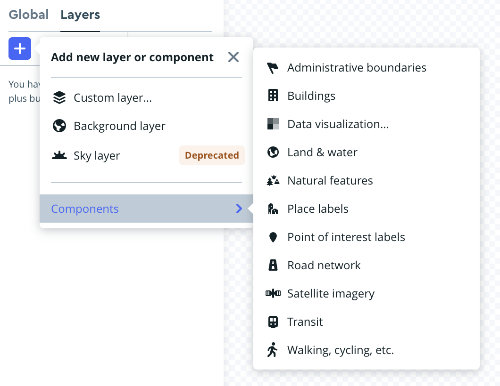{width=35%}

  

Style Your Basemap

Adjust the colors and typography of the features, ensuring they are distinct enough for general visibility and for those with common types of colorblindness.

  

Share Your Basemap

Maps can be shared from Mapbox through a style URL and access token, available under the "Share" option in the studio editor or your Styles page.

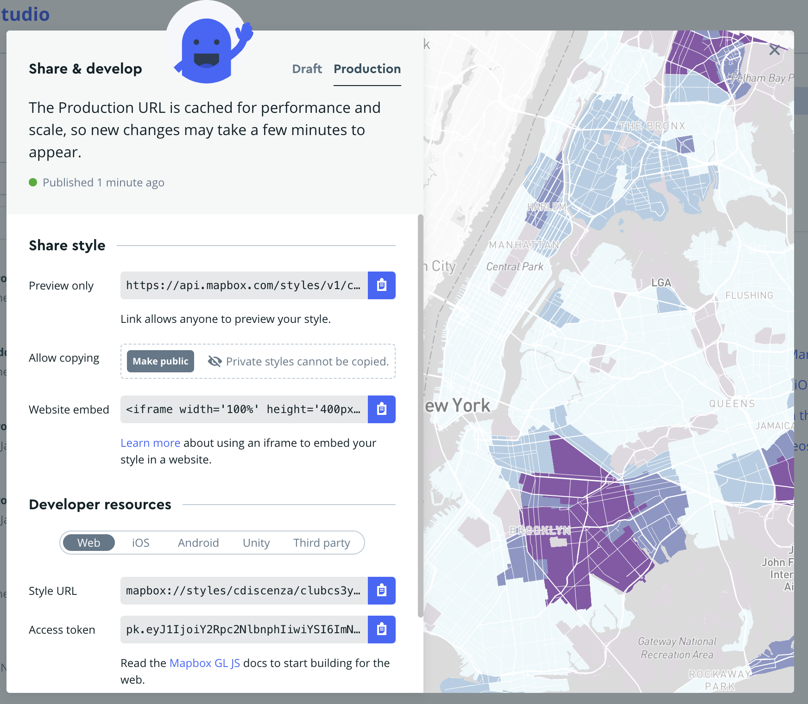{width=50%}

  

### Interactive Thematic Map {-}
Using the above simple basemap, let’s create a more complex map with an embedded dataset. Since our dataset is situated in New York, make sure your basemap is appropriately designed for that context.

Upload Your Data

Navigate to Add New Layer > Components > Data Visualization.
Choose "Upload Data" and select the NYC_nbrhd_data.geojson file.
Note: GeoJSON is generally more reliable than zipped shapefiles due to common zipper compatibility issues.

  

Add Your Data to the Map

From the Data Visualization tab, select your uploaded "NYC_nbrhd_data.geojson" as the source.
Select Data Visualization Type. Choose "Choropleth" as the data visualization type.
Zoom into “New York” if it doesn’t automatically zoom.

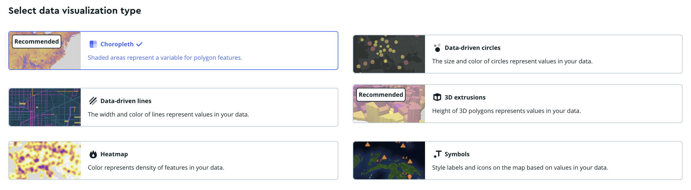{width=80%}

  

Create Data Classifications

Select “choropleth-fill” from the Choropleth dropdown
Select "pctblack" as the variable for color mapping from the “Style Across Data Range”. 
Click “Add another stop.” Consider using a “Step” in the Rate of Change. Add 6 bins or “stops” for distinct data ranges. 

:::tip
**Tip** 

Deciding on data classification schemes - Mapbox does not have a way to decide between different classification schemes, like Jenks or quantiles. Use QGIS or R to decide on a classification scheme and identify where the breaks are, then manually set those breaks in Mapbox. For this activity, use the following stops “0, 0.01, 22.78, 45.55, 68.32, and 91.1”
Adjust the classification to visually exclude non-residential areas by setting the lowest bin to a grey color.
:::

  

Design Your Color Scheme

Use resources like ColorBrewer to choose an accessible and aesthetically pleasing color scheme.  Increase the number of data classes for a larger color range, and use the HEX codes or RGB values provided to add your desired colors to Mapbox.
Check the accessibility of your color scheme using Mapbox’s built-in color blindness simulator under Settings > Debug tools.

  

Share Your Map

Publish your map to ensure updates are visible on other applications.
In order to add your map to your web page, you’ll need to do some coding. From your account page, selecting “Install Mapbox GL JS” will lead you through the code you will need to do so. A template is also provided here that you can use to install your map.

  

:::activity
**Extension Exercise**

Create a thematic map of an SDOH or maternal health outcome variable(s) in Georgia using gatracts.geojson. 

As you create this map, consider the following questions:

- How could these variables be best presented to a user?

- What are the strengths and limitations of each software?

- Are you able to map multiple variables at once? Trends between variables?

- What trends can you see between SDOH and maternal health outcomes?

:::

**Looking Forward**

In the thematic map section, you learned how to visualize spatial patterns and distributions within your datasets. Transition to a story map to weave these insights into a compelling narrative.

## Story Map App Development

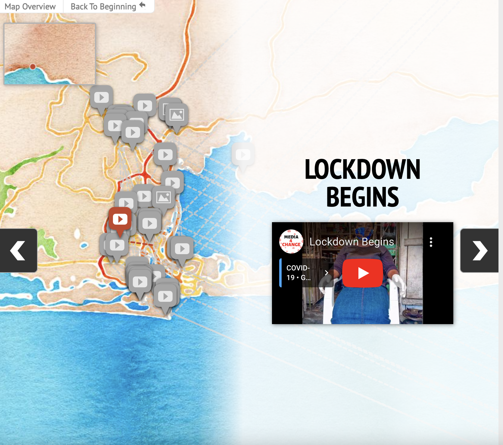{width=70%}

A story map is a tool that allows users to explore a geospatial dataset in greater detail, with more direction from the creator. You can lead users through individual points of interest, craft a narrative around your data, and ultimately tell a story. Datasets don’t need to be traditional data either. You can use photos, videos, or other media at points of interest in your story map. Effective story maps are informative, compelling, and the user will feel drawn through the narrative.

Depending on what software you use, story maps might be standalone journeys or integrated as part of a larger project. 

Check out these examples below:

*ArcGIS Online* 

- [Example 1](https://arcg.is/1bPHeK0) 

- [Example 2](https://arcg.is/0KTDX4) 

- [Example 3](https://arcg.is/0HDezC) 

*KnightLab* 

- [Example 1](https://www.georgiahumanities.org/southern-literary-trail-story-map/) 

- [Example 1](https://publications.newberry.org/time-machine/blackHawk/) 

- [Example 1](https://www.justempower.org/coronadiaries) *best example but stamen basemap :(*

Over the next few sections, you’ll be introduced to two softwares that can be used for story mapping: ArcGIS Online StoryMaps, and Knight Lab StoryMapJS. Neither requires coding, but StoryMapJS does allow for some basic coding. By the end of this section, you’ll be able to create a compelling story map while applying what you’ve learned thus far about data selection, cartographic principles, and human-centered design. 

We’ll create a story map of birth justice centers in NYC to guide you through the software. Unlike previous sections, where everything you needed was provided in the data, this section has a bit more creative freedom. An excel file of basic information (NYCBirthJusticeCenters.xlsx) will guide you, with names, addresses and websites of the birth justice centers. This will allow you to create the bones of a story map, but the content itself is up to you. Use this to explore what narrative you want to present, and what information you think is relevant or useful to constructing that narrative.

### ArcGIS Online {-}

ArcGIS Online has one of the most built-out and flexible story map softwares available. In fact, when you first open a story map, it might not look like what we’ve described above at all. ArcGIS Online StoryMaps are designed to allow for larger projects, with the “traditional” story map an element that you can add in between text, asset or thematic maps, and other media. Let’s get started with our “traditional” story map for now. 

#### Create a Traditional Story Map {-}

 Set Up Your Account

- Visit ArcGIS Online and either log into your existing account or create a new one.

  

Access StoryMaps

- Once logged in, navigate to the StoryMaps section at https://storymaps.arcgis.com/ to access your story dashboard.

  

Start a New Story

- Click on “New story” and choose “Guided map tour” to begin. For future projects, you might select “Start from scratch” to fully customize your story elements.

  

 Add Slides with Data

- Add data in StoryMaps is added one slide at a time.

*Each slide can include*

- A visual element (image or video)

- A title

- A description, which may contain text, audio, or a hyperlink button.

- Use the ‘Add location’ function to place the slide on the map.
Add new slides by clicking the ‘+’ icon at the bottom right. Rearrange slides by dragging them along the slide bar.

{width=95%}

  

 Select and Edit Basemap

- Click ‘edit’ on your map, then select ‘Select basemap’.

- Choose from default options or click ‘Browse more maps’ for additional choices. Simpler basemaps are under ‘Living Atlas’, or use your own from the content library.

  

 Add Maps to Your Library

- For feature layers: Open the feature layer in Map Viewer, select the folder icon, then ‘Save as’. The map will then appear under ‘My Maps’.

- For existing maps: Add the map to your favorites for easy access under ‘My Favorites’.

Tip: With these options, you can either keep your basemap simple, making largely aesthetic considerations (color, features, busyness) when choosing your basemap, or you can add a more complex basemap which displays additional data. 

  

 Enhance Basemap and User Interaction

- For mobile users, enable ‘Current location’ to show their location on your story map.

- Opt to show ‘progress lines’ to clarify the route of your story map.

- Adjust the zoom level manually if needed, especially to set a custom spatial extent that optimizes how your data is displayed. See below for an (albeit extreme) example of the difference setting a custom zoom extent can make.

{width=95%}

  

 Review and Publish

- Review your story map to ensure all data and visual elements are correct and effectively communicate your story.

- Once satisfied, publish your story map to make it accessible to your intended audience.

  

##### Integrate Other Geospatial Data Visualization {-}
The biggest strength of using ArcGIS Online is the ability to incorporate a variety of other types of data visualizations into a story map to create a larger narrative. Within an ArcGIS Online Story Map, you can find a traditional story map, but you can also include asset and thematic maps, media, timelines, and web apps. The end result can be a built out project with a story map as just one of many elements. Take your time to explore all of the available options. When you’re satisfied with how your story map is presented and contextualized, it’s time to hit publish.

### Knight Lab StoryMapJS {-}
Northwestern University’s Knight Lab has created a number of tools to help people tell stories with better visualizations. Their StoryMapJS tool is one of the most straightforward story map tools available, and it’s completely free. It doesn’t have the capacity of AGO to integrate with Knight Lab’s other tools, or its design flexibility, but it’s great for beginner story map-makers and can be integrated into existing web pages.

Create and Set Up Your StoryMap

- Go to Knight Lab's StoryMapJS to begin.

  

Start Your StoryMap

- Click on “Make a StoryMap”.

- Sign in with your Google account.

  

Name Your StoryMap

- Create a name for your StoryMap and enter it when prompted.

  

Configure Your Basemap

- You can chose the open streetmap for the map option. 

- For this activity, you want a customized basemap, create one using Mapbox (refer to the Mapbox section for details on creating a basemap).

- In StoryMapJS, go to Options -> Map Type, and add your Mapbox basemap using the Style URL and Access Token from Mapbox. Click close. 

Tip: If using a Mapbox thematic map as a basemap, create and add a legend via QGIS. Place the legend as media on the title slide or at the end of your story map, referencing its location on the title slide for easy navigation.

{width=50%}

Tip: The zoom feature looks wonky at first but it looks better as you add more slides.

  

Insert Data into Slides

Data in StoryMapJS is added one slide at a time. Use the sidebar on the left to add and arrange slides.

For each slide, you can add:

- A media element (link to media or upload an image).

- A title.

- A description. Credits and captions can be added here.

- Add location in the red box at the center of your screen.

*Example Data Entry:*

For a starting slide, add the logo of the Caribbean Women’s Health Association in the media section, along with relevant narrative information.

  

 Customize Icons

- Change icons by selecting ‘Marker options’ at the bottom right of each slide. 

Tip: Customize the icons for each point on your story map. Use free icons from sources like The Noun Project (note attribution requirements) or upload your own.

  

Adjust Background and Layout

- Modify the background color or add an image behind your story elements to match your map’s theme using "Background options" at the bottom right of each slide.

- Go to “Preview” to see your Story Map so far.

- When you’re done, click "Save" at the top left side of your map.

  

:::activity
**Extension Exercise**

Create a story map of designated maternal facilities in Georgia. A list of facilities, their locations, and their designation levels can be found in **dmfgeorgia.csv**.

As you create your story map, consider the following questions:

- What media best represents each center?

- What information best supplements that piece of media?

- How do you want the user to feel over the course of this story map? At the end?

- If you use an ArcGIS Online story map, how could you include other information to contextualize this traditional-style story map?

*Georgia data*
- https://covid-hub.gio.georgia.gov/datasets/esri::acs-median-household-income-variables-boundaries/about?layer=2

- https://covid-hub.gio.georgia.gov/datasets/esri::acs-race-and-hispanic-origin-variables-centroids/about?layer=2

- https://opendata.atlantaregional.com/datasets/GARC::maternal-health-child-asthma-by-tract-2021/about

- https://dph.georgia.gov/maternal-and-neonatal-center

:::

**Looking Forward**

In the story map section, you learned how to transform your data-driven insights into compelling narratives. By combining maps, text, images, and multimedia elements, you created immersive storytelling experiences that effectively communicated your findings to a broader audience. As you move forward, consider transitioning to a data dashboard for a more dynamic and exploratory approach.

## Data Dashboard App Development

In the data dashboard section, you will learn how to create interactive interfaces for exploratory data analysis. By designing dashboards with interactive visualizations such as charts, graphs, and maps, you provided users with dynamic tools to explore and analyze their data. Through customization and interactivity, you empowered your audience to delve deeper into the data, uncovering insights and trends that drive informed decision-making.

### Tableau Public {-}

Create an Account

- Go to Tableau Public and sign up for a free account.

  

Start a Workbook

- Log in https://public.tableau.com/app/discover, navigate to your profile by clicking your name at the top right, and click on "Create a Viz". Upload the "NYC_nbrhd_data.geojson" file and then select "Update Now" to preview the data. Proceed by clicking on "Sheet 1" at the bottom to start visualizing.

  

Create a Thematic Map

- In the data pane, select "NTA Name", "Geometry", and "Pctblack" using command + click. Click "Show Me" and choose the map visualization.

- A legend will appear; switch to a stepped color scheme by selecting "Edit Color". 

Tip: You can adjust range and midpoint under "Advanced".

- Hover over settings can be adjusted in 'Tooltip' under 'Marks' to display desired information effectively.

  

Filter Data

- Exclude Uninhabited Areas: Right-click on "NTA Names" under Marks to set a filter. Deselect “All.” Choose "Exclude selected values" and remove areas such as parks-cemeteries, airports, and Rikers Island. Click “Okay.”

- Borough-Specific Filtering: Drag "Boro Name" from the left toolbar under “Tables” to the Filters section above “Marks,” select all, click “Okay.” Then, right-click on "Boro Name” then click “Show Filter.” On the right-side of the map,  choose “the down arrow to “Edit Filter” then choose "Single Value (dropdown)" allowing selection of individual boroughs.

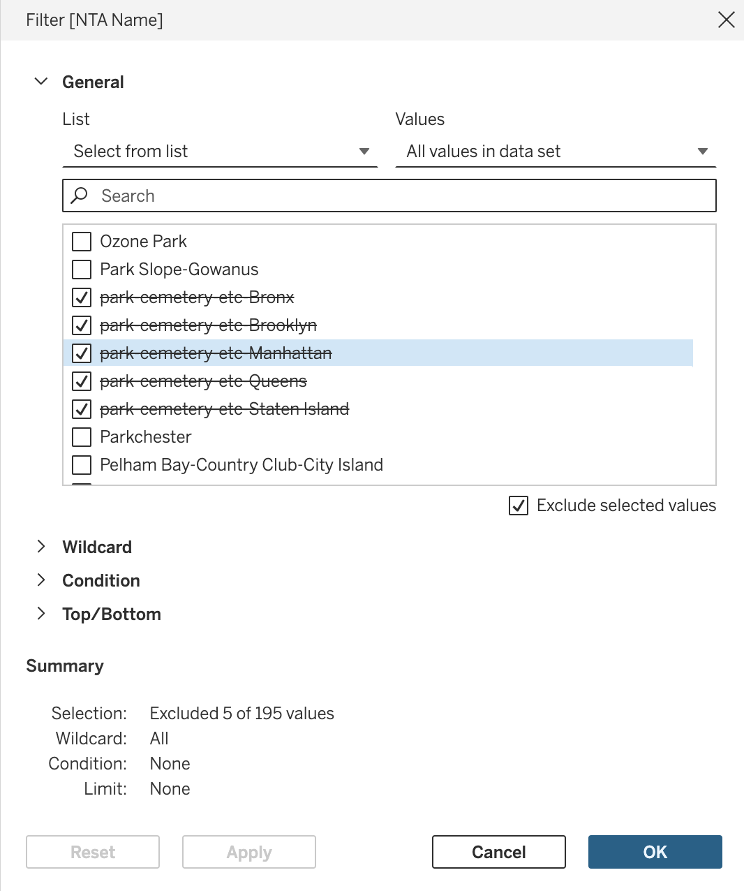{width=45%}

  

Add Additional Information

- Include data like severe maternal morbidity (Smmrate) as a color-coded element and adjust the legend back to a stepped color scheme. Add other demographic data as details in the tooltips.

  

 Create a Bar Graph

- Add a new sheet, select "NTA Name" and racial demographics, then choose "side-by-side-bars" from "Show Me". Customize axes and colors as needed.

- Repeat for Economic Data: Create another bar graph for data like poverty levels and rent burden, adjusting axes and visuals similarly.

  

Create a Dashboard

- Navigate to Dashboard (at the top of screen) -> New Dashboard. Use 'Objects' for layout and drag your created sheets into the layout. Adjust the size of graphs to 'Standard' for readability.

  

Add a Filter Action

- Go to Dashboard -> Actions, add a Filter action. Configure it to update the bar graphs based on selections or hovers on the map section of the dashboard.

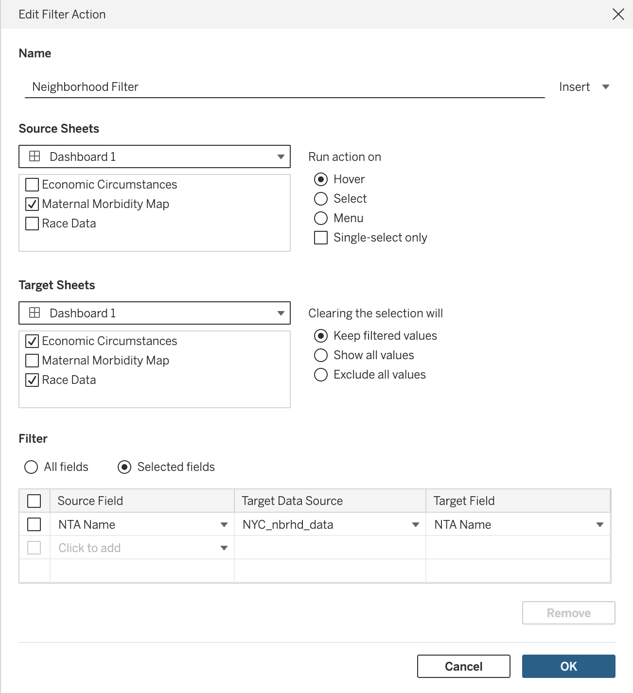{width=45%}

  

Finalize Your Dashboard

- Make final adjustments to legends, field names, and aesthetics. Ensure color schemes are cohesive and information is clear. 

- Edit titles within the dashboard to reflect interactive elements, like displaying the name of a highlighted neighborhood.

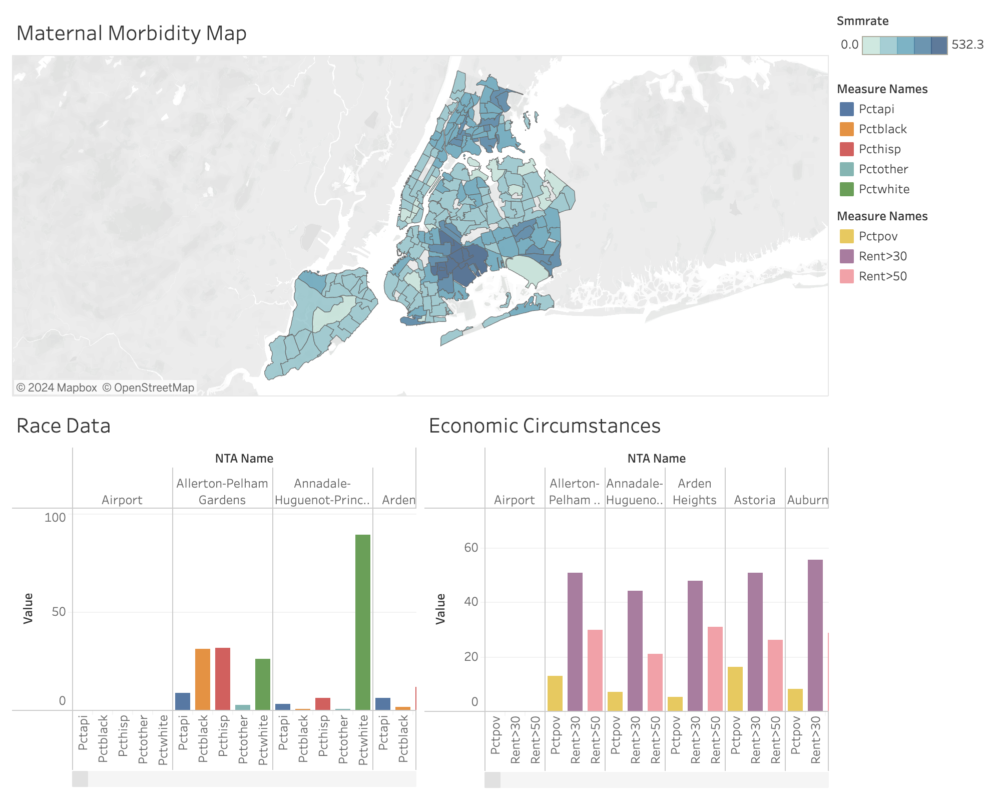{width=70%}

  

**Looking Forward**

In the data dashboard section, you learned how to create interactive interfaces for exploratory data analysis. By designing dashboards with interactive visualizations such as charts, graphs, and maps, you provided users with dynamic tools to explore and analyze their data. 

If you get stuck while creating your data dashboard, Tableau Public provides a number of how-to videos and community resources, including a community forum for troubleshooting. These additional resources can be found at the end of [here](https://public.tableau.com/app/learn/how-to-videos). 

:::activity
**Extension Activity**

Want additional practice? Create a dashboard on maternal health and SDOH in Georgia using the data provided [here].

:::

## Resources {-}
