---
---

# Sharing Your Prototype

:::objective
**Objectives**

In this module, you will…

- Expand your understanding of the evaluation and iteration process 

- Learn how to develop a dissemination plan for your project launch

- Understand how to carry out project promotions

:::

Here, the focus is on refining your visualization to perfection. In this module, we will discuss the cyclical process of iteration and evaluation. This module is about ensuring that your hard work gets the attention and impact it deserves. It's time to bring your project into the limelight!

## Iteration & Evaluation—Continuous Improvement 

The Iteration process is the process of continuous improvement, in which a person or team plans, develops and refines a project until it is complete. By this point, you have completed one cycle of the iteration process and have developed a prototype of your data application. Congratulations! You have the bare bones with which you can now build upon. If you need a refresher, please go back and review [Module 2](https://toolkit.sdohplace.org/02-scoping.html) which will explain the planning process. 

The prototype is the first draft of your project, and it should go without saying that you would hope to improve it beyond the simple design you’ve achieved. From here we move onto evaluation. 

### Iterate & Evaluate {-}

As we enter the evaluation phase, think about your team and stakeholders. Identify who should be the first to view each version of your product, and when their feedback might be most valuable.  

When evaluating your project, there are three main questions that need to be considered:

**Does the web application do what I set out for it to do?**

*Assess whether your application fulfills its purpose effectively. Take a moment to review and evaluate its performance, noting any shortcomings and potential areas for improvement.*

No matter the web application you have decided to create, ask yourself the basic question of does it do what I have set out to accomplish? Take a second to review your application and evaluate it for how well it accomplishes that goal. 
If it does not accomplish what you set out to do, write down why, what else is needed? Bring this up to your stakeholders and tea, as well. What would they like to see in this application?

  

**Are there any issues with the web application?** 

*Recognize that refinement is an ongoing process. Identify and address any major bugs that hinder the functionality of your web application. Seek feedback from your team and stakeholders to ensure comprehensive evaluation.*

This step is an ongoing process, and will most likely never be quite finished. The web application can always be improved and redesigned to better accomplish what we set out to do. If you aren’t careful, one can be stuck on this step for some time seeking perfection. Therefore, it is best if you stick to your goal and set that as your limit. 

This can be done in multiple ways. The first is to look for any major bugs within the application that limits its ability to correctly function. You can accomplish this on your own, but it’s best done with multiple eyes. Ask other members of your team to look through the application and report any major bugs they find. **Use your stakeholders!** Invite them to test out the beginnings of a project they’ve probably been waiting ages for. Have them report any bugs they find. 

After you have combed through the project, take your list of bugs and iterate the project again with the intent to fix them. From here all major bugs should be dealt with, and you’ll be left with only minor fixes. 

For minor fixes, dealing with them can depend on the project. You might not need to hammer out every last imperfection in the beginning. On the other hand, you might be dealing with an extremely sensitive or complex project, and any issue with the final design (including small ones) might prevent the project from succeeding. In any case, you know your audience and your project best. If you and your stakeholders are happy with the project, then you can continue to dissemination. 

  

**Can my intended audience use the web application in a way that is intuitive?**

*Prioritize user experience by seeking input from stakeholders and potential users. Conduct usability tests and focus groups to gather feedback on usability and identify areas for enhancement.*

This is by far the most important question to ask yourself before continuing the *big launch*. Do not allow yourself to move past this question, or continue with dissemination until you have fully answered this question in the affirmative. At the end of the day, your project will ideally not just be useful for yourself, but it should be helpful to others as well. 

You can consider setting up focus groups. Think about your intended audience, see if you could potentially invite a small group of them to a focus group to test out your project. Walk them through the project, and have them provide feedback on aspects they’d like to see changed. As these people will be the most likely to use your project, take their comments into consideration seriously. In the end, once you tailor your project to the user’s skill level, you have maximized the utility of your application!

  

:::tip
**Tip**

None of these are meant to be answered sequentially. As in, you do not need question 1 to be answered before moving on to question 2. Instead, it might be better to ask all these answers at once. 

:::

Once you have completed evaluation, if there are still issues to fix, or problems to solve complete another round of the iteration process. Rinse and repeat this cycle until you have the final iteration of your web application. Once you have that, you are onto the next step.

:::tip
**Tip** 

A word of caution: it can be easy to fall into an endless loop of evaluation and Iteration. No application can ever be perfect, there will always be things to improve and refine if you spend long enough looking for them. Stick to your goal, and adhere to your plan. Once you have a complete data application that you and your stakeholders are happy with, move on to dissemination. 

:::

## Web Analytics

One way to measure the impact of your project is with tracking analytics. Generally speaking, analytics services will log every visit to your webpage or application, and report this information to you, often through a dashboard, giving you insight to how people are using your site and which pages they are viewing. Analytics can provide answers to questions like:

- How many people are visiting my site?
- Where are these people located?
- What time of day are they visiting?
- Are they using a mobile device or laptop/desktop?

Getting the answers to these questions can help guide next steps and steer further development of your work and research. At HeRoP lab we use [Plausible Analytics](https://plausible.io/simple-web-analytics), though there are other options as well (you have probably heard of [Google Analytics](https://marketingplatform.google.com/about/analytics/), for example).

:::tip
**Why Plausible?** 

We switched from Google Analytics to Plausible for two main reasons: simplicity and privacy. Plausible has a very simple and user-friendly dashboard, which makes it very accessible and easy to use. It is also [privacy focused](https://plausible.io/privacy-focused-web-analytics) and does not collect personal data or personally identifiable information (PII). Unfortunately, though it is open source software, Plausible is not free (unless you [self-host it](https://plausible.io/self-hosted-web-analytics)), so it may not be a feasible solution for everyone. Google Analytics is, after all, a marketing platform.
:::

Though the specific details may differ depending on your application and your analytics provider, what you typically need to do is add a small snippet of code into the top of your site. If you are building an application on a hosted platform, you may simply need to get a key from your provider and enter it into a setting for your application. These code snippets will be run anytime someone visits your site in a browser, and will send a message back to the analytics provider with information about the user.

Here are some privacy-focused web analytics providers that we recommend:

- Plausible: https://plausible.io/docs/ - 14-day free trial, $9/month

- Matomo: https://matomo.org/ - 21-day free trial, $26/month

- Insights: https://getinsights.io/ - Free tier available

:::tip
**Tip**

Remember: Adding web analytics tracking to your app is completely optional, and it may not be worth the extra effort and/or expense. Nevertheless, it is an important thing to consider before the launch.

:::

## The Launch

Congratulations! You’ve created a fully realized version of your project. You’ve gone through multiple versions, worked long hours, and addressed your user feedback. There is only one last step before you can consider your project complete: Dissemination, or in other words: Launch! Dissemination is the most important step to ensure that all those hours of work don’t go to waste. It’s time to let your intended audience know that your project exists and can help them!

There are two versions of a Launch: 

**The Soft Launch**
 

The Soft Launch is used for when the project is complete, but there still might be some minor bugs or fixes needed to the final data application. Essentially, you have completed the data application, it has an official website, and everything is set to go, but you are not officially letting the public know that it’s ready for use. Instead you invite users to come test out the website, and offer any feedback that they have while using the product. This is also the time for people to test out the application for any major or minor bugs they find with the application that might need to be addressed before the official launch. 

  

**The Hard Launch**

The Hard Launch is the official public launch of the data application. For this, you can still accept user feedback, but the bulk of the work is complete. Any feedback from here on out will mainly be minor bugs that have gone unnoticed, or suggestions on how to expand on the project. For Hard Launches, you will be spending a majority of your time inviting people to view your application and promoting on social media websites. 

  

### Social Media & Dissemination Plan {-}

The first step for either is having a landing page for your data application. Here is where people will be directed to in order to access your data application, and as a result it needs to look good! Additionally it can be used for tracking how many visitors come to your site and access your data application 

The next step in this direction is to know your audience. Where would your intended audience be most likely to find your project? This can be easily accomplished by checking in with your stakeholders, allow them to share with their networks of the project’s launch and see where they shared the news. Looking at your intended audience can also be of help. 

Here is a breakdown of typical audiences and where they are most likely to be: 

| Website   | Audience |
|--------|-------------------|
| Facebook | More mature audience (30+), family-oriented content. Not ideal for younger audiences (<25 years). |
| LinkedIn | Typically mature audience (30+), professionals, academics, and career-focused individuals. Growing in popularity among younger audiences. |
| X (Formerly Twitter) | Mainly 20-30 year olds with diverse interests. Audience predominantly identifies as male. |
| Instagram | Younger audience (<25 years), mainly college age. Ideal for reaching students. |

Decide what platforms you are most likely to use, and where most of your audience is. If you, or your team, doesn’t have one already, create a social media profile on each platform you intend to use for your project. 

Here’s an example of the US Covid Atlas Twitter page: 

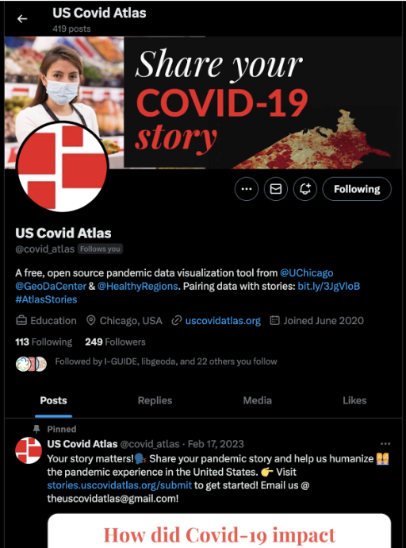{width=40%}

As you can see, the username is as close to the name of the project as possible, without any numbers or special characters making it easy to search. The description includes a short summary of what the project is about, and includes a link to take people to view the project. The profile image and banner are also both set up to convey more information about the project, including the project’s logo.

Once you have everything set up for your social media promotions, begin by creating a dissemination plan for your launch. A dissemination plan can help you track when and where you are promoting your application, and who made what post. This can be done in Google Sheets, Notion, or any other project management site you can think of.

Some things to include in the dissemination plan are: 

- Decide what websites and in-person sites to post marketing

- Social Media/Posting Schedule 

- Consistent Marketing

See below for an example:

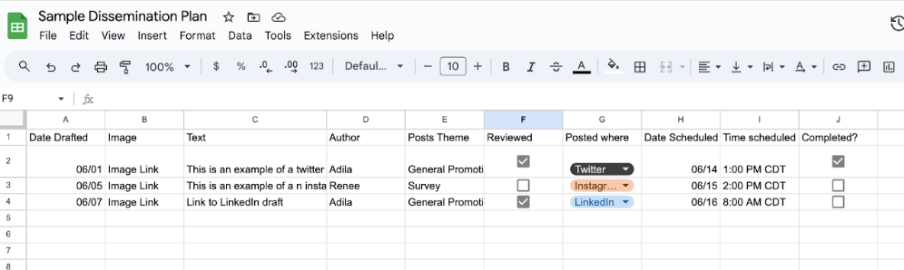{width=75%}

As you can see, for each post we have a corresponding image, who wrote the post, when and where the post will be uploaded, and if the post has been reviewed and approved to go out. Using this dissemination plan also allows you to schedule future posts, and ensures that people stay on track of promoting on social media. 

:::tip
**Tip**  

Having images accompany your social media posts can help them grab people’s attention, thus making your promotions more effective in the long run. You can use screenshots of your web application, or you can create promotional images yourself! The best way to do this is through [Canva](www.Canva.com). Canva is a mostly free tool that allow users to create promotional images from templates or scratch. Here’s an example of a social media promotion using Canva:

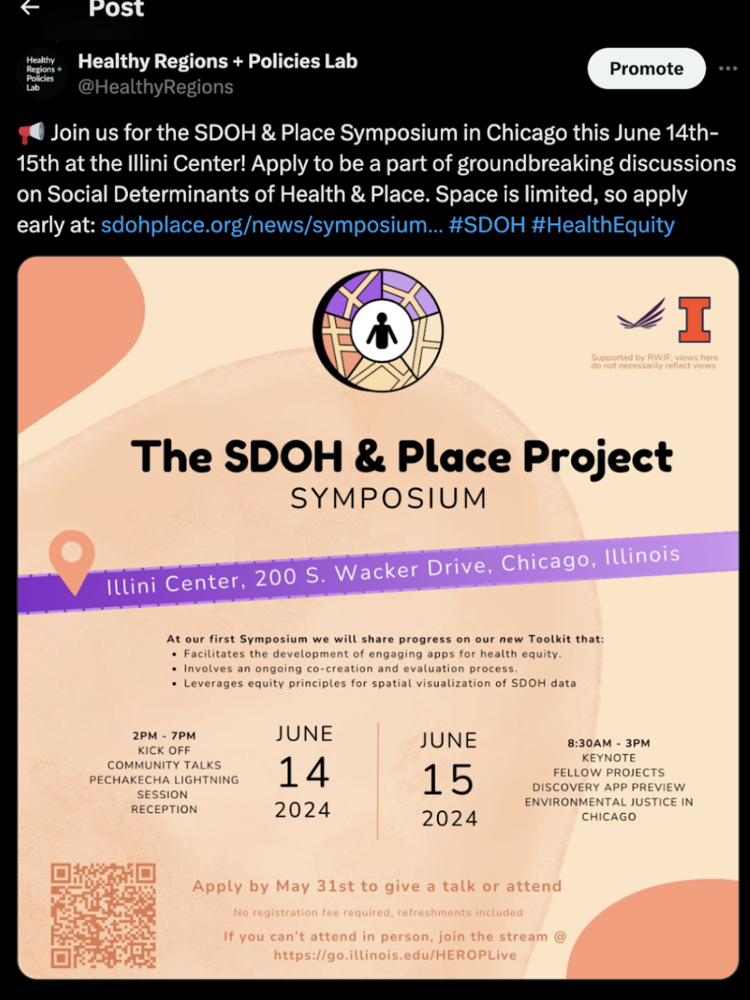{width=30%}

:::

When you begin to promote your application on social media, remember to also track post engagement. At the bottom of every social media post you can find clickable text that says, “View Analytics,” or “Post Insights,” or “View Engagements.” What it's called depends on the app, but the outcome is about the same. Clicking this will allow you to see more information on the post. Such information could include, how many people have seen the post, along with how many people interacted with the post and who interacted. Using this feature can provide you insight on how well your promotions are doing per application, allowing you to refine your dissemination plan as it runs. 

:::tip
**Tip** 

Make sure to engage on social media as well. Reposting/retweeting, liking, and commenting all help to boost engagement! Invite your stakeholders and members of your team to follow, like, comment and repost your social media posts. Every little bit helps! 

:::

Social media promotion is an effective way to ensure people know of your application, but it is only one form of promotion. If you want to maximize the number of individuals that know of your application, the best you can do is reach out to them directly! You can do this best by emailing them, or setting up MailChimp campaigns. 

## MailChimp Campaigns 

As part of the launch, one of the best ways to get the word is through word of mouth! Social media promotions are great, but they are only one form of promotion. They rely solely on people finding you and your application, even if you’ve planned to promote on social media apps that will include your target audience. Email campaigns, however, allow you to directly reach out to your target audience and inform them that your application is ready for them to use! 

We have found that MailChimp is an easy tool for sending email campaigns, and it allows for you to track the success of these campaigns. You can create a free account through their website, and immediately send emails to an audience of up to 1,000 individuals. They’re free account should be enough for most individuals and teams to promote their applications, but should you need they also include payment tears to reach more people.

Here is a step-by-step process for creating a mailchimp campaign: 

Build and import your contact list

- The first step is to build your contact list. Your application has been in production for months now, and if you have incorporated human-centered design in your planning you should have a network of individuals who are ready to use your app! In addition to them, ask your network if they can share the emails of any other people that might be interested in your application. Finally, Google nearby community organizations and institutions whose goals align with your own! They will have a page dedicated to contacts that you can then add to your contact list.

- After you have developed your contact list, import the list into the Audience section of your MailChimp, as seen below. 

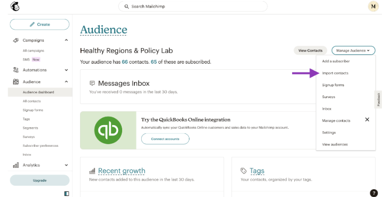{width=95%}

  

Create a new campaign

- In the left side of the screen, you will see a button that says “Create.” Select this and it will bring you to a new draft for your email campaign 

- If you have completed step 1 correctly, your audience will automatically be selected as the recipients in the “To” section. 

- Make sure to write a subject, indicate a time to send the email, and select a from email. 

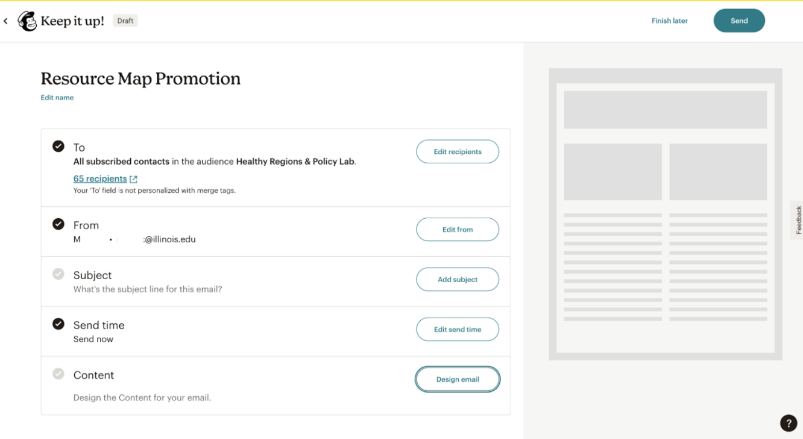{width=95%}

  

Create your content

- You can develop the complete content of your email from scratch or use a template.

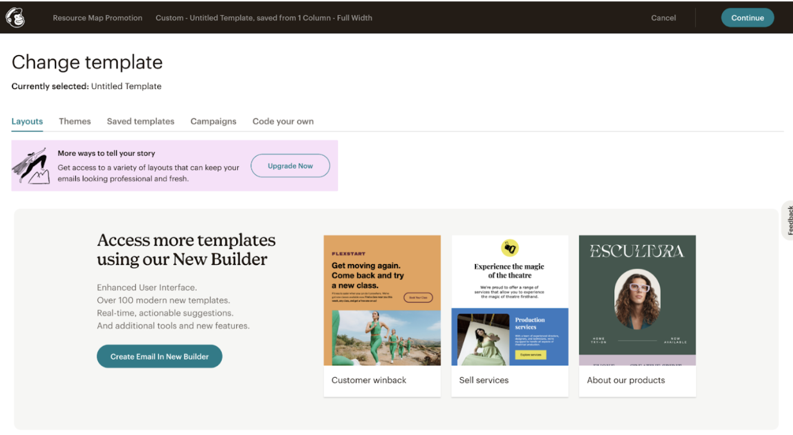{width=95%}

  

:::pitfall

**Caution: Address**

Some state spam laws require that you include an address at the bottom of your email campaign. MailChimp will usually warn you if this is the case. 

If you have to use an address, you can use the address of your institution or organization that you are affiliated with. 

:::

Review

- Double Check that everything looks correct! 

- You can send yourself test emails, and make sure you send yourself a bunch! What might look good in the preview might look horrible when its in an email format, so double-check!

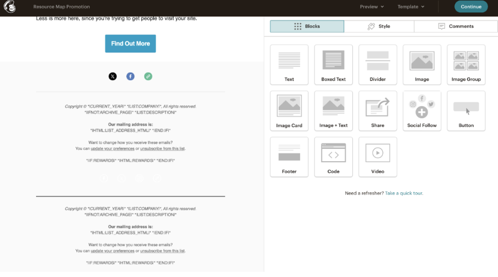{width=95%}

  

Double-check tracking

- This is the second most important part. Make sure you have set up tracking so that mailchimp tracks opens and clicks. This will tell you how many people you sent your campaign to opened your email, and how many of those clicked links to your application. 

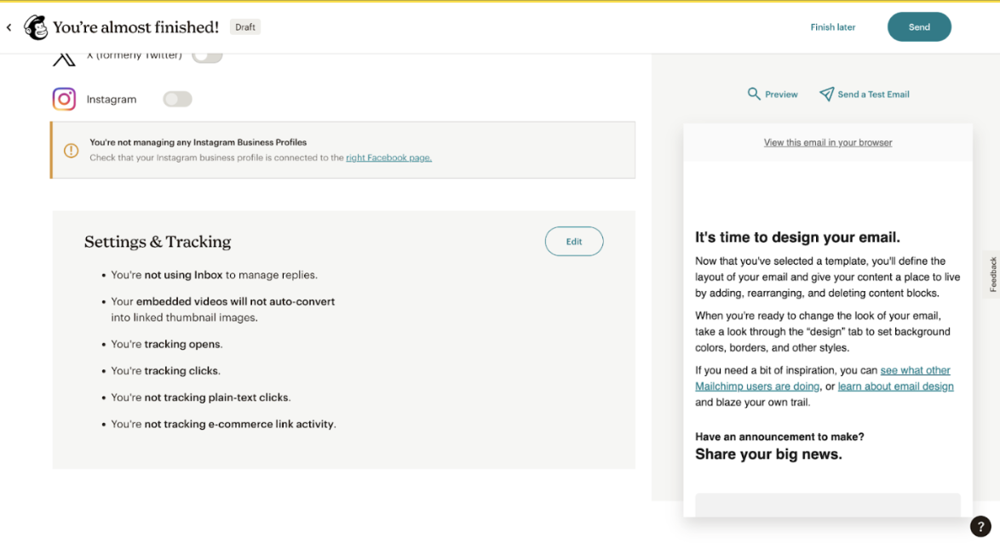{width=95%}

  

Send it & Track Analytics

- Send your email! If you have an idea for the best time to send it, make sure to schedule your email to send during that time. 

- Afterwards, you can access a report of your email campaign in the “Campaigns” section of your MailChimp. Here you can see how successful your email was.

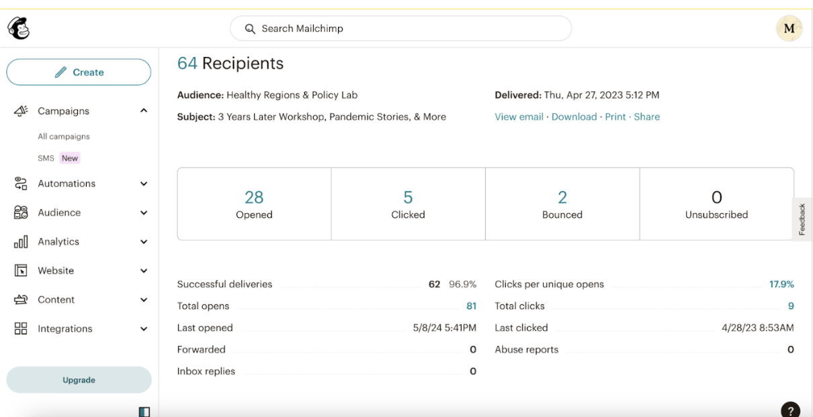{width=95%}

  

:::tip
**Tip**

People can mistake your email campaigns as spam emails if you’re not careful. If you feel like a large part of your audience might mistake an email campaign done through MailChimp as spam, you might want to personally send emails to those individuals. Otherwise, the best way to avoid coming off as spam is to ensure the following:

- Make sure you use clear and concise language, free from any typos. 

- Include no broken links, or links that are two long. Use hyperlinks whenever possible. 

- Have someone else review your email campaign before sending. They could help improve the email and prevent coming off as spam. 

:::

## Example of a Launch

With all of that in mind, let’s go through an example of a project Launch from start to finish. This is Adila: 

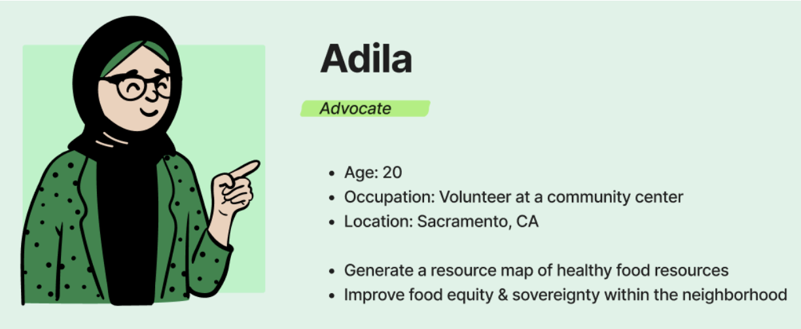{width=80%}

 **Background** 

Adila is a healthy food advocate for her community, and currently volunteers at the local community center. To help improve food equity and increase knowledge of healthy food options in the area, Adila has created a resource map of healthy food resources in and around her town. She has spent months of hard work creating her map and is finally ready to release her project to the public for members of her community to use. 

Adila, however is concerned that there might be some issues that went unnoticed up until now, and doesn’t want any bugs or issues with accessing the content to dissuade her audience from using the map all together. So, she begins a *soft launch* to a few members of her community and invites her stakeholders and a small group of community members to test the resource map before the official launch. 

Two weeks pass, and the stakeholders and focus groups provide Adila with the feedback she has been hoping for: they love the resource map! There appears to be no major bugs or issues to address, and the community members she invited to test out the map are finding it easy to use and already very useful for finding healthy food options in their area. With this in mind, Adila can now begin the *hard launch* of her web application. 

  

 **Decide what websites and in-person sites to post marketing** 

To do this, she begins by identifying where her audience is most likely to find her promotions. The best way for her to do this is through social media promotions, flyers at the community center she works at, and a small mailchimp campaign sent out to other community centers and similar health organizations nearby. Before she alerts everyone she needs to set up social media accounts for the map, and to ensure that the landing page for the web application is presentable. 

For her social media promotions, she thinks first where her audience might be spending their time on social media. As her web application is a healthy food resource map, her audience will most likely be parents or families that are concerned about their quality of food for their families. However, she also does not want to isolate the younger audience of college students and young adults who also need this information to improve their diets. She decides that the best platform for her to use will be Facebook, Instagram, and X (formerly Twitter). 

Facebook will hold a majority of her target audience, and so she will make sure that her Facebook profile is her primary mode of promotion with a majority of her promotions being posted to the website. X will be her secondary form of social media for her web application, as it will hold some of the target audience for her resource map along with pulling in some of the younger audience that would also be interested in using her app. Instagram will be her last social media profile she sets up to promote. Most of her target audience will not be on Instagram, but a lot of the younger audience she doesn’t want to isolate will. As a result, she will have a profile set up, but will keep her time spent promoting on Instagram low. 

With all that in mind she starts with a Dissemination plan. She decides to go with the following plan: 

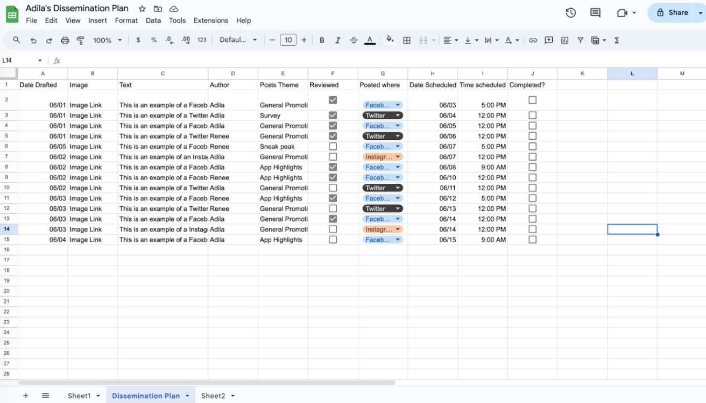{width=75%}

  

 **Social Media/Posting Schedule** 

As we can see, as Facebook is her primary mode of social media promotion, she plans to post four days a week on Monday, Wednesday, Friday and on Saturday. As most of her audience works during the day, she has set the promotions to go out either during common lunch breaks on weekends (12:00 PM), or in the afternoon after work is completed: 5:00 PM. Saturday is the only day of the week where a majority of her audience might be waking up early to do a grocery run, or have the day to themselves, so she sets that to go out early in the morning at 9:00 AM. 

For X, she decides to post every Tuesday and Thursday at 12 PM. She decides to stick to the plan of posting around noon which will lineup with most of her intended audience’s lunch break where they’re most likely to be on their phones. Thanks to the scheduled post feature on X, Adila can make a bunch of posts in advance so she can spend more time interacting and promoting on Facebook. However, she will still want to check in every now and then to make sure her X profile appears active. 

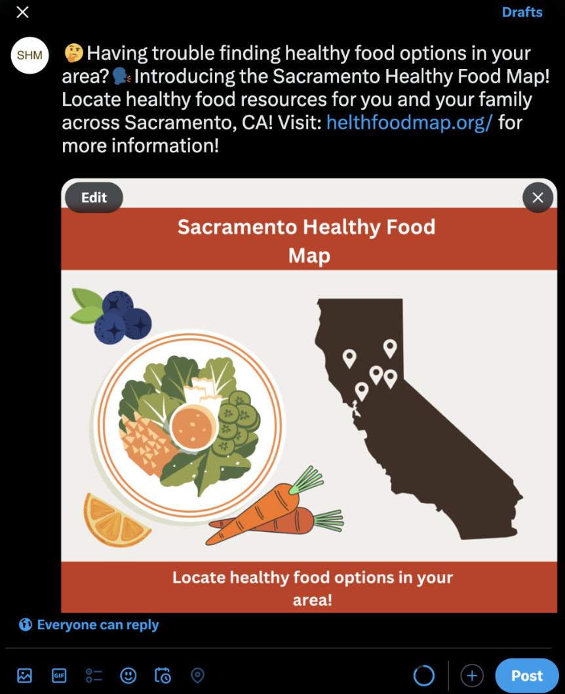{width=35%}

For Instagram, she decides to post only once a week on Friday, when her younger audience will be ending their week and making plans for the weekend. She has this post scheduled around noon to line up nicely with lunch breaks when most of the younger audience will be on their phones, as they might not have time later in the day if they’ve made plans. 

Adila has decided to follow through this dissemination plan for one month at which point she will assess which social media profile is getting the most attention, and whether she should reallocate her time spent on one or more apps. 

With her social media up and running, at the same time she will begin posting flyers at her community center, and letting the other volunteers know to get the word out regarding her application. After all, this resource map was created in part to help members of her community. She should make sure everyone who visits the center knows about the map! 

Her community center also hosts an email newsletter they send out to a list of people who have subscribed. She decides to ask the host of the newsletter to promote her application there, and sends them a small summary of the web application and a link to use it. 
  

 **Consistent Marketing** 

Finally, she identifies nearby community organizations and other community centers in the area that align with the same goals she has of promoting healthy food equity in her area. She gathers up a list of contact emails and begins a MailChimp campaign to further get the word out about her web application. 

With all this planned and in motion, she has completed her hard launch, and now monitors visitors to her web application, and the amount of traffic on her social media profiles. Eventually, as the months go by, the number of people visiting her web app might stabilize, and so she will shift gears and begin slowing down when she promotes her social media apps. However, for now, she can rest easy knowing her project is a success!

  

## Resources

- [Social Media Fact Sheet](https://www.pewresearch.org/internet/fact-sheet/social-media/?tabItem=5b319c90-7363-4881-8e6f-f98925683a2f)

- [Canva](https://www.canva.com/)

- [MailChimp](https://mailchimp.com/)

- [Soft vs Hard Launch Examples](https://blog.flutter.wtf/soft-launch-vs-hard-launch/)
