--- 
title: "The SDOH & Place Community Toolkit"
site: bookdown::bookdown_site
output: bookdown::gitbook
documentclass: book
bibliography: [book.bib, packages.bib]
biblio-style: apalike
link-citations: yes
favicon: images/favicon.png
github-repo: healthyregions/sdhoplace-toolkit
description: "This is the beginning of the SDOH & Place Toolkit."
---


## Preface {-}


The [SDOH & Place Project Community Toolkit](https://sdohplace.org/) aims to increase the capacity for community and civic organizations in health to:

 - Access and work with social determinants of health (SDOH) data (i.e., place/spatial data)
 - Use place data for social good and to further health equity
 - Develop engaging and compelling apps to inspire, activate, and retain users
 - Work within an open ecosystem infrastructure

The SDOH & Place Project Community Toolkit connects equity principles with analysis and design of spatial visualizations for SDOH spatial data. This toolkit draws inspiration from the Robert Wood Johnson Foundation (RWJF) Commission’s findings, which assessed [how communities’s health and life expectancy are affected by the places where they live](https://www.rwjf.org/en/insights/our-research/interactives/whereyouliveaffectshowlongyoulive.html). To address this issue, RWJF has previously created resources to [promote health equity](https://www.rwjf.org/en/building-a-culture-of-health/focus-areas/Features/achieving-health-equity.html).

In order to identify and engage with the necessities of different social actors, the community toolkit is based on the principles of Human-Centered Design (HCD). HCD is a well-researched framework that ensures the potential users’ desires, abilities, and contexts are at the core of interactive systems and applications. HCD consists of four main steps: identifying users’ needs, designing for those needs, evaluating, and iterating. Inspired by HCD, the community toolkit is built upon an ongoing co-creation and evaluation process that leverages the collaborative efforts of various stakeholders, such as researchers, policymakers, and analysts.


### Table of Contents {-}
Currently, the community toolkit contains six modules. Depending on your project's objectives, you can opt to undertake either one module or several of them. We recommend starting with Modules 1-3 regardless, and choosing your own adventure in subsequent chapters.

 - [**Module 1**](https://toolkit.sdohplace.org/01-intro.html) explores SDOH, equity, and types of visualizations. (*Led by Kamaria Barronville, José Alavez, & Marynia Kolak*)
 - [**Module 2**](https://toolkit.sdohplace.org/02-scoping.html) guides users in identifying and formulating their visualization goals, recognizing potential stakeholders, and prioritizing health equity in their planning. (*Led by Kamaria Barronville, José Alavez, & Marynia Kolak*)
 - [**Module 3**](https://toolkit.sdohplace.org/03-design.html) emphasizes the importance of user-centered design principles in spatial visualization and evaluates various engagement strategies with stakeholders. (*Led by Shubham Kumar &  José Alavez*)
 - **Module 4** focuses on the integration of spatial data into projects, covering data-wrangling methods, technologies, and the role of coordinate reference systems (CRS) in spatial visualization. (*Led by Catherine Discenza, Yilin Lyu, & Marynia Kolak*) 
 - **Module 5** delves into the fundamentals of exploratory data analysis in the context of social determinants of health (SDOH). (*Led by José Alavez & Kamaria Barronville* )
 - **Module 6** introduces users to multiple low or no-code applications for creating mapping visualizations. These open-source applications concentrate on four cartographic approaches for mapping SDOH: story maps, asset maps, thematic maps, and data dashboards. (*Led by Catherine Discenza*)
 - **Module 7** addresses how users can evaluate and disseminate their SDOH mapping projects, underscoring the importance of ongoing stakeholder engagement. (*Led by Marc Astacio-Palmer*)
 
### Author Team {-}

#### Toolkit Editors {-}

**Kamaria Barronville** *Instructional Designer*

**José Alavez** *Postdoctoral Scholar*

**Marynia Kolak** *Principal Investigator*

#### Toolkit Contributors {-}

**Shubham Kumar** *Product Designer*

**Catherine Discenza** *Graduate Research Assistant*

**Marc Astacio-Palmer** *Research Coordinator*

**Adam Cox** *Software Engineer*

**Andre Vines** *Illustrator*

**Yilin Lyu** *Graduate Research Assistant*

### Feedback {-}
We welcome your input to make this toolkit better. Please submit via our [contact form](https://sdohplace.org/contact), or post an [issue](https://github.com/healthyregions/sdhoplace-toolkit/issues) directly on the toolkit Github repository page.

### Acknowledgements {-}
Support for this toolkit was provided in part by the Robert Wood Johnson Foundation. The views expressed here do not necessarily reflect the views of the Foundation.

The toolkit team is housed at the [Healthy Regions & Policies Lab](https://www.healthyregions.org) at the [Department of Geography and Geographic Information Science](https://www.ggis.illinois.edu), at the University of Illinois at Urbana-Champaign.

As a land-grant institution, the University of Illinois Urbana-Champaign has a responsibility to acknowledge the historical context in which it exists. The University of Illinois Urbana-Champaign sits on the lands of the Peoria, Kaskaskia, Piankashaw, Wea, Miami, Mascoutin, Odawa, Sauk, Mesquaki, Kickapoo, Potawatomi, Ojibwe, and Chickasaw Nations. It is necessary for us to acknowledge these Native Nations and for us to work with them as we move forward as an institution. Over the next 150 years, we will be a vibrant community inclusive of all our differences, with Native peoples at the core of our efforts.

```{r include=FALSE}
# automatically create a bib database for R packages
knitr::write_bib(c(
  .packages(), 'bookdown', 'knitr', 'rmarkdown'
), 'packages.bib')
```

<!--chapter:end:index.Rmd-->

# Introduction

:::objective
**Objectives**

In this module, you will:

* Expand your understanding of the social determinants of health and equity
* Learn how spatial data visualizations are used in public health   
* Define four main types of web mapping applications

By the end, you should have an idea of which type of spatial data visualization type you plan to work with for your project.
:::

Think of spatial data visualizations as your bridge to meaningful conversations in public health. Nevertheless, crafting insightful maps, dashboards, or other spatial representations can be challenging, due to both technical and methodological hurdles. The path to creating an effective spatial data visualization does not commence with software usage; rather, it initiates with stakeholder meetings, annotations, and sketches. Therefore, a objective of this toolkit is to encourage you to invest time in thinking about your potential visualization and considering the individuals who will reap its benefits. 

Annotations, sketches, and meeting summaries can be handwritten in a notebook or digitally generated on a computer. We recommend creating a journal for this toolkit to annotate and store your notes. Your toolkit journal will assist you in organizing your thoughts, creating new content, making sketches, saving code, writing notes from meetings, and reflecting on your mapping process. Indeed, the production of relevant visualizations related to SDOH is a lengthy and complex process that requires creativity, organization, and technological skills. Your journal can be an invaluable companion on your journey.

:::tools

**Tools**

For this toolkit, you need your **toolkit journal**: 

- Notebook and writing utensil or
- Note-taking or sketching app (if you prefer digital annotations) 

Some of our team members prefer drawing on post-it notes, tablets, digital apps, or wall-sized pieces of paper. Take your pick and go with it!
:::


## SDOH & Place 

When we talk about the factors that shape our health, it's not just about biology or lifestyle — it's about where we live and the complex tapestry of history, society, and economy that frames our lives. The [social determinants of health (SDOH)](https://www.cdc.gov/about/sdoh/index.html) encompass a range of historical, social, cultural, political, and economic factors that significantly impact the well-being of individuals and their communities. These SDOH aren't just statistics; they're stories of communities and the places we call home, varying from one street to the next. They're about whether we have parks over parking lots, fresh food on shelves, and whether our neighborhoods are marked by support or segregation.

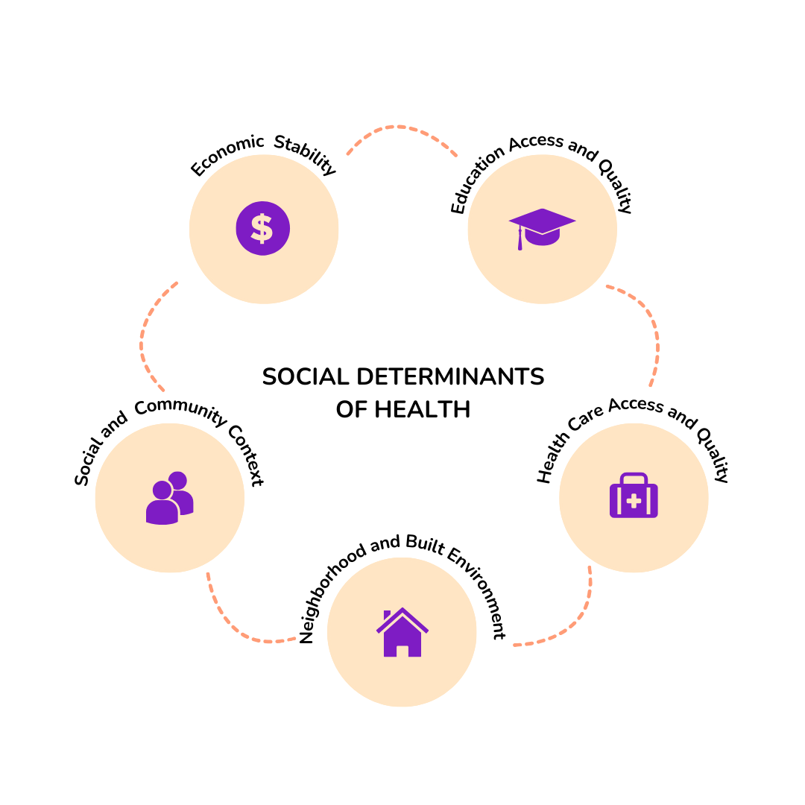{width=80%} 

The social determinants of health are complex and exist at many different scales — the individual, interpersonal, community, and regional levels. In this toolkit, we focus on how the **SDOH emerge at community and regional levels**. For example, neighborhoods will have differing availability of fresh produce, community clinics, and job opportunities, impacting how residents are able to successfully eat healthy, visit health providers, and afford housing essentials. By using neighborhood or regional scales of data to approximate SDOH, we can begin to get a deeper sense of the complex environment in which people live, work, and play. When working with measures at neighborhood-levels, a spatial view is essential to enable us to work with the data, from data wrangling to visualization and analysis. A [neighborhood-view of SDOH](https://jamanetwork.com/journals/jamanetworkopen/fullarticle/2759757) is multidimensional, and can predict over 60% of premature deaths. 

Academics, activists, government agents, and policymakers have employed data visualizations to examine the connections between places and SDOH. For example, they have utilized dashboards to study the impact of COVID-19 on vulnerable communities. They implemented [participatory mapping](https://www.cdc.gov/pcd/issues/2020/20_0123.htm) to advocate for policy-based interventions, and deployed [story maps](https://uploads.knightlab.com/storymapjs/ddf1b1212ec9c9aac4bebe45196b367d/hi-update-english/index.html) to promote health initiatives. To produce these data visualizations, health researchers and advocates mobilize a wide array of conceptual frameworks and diverse technical skill sets. Moreover, data visualizations in public health do not only analyze the relationship between places and SDOH. They promote health equity: "a state in which everyone has a fair and equitable opportunity to achieve their highest level of health" (CDC's Office of Health Equity, 2022).

## Centering Equity
The concept of equity in public health data visualizations goes beyond mere stylistic enhancements to aid in comprehension or research. It extends to encompass connections to pertinent resources and diverse language options, for example, empowering communities with information, processes, and agency to transform, advocate for, and influence residents, neighborhoods, and broader political, economic, and social structures towards healthier systems.

Let's dive deeper into how we can make data visualizations not just informative, but also inclusive and impactful. You see, it's not all about graphs and numbers. By weaving in stories and multimedia—like videos and interactive media streams—we open up a world where data talks to everyone, not just to those who love statistics.

Imagine a dashboard that not only shows you the trends but also tells you the stories behind the numbers. It's designed with real people in mind, adapting to a variety of preferences—whether you’re someone who loves a good narrative or someone who digs deep into the data.

However, we've got to acknowledge that sometimes, our public health systems fall short. They miss the mark on painting the full picture of health disparities. That’s why, when we're talking about Place & SDOH, we need to put equity at the heart of our work—from the word go, right through to the final pixel of the design. It's not just a 'nice-to-have'; it's a must-do for visualizations that truly resonate with and serve all communities.

### Equity Orientation {-}

The [equity orientation in a public health data system](https://www.ncbi.nlm.nih.gov/pmc/articles/PMC9508440/) involves several key components that must be outlined to address health disparities and promote equitable outcomes effectively. 

These components include:

#### Setting Parameters of Equity: {-}
- **Decision-Making Inclusion:** The process of setting parameters for equity should involve diverse stakeholders, including representatives from marginalized communities, to ensure that the perspectives and needs of all affected populations are considered.
- **Target Population:** It is crucial to identify the specific populations and communities that are the focus of efforts to improve equity. This includes recognizing vulnerable groups that historically experience disparities in health outcomes.

#### Focus on Equity: {-}
- **Differential Needs:** An equity-oriented approach acknowledges that different populations have varying needs and histories. It recognizes the importance of tailoring interventions to address these disparities rather than assuming that a one-size-fits-all approach will be sufficient.
- **Addressing Historical Considerations:** An equity-oriented system acknowledges historical injustices and systemic discrimination that have contributed to current health disparities. It seeks to redress these past injustices and provide opportunities for affected communities to improve their health and well-being.

#### Subject of Equity: {-}
- **Inclusivity:** The subject of equity encompasses all individuals and communities facing health disparities, including marginalized and underserved groups.
- **Generational and Historical Considerations:** An equity-oriented data system takes into account intergenerational and historical factors that have contributed to health disparities. It recognizes that current health outcomes are influenced by past policies and practices.

#### Content of Equity: {-}
- **Procedural Equity:** This aspect of equity focuses on ensuring that the decision-making processes and procedures are perceived as fair and transparent. It involves involving affected communities in the planning, implementation, and evaluation of health interventions.
- **Distributive Equity:** Distributive equity concerns how social welfare and resources are distributed to meet the needs of different populations. It aims to allocate resources in a way that reduces health disparities and provides equitable access to healthcare and other essential services.
- **Contextual Equity:** This aspect acknowledges that pre-existing social conditions (such as poverty, discrimination, and access to resources) influence equity. An equity-oriented data system considers these contextual factors when designing interventions to address health disparities effectively.

.](images/preface-centeringequity1.png)

### Embracing a Trauma-Informed Mindset in Decision-Making {-}

Adopting a [trauma-informed mindset](https://ncsacw.acf.hhs.gov/userfiles/files/SAMHSA_Trauma.pdf) is crucial for creating solutions that are sensitive, empathetic, and inclusive when working in the space of communicating, understanding, and analyzing. Trauma-informed decision-making ensures that your project respects the experiences and well-being of individuals whose data is being visualized. Here are key considerations to guide your decision-making process with a trauma-informed approach:

- **Understand the Impact of Trauma:**
Recognize that individuals within your data may have experienced trauma, whether it's related to health disparities, socioeconomic challenges, or other adverse life events. Understanding the potential impact of trauma allows you to approach your project with empathy and compassion.

- **Prioritize Safety and Trust:**
Safety and trust are foundational elements of trauma-informed care. Ensure that your data visualization project creates a safe and trustworthy space for users. This involves transparent communication, data security measures, and a user-friendly interface that minimizes potential triggers.

- **Promote Choice and Empowerment:**
Empower users by providing choices in how they interact with and interpret the data. Consider customizable features that allow individuals to tailor their experience based on their preferences. This promotes a sense of agency and control over their engagement with the visualization.

- **Avoid Re-traumatization:**
Strive to avoid re-traumatization through your data visualizations. Be mindful of the language used, the visual elements displayed, and the overall tone of your project. Aim to present information in a way that informs without causing distress or harm.

- **Cultural Sensitivity and Diversity:**
Acknowledge and integrate cultural sensitivity into your decision-making process. Consider the diverse backgrounds, beliefs, and experiences of the individuals represented in the data. Ensure that your visualizations are inclusive and respectful of different cultural perspectives.

- **Engage Stakeholders and Communities:**
Involve stakeholders and communities in the decision-making process. Seek input from those directly impacted by the data being visualized. Community engagement ensures that your project aligns with the real needs and concerns of the people it serves.

- **Continuous Feedback Loops:**
Establish continuous feedback loops to gather insights from users and stakeholders. Regularly reassess your decision-making processes in light of the feedback received, allowing for ongoing improvement and adaptation to the evolving needs of the community.

- **Ethical Data Use and Privacy:**
Uphold ethical standards in data use and privacy protection. Clearly communicate how data will be used, ensuring transparency and obtaining informed consent when necessary. Respect privacy rights and prioritize the responsible and ethical handling of sensitive information.

By embracing a trauma-informed mindset in decision-making, your SDOH data visualization project can contribute to a more compassionate and understanding approach to public health. This mindset not only enhances the user experience but also promotes a positive impact on the well-being of the individuals and communities represented in the data.


:::tip
**Tip**

Consider your audience or who your project will impact. How can you involve them in the entire process of developing and disseminating your project?

* Start by creating a list of people you know that can be included, think about who they can connect you to.
* Ask if they're willing to contribute some of their time and expertise to help you develop this project.
* View the people your working with as co-creators. 
:::


## Dynamic Spatial Visualizations 

Visualizing public health data isn't just about the "what"—it's about the "so what?" It's about crafting digital narratives that anyone can access, understand, and use to make a difference. These visual tools are our digital megaphones and meeting places—they bring us together, keep us informed, and push us towards action.  [Data visualizations](https://www.ahrq.gov/data/visualizations/index.html) in public health that advance equity are digital tools designed to provide accessible and comprehensive data related to public health indicators, focusing on reducing health disparities and promoting equity among different populations. These tools often combine various data sources and visualization techniques to present information in a user-friendly and easily understandable format.

Because of our focus on SDOH & Place at neighborhood and regional levels, we'll focus on spatial data visualizations. Spatial data visualizations incorporate not just the "regular" data, but *in addition*, how that data is linked to places. This new dimension of data can be visualized as a map. But another important aspect emerges; with spatial data, we are given the ability to link any data by location. This enables us to integrate the many facets of SDOH and health, converging on place.

](images/preface-airquality.png)

Data visualizations can be used by community members and organizations, research groups, policymakers, and more to empower individuals to better access and mobilize SDOH data and advance [health equity](https://www.cdc.gov/healthequity/whatis/index.html).
Within the realm of public health, maps, dashboards, and interactive web applications can be created to foster fairness through an inclusive design that accommodates diverse user groups and their varying degrees of health equity. These tools are not only visually appealing and easy to comprehend, they also provide valuable insights. They adapt to the needs of different social actors by combining well-suited graphics, animations, and audio-visual elements. They even offer networking tools (e.g., messaging boards) for seamless data exchange and user interaction. These interactive features also serve to promptly update users about any alterations.

](images/preface-storymap1.png)

:::tip
**Tip**

We use the term *spatial data visualizations* throughout the toolkit. We are focusing on web-based applications that will have some interactions. (In other words, they're not just pictures.) There are many other names for what we're talking about, like:

* Web Applications
* Mapping Applications
* Spatial Decision Support Systems

We're not covering all types of spatial data visualizations, or all web apps, but will focus on  common types of web mapping applications. 
:::


## Types of (Spatial) Applications 

Throughout this module, we've concentrated on orienting you to how we talk about SDOH and Place, given you a change to brainstorm ideas, recognize prospective stakeholders, and consider potential data at your disposal for your project As we progress, we will now examine how these three features converge when it comes to choosing an appropriate spatial visualization. To facilitate this, we will introduce four distinct types of spatial visualizations for communicating about and investigating the social determinants of health: asset maps, thematic maps, story maps, and dashboards. 

When comparing spatial visualization options, we'll focus on two dimensions: 1) map type, and 2) level of data & interaction complexity. For map type, visualizations may be more of a **reference** or **thematic** map. A reference map is meant to emphasize *information* about locations, whereas a thematic map will focus on *geographic patterns* of a specific topic. Interaction complexity refers to the intensity and variability of user interaction with the visualization. The interactions may involve a click to open an information window, or may require extensive decision-making and careful parameter selection to generate a updated visualization. Data complexity my refer to how many types of data you are incorporating, from different forms of spatial data (e.g. address-level locations, community boundaries) as well as different types of input data (e.g. photos, videos, tabular data). As applications get more complex, you can also have lines blurred across both dimensions. 

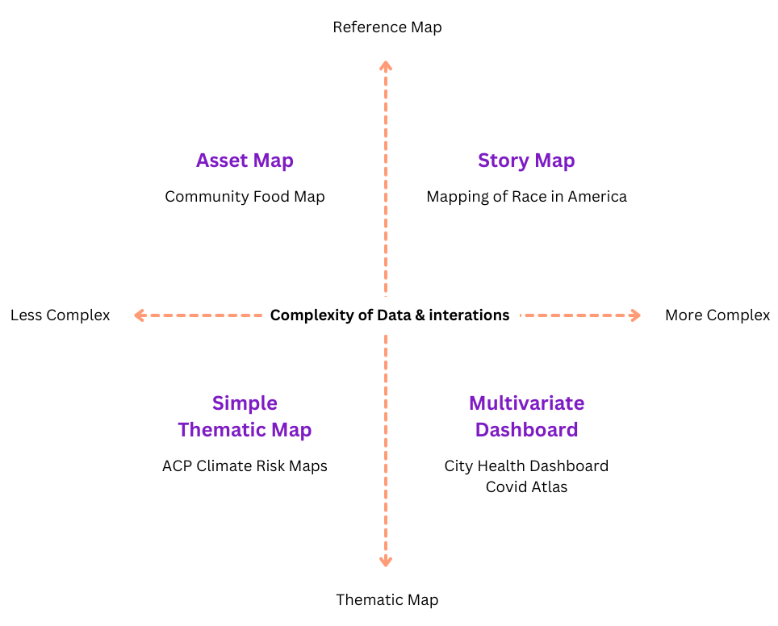

### Asset Maps {-}
These are like your community's highlight reel, showcasing everything from the vibrant parks and schools to the people who make your area tick. They're about celebrating what's there, not just what's missing, and sparking conversations about building on those strengths. 

Asset maps act as reference maps and tend towards straightforward interactions, like clicking on an icon to access details about an address. Data-wise, asset maps will start with address-level locations, that will get converted to **point** data.

](images/intro-food.png){width=80%} 

[Asset mapping](https://ajph.aphapublications.org/doi/full/10.2105/AJPH.2011.300351) may involve engaging with community members, stakeholders, and local organizations to gather information and collaboratively build the map. The process can be facilitated through surveys, interviews, focus groups, and public meetings. Alternatively, you may link existing data about resources into a newly integrated platform. The resulting asset map is a visual tool that provides a comprehensive view of the community's strengths, potential partnerships, and areas where support and resources are available. 
The assets included in an asset map can be diverse and encompass various categories, such as:

- **Physical Assets:** These include tangible resources like parks, schools, hospitals, community centers, libraries, public transportation, and other infrastructure elements.

- **Human Assets:** Human resources within the community, such as skilled individuals, volunteers, community leaders, and organizations' staff, are valuable assets.

- **Social Assets:** Social assets refer to the networks, relationships, and social capital present in the community, including support systems, cultural groups, and community organizations.

- **Economic Assets:** These include businesses, local enterprises, job opportunities, and other economic resources that contribute to the community's well-being.

- **Cultural Assets:** The cultural assets encompass the traditions, heritage, arts, and cultural events that enrich the community's identity and cohesion.

- **Environmental Assets:** Natural resources, green spaces, environmental initiatives, and sustainable practices are considered environmental assets.

Asset Maps empower communities, steer strategic planning, and guide resource allocation. They're about networking and flipping the script to a more positive community narrative.

### Simple Thematic Maps {-}
Here's where we paint with data, using colors and symbols to show patterns like disease spread or healthcare access across different places. [Thematic maps](https://www.cdc.gov/dhdsp/maps/gisx/resources/thematic-maps.html) in public health are maps that use visual symbols, colors, and patterns to represent specific health-related data or themes within a geographic area. 

Data-wise, thematic maps use area boundaries, like census tracts or counties, referred to as **polygon** data. Statistical data in CSV formats are merged to spatial data boundaries. Data & interaction complexity remain more simplified, encouraging the user to inspect visualized patterns. Interactions may include selecting different variables for different maps, or clicking on an area to get information in a pop-up window.

)](images/preface-thematic.png){width=100%}  

Thematic maps are valuable tools in public health for conveying complex information in a spatial context, allowing researchers, policymakers, and the public to quickly understand and interpret health-related data. Simple thematic maps in public health are used for a variety of purposes, including:

- Visualizing disease prevalence and distribution

- Identifying health disparities across different regions or demographic groups

- Monitoring disease outbreaks and patterns

- Assessing access to healthcare services and resources

- Evaluating the impact of public health interventions and policies

- Communicating public health information to the general public and stakeholders

Simple thematic maps get straight to the point, showing you who and where are affected by health issues, helping to direct attention and resources effectively. 

### Story Maps {-} 
A [story map](https://ica-abs.copernicus.org/articles/3/245/2021/ica-abs-3-245-2021.pdf) in public health is a powerful and interactive tool that combines maps, text, images, and multimedia elements to tell a compelling narrative about health-related issues, initiatives, or research. Data and interactions may be gorgeously complex, encouraging users to fully imbibe. Different types of spatial data may be used, from point-based locations to regional views. 

These are your digital storybooks, weaving maps with tales and images that take you on a journey through health challenges and triumphs. It allows public health professionals to present complex data, trends, and information in a visually engaging and accessible manner, making it easier for a wide range of audiences to understand and connect with the subject matter. 

)](images/preface-storymap.png){width=90%}  

Key features and uses of story maps in public health include:

- **Data Visualization:** Story maps use maps and data visualizations to illustrate health-related trends, patterns, and disparities across geographic regions. This can include disease prevalence, access to healthcare, environmental health risks, and other relevant data.

- **Narrative Communication:** Story maps are structured to present information in a storytelling format. Public health professionals can use narrative elements to explain the context, significance, and implications of the data, helping the audience grasp the larger story behind the statistics.

- **Health Education and Promotion:** Story maps are an effective educational tool to raise awareness about public health issues, promote healthy behaviors, and disseminate health-related information to the public.

- **Community Engagement:** Story maps can engage communities in public health initiatives by presenting data and insights in a way that is relevant and relatable to specific geographic areas or demographics.

- **Policy Advocacy:** Public health professionals can use story maps to advocate for specific policy changes by visualizing the impact of current policies and proposing evidence-based solutions.

- **Environmental Health:** Story maps can be used to communicate information about environmental health hazards, pollution, and their impact on public health. They can also showcase initiatives aimed at improving environmental conditions and public health outcomes.

- **Outbreak Response and Preparedness:** Story maps can be utilized during disease outbreaks to track the spread of infections, identify hotspots, and inform response efforts.

- **Health Equity and Disparities:** Story maps can highlight health disparities and inequities across different communities and populations, drawing attention to areas with the most significant health challenges and the need for targeted interventions.

Story Maps turn data into engaging tales, educate, and rally communities. They're advocates, educators, and responders all in one.


### Multivariate Data Dashboards {-}
Imagine your health community's stats brought to life in real-time – a dashboard that's part control panel, part story, helping everyone from officials to neighbors make sense of the numbers. Multiple variables will be integrated across different views, enabling a multivariate experience. Interactions can be complex, requiring user input to change figures or update sliders. Data may also be complex, although will mainly focus on statistical tabular data (rather than multimedia formats).

In public health, [data dashboards](https://www.ruralhealthinfo.org/assets/4472-19438/lessons-learned-dashboard-norc-brief.pdf) are digital tools that provide visual representations of key health-related data and indicators. Here’s an example of a dashboard that highlights users stories, [New Video Series: Moving from Data to Action | City Health Dashboard](https://www.cityhealthdashboard.com/blog-media/1501). These dashboards are specifically designed to present public health data in a user-friendly and easily understandable format, enabling stakeholders, policymakers, researchers, and the general public to access and interpret critical information about population health. 

](images/preface-dashboard.png)

Data dashboards in public health typically include the following features:

- **Health Indicators:** Dashboards display a variety of health indicators, such as disease rates, mortality rates, vaccination coverage, hospitalization rates, environmental health data, and other relevant metrics.

- **Geospatial Data:** Many public health dashboards utilize spatial data to present geostatistical analysis in real-time, allowing users to understand health patterns and disparities across different geographic regions.

- **Time Series Data:** Dashboards often provide data over time, allowing users to observe trends, track changes, and identify seasonal patterns in health outcomes.

- **Demographic Disaggregation:** Public health data dashboards may disaggregate data by demographic characteristics, such as age, gender, race, ethnicity, and socioeconomic status. This helps identify disparities and understand how health outcomes vary among different population groups.

- **Comparisons and Benchmarks:** Dashboards may include the ability to compare health outcomes across regions, states, or countries, as well as against national or global benchmarks.

- **Data Sources and References:** Transparent dashboards typically provide information about the sources of data, data collection methods, and references to ensure data credibility.

- **Interactivity:** Interactive elements allow users to customize the dashboard, apply filters, and explore data based on their specific interests and questions.

- **Alerts and Notifications:** Some dashboards include alerting features to notify users about significant changes in health indicators or emerging health threats.

Spatial Data Dashboards keep a pulse on public health, from tracking diseases to zooming in on health equity. They're transparent, interactive, and always on the lookout with alerts.

:::activity
**Activity**

After exploring the four spatial visualizations (e.g., story maps, thematic maps, dashboards, and asset maps), it is essential to reflect on their advantages and limitations. Create a list of three advantages and three limitations for each of the four visualizations that we reviewed in this module.

For example, you could focus on which visualization is better suited for displaying a place's historical health trends, analyzing the impact of a pandemic, or explaining the results of a public policy? Which visualization requires some experience with statistics and coding, and which one requires experience with the humanities and storytelling?

:::

## Resources {-}
For a deeper dive on topics discussed in this chapter, please check out the following. If you have a resource to add, feel free to suggest one by submitting an [issue](https://github.com/healthyregions/sdhoplace-toolkit/issues) to our toolkit repository.

- [Achieving Health Equity](https://www.rwjf.org/en/building-a-culture-of-health/focus-areas/Features/achieving-health-equity.html) - Robert Wood Johnson Foundation
- [Data for Equity: A Review of Federal Agency Equity Action Plans](https://civilrights.org/wp-content/uploads/2023/04/Data-For-Equity-Report.pdf) -  Leadership Conference Education Fund
- [Do No Harm Guide: Crafting Equitable Data Narratives](https://www.urban.org/projects/do-no-harm-project) - the Urban Institute
- [Common Thematic Map Types](https://gistbok.ucgis.org/bok-topics/common-thematic-map-types) - The Geographic Information Science & Technology Body of Knowledge (2nd Quarter 2021 Edition), John P. Wilson (ed.)
- [Narrative and Storytelling](https://gistbok.ucgis.org/bok-topics/narrative-and-storytelling) - The Geographic Information Science & Technology Body of Knowledge (2nd Quarter 2021 Edition), John P. Wilson (ed.)
- [GIS&T for Equity and Social Justice](https://gistbok.ucgis.org/bok-topics/gist-equity-and-social-justice) - The Geographic Information Science & Technology Body of Knowledge (2nd Quarter 2021 Edition), John P. Wilson (ed.)


<!--chapter:end:01-intro.Rmd-->

--- 
---

# Project Planning 

:::objective
**Objectives**

In this module, you will:

* Refine your project goals and objectives
* Identify your project team & stakeholders
* Assess strengths, needs, and make a plan
:::

:::tools

**Tools**

For this module, you need:  

- Your **toolkit journal**
- You may also want to generate a series of digital documents for final **Project Requirements** developed in this module. That may be a series of documents, spreadsheets, or templates identified across online resources.

:::

## What's the Point? 

The goal of this project will be to develop some place-based data visualization or application support that will integrate social determinants of health and an equity framework.

But, what will you *do*, specifically — and *why*? Let's run through some core questions.

**Where** is your application? Is it within a city, neighborhood, or across an entire country? 

- Greater *spatial coverage* does not necessarily mean that your project will get more complex. It may be easier to grab data for all communities within a city from a data portal, for example, than extract data for a single neighborhood. Having more areas available for comparison can also be useful.

- Greater *spatial resolution* does tend to make projects more complicated, on the other hand. You want to explore state policies for 50 states? No problem. Want to grab census tract data for the entire country (all 77,000)? This will limit your visualization options, as some software approaches will be able to handle it with ease, whereas others not all. 

**Who** is your application *about* — a specific population, defined by their residence and/or some social, economic, or other characteristic? And, **Who** is your application *for*? Who will actually be using your application? How and why are they different?

:::pitfall
**Pitfall**

Data may not be available for all places and populations. For example, COVID-19 data by race and ethnicity is still not disaggregated below the state-level for all counties in the U.S (!). You may need to start with your ideal, and then work towards what's actually doable.

:::

- As this toolkit will highlight more than once--it is helpful to work with persons who will actually use the application, *to increase its meaning and utility*. At the same time, it is also helpful to work with persons **who the data is about**, as lived experiences will provide invaluable understanding, depth, and insight into the project of interest. 

**When** is your application being used? Are you focused on the most recent datasets you can find, or are you interested in data over many time periods? And, how will the application itself be changed or updated over time? 

- Consider the *sustainability and long-term maintenance* needs of your project. Where will it be in five years? Would it be okay for the application to exist as a time capsule for a project completed, or do you prefer it to have data updated regularly?

**What** actions should/could result from your application? Are they reasonable, feasible, and time-bound? 

- Do you intend for your interactive asset map of cooling centers to be used by community members during a heat event to find refuge? Are you trying to inspire action from policymakers after exploring your data dashboard of modeled map findings and statistics on health disparities? 

- It is common to start with too ambitious a goal, that will slowly get refined over the project's course of implementation. Try to be realistic and honest when assessing what your final project could do.

**Why** should people care?

- This is often the most important question, and the one least formulated in early stages of the process. Something may be interesting and meaningful to you, but may not be important to others. Or it may be very obvious to you and your peers, but the thought hasn't occurred to others in a different discipline or domain. Be specific and intentional in setting this objective, and do the research. 

Put these together to generate an overview *goal statement* for your project. Include the primary question you’re trying to answer. This may change throughout the process, but should be changed to be refined further, rather than expanded in scope.  

Think of the start of your project as setting out on a road trip. First, you need to map out where you want to go. What do you hope to discover along the way? Your visualization techniques are like choosing the right vehicle for the journey—each has its strengths for different terrains. Your goals will evolve as you travel, finding new paths to explore. But it all starts with a clear destination in mind.

## Refining Goals for SDOH 

Taking your project a step further, dig deeper into how your application can address SDOH directly. Which common approach or technique is the most pertinent to your goals? Consider the following ideas:

 <details markdown='1'><summary>**Identifying Health Disparities**</summary> You can employ spatial visualizations to identify areas with disproportionate health burdens and disparities. For example, by mapping health outcomes and demographic data from the census, it could become evident which communities or populations experience higher rates of diseases or poor health, shedding light on potential health inequities. </br></br></details>
 
  <details markdown='1'><summary>**Targeting Interventions**</summary>  Another option is performing spatial analyses to target interventions and resources to areas with the greatest need. By creating asset maps, you could aid public health advocates to direct their efforts, and allocate resources to address health disparities and promote equity. </br></br></details>
 
  <details markdown='1'><summary>**Assessing Access to Healthcare**</summary> You can produce maps to evaluate the accessibility of healthcare services across different regions. These cartographies identify areas with limited access to medical facilities or services, which is crucial in understanding barriers to healthcare for marginalized populations and addressing health disparities. </br></br></details>
  
   <details markdown='1'><summary>**Modeling SDOH at Different Scales**</summary> You can produce geostatistical analyses to model how social determinants of health (SODH) affect communities at different scales. By studying and mapping these factors, you may better understand how social conditions influence health outcomes and equity. </br></br></details>
   
   <details markdown='1'><summary>**Environmental Justice**</summary> You could create a dashboard to assess environmental health risks and exposures. By combining graphs, maps, and tables you may identify areas with environmental hazards that disproportionately affect specific communities, contributing to health disparities. </br></br></details>
    
  <details markdown='1'><summary>**Health Planning and Policy Interventions**</summary> Your maps can inform stakeholders in their efforts to create effective policies. By deploying various spatial visualizations, you can support interventions targeting specific health challenges in various communities, ultimately promoting health equity.</br></br></details>
  
  <details markdown='1'><summary>**Community Engagement**</summary> Story maps or collaborative mapping projects may facilitate community engagement by providing social experience insights. These representations allow community members to participate in decision-making, voice their concerns, and collaborate with public health officials to design interventions that address their unique needs and concerns. </br></br></details>

  <details markdown='1'><summary>**Monitoring and Evaluation**</summary> Spatio-temporal dashboards are effective tools to monitor the effectiveness of interventions over time. By comparing health outcomes before and after implementing interventions, public health officials can assess whether disparities are decreasing and health equity is improving.</br></br></details>

</br>
Take a moment to consider which goal(s) you have for your project. We recommend starting simple, with no more than one or two goals to start with. Your initial project should focus on accomplishing your primary goal to the greatest of your abilities. Over time, more experience, resources, and support will enable you and your team to expand further.
</br>


```{r table-healthdisparities, echo=FALSE, message=FALSE, warnings=FALSE, results='asis'}
require(pander)
panderOptions('table.split.table', Inf)
my.data <- "  Goal        | Description
  Identifying Health Disparities      | Map health outcomes & demographics to identify disparities.
  Targeting Interventions     | Use spatial analysis to direct resources effectively.
  Assess Access to Healthcare | Map service accessibility to pinpoint healthcare gaps.
  Modeling SDOH at Different Scales | Analyze SDOH imapct across scales for insight into health influences.
  Environmental Justice | Create dashboards to monitor enviornmental health risks.
  Health Planning & Policy Interventions | Inform policy with visualizations to address health challenges.
  Community Engagement | Use story maps to involve communities in decision-making.
  Monitoring and Evaluation | Track interventions over time with spatio-temporal dashboards."
set.caption("Common Goals for SDOH & Place Applications")
df <- read.delim(textConnection(my.data),header=FALSE,sep="|",strip.white=TRUE,stringsAsFactors=FALSE)
names(df) <- unname(as.list(df[1,])) # put headers on
df <- df[-1,] # remove first row
row.names(df)<-NULL
pander(df, style = 'rmarkdown')
```
</br>

### Integrate Equity Directly {-}

Think back to the equity framework introduced in the first module. While each component is critical to any application built to understand and communicate SDOH, the [**Content of Equity**](https://toolkit.sdohplace.org/01-intro.html#content-of-equity) component can be a useful consideration when building into your goals. Consider how your application may address equity by focusing on one or more of these aspects. Some examples include:

- Integrating community stakeholders directly to the decision-making processes, planning, and implementation of your web application. *(Procedural Equity)*
- Developing an asset map of local health and social services to maximize networking and connection in your city. *(Distributive Equity)*
- Curating a story map that invites users to "walk" through a neighborhood over time as it becomes segregated from highway construction. *(Contextual Equity)*
 
:::activity
**Activity**

Take a look at these three real-world projects. In your own words, sketch out their goals. Do they align with any of the SDOH application goals we've mapped above? What content of equity (procedural, distributive, or contextual) do they address?

- [Data and Stats | Tulsa Health Department](https://www.tulsa-health.org/community-health/data-stats/north-tulsa-medical-provider-and-pharmacy-asset-map)

- [United States of Health Dashboard | McKinsey & Company](https://www.mckinsey.com/industries/public-sector/our-insights/us-public-health-dashboard)

- [Heart Disease Death Rates Aged 35 and older, Total Population | cdc.gov](https://www.cdc.gov/dhdsp/maps/national_maps/hd_all.htm)

Next, update your own goal statement based on ideas in this section. What are your SDOH and Equity goals?
:::

:::tip
**Tip**

This is just the beginning of a process. To keep progressing, it's essential to always look for inspiration and stakeholders. Take some time to explore various web maps, dashboards, atlases, magazines, and academic articles. Then, list the ones you find appealing in your journal. Even if they are spatial visualizations that have nothing to do with health, try to imagine how you can use their design to study SDOH.
:::

## Defining Stakeholders 

Once you've got your project's goals on the horizon, it's time to look at who's journeying with you. Collaboration and stakeholder identification are vital components of any project that aims to achieve equity. Whether it's a non-governmental organization, a research group within a university, or a government agency, stakeholders bring diverse perspectives and expertise to the table. Similarly, communities, activists, and advocates can also play a significant role in your project's success. 

<blockquote>Early identification of stakeholders is key to building trust and solidarity, which is a time-consuming but necessary process. </blockquote>

In Module 3, we will delve deeper into employing User-Centered Design to engage stakeholders effectively. The aim will be to ensure that every step of the project, from conception to implementation, is done in collaboration with those who have a vested interest in the outcomes, guaranteeing that the resulting initiatives are equitable, impactful, and sustainable. For now, let's assess your team.


### Assess Your Team {-}

Take an inventory of who makes up your team, and define each person's role. If you are embedded within a larger organization or corporation, there may be expansive stakeholders involved, with multiple stages of review, implementation, and iteration. If you're in a smaller group or you're on your own, you may be taking on several roles at the same time. 

Your core team may include community members directly, or may have a different leadership structure. Here are some critical roles to consider:

```{r table-setstrategy, echo=FALSE, message=FALSE, warnings=FALSE, results='asis'}
require(pander)
panderOptions('table.split.table', Inf)
my.data <- "  Responsibilities        | Description
  Set Strategy, Priorities, & Standards     | Core Team, Leadership
  Allocate Resources (Time and $)     | Leadership
  Manage Processes | Core Team, Project Manager 
  Design, Research Use Cases | Core Team, Designer
  Develop, Deploy, & Monitor Project | Core Team, Engineer
  Use the application in way that was expected | Expected Users
  Use the application in way that was uexpected  | Unexpected Users
"
df <- read.delim(textConnection(my.data),header=FALSE,sep="|",strip.white=TRUE,stringsAsFactors=FALSE)
names(df) <- unname(as.list(df[1,])) # put headers on
df <- df[-1,] # remove first row
row.names(df)<-NULL
pander(df, style = 'rmarkdown')
```

There are two additional stakeholders every application developer should consider -- the Champion, and the Curmudgeon, which are actual roles that have been used in *Health Informatics*. 

Considering them will be essential for your success:

- **The Champion** - They love your idea, sing its praises, and are ready to share your work with everyone they know. They may not get the "tech stuff" completely, and won't have time to learn it if they wanted to, but are your biggest cheerleader. They may help you get funding.

- **The Curmudgeon** - They prefer to do things the way they have always been doing it. It's generally something they do themselves, and probably manually. They are not interested in your work, and may challenge it with a sigh, eye-roll, or outright lament. May prefer technology the way it "used" to be.

We caution that you not shift your work too much in either direction to please/antagonize either of these stakeholders, but rather understand their role in the process at this stage. 

:::activity
**Activity**

Review these two projects and identify their stakeholders. Explain what is their role in each project.

- [Urban Youths Go 3000 Miles: Engaging and Supporting Young Residents to Conduct Neighborhood Asset Mapping | AJPH](https://ajph.aphapublications.org/doi/full/10.2105/AJPH.2011.300351)

- [Food assets for whom? Community perspectives on food asset mapping in Canada](https://www.tandfonline.com/doi/full/10.1080/17549175.2021.1918750)
:::

### Motivations {-}
If you find yourself to be a "curmudgeon" at the idea of working with others to support your journey, we also encourage you to take a moment to consider all the benefits of engaging more stakeholders.

Here’s how a wider stakeholder alliance can shape your journey:

- **Understanding Diverse Perspectives:** Stakeholders come from various backgrounds and sectors, each bringing unique insights that can challenge and enrich your project's approach to health. A government official might understand policy implications, while a local activist might provide a grassroots perspective on community health challenges.

- **Data Gathering and Validation:** Collaborators are crucial in both collecting and validating SDOH data. They ensure that the information reflects real-world conditions and is relevant to the communities affected. Researchers can provide rigorous methodologies, while community members can offer qualitative insights that ground the data in lived experiences.

- **Expanding the Network:** Engaging with stakeholders allows for the expansion of your network. Each stakeholder may introduce you to other relevant parties, broadening the reach and potential impact of your project. This can lead to discovering untapped resources or finding new avenues for support and advocacy.

- **Exploring New Contexts:** Stakeholders can act as guides through unfamiliar territories, both metaphorically in the project domain and literally in the community spaces. They help navigate the cultural, social, and political landscapes that shape health outcomes.

- **Innovative Co-Design:** Utilizing User-Centered Design principles, stakeholders become co-creators in developing spatial visualizations that represent SDOH. Their input ensures that the end products are not only technically sound but also culturally sensitive and user-friendly.

- **Forging Partnerships:** Collaboration can lead to long-term partnerships that extend beyond the life of a single project. These relationships can build a foundation for future initiatives, creating a sustainable impact on public health.

- **Revising Project Goals:** Stakeholders often provide new insights that can lead to a reframing of project goals. What begins as a narrow focus on a particular health issue might evolve into a more holistic approach that considers a wider range of social factors.

- **Ensuring Equity:** By involving a diverse group of stakeholders, the project is more likely to address equity in a meaningful way. Equity is not just about equal access, it's also about designing interventions that acknowledge and address power imbalances and historical contexts that contribute to health disparities.

### Finding a Community of Practice {-}

Even if you think you're getting into this solo or with a smaller team, you may be surprised at the number of people available to connect with you as invaluable colleagues, future friends, and mentors in your network. You've found this project -- that already means you're a part of a wider community of practice. Join our [**LinkedIn**](https://www.linkedin.com/groups/14406296/) and [**GitHub**](#) pages to introduce yourself and expand your network. Additionally, consider sharing your ideas with people in your community, whether that be your neighborhood, school, or work.

:::tip
**Tip**

Not sure where to start looking for mentors? We love this [**Mentor Map**](https://www.insidehighered.com/sites/default/files/files/Mentoring%20Map%5B1%5D(1).pdf) exercise by the *National Center for Faculty Development & Diversity* -- not just for academic folks, but anyone who has a beating heart and is working on a project. Try out the exercise yourself to identify persons in your network who you may be reach out to connect for feedback, accountability, intellectual discussions, and emotional support as you work through the project. 
:::

## Project Assessment

You now know what you want to do, and who you want to do it with. You've gathered your team and had a few good discussions. If you're on your own, you've made a list of mentors and additional resources to connect with so you can ensure feedback throughout the process.

Let's finish scoping this project.

### Assess Your Strengths {-}

Each project will require **domain expertise** and **technical capacity**. Domain expertise means they are subject matter experts (SME). For example, someone who has been a 6th grade English teacher for 5 years, can be considered a SME of teaching 6th grade English. Technical capacity will refer to those people who know how to code from the back end (what only the core team sees) to the front end (what your users see).

Which is your strength, and which will you need to skill up to further support for project implementation? 

For example: 

- If your project is about building an asset map to support populations experiencing food insecurity, you may be a food bank volunteer who has worked directly with populations impacted, live in the community, and also would be using the application with collaboration from the regional food pantry network. In this case, you have extensive domain expertise and knowledge that will be more enriched than most web app developers, assuming you are not a developer for your day job. For this project, you will be the SME and need to find someone who has the technical capacity needed for the project *or* your goal will be to scale up your technical capacity within the constraints of your setting. 

- On the other hand, perhaps you are a graduate student who has been coding statistical models for your work, and are interested in adding more social impact to your work. You’re used to learning new programming languages for new projects, and have a high technical capacity, but are not embedded within the community you want to build an asset map for. For this project, you would be the technical expert and need to find a SME *or* your goal will be to scale up your understanding of equity based frameworks, learning more about community experiences, as well as researching the topic further to build your domain expertise. 

After assessing your strengths, go back to your list of stakeholders and update as needed. 

:::tip
**Tip**

As you expand your stakeholder team, your project may update according to shared goals and visions of team members. As a result, your team will work through the assessment process more than once. This iterative process is expected.
:::

:::activity
**Activity**

Write down your purpose and objectives by clearly stating why you want to solve this problem and what you hope to achieve. Who is your target audience? 

Next, make a list of your potential stakeholders. How would you contact your stakeholders and why would they be interested in collaborating with you? Would you be part of an ongoing project or propose a new one?

The format for this exercise is flexible and exploratory. You can opt to create lists of objectives, draw diagrams, write a structured plan, or engage in a free-writing exercise.

The primary aim of this task is to develop a foundation to begin exploring spatial data for your project. It's important to note that your final prototype might diverge significantly from what you record in this entry, and that's perfectly acceptable. Remember, the process of using SDOH spatial data for visualizations is a dynamic process.
:::

### Assess Project Needs {-}

Project Needs will include data, computer services, time, and attitude. To assess this, you will need to survey your motivation and pain points, as well as technical, financial, people, and time resources. 

- **Data**: What data do you have, and what will you need to find? How comfortable are you working with data, and what is the state of data where you are now? Do you curate community resources on post-it notes, PDFs, spreadsheets, or databases? Consider taking a [data maturity assessment](https://data.org/dma/) to better understand your data strategy along dimensions of purpose, practice, and people. Take your data skills a notch or two to the next level, progressing with patience, rather than jumping into a complex warehousing project that could be overkill.

- **Computing Resources**: Do you have expansive computing resources and software available to you (e.g. large university of industry environment), or are you seeking free and/or low cost computing solutions? If you're developing a project for a team member at a different institution, can they access the technical resources needed, or would they need to purchase a costly subscription? Knowing what resources are available to you is essential for selecting the best approach for app development.

- **Community**: Are you working within an isolated environment, or do you have multiple colleagues who are ready to help? Perhaps you're surrounded by people, but everyone is already overstretched with their work. At the same time, who will take over the project when you've moved on — are there interns, analysts, or volunteers interested in learning from your findings? Identify your needs.

- **Attitude**: This facet is also crucial, and can help you decide which adventure to choose in later modules. If troubleshooting coding bugs like tasty puzzles sounds fun, take the coding route, even if you've never seen yourself as a coder. If you just want to get through the application building process as fast as possible to move on to a different project, go for a software-based option instead. You may find yourself to be a *prototyper*, enjoying the process of building a project; or an *optimizer*, instead wanting to refine pieces until they are perfect. The best teams have both! 

Consider **sustainability** at this stage. What will your project look like in five years? 


### Is there an app for that? {-}

In the ever-evolving landscape of data visualization and technology, it's essential to explore existing tools and applications before embarking on a new project. This not only saves time and resources but also allows you to benefit from the wealth of solutions that may already address your needs. Here are some ideas to help you determine if there's an app or web visualization that aligns with your SDOH data visualization project:

- **Research Existing Solutions**
Start by conducting thorough research on existing data visualization tools and applications. Look for platforms that specialize in healthcare, public health, or social determinants of health. Consider both general-purpose visualization tools and those specifically designed for SDOH.

- **Collaborate and Network**
Connect with professionals in the field of public health and data visualization. Attend conferences, webinars, or join online forums where experts discuss SDOH projects. Networking can provide valuable insights into tools that have been successfully used in similar projects.

- **Evaluate Open Source Solutions**
Consider open-source visualization tools and frameworks. Open-source projects often have active communities and can be tailored to specific needs. GitHub and other repositories are great places to explore such solutions.

- **Consult with Peers and Stakeholders**
Reach out to colleagues, peers, and stakeholders involved in similar projects. They might have insights into tools that have proven effective in their work. Collaboration can lead to shared resources and knowledge.

- **Check for Integration Capabilities**
If your project involves integration with existing systems or databases, ensure that the identified tools have the necessary integration capabilities. Compatibility with data sources is crucial for a seamless visualization experience.

- **Consider Customization and Scalability**
Assess whether the existing tools can be customized to meet the specific requirements of your SDOH data visualization project. Additionally, evaluate their scalability to accommodate potential future expansions or changes in data sources.

- **Evaluate Cost and Licensing**
Analyze the cost implications and licensing requirements of using existing tools. Some applications may be free, while others might have subscription fees or licensing agreements. Factor in your budget constraints when making a decision.

By thoroughly exploring existing solutions, you can make informed decisions about whether to build from scratch or leverage the capabilities of existing apps and web visualizations for your SDOH project. Remember, a well-researched approach can lead to more efficient and impactful data visualization outcomes.

## Finalize Approach

The field of project management is vast, interdisciplinary, and always growing. Here are some highlights that can go a long way in scoping your project effectively and finalizing goals In these steps, you'll move from ideas to a concrete plan.

### Define SMART Goals {-}

You've already sketched out a few goals for your project, including an overview and SDOH-specific plans. Now let's get specific. Establish SMART (Specific, Measurable, Achievable, Relevant, Time-bound) goals or similar criteria for the project to ensure clarity and effectiveness:

**Specific:** Clearly define the objectives and outcomes of the project.

**Measurable:** Set quantifiable metrics to assess progress and success.

**Achievable:** Ensure that goals are realistic and feasible within the project scope.

**Relevant:** Align project goals with the overall purpose and objectives.

**Time-Bound:** Define specific timelines for the completion of key milestones and the entire project.

Check out resources at the end of this module for more examples of SMART goals & resources.

### Define Requirements {-}

**System Requirements** Based on the inventory of your project assessment above, you're ready to generate a list of system requirements. Identify major *system capabilities* (e.g. must use free or opensource technologies; must integrate new data contributed with approval), *system assumptions or constraints* (e.g. you will have access to colleagues for support; you have a limited budget and time to accomplish goals), *user characteristics*, and any other requirements. 

Review your project needs, your own strengths, and stakeholder needs defined earlier in this module. You may find multiple templates online for ideas.

**User Requirements** Identify the goals for your intended audience. Be specific about the types of interaction you have in mind. Following are a number of potential options, with increasing complexity:

- Implement a user-friendly interface with features like drop-down selection, click for pop-up windows, and storytelling to enhance access to information. 
- Ensure that users can easily explore relevant data points and insights related to social determinants of health (SDOH) within their specified areas. 
- Incorporate interactive elements such as sliders and number entry fields to allow users to input specific parameters, enabling a more personalized and focused exploration of the data.
- Design the application to respond dynamically to user inputs, providing real-time visualizations and insights based on the selected criteria.

:::tip
**Word of the Day: *Affordances* **

These user behaviors, like anticipated clicks or zooming to view, are called *affordances* in the design space. Affordances are clues that an object can be used to perform some action. If you see what looks like a button on the internet, you may want to click it. If you see a slider, you may want to slide it.

Designing products well take *affordances* into account. In this stage of planning, you're engineering things so that your audience will know what to do intuitively, based on these visual cues. A deeper dive into the topic can be found at [Smashing Magazine](https://www.smashingmagazine.com/2014/06/affordance-most-underrated-word-in-web-design/).

:::

### Break Down Details {-}

**Generate a Timeline**

- Develop a detailed timeline outlining the various stages of the project, from data preparation and analysis to application development and deployment.

- Clearly define milestones and deadlines to track progress effectively.

**Task Breakdown**

- Break down the project into manageable tasks and subtasks, assigning responsibilities to team members based on their expertise.

- Prioritize tasks based on dependencies and critical paths to ensure a smooth workflow.

**Process Documentation**

- Establish a systematic approach to document the entire process, including data preparation steps, analysis methodologies, and application development strategies.

- Maintain a comprehensive record of decisions made, challenges encountered, and solutions implemented throughout the project.

**Communication Plan**

- Develop a communication plan that outlines how team members and stakeholders will stay informed about project progress.

- Define regular check-ins, status updates, and channels for effective communication within the team.

### Enable Agile Processes {-}

While there are many project management styles out there, we recommend approaches that allow for regular updates and revisions. The traditional "waterfall" method of developing a project on your own and delivering it one go is not realistic for complex spatial data visualization work about SDOH & Place, as you'll miss crucial engagements and opportunities for improvement along the way. 

We recommend embracing "agile" methodologies to foster flexibility and adaptability in project execution, especially the processes of iterative development and user-centered design.

#### Iterative Development {-}

- Implement an iterative development approach, allowing for continuous refinement and improvement based on feedback and evolving requirements.

- Conduct regular sprint cycles to review and adjust project goals, ensuring alignment with stakeholder expectations.

#### User-Centered Design{-}

- Prioritize user feedback and engagement throughout the development process, incorporating user-centered design principles.

- Conduct usability testing to gather insights into user preferences and refine the application interface accordingly.

By establishing clear deliverables and defining an agile and well-documented process, the project can proceed systematically and effectively, addressing the identified objectives and stakeholder needs.

:::activity
**Activity**

Establish your final Project Requirements, based on the assessment completed in this module. They should include:

- Your project overview
- Your project goals & objectives
- System Requirements 
- User Requirements
- Timeline

Indicate which project management approach you'll be adopting. Include a few sentences to describe your process and communications plan. This will be a work in progress, so feel free to update as you go!
:::

## Resources {-}
For a deeper dive on topics discussed in this chapter, please check out the following. If you have a resource to add, feel free to suggest one by submitting an [issue](https://github.com/healthyregions/sdhoplace-toolkit/issues) to our toolkit repository.

- [Data Maturity Assessment](https://data.org/dma/) - The Data Foundation
- [Stakeholder Responsibilities and Role Descriptions](https://www.healthit.gov/sites/default/files/cds/3_5_14_stakeholder_responsibilities_and_role_descriptions.pdf) - HealthIT.gov
- [Objectives and goals: Writing meaningful goals and SMART objectives](https://www.health.state.mn.us/communities/practice/resources/phqitoolbox/objectives.html) - Minnesota Department of Health
- [Design, Development, Testing, and Deployment of GIS Applications](https://gistbok.ucgis.org/bok-topics/design-development-testing-and-deployment-gis-applications) - The Geographic Information Science & Technology Body of Knowledge (2nd Quarter 2021 Edition), John P. Wilson (ed.)

<!--chapter:end:02-scoping.Rmd-->

---
---

# Human Centered Design

:::objective
**Objectives**

In this module, you will: 

- Describe the fundamental concepts of Human-Centered Design

- Analyze various design elements (e.g., graphic icons, layout, text fonts)

- Create a user interface prototype

:::

Picture yourself not just as a creator, advocate, policymaker, or researcher but also as a storyteller and a listener. In this module, you're going to learn the ropes of Human-Centered Design (HCD)—it's all about making sure our designs click with the very people they're meant for. We're talking about a real connection.

> The primary objective of a successful data visualization method should be to meet the needs of the individuals who will be using it.

This entails understanding their objectives in using web applications, their situations, and their familiarity levels. It's essential to determine the design approaches that would most effectively cater to these requirements. Not planning appropriately can lead to revising the design which would eventually slow you down from releasing the application you have in mind. Therefore, a crucial first step of any data visualization planning process is to identify the users and understand what they want out of the visualization. 

## Design Methods

Let's dive into the world of design methodologies, where each approach brings something special to the table. Our star player here is **Human-Centered Design (HCD)**, a method that puts people at the heart of the design process. HCD is all about getting into the users' shoes, understanding what they need and want, and then crafting solutions that hit the mark. But that's not the whole story. We're also going to peek into some other relevant and overlapping design methods, each with its flavor:

<!-- ```{r table-simple, echo=FALSE, message=FALSE, warnings=FALSE, results='asis'} -->
<!-- require(pander) -->
<!-- panderOptions('table.split.table', Inf) -->
<!-- my.data <- " Type          | Description  -->
<!--  Human-Centered Design (user-focused design approach)          | An approach to problem-solving that starts with people and ends with innovative solutions tailored to suit their needs. It involves understanding the perspective of the users for whom you're designing, generating a range of ideas, and iteratively testing and refining solutions  -->
<!--  Participatory Design (collaborative design approach)          | A process that involves all stakeholders, especially users, in the design process. The aim is to ensure that the designed product meets the needs and expectations of the users. It often involves workshops, user interviews, and collaborative sessions where users actively contribute ideas and feedback.  -->
<!--  Design Thinking (problem-solving framework)          | A non-linear, iterative process used to understand users, challenge assumptions, redefine problems, and create innovative solutions to prototype and test. It comprises five phases: Empathize, Define, Ideate, Prototype, and Test. This approach encourages questioning, experimentation, observation, and innovation.  -->
<!--  Universal Design (accessibility-focused design approach)          | Involves creating products and environments that are accessible and usable by all people, to the greatest extent possible, without the need for adaptation or specialized design. It emphasizes simplicity, intuitiveness, and accommodating a wide range of individual preferences and abilities.  -->
<!--  Experience Design (user experience-focused design approach)          | Focused on the quality of the user experience and culturally relevant solutions. It goes beyond the product itself to include all aspects of the user's interaction with a company, its services, and its products. " -->

<!-- df <- read.delim(textConnection(my.data),header=FALSE,sep="|",strip.white=TRUE,stringsAsFactors=FALSE) -->
<!-- names(df) <- unname(as.list(df[1,])) # put headers on -->
<!-- df <- df[-1,] # remove first row -->
<!-- row.names(df)<-NULL -->
<!-- pander(df, style = 'rmarkdown') -->
<!-- ``` -->
<!-- </br> -->

<details markdown='1'><summary>**Human-Centered Design**</summary>
Type: User-focused design approach</br/>
An approach to problem-solving that starts with people and ends with solutions tailored to suit their needs. It involves understanding the perspective of the users for whom you're designing, generating a range of ideas, and iteratively testing and refining solutions.
<br/><br/></details>

<details markdown='1'><summary>**Participatory Design**</summary>
Type: Collaborative design approach<br/>
A process that involves all stakeholders, especially users, in the design process. The aim is to ensure that the designed product meets the needs and expectations of the users. It often involves workshops, user interviews, and collaborative sessions where users actively contribute ideas and feedback.
<br/><br/></details>

<details markdown='1'><summary>**Design Thinking**</summary>
Type: Problem-solving framework<br/>
A non-linear, iterative process used to understand users, challenge assumptions, redefine problems, and create innovative solutions to prototype and test. It comprises five phases: Empathize, Define, Ideate, Prototype, and Test. This approach encourages questioning, experimentation, observation, and innovation.
<br/><br/></details>

<details markdown='1'><summary>**Universal Design**</summary>
Type: Accessibility-focused design approach<br/>
Involves creating products and environments that are accessible and usable by all people, to the greatest extent possible, without the need for adaptation or specialized design. It emphasizes simplicity, intuitiveness, and accommodating a wide range of individual preferences and abilities.
<br/><br/></details>

<details markdown='1'><summary>**Experience Design**</summary>
Type: User experience-focused design approach<br/>
Focused on the quality of the user experience and culturally relevant solutions. It goes beyond the product itself to include all aspects of the user's interaction with an organization, its services, and its products.
<br/><br/></details>


## Human-Centered Design

Human-Centered Design (HCD) is a well-researched framework that provides a set of guidelines and processes to ensure that designs cater to the desires, abilities, and contexts of their potential end users. Our focus is on HCD as it guides the designer in you to to empathize with users, understand their needs, wants, and experiences, and create designs that engage and adapt to the context of their real lives. Employing HCD can also reduce the risk of negative outcomes and enhance user well-being.

Applications of HCD principles have generated a design process that shares the following three steps:

{width=95%}

Throughout these steps, the designer will constantly 'diverge' their ideas to think wide and open while 'converge' their scope and prototype with focus.

### Identifying User Needs {-}
The first step of the HCD process is to understand what a user hopes to accomplish and the conditions that will allow them to do so. 

To determine user needs, inclusive workshops are an effective way of bringing users into the design process and empowering them to share their goals for the tool as well as their particular concerns and contexts that might shape their use of the application. The success of these workshops depends on how well the participants represent a potentially **diverse end-user group**: to best understand the true breadth of needs to be considered, users of all different backgrounds, experience levels, and goals must be given equal opportunity to provide insight.

Establishing common terminology with workshop participants is necessary as they may not be familiar with application design or data discovery. Therefore, certain functionalities must be explained with examples to allow participants to articulate what sorts of features they may benefit from.

Workshops can be organized in a way that is feasible and comfortable for all:

<details markdown='1'><summary>**Virtual workshop**</summary>
Virtual meetings (over Zoom, for example) are an effective way to hold these workshops. Virtual meetings allow for a broader spectrum of users to participate. In these meetings, it is recommended to include multimodal communication, such as a mix of presentations, live discussions, polling, and a chat function. This ensures that participants with varying levels and preferences of engagement get an opportunity to speak their minds.
<br/><br/></details>

<details markdown='1'><summary>**In-person workshop**</summary>
If you’re lucky that all your users are available for an in-person workshop, then using a whiteboard, sticky notes, and other stationery is recommended.
<br/><br/></details>

Free online platforms are available to enable a collaborative brainstorming session to determine user needs, be it virtual or in-person. FigJam and Miro, for example, are free online collaboration tools that allow users to brainstorm and organize ideas, allowing for real-time interactive sessions between team members.

:::activity
**Activity**

Making User Personas

One of the most effective ways to get started with identifying user needs is to create details around each *user persona*. This way, you can not only test the assumptions that you make about your personas but also see how far you can ideate on their potential needs. The primary object is to understand the personas by gaining a deep understanding of their **needs, preferences, behaviors, and goals.** This understanding is crucial for developing the application in the direction that resonates with their needs. 

During the exercise, personas are looked at from a more humanized lens that helps build empathy as it is easier to relate to a fictional character representing a real user than to an abstract persona. We recommend using the User Persona FigJam template to collaborate and build a meaningful set of user personas, for which steps are provided:

<details markdown='1'><summary>**Step 1: Accessing FigJam and load the User Persona FigJam template**</summary>

1. Go to the [Figma website](https://www.figma.com/) and sign in or create a new account. - If you don't have an account, click on "Sign Up" to create a new account. Follow the on-screen instructions to complete the registration process. You can choose a free account, but if you have the chance, pick the academic account since it provides more perks. 

2. Once you sign up, Figma will lead you to your personal workspace. Under Teams (left part of the screen), select “Create new team.” Name your new team as you like, we will name it “Place Project.” You can skip adding your collaborators and choose the starter option.  

{width=90%} 

3. Once you have your new team, access the [User Persona FigJam template](https://www.figma.com/community/file/1027357893837345723/user-persona) webpage and click on the "open in Figjam" button. This action will open the template into your own work space.

<br/></details>

<details markdown='1'><summary>**Step 2: Edit the User Persona Template**</summary>

1. Once the template is open, you'll see a canvas with predefined sections for different aspects of a user persona (e.g., demographics, goals, frustrations). Take a few minutes to explore this template. You can zoom into specific sections. 

{width=90%} 


2. You will see the name of the file on the top of the canvas. The default name is "User persona (community)" Click on the arrow and choose “rename.” You may name your new file "Place Project - User Personas," but you can pick your own name. Click on the arrow once again and pick “move to project” and move your file under the team you created on Step 1.2 of this guide. 
   
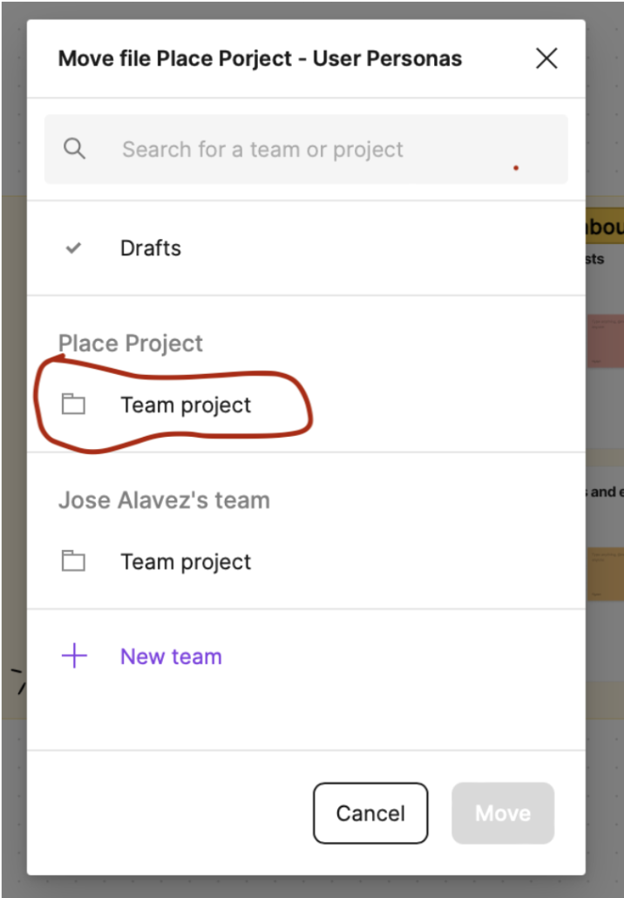{width=90%} 

3. Now that your file is in the correct project, click on each section on the canvas to edit the text and add details relevant to your potential user personas. You may change the image of your personas, change their personality traits by moving the sliders, and write on the sticky notes their interests, motivations, goals, pain points and frustrations etc. 

{width=90%} 

4. You can also use the drawing tools, sticky notes, and connectors (below of the screen) to enhance the visual representation of your user personas.

5. You can also copy and paste different elements of this template. For example, right click on the "Basic Information Section," paste it on the canvas and move this section just below your first persona. Do the same with the "More about'' section. Now, you can have multiple personas with different skills, motivations, and personalities. 

{width=90%} 

6.  FigJam automatically saves your work, but it's a good practice to save manually the version history as well. Perhaps you may want to come back to a previous version of your template. Click on the main menu icon in the top-left corner and choose "file" then select "Save to version history" and follow the instructions. 

</br></details>

<details markdown='1'><summary>**Step 3: Collaborate with Others**</summary>

1. FigJam is designed for collaboration. Click on the "Share" button in the top-right corner to invite some of your colleagues of the Place Project Fellowship to provide you feedback in real-time. You can use their emails or provide them with a link to your canvas. 

2. You may use sticky notes to communicate and work together in order to refine your user personas. However, another way to do it is by clicking on the "Add comment" (e.g., speech globe) icon at the top of the canvas, selecting where you want to add the comment on the canvas and writing it. 

{width=90%} 

</br></details>

<details markdown='1'><summary>**Step 4: Save and Export**</summary>

If you need to share the user personas outside of FigJam, you can export the file by clicking on the “Main Menu" icon, selecting "File" and "Export as" to choose your desired format (PDF, JPG. PNG etc).

</br></details>

<details markdown='1'><summary>**Step 5: Iterate and Refine**</summary>

1. User personas are dynamic, and your project may evolve. Use FigJam to iterate and refine your user personas as needed.

2. Collaborate with your team at the Place Project  to gather feedback and make improvements to ensure the personas accurately reflect your target audience.

3. On your own try to create at least three potential User Personas for your project and share it with your Place Project colleagues. Also do not forget to provide some feedback to them.

Congratulations! You've successfully used a FigJam template to create user personas for your project. Feel free to explore other FigJam features to enhance your collaborative design process.

</br></details>

:::


### Designing to User Needs {-}

The next step of the HCD process is to determine a web application design that will meet user needs. An application's user interface is a key element of design for developers to consider.

#### Organize Functions {-}
To involve users in the process of creating the application interface, **card sorting** is one effective method of participatory design, in which users are given note cards representing application functions and are asked to arrange them in ways they would find most easily to navigate on a web page. Creating a full list of functions that will help users meet their goals, such as the ability to query a dataset using keywords, or zoom in on particular locations in a map, is a helpful first step of this process.

{width=90%} 

During the card sorting activity, don't hesitate to create, remove, or edit cards that may be suggested by the users. This technique often serves as a guidance for taking the next step, but you should feel free to adapt and improvise as needed. Application developers should also consider how data will be organized into meaningful categories. For health equity applications, for example, it is often useful to divide data by demographics.


#### Design Aesthetics {-}
The design of graphic icons, buttons, window layouts, symbols, text fonts, and color schemes is also crucial to this step. Researchers have identified certain principles of design that seem to be broadly visually appealing and successful. These include:

- Navigation tools should be highly visible, intuitive, & consistently placed

- Writing should be presented in readable blocks

- Text should be easy to read and appropriate size, color, and font

- Elements should be organized in an understandable structure denoted by meaningful headings

- Images should be relevant, clear, and properly sized

Overall layout should be minimalist, uncluttered, and balance color with an effective use of white space.

#### Design Tools {-}

Starting with design tools, using a pen and paper for making paper prototypes offers a great starting point. This allows for rapidly translating ideas into tangible and shareable prototypes, helping make quick iterations.

Alternatively or additionally, you could opt to make low or mid-fidelity prototypes. Low-fidelity prototypes are rudimentary representations of design concepts, helping explore and communicate ideas without delving into specifics. On the other hand, mid-fidelity prototypes offer a more refined depiction of the final product. Here are some simple to use low-fidelity design tools:

- [MockFlow](https://mockflow.com/): MockFlow is a versatile web tool ideal for creating wireframes, user flows, and prototypes with its intuitive drag-and-drop interface, facilitating seamless collaboration among team members.

- [Wireframe.cc](https://wireframe.cc/): Wireframe.cc offers a minimalist approach to wireframing, allowing users to quickly sketch out ideas and concepts in a clean and straightforward manner, making it perfect for rapid ideation and iteration.

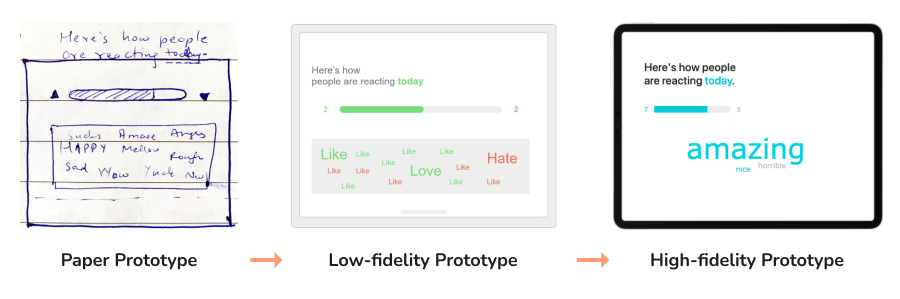{width=100%}

Moving further, high-fidelity prototypes mirror the end product closely in terms of design, interactions, and functionality. Making these require more time and resources to develop. There are a variety of tools freely available on the internet to collaboratively design high-fidelity user interface prototypes. Several options include:

- [Figma](https://www.figma.com/): A collaborative design tool often used for user interface design. Figma is entirely browser-based and includes many helpful design tools, adaptable templates, and allows for real-time collaboration.

- [Wondershare Mockitt](https://mockitt.wondershare.com/home.html): Similar to Figma, Mockitt includes a wide variety of design tools, but may be an easier platform to use for design beginners.

- [Quant-UX](https://www.quant-ux.com/): Quant-UX is an open-source design tool similar to the above platforms, but includes features that allow for usability testing and analysis.

:::activity
**Activity**

Mocking up a Mockup

Choose one of the above design tool platforms and create a free account. Walk through their getting-started steps to learn how to use the platform. If you find the platform confusing or limiting, try out another and compare. Also, visit design mockup websites such as [Dribbble](https://dribbble.com/) and [Behance](https://www.behance.net/) to search for creative inspiration on user interface design.
:::


### Evaluation and Iteration {-}

The next step of the HCD process is to evaluate how usable, accessible, and satisfying the initial web application design is for users. To do so, it is crucial to solicit feedback through user testing and evaluation. An effective method of evaluation is to have users test out a prototype of the design and give feedback on their experience.

#### Heuristic Evaluation {-}

Before bringing the users back in the loop, there is plenty of testing you can do yourself to ensure usability of your application. Heuristic evaluation is often considered as a fast and inexpensive method to highlight usability issues early on. The analysis can also be optionally done with users that may involve observing and taking more granular feedback. Following are 10 usability heuristics that can help you to quickly evaluate your application:

{width=100%} 
<details markdown='1'><summary>**More details on each Heuristic**</summary>
```{r table-simple, echo=FALSE, message=FALSE, warnings=FALSE, results='asis'}
require(pander)
panderOptions('table.split.table', Inf)
my.data <- "Heuristic | Description

Visibility of System Status | Keep users constantly updated on what the system is doing. Offer clear feedback on their actions and system responses promptly, ensuring they're always aware of the current state.

Match between System & Real World	| Speak the user's language and organize information in a way that mirrors how they think and operate in the real world. Use familiar terms and conventions to guide users through the interface seamlessly.

User Control & Feedback | Empower users to navigate the system with ease and confidence. Provide intuitive ways for users to backtrack or exit undesirable states or actions, giving them a sense of control and freedom over their interactions.

Consistency & Standards	| Maintain uniformity throughout the interface, ensuring that similar elements behave predictably and are represented consistently. Adhere to established design patterns and standards to create a cohesive and intuitive user experience.

Error Prevention | Design the system to anticipate and prevent user errors whenever possible. Implement safeguards such as confirmation dialogs to mitigate the risk of unintended actions and provide a safety net for users to catch mistakes before they happen.

Recognition rather than Recall | Present information and options in a way that reduces the cognitive load on users, minimizing the need for them to recall details from memory. Make relevant cues and instructions readily visible to guide users through their interactions effortlessly.

Flexibility & Efficiency of Use | Cater to users of varying skill levels by offering shortcuts or customization options to streamline their tasks. Allow users to tailor their experience to suit their preferences, making interactions more efficient and accommodating their individual needs.

Aesthetic & Minimalist Design	| Strive for simplicity and elegance in the interface, focusing on essential elements while eliminating unnecessary clutter. Create a visually pleasing environment that enhances usability by directing users' attention to what matters most.

Help Users with Errors | Communicate errors clearly and constructively, using plain language to explain the problem and offering actionable solutions to resolve it. Guide users through the error-recovery process smoothly, helping them troubleshoot and recover with confidence.

Help & Documentation | Provide accessible and user-friendly help resources for users seeking assistance. Offer clear, concise documentation that addresses common questions and concerns, empowering users to find answers and guidance whenever they need it."

df <- read.delim(textConnection(my.data),header=FALSE,sep="|",strip.white=TRUE,stringsAsFactors=FALSE)
names(df) <- unname(as.list(df[1,])) # put headers on
df <- df[-1,] # remove first row
row.names(df)<-NULL
pander(df, style = 'rmarkdown')
```
</br></details>

:::activity
**Activity**

Rapid-fire Heuristics Evaluation

Spend 5 minutes conducting a usability heuristics analysis on your preferred website or application, utilizing the provided heuristics. **Pay attention to the details.** Then, expand this exercise to another website, repeating the evaluation process. Look for similarities or differences between the two. For a deeper understanding, focus on applications similar to those you're interested in creating. 

This activity offers valuable insights into heuristic application and user experience, aiding in the enhancement of your own application design.
:::

#### Interviews & Surveys {-}

The best form of feedback is the one coming straight from your users. Evaluations can be conducted live by bringing a group of users together for in-person or remote interviews by having them think aloud as they navigate through your application. They could also share their qualitative feedback using a focus group setting. On the other hand, conducting online surveys can help gather quantitative feedback.

Across evaluations, it is important to administer a set of background questions to understand users' demographics, their roles or occupations, and their overall goals to understand how individuals across different contexts differ in how usable they find the web application. The questions users are asked should allow you to evaluate the extent to which the application meets established user needs and the extent to which the application is usable.

<details markdown='1'><summary>**Interviews**</summary>

Interviews demand thorough planning and execution, whether conducted face-to-face or remotely.

A helpful strategy is to structure questions logically. Begin with broader inquiries to encourage participants to think broadly. As the conversation progresses, gradually transition to more specific questions. When wrapping up, ensure there's space for open-ended inquiries, allowing participants to share anything not covered. Interviews include a range of questions covering the following aspects:

- Introduction: Background, primary responsibilities or tasks, ways to interact

- Needs & Pain Points: Main challenges, recent experience, frustrations, specific features

- Usage & Experience: Frequency, likes and dislikes

- Feedback: Rate overall satisfaction, improvements expected, anything else, likely to recommend?

These questions can serve as a starting point for conducting user interviews, but it's essential to adapt and refine them based on your application and the goals you have for the interview.

Furthermore, incentives can be essential for securing interview sign-ups. Consider consulting your organization or manager to explore potential compensation methods for participants' time.

</br></details>

<details markdown='1'><summary>**Surveys**</summary>

Surveys are generally the least resource-intensive method of evaluation. When designing a usability survey, it is crucial to ask questions that will shed light on how usable, enjoyable, and effective individuals find the tool. These surveys can include a mix of multiple-choice, ratings, and open-response questions. Examples include:

- What are your main objectives when using this tool? Were you able to meet those goals?

- What features do you use most?

- How easily navigable did you find the interface? Was it visually appealing?

- What would you like to see change (or stay the same) about the tool?

There are many online platforms to create surveys:

- Google Forms is a free, easy-to-use tool that allows for unlimited questions and offers a full range of question types. Google Forms will not analyze the data collected.

- Qualtrics is a more powerful tool for survey design and can generate a quantitative analysis of the data. Qualtrics includes a free option, however, there is a steeper learning curve to creating these surveys than a tool like Google Forms.

- Using printed sheets with survey questions can also work if the setup is in-person.
Based on the survey respondents and their level of comfort, their responses may need to be recorded anonymously.

</br></details>

:::pitfall
**Pitfall**

Neglecting IRB Guidelines

Beware of potential pitfalls when gathering feedback. Ensure that your chosen method aligns with IRB or institutional approval guidelines for research involving human subjects. Neglecting this could lead to privacy breaches or ethical concerns. Additional measures like encryption and secure data storage may be necessary to safeguard sensitive information. It's always good to check before proceeding.
:::

#### Iteration {-}

Following evaluation, you should revise the application accordingly, and re-evaluate and redesign until user needs are sufficiently satisfied. Constantly keeping in touch with stakeholders and users make it easier to design for them. Lastly, try accommodating as much feedback but don't let it come in the way of you from moving forward to the next steps.

## Good Design

Human-Centered Design (HCD) is all about putting users first, but at the end of the day, its core objective remains aligned with broader design principles.  Whether you stick strictly to HCD methods or embrace a more adaptable approach, the overarching goal is to produce designs of high caliber that really work for users. Ultimately, the aim is to deliver a positive user experience. The following are key attributes that are associated with good design:

{width=100%}

```{r table-simples, echo=FALSE, message=FALSE, warnings=FALSE, results='asis'}
require(pander)
panderOptions('table.split.table', Inf)
my.data <- "Attribute | Description

Useful | It must be original and meet a specific need

Usable | The application should be straightforward to navigate

Desirable | Images, branding, other elements should create an emotional connection

Findable | Content should be easy to find within the site and from external sources

Accessible | The content must be accessible to individuals with disabilities

Credible | Information provided should be trustworthy and believable to the user
"

df <- read.delim(textConnection(my.data),header=FALSE,sep="|",strip.white=TRUE,stringsAsFactors=FALSE)
names(df) <- unname(as.list(df[1,])) # put headers on
df <- df[-1,] # remove first row
row.names(df)<-NULL
pander(df, style = 'rmarkdown')
```

## Resources {-}

- [Stakeholder Engagement Toolkit for Evidence Building](https://www.datafoundation.org/stakeholder-engagement-toolkit-for-evidence-building-introduction) - The Data Foundation
- [How to create a persona](https://www.figma.com/resource-library/how-to-create-a-persona/) - Figma
- [Card Sorting: The Ultimate Guide](https://www.interaction-design.org/literature/article/the-pros-and-cons-of-card-sorting-in-ux-research) - Interaction Design Foundation
- [10 Usability Heuristics for User Interface Design](https://www.nngroup.com/articles/ten-usability-heuristics/) - Nielsen Norman Group
- [Design-Pattern Guidelines: Study Guide](https://www.nngroup.com/articles/design-pattern-guidelines/) - Nielsen Norman Group
- [How to Conduct Focus Groups](https://www.interaction-design.org/literature/article/how-to-conduct-focus-groups) - Interaction Design Foundation

<!--chapter:end:03-design.Rmd-->

---
---

# Spatial Data Wrangling 

:::objective
**Objectives**

In this module, you will:

* Introduction to spatial data concepts and operations
* Convert CSV lat/long to spatial points and geocode address
* Overlay points with boundary data, merge SDOH data, visualize as thematic map
* Gain insight into SDOH data resources
:::

You've spent some time visioning your project goals, breaking down specific needs, and connecting with potential users of the application. Once you've done these things, you're ready to take on the data at hand, and start wrangling.

What sort of data will you be working with? Some examples could include:

- **Resource or asset data**: This could be a spreadsheet of locations including their names, description, category, and address. For data wrangling, you'll want to set this dataset up as a .CSV format to start. This may be used as a primary dataset for an asset map.

- **Tabular, statisical, or "flat-file" data**: This could be a CSV, TXT, or XLSX format dataset filled with details on income, education, or housing estimates by county. It could be data on health outcomes, with each row corresponding to a different time point. You may have downloaded it directly from a data portal, or extracted from the Census. You may use this data for thematic maps, dashboards, and more.

- **Multi-media data**: This could be photographs, videos, or stories that you have geo-tagged to specific locations. It can be used for story maps, and more.

Because we're working with place-based SDOH data, that means learning how to handle *spatial data.* (This may involve converting non-spatial data to spatial data.) Working with spatial data is like working with regular data, plus entirely new dimensions. The data formats are different, and you'll need different tools to work with it. 

## Environment Setup

:::tools
**Tools**

*Download the Activity Datasets*

While you will use your own data for your project, practice with ours. Please download and unzip this file to get started: [SDOHPlace-DataWrangling.zip](https://github.com/healthyregions/sdohplace-toolkit/raw/main/data/SDOHPlace-DataWrangling.zip)
:::

Which computing environment should you work with spatial data? It's up to you — there are many options to choose from today. Our toolkit focuses on free and opensource tools, and/or tools that are widely available with low cost. In this chapter, we'll work with *QGIS*, *Excel*, and *GeoDa.* In the Appendix, you'll find the same activities using *R programming* scripts.

:::tools

**Tools**

For this module, you need the following installed on your machine. A recent, stable version is sufficient; note that versions will be updated regularly, so you'll need to learn to update, manage, and troubleshoot as you go. 

- **QGIS**: QGIS is a free, opensource geographic information system that can be used to create, map, and analyze geospatial data. Download QGIS [here](https://qgis.org/en/site/).
- **Excel**: Excel is a spreadsheet software that can store, organize, and analyze data sets. Use a free online version [here](https://www.microsoft.com/en-us/microsoft-365/free-productivity-apps#free-benefits).
- **GeoDa**: GeoDa is a free, opensource GIS tool, designed to be an introductory tool for spatial data science. Download GeoDa [here](https://geodacenter.github.io/).

If you prefer to code, or want to practice coding, go to the [Appendix]() to learn the same materials using the R Programming Language. 
:::


Throughout, you'll learn the tool you're using isn't as important as your ideas, concepts, and goals. You can merge data, run a buffer analysis, and make a map using ESRI, QGIS, R, Python, Spatial SQL or any other number of software or coding languages. Your goal is to learn what you want to do, understand why you need to do it, and learn & discover as you go.

That being said, data wrangling takes up **at least 80%** of a traditional GIS/spatial analysis project. Don't underestimate the time needed to resolve challenges, and practice patience.

### Installing & Working with Software {-}

All three software that you'll be introduced to have extensive documentation to help users understand the tools available to them and troubleshoot issues they come across. This documentation can be found [here](https://www.qgis.org/en/docs/index.html) for QGIS, [here](https://support.microsoft.com/en-us/excel) for Excel, and [here](https://geodacenter.github.io/documentation.html) for GeoDa.

In addition to these official documentation sources, search engines are your best friend. Gravitate toward answers on community-driven forums like [Stack Overflow](https://stackoverflow.com/) or [GIS Stack Exchange](https://gis.stackexchange.com/), because someone else will have likely experienced your problem before. Searching the issue you run into or the error message that you receive is likely to bring up a forum thread of people who worked to resolve the same issue.

:::tip

**Tip**

- If possible, it's best to copy/paste specific error messages (or "stack traces") from your software into search engines to find the most relevant result.
- *Google* tends to be the most common search engine used by developers, so may be most likely to give you the result you need.
- Sometimes information like local file paths or user names can be printed into error messages. Be sure to keep these out of content that you post to forums!
:::

Another important aspect in working with this software is file management. Decide before you start a project what your file management strategy will be, and where everything will be stored. Generally when you open a dataset in GIS software, you are only creating a pointer to the locally stored files, not copying the data into the project. This means that if a file gets moved mid-project, the software will be unable to access the data, and you'll have to re-add it to the project. Some file formats, like shapefiles, consist of multiple files that must always be kept in the same folder together. **A robust file management approach will save you time and frustration in the long run.**

:::tip
**Tip**

Mac users will need to override a security setting to download QGIS. Once you have installed QGIS, you will need to go to Security and Privacy in System Preferences. There, you will find a message that “1 GDAL Complete.pkg” was unable to be opened. Select “Open Anyway.” You may need to do this for multiple packages depending on the version of QGIS you download. 

If you still have issues opening QGIS after this, Stack Overflow is a great resource for troubleshooting GIS software issues.
:::

## Intro to Spatial Data 

Spatial data is essential for understanding the world around us, as it combines information with specific locations. This type of data is vital because it allows us to see how information changes with location. Without the geographical component, we're left with just a list, not a spatial analysis or map that can guide decisions or provide insights.

Understanding these aspects of spatial data is crucial, especially as we delve into more complex analyses. Whether it's navigating through the components of a shapefile or exploring data in R, having a grasp on these concepts can help tackle the challenges that come with spatial data analysis.

### Spatial Data Types {-}

Spatial data is generally divided into two broad categories: **vector** and **raster** data. Vector data holds "features" using points, lines, or polygons whereas raster data can be satellite imagery or other pixelated surfaces.

{width=70%}

We mainly use vector data for our purpose. For example, a group of clinics can be geocoded and converted to points, whereas zip code boundaries are represented as polygons. Note that spatial data is not just locations and shapes, but also attributes. So points on a map correspond to associated details for each clinic provider, and may also include fields like “name”, “services”, and more. 

For example, a park can be represented as a polygon or a point. Linked with each park, we can have information regarding their names, sizes, types of plants, open hours, and other various features. These attributes can be stored in a data table, along with their spatial inforamtion, in a shapefile, or a spatial file loaded in your R environment.

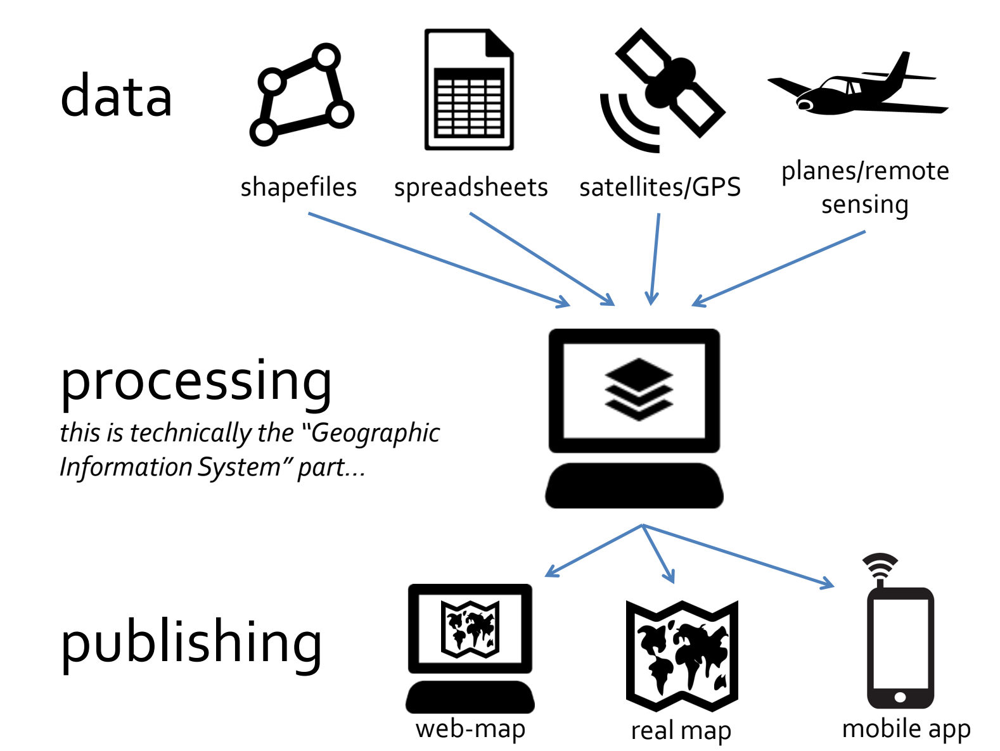{width=95%}

### More Types of Data {-}

While we focus on tabular spatial data in this introductory module, you may work with multiple types of data in your SDOH project that is linked to place. Another of thinking about this is considering spatial data as primary, secondary, or tertiary. In the following section, we will provide a brief description of each of these types of data.

<details markdown='1'><summary>**Primary Spatial Data**</summary>Primary spatial data refers to the data that you can collect either personally or through a sensor/machine which you or your stakeholders have previously installed. There are several examples of spatial visualizations of SDOH made with primary data. Some researchers have used online interviews or questionnaires to analyze their experiences in their neighborhood. Other researchers have placed sensors to map air quality in cities. The use of Global Positioning Systems (GPS) or smartphones is another way to generate primary data.</br></br></details>

<details markdown='1'><summary>**Secondary Spatial Data**</summary>You may encounter challenges when gathering SDOH primary spatial data, as it can be a time-consuming and costly endeavor. As a result, SDOH researchers, mapmakers, and advocates frequently turn to various secondary resources, such as spatial databases and census records, to inform their spatial representations. Typically, these files consist of digital layers that are prepared for seamless incorporation into a GIS or web mapping application. However, you can also work and manipulate non-spatial data in your project. Notable sources for such data include both profit and non-profit databases, government census information, and even digitized or scanned paper maps.</br></br></details>

<details markdown='1'><summary>**Tertiary Spatial Data**</summary>In the realm of SDOH spatial visualizations, there exists a third option–your map(s) may access other maps’ spatial data. Tertiary spatial data are spatial layers that have been previously or currently utilized in other cartographies and are readily accessible for integration into a Geographic Information System (GIS) or web mapping applications. When engaging with stakeholders experienced in health mapping, it's worth inquiring whether they possess any spatial layers that could prove beneficial for your project. </br></br></details>

It is key to emphasize that data can often be tainted by biases and errors. As a result, the methods used to gather, aggregate, or model spatial data can have adverse effects on the quality of our data visualizations. It is of utmost importance to meticulously scrutinize various forms of data, whether they are qualitative (e..g, interviews or questionnaires), quantitative (e.g., databases), or mixed (e.g., surveys). A valuable starting point for data analysis involves assessing metadata within databases or interview questions. Further insights into this subject will be explored in subsequent sections of this toolkit.

In your project, there's no need to limit yourself to just one kind of data. In fact, it's not only possible but often necessary to mix and match different sources and types of spatial data to craft compelling SDOH spatial visualizations.

:::activity

**Activity** 

Review these projects below and identify what type of data they use. In your opinion, what other types of data could they use to enrich their visualizations? 

[Using Asset Mapping to Identify Health Needs of a Latinx Population in Rural Virginia](https://scholarscompass.vcu.edu/cgi/viewcontent.cgi?article=1396&context=uresposters)
[US Social Determinants of Health Atlas - Map of the Month](https://carto.com/blog/visualizing-health-data-social-factors)
:::


### Spatial Data Formats {-}

Just like you may store text in an MS Word document or a PDF, there are many different formats used to store vector spatial data. Keep in mind that file extensions are very important -- it is often how people refer to different file formats.

Perhaps the simplest format is a comma-separated value, or **CSV**, file. This is a plain text format for table storage that can be opened and exported from MS Excel, or even just a simple text editor. What can make a CSV a "spatial" data format is the presence of columns that represent coordinate locations for each row in the table. These columns could be latitude, longitude coordinates, or a single column could hold a different coordinate format like Well-Known Text (WKT). A CSV file name will end in `.csv`, though you may also see `.tsv`, for "tab-separated values".

Another common spatial data format is the **shapefile**. A shapefile is actually a suite of multiple files, all with the same name but each with a different extension. There must be three files present at a minimum, `.shp`, `.shx`, `.dbf`, though typically you will have 4-7 files, other common extensions being `.prj`, `.cpg`, etc. These files must always be kept together, so make sure you zip up a shapefile if you are sending it to someone else!

We will also use a format called **GeoJSON**, `.geojson` or sometimes just `.json`, and you may also hear about GeoPackages, `.gpkg`, though we won't be using that format in this module.

|Format|Extension|Pros|Cons|
|---|---|---|---|
|CSV|`.csv`|Human-readable data<br/>Edit in MS Excel or text editor|Inefficient for large datasets|
|Shapefile|`.shp`<br/>`.shx`<br/>`.dbf`<br/>etc.|Robust and performant<br/>Can use any CRS|10-character attribute name limit<br/>Sidecar files can be confusing!|
|GeoJSON|`.geojson`|Human-readable data<br/>Edit in text editor|Inefficient for large datasets|

:::activity 

**Activity** 

*Open a Vector Data File in QGIS*

There are multiple ways to add a vector dataset to a QGIS project. First, open QGIS and create a blank document. Next, use one of these methods:
- Navigate to **Layer** > **Add Layer** > **Add Vector Layer**, and then find the `chicagotracts.shp` file in your file system.
- Use the Browser panel to navigate your file system, and drag `chicagotracts.shp` into the map view.
- In your standard file explorer, navigate to the `chicagotracts.shp` file, then drag and drop it directly into your QGIS project.
    - In your file system you will see all shapefile sidecar files, be sure to use the `.shp` file when you drag it into QGIS.

You will now see a new layer in your **Layers** panel. To "style" the layer (change the colors and symbols that are used to represent it), you can either:

- Right-click on the layer and choose **Properties...**, then go to the **Symbology** tab.
- Go to **View** > **Toolbars** and enable the **Layer Styling** toolbar.
    - This toolbar provides direct access to the symbology for the currently selected layer, no need to open the Properties window!

**Challenge**: Repeat the same activity using GeoDa, a spatial statistical software.

[*Open a Vector Data File in R*](https://toolkit.sdohplace.org//04-dataR.html#intro-to-spatial-data-1)
:::

:::activity 
**Activity** 

*Add a Basemap in QGIS*

The easiest way to add a basemap to your QGIS project is through the **QuickMapServices** plugin. To install this plugin:

1. Go to **Plugins** > **Install and Manage Plugins...**
2. Search for and select `QuickMapServices`
3. Click **Install**

Once installed, it's best to add the extra "contributed pack" to this plugin, in order to get more basemap options.

1. Go to **Web** > **QuickMapServices** > **Settings...**
2. Go to the **More services** tab, and click **Get contributed pack**

Depending on your version of QGIS you may have different base map options, but all versions should at least have OSM Standard. Select this to add the base map.

**Warning**: Do not use Google or Bing basemaps in published work, it is generally against their terms of service.

**Challenge**: Repeat the same activity using GeoDa, a spatial statistical software.
:::

## Coordinate Reference Systems

The “spatial” part of spatial data is coordinates. For example, you may have a dataset of hospitals: the location of each feature will be represented by a latitude/longitude coordinate pair. If you have a dataset of county boundaries, each corner, or "vertex" of every shape will be represented by a coordinate as well. The fact that spatial data stores coordinates is the only thing that makes it "special."

However, there are many different ways of storing coordinates (not only latitude/longitude as you may assume) which is what brings us to the concept of a “coordinate reference system” (CRS), which is exactly what it sounds like: a reference system for interpreting coordinates.

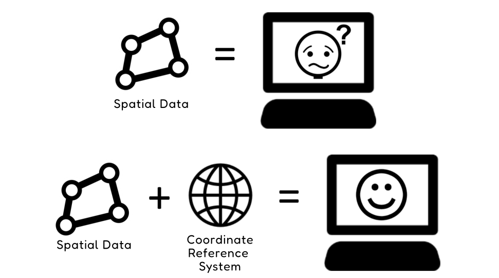{width=95%}

:::tip
**Tip**

*EPSG Codes*
In the 1980s the European Petroleum Survey Group began a registry of coordinate reference systems, and this database is now a standard registry: All common coordinate reference systems have their own EPSG code.
:::

There are two basic categories of coordinate reference systems: **Geographic (GCS)** and **Projected (PCS)**.

A **GCS** is fairly straightforward, because its coordinates are latitude/longitude "decimal degrees" that look like `44.0208693`, `-92.4841652`. There are just a few common geographic coordinate systems, and the only thing that differentiates them is a slightly different mathematical model of the globe, called a "datum". The most common one is **WGS84** (EPSG: 4326), though you may also see **NAD83** (EPSG: 4269), which is slightly more accurate for North America. For our purposes, we don't need to worry much about the difference between these two.

GeoJSON datasets should only store data in WGS84.

If you're not sure what CRS a latitude/longitude coordinate value is in a dataset you pulled from a data portal, there is a good chance it will be EPSG:4326! Once challenge with this CRS is that the distance is in degrees, not miles or kilometers. To use spatial data for distance or geometric calculations, you'll need to transform to a different CRS that that uses different unit of distance...

A **PCS** on other hand is “projected,” meaning that it is not only based on a datum, but on top of that it uses a **map projection**. Map projections are different methods for flattening the globe (or portions of it) so it can be displayed on a 2-dimensional plane (in other words, a map!). When a geospatial dataset is stored in a projected CRS, it doesn’t actually use latitude/longitude coordinates at all–it uses X/Y coordinates based on the flattened plane that the projection defines.

Robust spatial data formats, like Shapefiles and GeoPackages, are able to store data in any CRS, either geographic or projected.

:::tip

**Tip**

*Summary of Geographic vs. Projected CRS*

- A Geographic Coordinate Reference System interprets coordinates as latitude/longitude positions on the globe.
    - Units: degrees
    - Examples: **WGS84** (EPSG: 4326), **NAD83** (EPSG:4269)
- A Projected Coordinate Reference System interprets coordinates as x, y positions within a given map projection.
    - Units: feet or meters (defined by CRS)
    - Examples: **Web Mercator** (EPSG:3857), **NAD83 / UTM Zone 16** (EPSG: 26916), **NAD83 / Illinois East (ftUS)** (EPSG:3435)

**Always use a projected coordinate system if you are making any distance-related calculations on your spatial data.**
:::

#### Why use Projected Coordinate Reference Systems for Spatial Data? {-}

You may be wondering: Why isn’t all spatial data just stored as latitude/longitude coordinates? The short answer is simply “measurement.” In order to perform any geographic calculations--length of roads, area of districts, distance from hospitals, etc.--you will need to use a projected CRS.

This is because every CRS is defined by the units that its coordinates are stored in, meaning that if your CRS uses latitude/longitude coordinates (like WGS84) your units are degrees. However, degrees are terrible for distance measurements because, for example, one degree of longitude along the equator is 69 miles, but around Chicago it’s just 51.

A projected CRS, having flattened the Earth (or a portion of it) represents a grid system that is not based on degrees but on feet or meters. Therefore, the X/Y coordinates that a projected dataset stores are just the number of feet (or meters) away from the origin of the projection (like a Cartesian coordinate system in algebra). With your data in the appropriate projected CRS for your region, you are ready to make meaningful calculations.

:::tip
**Tip**

*Coordinate Reference Systems in QGIS*

QGIS applies coordinate reference systems at two different levels, and it is important to understand the difference between these levels.

- At the **individual layer level**, QGIS says: *What CRS should be used to interpret this particular dataset?*
Generally, a dataset will properly reports its CRS and no action is needed. However, you can right-click on a layer and use **Layer CRS >** to assign a different CRS to it. This does not change the underlying data, just how it is interpreted.
    - If a layer has no CRS assigned to it, a `?` symbol will appear next to its name and QGIS will default to interpreting is through the project-level CRS.
- At the **project level**, QGIS says: *What CRS should be used to display the layers in this project?* By default, QGIS will choose the CRS of the first layer that you add to a project.
    - You can change the project’s CRS in Project > Properties… > CRS, or through the small button in the bottom right that displays the current CRS.

As long as each layer’s CRS is correctly assigned, GIS software will properly align datasets with different coordinate reference systems, and even allow you to display those datasets in a different projection altogether.

**One of the most common problems people have with spatial data is not knowing what CRS to use with their data!**
:::

#### Common Projected Coordinate Reference Systems {-}

One projected CRS you are already used to seeing is a modern adaptation of the Mercator projection, commonly called **Web Mercator** (EPSG:3857). Every interactive web map--Google, Apple, Uber, Lyft, etc.--uses this projection, because it covers the whole world and has a handful of other advantages. However, this projection is not very good for calculations because it greatly magnifies the size of land masses as you approach the north and south pole.

Instead, we need to use a projected CRS that is designed for a smaller region within which our dataset is located. In the US we commonly use a series of projected CRSs called UTM Zones which are based on the NAD83 datum and the Universal Transverse Mercator projection, for example **NAD83 / UTM Zone 16** (EPSG: 26916) covers Chicago. Another common set of CRS definitions in the US is the State Plane series. Chicago sits within the area best covered by **NAD83 / Illinois East (ftUS)** (EPSG:3435). 

To find a CRS, we recommend using **Google** -- seriously! Google "EPSG Illinois ft" if you want to identify a CRS that is appropriate for the Chicago region as an example, and using an appropriate distance metric for further analysis. Doing this, you'll find that EPSG:3435 emerges as a top choice. 

:::activity 

**Activity** 

*Reproject Data in QGIS*

If you have spatial data that uses a geographic CRS, like a GeoJSON file, then you will need to transform or reproject that data to a projected CRS in order to use it for any distance-related spatial analysis. Try the following in QGIS:

1. Load the `chicagotracts` dataset by dragging and dropping the `chicagotracts.shp` file into a new blank document.
2. Right-click on the layer in the **Layers** panel.
    - Observe: In **Layer CRS**, QGIS has properly chosen EPSG:4326 (WGS84) to interpret this dataset.
    - Note: By clicking **Set to...** or **Set Layer CRS...** you can tell QGIS to use a different CRS for this layer. *No need to do this in this case!*
    - Choose: Click **Export > Save Features As...** to open the data save dialog box.
3. Pick ESRI Shapefile as the output format.
4. Browse to an appropriate folder and name your export `chicagotracts-3435`.
5. Use the CRS dropdown to select `NAD83 / Illinois East (ftUS)`.
    - If this CRS is not in the dropdown, use the Select CRS button to open a more detailed dialog box.
    - Filter for `NAD83 / Illinois East (ftUS)` and find the appropriate CRS in Projected > Universal Transverse Mercator...
6. Leave all other settings as they are, click **Ok** to save the dataset.
    - The new dataset will be in your selected CRS.
    
[*Reproject Data in R*](https://toolkit.sdohplace.org//04-dataR.html#coordinate-reference-systems-1)
:::

## Converting to Spatial Data

A common goal in SDOH research is to work address-level data, known as *points* or *events* (when considering time) in spatial analysis research. This could refer to resources in a community, . Before we can run any analytics on the resource location data, we need to convert resource addresses to spatial data points, which can be then used to calculate access metrics.

Locations, when measured as points, can include things like:

- **Health providers**: Hospitals, Clinics, Pharmacies, Mental health providers, Medication for opioid use disorder providers
- **Area resources**: Grocery stores & Supermarkets, Playgrounds, Daycare centers, Schools, Community centers
- **Area challenges**: Crime, Superfund sites, Pollution-emitting facilities

Points can also represent people, like individual patients residing in an area. Because individual locations for persons is protected health information, we’ll focus on point data as resources in the chapter. However, you can reuse the approach in this workshop to wrangle patient-level data the same way in a secure environment, under the guidance of your friendly IRB ethics board.

Let's start with an example where the spatial coordinate information has already been embedded within the data set as latitude and longitude information.

### CSV to Spatial Data

Comma separated (CSV) files are not a spatial data format. To be used for spatial analysis or mapping they will need to be converted to a spatial data format, such as a `GeoJSON` or `shapefile` data format. As long as a CSV contains spatial data like coordinates, GIS software should allow you to save CSV data as a new spatial data file. 

There are multiple options for converting CSV files to spatial data. For this type of conversion, you’ll want a CSV file with coordinate information (e.g. longitude and latitude) in separate fields. It's possible that coordinates recorded using a different CRS that is not long/lat, though we'll use a classical example here.

Your CSV may have:

- One field for **longitude** (which will be read as the **x** coordinate)
- One field for **latitude** ( which will be read as the **y** coordinate)

Using a GIS or coding platform, you'll assign the coordinate values and indicate the CRS being used. If you're not sure what the CRS is and it's a long/lat value, try EPSG:4326 as the most commont. You made need to troubleshoot if this is not the correct CRS for your dataset by inspecting documentation for the data. 

Always open a CSV to inspect it before trying to convert it. Verify longitude and latitude are in separate fields, and those fields are correctly labeled. Then, inspect afterwards! Make sure the points are plotting where you expect them. Common errors during this step is mixing up the long/lat, or assigning the wrong CRS.

:::activity
**Activity**

*Convert CSV to Spatial Data Format in QGIS*

<details markdown='1'><summary>**Step 1: Open a CSV File**</summary>
- Open your CSV file via Layer -> Add Layer -> Add Delimited Text Layer. We’ll use `Affordable_Rental_Housing_Developments.csv` for this exercise. 
- You will be prompted to indicate which fields in your CSV contain longitude and latitude (or some other X/Y coordinate system), as well as the CRS, which will likely (although not always!) be EPSG:4326 if not otherwise noted. Select the appropriate fields, then hit OK. 


- A map of your data will be generated. 

<br/></details>

<details markdown='1'><summary>**Step 2: Add a Basemap**</summary>

Add a basemap to inspect that your data has loaded properly. If you've mixed up longitude and latitude, your data points may be on the other side of the world!

<br/></details>

<details markdown='1'><summary>**Step 3: Save in a Spatial Data Format**</summary>

Right click the layer and go to Export -> Save Features As. When you select a file path, you will be prompted to select a file format. Select GeoJSON and the appropriate file path. Once you save, you should have a new GeoJSON file. You could have saved this file using any other spatial format, too!

 

<br/></details>

**Challenge:** Open a CSV as a spatial data file in GeoDa, then save as a shapefile.

[*Convert CSV to Spatial Data Format in R*](https://toolkit.sdohplace.org//04-dataR.html#convert-csvs-to-spatial-data-1)

:::

### Geocode Addresses

What if your original dataset only has addresses? In that case, you'll need to geocode your data to identify coordinates for spatial data transformation.

Addresses are not spatial data. They are real-world representations of spatial data, but GIS software will not be able to map them without further information. Geocoding is the process of converting addresses into geographic coordinates using a known coordinate reference system (CRS). We can then use these coordinates (ex. longitude, latitude) to spatially enable data. 

#### Using Topologies {-}

Geocoding services use [topologies](https://www.opengeomatics.ca/topology-and-geocoding.html#geocoding) to assign street addresses along streets. Different services have differing degrees of topology quality; some are updated regularly, and others may have fewer updates, so precision may not be the same. Many services will give you a match score to let you know how closely the address matched their information. 

How precise does your measure need to be? Do you want to reject matches with <90% uncertainty? Some services will not have this option available. If you're at a university or institutional setting, you may have access to geocoding services with more precise topologies, like ESRI or Google proprietary geocoding products. The examples used in this textbook use an open topology that will provide reasonable accuracy for many areas. 

:::tip
**Tip**

If you are geocoding [protected health information (PHI)](https://cphs.berkeley.edu/hipaa/hipaa18.html), you may not use web-based geocoding service. Check with your instution to access a server-based, offline, HIPPA-compliant geocoding service.  
:::

#### Data Preparation for Geocoding {-}

After determining the geocoding service you'll use, plan for an intensive data cleaning and preparation stage. Read the service documentatioon to understand how data must be formatted. You will likely need to split your address field as different address, city, state, and zip code values. 

Geocoding tools may be having an issue reading some addresses due to formatting issues in the CSV. Suite or apartment numbers, for example, may cause tools to be unable to geocode addresses. Only include the street address in the address column of your CSV. If you want to retain apartment or suite numbers, include them in a separate column in your CSV. Another common issue is an address being miswritten in your CSV file. 

Even something as small as an extra apostrophe can prevent an address from being geocoded properly. Many cities have also addresses that are duplicates or are very similar. Providing  the most information you can is the best way to resolve this issue. Geocoding tools can use street address, city, state, and country information to geocode addresses. If you do not already have all of this information in your original CSV, add it and try geocoding again.


:::activity

**Activity**

*Geocode with QGIS*

For this exercise, download `chicago_methadone_nogeometry.csv`, a data set of methadone centers in Chicago that only includes center names and addresses.

<details markdown='1'><summary>**Step 1: Geocode with MMQGIS**</summary>

To geocode addresses in QGIS, first you will need to install the plugin MMQGIS. Go to Plugins -> Manage and Install Plugins. Search MMQGIS, and install it. 

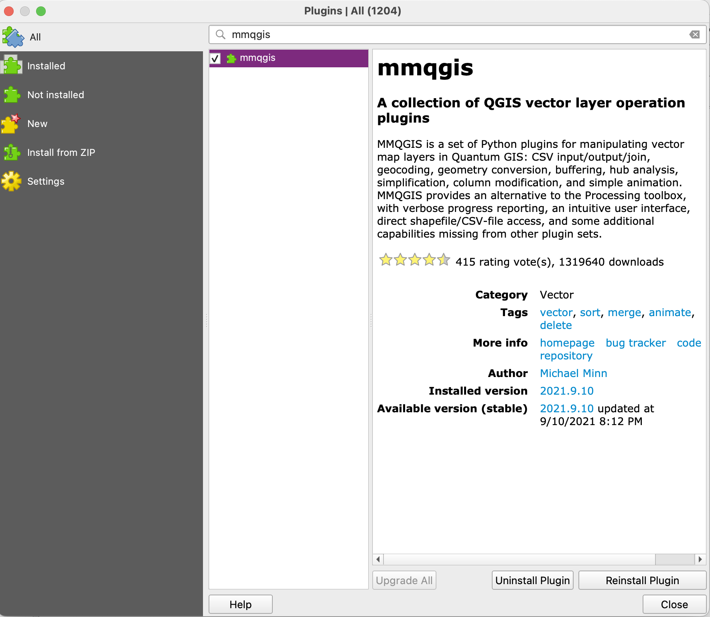 

Once installed, the plugin should be visible on the toolbar across the top. Select MMQGIS -> Geocode -> Geocode CSV with Web Service.

 

Upload your CSV file. Confirm the correct fields are being read, choose your web service (OpenStreetMap is the open source option), name your output files and select the file formats. Hit apply, and the addresses should appear as points, and a spatial data file should have been generated and appear on the left side of your screen as a new layer.


<br/></details>

<details markdown='1'><summary>**Step 2: Inspect your Data**</summary>

Once all your addresses are appearing, inspect them to ensure that everything has geocoded properly. Add a basemap to quickly visually inspect your data points. From the layers sidebar, right click your geocoded spatial data file and select Zoom to Layer(s). If any data points lie outside your expected spatial extent, this will quickly alert you to that issue. 

Inspect the layer attribute table to determine the source of any issues. Right click your geocoded layer and select Open Attribute Table. In addition to the information from your CSV, QGIS will have generated a few more pieces of information, including the full address and lat/long. Taking a look at this information for any points that did not properly geocode can help you discover where the issue may be in your original CSV. 

<br/></details>

Once everything has geocoded properly, you’ll have a spatial data file ready to use in other software.

[*Geocoding in R*](https://toolkit.sdohplace.org//04-dataR.html#geocode-addresses-1)

:::


## Merge data sets

Merging data sets is a vital skill for analyzing health data from an SDOH perspective. SDOH data and health data will often be in separate data sets, but use the same geographic scale, such as zip code or census tract. Being able to merge these kinds of data sets together using that scale is important to the ease of performing analysis with your data.

You will likely be merging data in flat files, like statistical datasets and Census records, to a spatial boundary corresponding to some administrative boundary. The new spatial dataset, a shapefile or GeoJson, is your master dataset that retains all of the original data, spatial boundaries, and new data you're merging in. 

Place literally serves as your "key" to join the data together.

### Reshape Data {-} 

Data sets often don’t come in GIS-friendly formats. Flat files may be separated vertically among multiple variables (long format) rather than horizontally along a single identifying variable (wide format). While long format is considered a standard for "tidy" data and the standard in epidemiological research, it's not efficient for GIS purposes. To merge data to boundaries for mapping and some spatial analysis, we'll have to reshape from long to wide format. Knowing how to reshape data efficiently will make you a master data wrangler.


You can use pivot tables in Excel to reshape your data, or your favorite coding approach. Reshaping data is a pain, but important for subsequent research! 

:::activity

**Activity**

*Long to Wide with Excel*

**File:** `COVID-19_Cases__Tests__and_Deaths_by_ZIP_Code.csv` 

To create a wide data set with the cumulative cases for each week for each zip code, create a pivot table in Excel. 

<details markdown='1'><summary>**Step 1: Create a Pivot Table**</summary>

- Open the CSV as an excel file, and open a new sheet. 
- Go to Insert -> Pivot Table. 
- Select the data you wish to include; in this case, we want the cumulative case data, so select columns A-F from the original excel sheet. 
- Make sure the pivot table will be placed in the new excel sheet, and hit OK. 

<br/></details>

<details markdown='1'><summary>**Step 2: Add Your Data**</summary>

The pivot table will open with the selected data, which can be sorted into rows, columns, values, and filters. 
- In this example, the zip codes should be our rows, so choose Zip Code from the selection and drag it into Rows. 
- We want our columns to be organized by week, so drag either Week Number, Week Start, or Week End into the Columns. 
- You’ll notice these variables split into multiple categories when dragged into a pivot table field. Use the information icon at the side of each category unwanted information. 
- Finally, drag Cases - Cumulative into the Values to fill out the table.

<br/></details>

<details markdown='1'><summary>**Step 3: Clean Up Your Table**</summary>

Pivot tables often generate columns and rows that are unnecessary for our purposes. These extra columns and rows could make it difficult for spatial software to read your CSV later.

- Use the drop down menu for Row Labels or Column Labels to remove any unwanted rows or columns, such as Grand totals and the first row that includes Sum of Cases and Column Labels.  
- Rename the column containing zip codes. 

<br/></details>

Your nearly completed pivot table will look something like this:

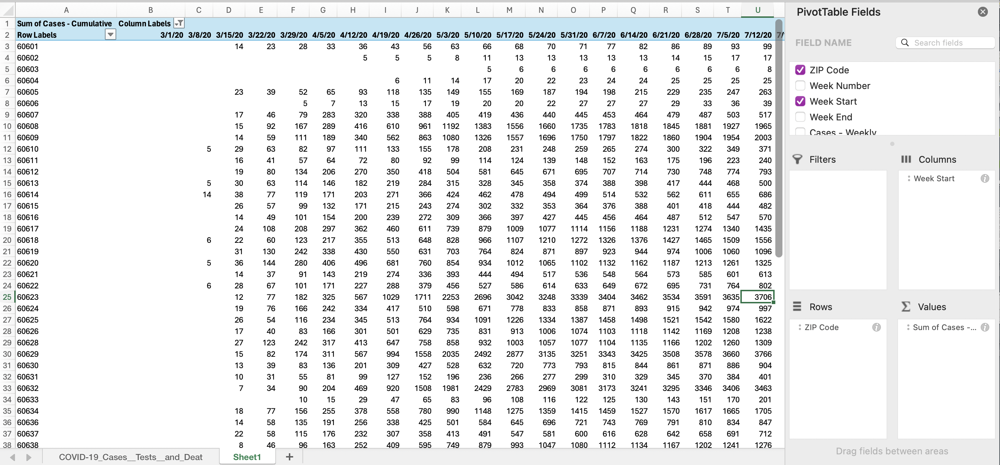

Update the column names to include the variable and date together for bonus points (ex. "Cases_050320"). Note that if you will later merge to a shapefile, you'll need to stick under 10 characters for variable names.

Save the sheet as a new CSV by going to File -> Save As. It's ready for merging!

**Note**: You can also select variables of interest as a subset of the data using QGIS or GeoDa.

[*Reshaping Data in R*](https://toolkit.sdohplace.org//04-dataR.html#reshape-data-1)
:::


### Join by Attribute {-}

One of the most common spatial data tasks is merging. First, we merge by attribute, meaning the "key" to join two datasets exists as an exising column name. That may be a zip code, neighborhood, or county ID. For this step, you want to ensure you have a 1:1 match, meaning that your flat file data includes data for each geographic area only once. If not, go back to the "reshape data" section, rinse, and repeat!


#### Geographic Identifiers {-}

You will come across data with various different boundaries, such as county, zip code, and census tracts. Each of these boundaries have a unique identification code. In the U.S., that could be a  Federal Information Processing System (FIPS) code, or numbers which uniquely identify geographic areas. These are types of **Geographic Identifiers**, also known as GEOID's for short. 

Some of the most common administrative/legal and statistical geographic entities with unique GEOIDs include states, counties, congressional districts, core based statistical areas (metropolitan and micropolitan areas), census tracts, block groups and census blocks. Sometimes a census tract may be identified by its full 11-digit FIPS code, and other times, the data provider may only include the last 6 digits.  Learn more about [GEOIDs at the U.S. Census](https://www.census.gov/programs-surveys/geography/guidance/geo-identifiers.html) for tips. Some cities, like New York and Chicago, have developed additional neighborhood boundaries that aggregate census tracts. 


#### Merging to Spatial Data {-}

To merge your data to a geographic area, you'll need to find the geographic spatial boundary or corresponding spatial data. You can search the Census for the specific area of interest, and select your year vintage (ex. "Illinois tracts in 2010"). You could also search using carefully selected keywords in your town's Data Portal (ex. "Chicago tract boundaries"), or using Google as a search engine (ex. "Milwaukee census tract .shp"). Note that tract boundaries changed in 2020 (and generally every decade), so learning how to work with a Census crosswalk may take more time and learning in your journey.

After inspecting your spatial dataset, ensure you know the GEOID of the variable that will be your key. Inspect the dataset you are joining, and identify the corresponding key. We recommend joining to the spatial dataset, not the other way around, to preserve data quality. Inspect any rows that were lost after joining during merges.

:::activity
**Activity**

*Merge SDOH data to Zip Codes in GeoDa*

Here, we’ll merge data sets with a common variable using GeoDa. Merging the cumulative case data set you created in the last section to zip code spatial data will allow you to map the case data. You’ll be merging the case data and spatial data using the zip codes field of each dataset. 

<details markdown='1'><summary>**Step 1: Clean Zip Code Data**</summary>

We've cleaned our covid case data already, but you’ll notice that the zip codes are repeated in the zip code data set, and needs to be cleaned before we can continue with merging the data. 

- Select one row for each zip code and save the selection as a new geojson, ChiZipCleaned. 

You’ll notice that two zip codes have repeats that are not exactly alike. This is because these two zip codes have small exclaves, and so are listed separately since they are separate polygons. However, having the repeated zip code will create problems when merging the data, and the exclaves are small enough not to be relevant for our analysis. Only choose the rows with a larger area for these two zip codes.

<br/></details>

<details markdown='1'><summary>**Step 2: Merge Data**</summary>

- Open ChiZipCleaned.geojson. 
- Go to Table -> Merge. 
- Select the cumulative case data set. 
- Under parameters, select Merge by key values, with zip selected for current table key and Zip Code selected for import table key. 
- Move over all data columns you want to see in this merged data set.

Tip: you do not need to include Zip Code since this field is being used to merge the two data sets, including it will only duplicate zip codes in the resulting data set.


<br/></details>

**Challenge:** Do the same process using QGIS.

[*Merge by Attribute in R*](https://toolkit.sdohplace.org//04-dataR.html#join-by-attribute-1)
:::


:::tip
**Tip**

*Using Zip Codes* 

Zip codes are often the smallest area resolution available for many health researchers, due to privacy concerns. However, zip codes correspond to postal service routes, are not meaningful administrqtive units, and can mask data insights at the neighborhood level as a result. Associations that may appear if using tract-level data could be hidden at the zip code level. Be careful, and understand your limitations!

The Census provides Zip Code Tabulation Areas (ZCTAs), which are similar to but not exactly the 5-digit Zip Codes people think of when referencing their postal address. Furthermore, full 9-digit Zip Codes change regularly. For precision, consider using the [HUD Crosswalk](https://www.huduser.gov/portal/datasets/usps_crosswalk.html) to transform your zip code year to a census tract. 
:::


### Join by Location {-}

Sometimes, you won't have a boundary key! How will you know which parks fall into which census tract? Or what about selecting neighborhoods with commuter train infrastructure?

A spatial join is defined as merging data based on location. Both datasets are spatially enabled, and likely overlap each other. The data from one dataset (that you're joining) gets "stuck" to the dataset you're merging to. Both data should be in the same CRS.

Add spatial joins to data to analyze the relationships data sets may have with each other. This tool allows you to merge certain aspects of data sets, such as joining descriptive statistics about one data sets relation to the other.

:::activity
**Activity**

*Add a Spatial Join*

We’ll create a spatial join with affordable housing development data and ChiZipCleaned.geojson. In this case, we’ll add the number of affordable housing developments in each zip code to the zip code data set.

<details markdown='1'><summary>**Step 1: Join Attributes**</summary>

Go to Processing -> Toolbox and search for Join Attributes. For this exercise, select Join attributes by location (summary). Set the following parameters:


These parameters are set on the premise that we want a count of the affordable housing developments contained within each zip code. A new joined layer will be mapped on top of your current layers. 

<br/></details>

<details markdown='1'><summary>**Step 2: Map the Joined Data**</summary>

The new layer generated by the spatial join will default to a single symbol map, not providing any useful visual information about the spatial join.

- Change the symbology by right clicking and going to Properties -> Symbology.
- Change the symbology from Single Symbol to Graduated with the value Community Area Name_count. 

Try changing the color ramp, mode, and number of classes. The resulting joined layer may look similar to the one below.


*Note: In order for null values to appear, you may need to first set symbology to graduated colors, then change it to Rule-based. Add a field with the rule set to Else rather than Filter. Then change colors and arrange as you wish.* 

<br/></details>

[*Merge by Location in R*](https://toolkit.sdohplace.org//04-dataR.html#join-by-location-1)
:::

:::pitfall
**Pitfall**

*Invalid Geometries*

In the example above, Zip code 60655 has an enclave not included in the Chicago city limits, and you may have a technical issue with that enclave when moving between GeoDa and QGIS with the newly cleaned Chicago zip code data that causes an Invalid Geometry error when conducting a spatial join. Since the zip code in question has no affiliated affordable housing developments, in this case we’ll set the Invalid feature filter, found under the layer’s Advanced Options when creating the spatial join, to skip features with invalid geometries.
:::

## Inspect Data 

Inspect data, both through spatial and non-spatial means, when starting a new project, after each step of data processing, and when complete. That means all the time! This helps verify that all data wrangling to this point has occurred properly. 

In the next module, we'll dive into the details of this further, moving past inspection to cartography anddata analytics.

### Thematic Maps {-}

To inspect data from a spatial perspective, create a series of choropleth maps. A choropleth map is a thematic map that utilizes shades, textures, and colors to depict data values in specific geographic areas. Choropleth maps are useful for rapidly discerning spatial data patterns. However, these patterns may vary depending on the chosen data classification method.

### Map Overlay {-}

Overlay multiple data sets to investigate how they correspond to one another. Open the data sets you are interested in and order your layers appropriately to get an initial view of potential relationships between data sets.

:::activity
**Inspect Data with Different Methods**

<details markdown='1'><summary>**Generate Choropleth Maps in GeoDa**</summary>

Open ChiZipCleaned.geojson. From the Map option on the toolbar, you can select a variety of choropleth map options using different variables or breaks for your data. 

Select a mapping method and a variable to map. Inspect your data by comparing how different data break methods present the same variables, and how the spatial patterns of different variables compare. 


<br/></details>

<details markdown='1'><summary>**Overlay Data in GeoDa**</summary>

With the Chicago zip code data already loaded in GeoDa, add a layer of point data with Affordable_Rental_Housing_Developments.csv. 

- From the map view, select Add Map Layer. 
- Select the affordable housing data set, set the lat/long fields, and hit OK. 
- If you do not see the housing data, go to Map Layer Settings. Make sure the layer is turned on and ordered first.

Once you add it to one map, you should be able to find it as a layer in each subsequent map you make with these data sets for the duration of your mapping session.

Note: the first row does not have lat/long data and may impede GeoDa from mapping the rest of the affordable housing data set. If you have this problem, try removing this row from the CSV.

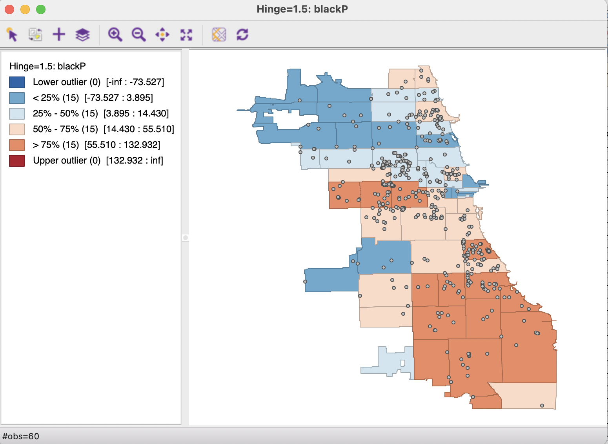

<br/></details>

<details markdown='1'><summary>**Overlay Data in QGIS**</summary>

Let’s overlay zip code boundary data with affordable housing point data.

- Load ChiZipCleaned.geojson into QGIS. 
- Add Affordable_Rental_Housing _Development.csv by going to Layer -> Add Layer-> Delimited Text Layer.
- Navigate to the file, and ensure all fields indicate the correct data source in order to display the data properly.

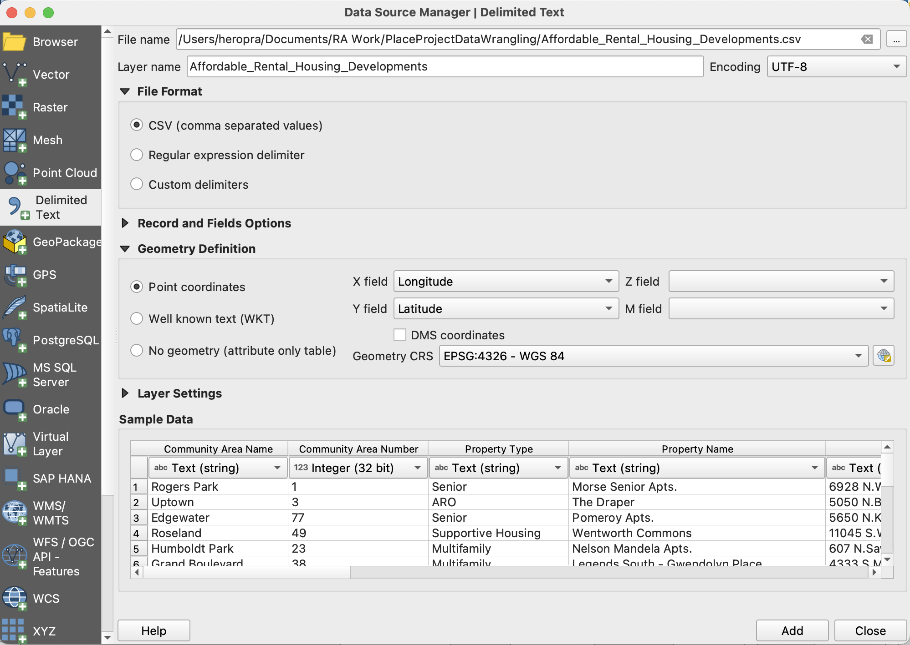

Adjust the color, transparency, size, and borders of each layer by right clicking the layer and going to Styles -> Edit Symbol. The affordable housing data can also be saved as a spatial data set at this point, by right clicking on the layer and navigating to Save Features As. 

<br/></details>

[*Inspection in R*](https://toolkit.sdohplace.org//04-dataR.html#inspect-data-1)

:::

## Finding Data

In this module, we provided sample data to work with. When you're looking for your own data to integrate, you'll need to do some research to find what you need. Here are some tips of places to search:

- City, County, and State Data Portals. Look for your area of interest using search terms like "tracts" or "zip code" to find aggregate data ready for joining.

- The Social Vulnerability Index dataset by CDC includes cleaned American Community Survey that is easy to extract and merge with your spatial data.

- While U.S. Census data is available at Census.gov, finding data may be more efficient using third party platforms like IPUMS/NHGIS or Social Explorer. We also recommend the tidycensus package in R (see Appendix Resources for details).

- Additional aggregated products to check out include: EJScreen, the City Health Dashboard, County Health Rankings, the Opportunity Atlas, the Neighborhood Atlas, and more.

- Learning how to use the "turbo-pass" Open Street Map plugin in QGIS, or R corresponding library, will give you access to a public version of digitized infrastructure (e.g. streets, parks) and resources (e.g. supermarkets, schools) across the globe. Some areas have better coverage than others.

When determining which data to include, consider using a conceptual model to guide your variable selection. The socio-ecological model of health or risk environment models, for example, identify specific indicators that you may want to fold in.

## Resources {-}

- https://www.opengeomatics.ca/topology-and-geocoding.html#geocoding 

<!--chapter:end:04-data.Rmd-->

---
---

# Research Design & Analysis

:::objective
**Objectives**

In this module, you will: 

- Gain insight into the different spatial analysis techniques applicable to SDOOH research
- Delve into potential pitfalls and limitations in spatial analysis of SDOH data
- Identify cartographic design principles for effective communication

:::

Spatial analysis and design mapping techniques have become indispensable tools in the study of Social Determinants of Health (SDOH).  This module provides an overview of spatial analysis methods in the SDOH context, highlighting common pitfalls and best practices in cartographic design. By understanding how health outcomes geographically correlate with socioeconomic and environmental factors, we can identify health disparities and guide effective interventions. Additionally, we'll then examine the limitations and challenges of spatial analysis in the SDOH context.

Finally, the module will focus on cartographic design principles, stressing the importance of effectively communicating through maps. We will delve into using color schemes, symbology, and other mapping elements to accurately present and visually enhance spatial data related to SDOH.

:::tools
**Tools**

*Download the Activity Datasets*

While you will use your own data for your project, practice with ours. Please download and unzip this file to get started: [SDOHPlace-ResearchDesignAnalysis.zip](https://github.com/healthyregions/sdohplace-toolkit/blob/main/data/SDOHPlace-ResearchDesignAnalysis.zip)

This dataset includes data prepped and merged in the previous module.
:::

## Research Design

You've got data, a goal, and an app on the horizon -- How can you ensure that your understanding of the data is accurate, complete, and representational? Do you need to transform your data into new variables to get a better picture first? Do you need to visualize your data in new ways, or prepare for a more advanced analytical model? 

There are multiple pitfalls you'll want to avoid when design your analysis. In the following overview of **Mindsets & Spatial Reasoning,** spatial data scientist [Julia Koschinsky](https://spatial.uchicago.edu/directory/Julia-Koschinsky) reviews how to think about the process of analyzing data and how to set up the problem and research design. 

```{r table-pitfalls, echo=FALSE, message=FALSE, warnings=FALSE, results='asis'}
require(pander)
panderOptions('table.split.table', Inf)
my.data <- "  Move Away From        | Move Towards
  **Confirmation Bias:** Looking to confirm pre-existing beliefs with data | Expect that, as humans, we’ll be fooling ourselves.Focus on finding what’s wrong.
  Maps and spatial analysis will confirm the expected, which is fine … | … but what is more interesting is to discover something unexpected, something surprising, beyond what we already knew before we started the analysis. What is the added value of doing the spatial analysis?
  **Fixed mindset:** Only technical people can learn spatial data analysis | **Growth mindset:** Class and toolkit assumes that everyone can learn this
  Inductive or deductive reasoning, or 'data-driven' or 'model-driven' thinking that lets the data speak on its own. | Exploratory Spatial Data Analysis & Spatial Reasoning as abductive/iterative reasoning. These approaches go back and forth between potential explanations and evidence to update both in lockstep.
  Focus on description, for ex., where’s the cluster or access gap? | Focus on explanation and falsification: Why is the cluster there? Is the cluster real (not random)?
  Analyzing data with a classic exploratory or temporal analysis, ignoring the spatial dimension even though it’s relevant. | Spatial methods to explicitly analyze location, distance, and spatial interaction
  Assuming maps are always objective | Recognizing that maps are often used to exercise power and to manipulate.."
set.caption("")
df <- read.delim(textConnection(my.data),header=FALSE,sep="|",strip.white=TRUE,stringsAsFactors=FALSE)
names(df) <- unname(as.list(df[1,])) # put headers on
df <- df[-1,] # remove first row
row.names(df)<-NULL
pander(df, style = 'rmarkdown')
```


Correlation is not causation. A good exploratory data analysis, however, can help you gather evidence and make a case for next steps. What are some considerations for your research design? 

- **Data Integrations:** Do you have the right data combined and harmonized for analysis & viewing? 

- **Spatial Scale:** What is the scale of the phenomenon you are trying to understand -- and the scale of your data? If they're not the same, be careful of making errors in interpretation. 

- **New Variable Calculations:** Do you need to generate new measures that may be more precise? 

- **Data Limitations:** How was the data you have collected? Are there any biases or issued you need to consider when interpreting findings? What's missing?  

- **Methodologies Used:** Most methods will return some result -- that doesn't make them the correct or useful. Are you using the right methods for your data, and that also address data limitations?

- **Model Interpretation:** Did you interpret your results with data, scale, and methodological considerations in mind? For example, be weary of drawing conclusions on individuals from population-level data. That's the [ecological fallacy](https://mgimond.github.io/Spatial/pitfalls-to-avoid.html#ecological-fallacy).

::: pitfall

**Potential Pitfall**

The **Modifiable Areal Unit Problem (MAUP)** is a significant issue in spatial analysis that arises when results of statistical analysis are affected by the scale or the zoning of the area units used in the study. Essentially, it reflects the idea that the same set of data can lead to different conclusions depending on how the data is grouped geographically. 

This problem is particularly relevant in disciplines like geography, epidemiology, and urban planning. For a deeper understanding of MAUP, its implications, and strategies to mitigate its effects, [here's a comprehensive resource](https://gisgeography.com/maup-modifiable-areal-unit-problem/) that offers detailed insights. You may also watch this informative [video](https://uchicago.hosted.panopto.com/Panopto/Pages/Viewer.aspx?id=512fd409-0b51-4d24-b43e-b1030168712b) from GIS Librarian [Robert C. Shepard](https://www.lib.uchicago.edu/about/news/meet-rob-shepard-new-gis-librarian/) from University of Chicago. 

:::

## Defining your Position

In exploring cartography and spatial analysis, it's crucial to challenge their perceived objectivity. Traditionally viewed as neutral tools, unaffected by the biases of their creators, recent studies, especially from feminist and global South perspectives, have started to challenge this view. They reveal how data often overlooks marginalized communities, how maps can perpetuate colonialist views, and how the choice of colors and symbols might oversimplify diverse human experiences.

Therefore, it's essential to rethink our approach to maps and analyses, recognizing that they are not impartial mirrors of reality. When conducting analyses or creating maps, we should ask ourselves critical questions: Who is collecting the data I use, and for what purpose? Which narratives are my analyses emphasizing? Whose interests does the software I use serve – is it a commercial product or open-source? How do factors like our gender, race, ethnicity, economic status, sexuality, and nationality influence our approach to cartography?

A way forward involves examining our privileges, recognizing the types of discrimination we face—or don’t face—and considering how our experiences influence our mapping efforts. Listening becomes a crucial skill. Mapping should go beyond mere argumentation and become a tool for inquiry. We must critically examine our own maps and data, paying attention to who is represented and, importantly, who is left out. Engaging with stakeholders is a key part of this process.

Additionally, we should strive to give a voice within our analyses to those directly impacted by our maps rather than speaking for them. Being mindful of our cartographic language is vital; like words, maps convey narratives.

::: tip

**Tip**

Take time to reflect on these points and jot them down in your journal. Regularly revisit these thoughts and refer back to Module 1 of this toolkit, recognizing that mapping is an evolving, iterative process.
:::

### Reflective Mapping

Remember, mapping is more than just inputting data into software; it involves thoughtful reflection. This process should take into consideration the context and significance of the data, ensuring that your maps tell an accurate and meaningful story. By carefully selecting and analyzing your variables, and critically examining the resulting spatial patterns, your maps can become powerful tools for understanding and communicating complex social and health-related phenomena.

In modern spatial epidemiology, it’s critical to not take associations at face value. For instance, health disparities are often driven not by race itself but by systemic racism. Analyzing only a specific racial or ethnic group isn’t sufficient. Thus, investigating a multitude of variables and cultivating a curiosity to understand these complex intersections is crucial for meaningful knowledge discovery. This approach allows for a more nuanced understanding of the interplay between various factors and health outcomes, ultimately contributing to more effective public health strategies and interventions.


## Calculating Spatial Variables

While the previous module focused on spatial data wrangling techniques to develop new harmonized datasets and variables, there are many more approaches to refining measurements of the environment. 

For example, spatial access to a resource can be calculated using multiple approaches. Let's consider approximating a neighborhood as a census tract. Access to the resource could be measured as:

- Total number of resources within the census tract
- Total number of resources within a mile of the census tract
- Total number of mile-wide resource buffers intersecting the tract
- Percentage of the census tract covered by a mile-wide resource buffer
- Drive, bike, or walk time from the center of tract to nearest resource
- Total number of resources within a mile per 1,000 people in the census tract
- Gravity model score measuring spatial access to resoure using a distance decay function, total capacity at resource, and population in demand

Which one is best? It will depend the data available, your skills and interest in calculations, and more importantly, the underlying phenomenon of interest. How often do persons access the resource? What travel behavior is used? 

For density based measures (like total number of resources per area), use the spatial join function froom the last module, and summarize by area. This is also termed as a "point in polygon" operation. For additional proximity-based metrics like buffer and distance calculations, read on. For more complex access modeling techniques, check out the advanced metric resources at the end of the module.

### Buffers

Creating buffers and calculating distances are vital techniques for understanding relationships between geographic features and identifying potential spatial patterns or associations.

Buffers are polygons created at a specified distance around input features, like points, lines, or other polygons. They are useful for analyzing the proximity of health-related phenomena to specific locations.

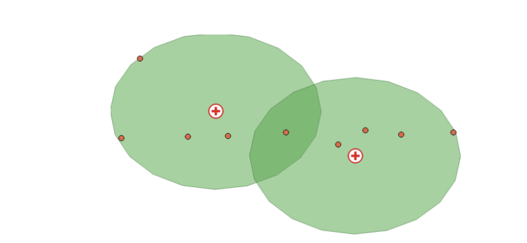


For example, you can create a buffer of a half-mile radius around a public health clinic to analyze the census tracts within that area. Another application is generating a buffer around a hospital to identify the population within a certain distance or assessing the impact of pollution from a factory on nearby schools or residential areas.

To create a buffer in GIS software or coding, you specify a fixed or variable distance value. Fixed-distance buffers are constant radius polygons around input features, while variable-distance buffers can vary based on an attribute value.

::: activity

**Activity**

*Buffer Analyses: Calculate Farmers Market Service Areas*

Grab the data for this activity and the following ones [here](https://github.com/healthyregions/sdohplace-toolkit/blob/main/data/SDOHPlace-ResearchDesignAnalysis.zip).

This activity focuses on utilizing data from Chicago's farmers' markets, specifically the `farmers_markets_2012` dataset. Farmers' markets are vital for health and well-being, providing access to fresh, locally-grown produce and supporting sustainable food systems. They offer diverse, nutritious food options, often at affordable prices, and foster community connections and local agriculture support. The presence and density of farmers' markets in a neighborhood significantly influence residents' food accessibility.

<details markdown='1'><summary>Start a New Project </summary>

- Open QGIS and create a new project. Save it as “Chicago Farmers Markets 2012”.
- Add the shapefile: `farmers_markets_2012.shp`.

</br></br></details>

<details markdown='1'><summary>Creating Buffers</summary>

- Go to the Vector menu > Geoprocessing Tools > Buffer(s).

- In the dialog box, choose "farmers_markets_2012" as the input layer.Ensure you are using the correct Coordinate Reference System (CRS).

- Enter the buffer distance (e.g., 0.5 miles) and select the appropriate unit from the Unit drop-down menu.

- *Tip:* The distance unit is based on the CRS of the input layer. If you're not using the correct CRS, the default unit may be in degrees. Refer to Module 4 if you encounter issues.

- Keep default settings for segments, join style, and miter limit. Initially, leave the "dissolve result" box unchecked to maintain separate buffer zones.

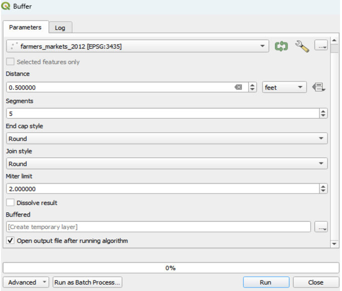

</br></br></details>


<details markdown='1'><summary>Running the Buffer Tool</summary>

- Click "Run" to execute the Buffer tool. A new buffered layer is added to your project.
- In the Layers Panel, arrange the point feature (farmers markets) above the buffered polygon for better visualization.
- *Tip:* Observe how the buffers overlap or remain separate, depending on the distance you chose.

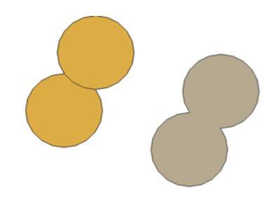

</br></br></details>


<details markdown='1'><summary>Dissolving Overlapping Areas</summary>

- -Reopen the Buffer dialog box, go to Parameters, and check the box for "dissolve result".
- Click "Run" again. A new layer with dissolved overlapping areas is added.
- Close the Buffer dialog box.
- Remove the initial overlapping buffer layer and keep the dissolved buffer layer to organize your layers
- *Tip*: Organize your layers for clarity, such as renaming layers, removing unwanted ones, or toggling layer visibility.

</br></br></details>

Through this activity, you will understand the spatial distribution of farmers' markets in Chicago and their impact radius, which is crucial for assessing community access to fresh food. The buffer analysis illustrates the physical reach of these markets, offering insights into potential areas needing more access to fresh produce.

::: 

### Nearest Resource
Calculating distances involves measuring straight-line (Euclidean) or network (along paths or roads) distances between features.In health geographies, this might include assessing accessibility to healthcare facilities or analyzing the spatial distribution of disease cases relative to risk factors. Examples include calculating the Euclidean distance from residential locations to the nearest healthcare facility or measuring the network distance along roads to determine travel time to hospitals. 

It’s important to choose the right measurement method (Euclidean or network) based on the research question and the nature of the features.

::: activity

**Activity** 

*Minimum Distance Calculations*

In this part of the exercise, we're interested in determining the straight-line distance from residential locations, such as census tracts, to the nearest farmers market. The "Distance to nearest hub (line to hub)" tool in QGIS can be used to calculate the distance between the center of an origin feature (e.g., centroids of Census Tracts) and its nearest destination feature (e.g., farmers market).


<details markdown='1'><summary>Accessing the Tool</summary>

- In QGIS, open the Toolbox by going to Processing.
- Search for and select "Distance to Nearest Hub (line to hub)" under Vector analysis.


</br></br></details>

<details markdown='1'><summary>Setting Up the Tool</summary> 

- In the processing dialog box, set "Source Point layer" to "Chicgotracts_Centroids".
- For "Destination hubs layer", select "farmer’s market_2012".
- Choose your preferred measurement unit (e.g., miles) in the "Measurement unit" field.
- Leave other settings as default.

</br></br></details>


<details markdown='1'><summary>Running the Tool</summary> 

- Click "Run". A new layer ("hub distance") will be added to your project. Close the dialogue box.
- Open the attribute table of the new layer to view the computed hub distances (HubDist).
      


</br></br></details>

<details markdown='1'><summary>Analyzing Access to Facilities</summary> 

- Examine the attribute table to identify if there are any facilities (e.g., farmers markets) that lack good access. Consider the implications of these findings for community access to fresh produce.
    
</br></br></details>

<details markdown='1'><summary>Using Extract within Distance Tool</summary> 

- Another useful tool is the "Extract within distance" under vector selection in the geoprocessing toolbox.
- This can be used to extract tract centroids that are within a specified maximum distance (e.g., 1 mile) from the input features (e.g., farmers markets).

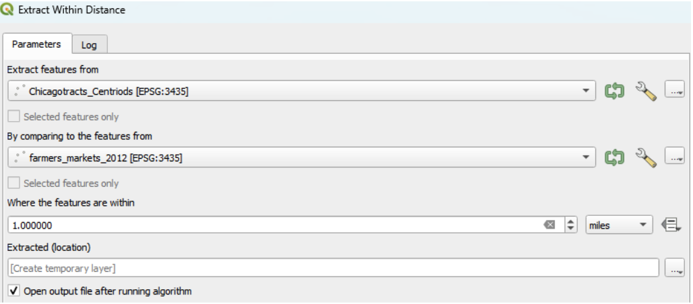

</br></br></details>

Through these exercises, you will gain insights into the accessibility of fresh produce from various residential areas in Chicago, which is crucial for understanding the availability of healthy food options across the city. This analysis can inform urban planning and policy decisions to improve access to essential amenities like farmers markets.

:::


## Exploratory Data Analysis 

Exploratory Data Analysis (EDA) serves as the compass for spatial analysts navigating through the vast seas of data. It's a pivotal phase in your analytical journey, akin to charting a course before setting sail. EDA illuminates the landscape of spatial datasets, revealing patterns, anomalies, and relationships that might otherwise remain hidden. Through visualizations, statistical summaries, and spatial queries, analysts delve into the intricacies of the data, unraveling its mysteries and gaining insights that inform subsequent spatial analyses and decision-making processes. In essence, EDA is the compass that guides spatial analysts in their quest to uncover the hidden treasures buried within geographic information.

Exploratory *Spatial* Data Analysis includes techniques to describe and visualize spatial distributions, identify non-typical locations (known as spatial outliers), discover patterns of spatial association (e.g. spatial clusters) and suggest different spatial "regimes" and other forms of spatial non-stationarity. 

Each spatial pattern has a different story, or phenomenon driving its pattern. A polluting factory may influene someone's health who is living across the street, based on proximity -- in spatial terms, this may be a pattern of **spatial dependence**. Alternatively, or in addition to, residents near polluting sources may be more likely to have lower incomes based on complex, decades-long deinvestment processes, resulting in **spatially heterogenous** distribution of health outcomes.

By exploring the data available to us, we can begin to understand what those drivers are -- or at the very least, rule some out, and update our thinking. Because our brains our wired to find patterns (even if they're not there), we can use math and good research design gather evidence.

### Univariate and Bivariate Analyses

A solid EDA/ESDA approach starts with one (univariate) or two (bivariate) variables at a time. The data views we take may be non-spatial, setting up classical figures and charts, and/or spatial, using thematic mapping techniques. We'll highlight some approaches here, but recommend a deeper dive with a standard statistics course. Here are some things to look for:

- **Descriptive statistcs**: Summarize data as tables, calculating population summaries, total number of areal units included, and include testing statistics. Stratify by different spatial regimes (e.g. urban vs rural) or groupings (quantiles), as they are uncovered in later analyses. Follow STROBE reporting guidelines for summaries (e.g. median and IQR vs. average and SD). Beware of missing data, so report data included in your tables and notes.
- **Visualize your data**: It goes without saying, but we must -- visualize your data! Examine histograms, scatter plots, thematic maps, and more and explore relationships. Software like *GeoDa* was designed for brushing and linking to explore trends further.
- **Models at the End**: Avoid working with biased data and mis-specified models by waiting to run your regression & other anlaytical models. Ensure your data is high quality and at least understand the limitations and biases. In traditional EDA, a confirmatory analysis follows.

First let's explore scatter plots as a classic approach, and then dive into spatial data with statistical mapping techniques. 

#### Scatter Plots

Scatter plots are invaluable for visualizing relationships between Scatter plots can uncover possible correlations (both positive and negative) or patterns between socioeconomic factors and health indicators.

**Understanding Correlations in Scatter Plots**

- *Positive Correlation:* This is observed when data points in a scatter plot align along an upward diagonal line. It suggests that as one variable increases, the other variable tends to increase as well.

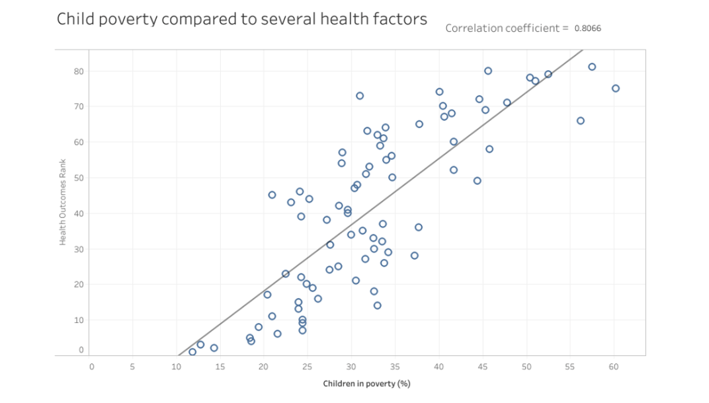


- *Negative Correlation:* Seen when data points align along a downward diagonal line, indicating that one variable decreases as the other increases.


Interpreting these correlations offers insights into potential links between SDOH factors and health outcomes, guiding targeted interventions and policy-making. However, it's important to remember that correlation does not equate to causation. Always complement scatter plot analyses with additional analysis, theories, and concepts to ensure a comprehensive understanding of the data and its implications.

::: activity

**Activity**

*Creating Scatter Plots in GeoDa*

Scatter plots in GeoDa are useful for examining linear relationships between two variables:

<details markdown='1'><summary>Setting Up the Scatter Plot</summary>

- To start, select "Explore" > "Scatter Plot".
- In the "Scatter Plot Variables" dialog, choose a variable for the "Independent Var X" (e.g., age Over 65) and another for the "Dependent Var Y" (e.g., disability status).
- In this example, we're exploring the relationship between the population over 65 years and disability status. It’s generally good practice to place the variable you’re most interested in as the Y (dependent) variable.

</br></br></details>

<details markdown='1'><summary>Customizing and Analyzing the Scatter Plot</summary>

- Once the scatter plot is generated, you can right-click on it to access various functions, such as changing the color or saving the image.
- Examine the plot to assess the relationship between the two variables. Look for patterns such as a positive or negative correlation, or no apparent correlation.

</br></br></details>
::: 

### Statistical Mapping

Statistical mapping is the art and science of visually representing spatial data through the lens of statistical analysis. It's a powerful tool that transforms raw data into insightful maps, providing a tangible means of understanding spatial patterns and distributions. 

#### Data Classification

At the heart of statistical mapping lies data breaks classification, a fundamental technique used to categorize continuous data into distinct intervals or classes. These classes are defined based on statistical measures such as quantiles, standard deviations, or natural breaks in the data distribution. 

<details markdown='1'><summary>Quantiles</summary> 

- Observations are grouped into bins that each have the same number of observations, the so-called quantiles. The number of observations in each bin is equal, but the range for each bin is not.
- This statistical method is easy for the map reader to understand as it offers a straightforward approach by distributing equal observations across categories. For instance, with 30 counties divided into six categories, there would be five counties per category.
- This method works well when the data distribution is normal. 
- The problem with quantiles is that ties in data rankings can complicate quantile maps, leading to uneven class sizes. Also, outliers are lost when equal numbers of data values are in each class.

</br></br></details>

<details markdown='1'><summary>Equal Intervals</summary> 
- Organizes observations into categories that divide the range of the variable into equal interval bins.
- This classification divides the data into segments of equal range, such as intervals of 10. The user defines the number of intervals (20, 30, 40, etc), and the data is segmented accordingly. 
- Equal intervals are easy to read and understand; but it can be misleading in that no information is given on the distribution of the data within each distinct class. Thus, this method may not be ideal for skewed distributions or when outliers are present, as 

</br></br></details>

<details markdown='1'><summary>Natural Breaks (Jenks)</summary>  
- Natural breaks focus on the inherent groupings within the data, clustering similar values together while emphasizing the differences between categories. 
- Uses a nonlinear algorithm to group observations such that the within-group homogeneity is maximized 
- This method suits data not normally distributed and is particularly effective for highlighting extreme values. However, the number of observations in each category can be highly unequal.

</br></br></details>

<details markdown='1'><summary>Standard Deviation</summary> 
- The Standard Deviation method showcases the variation of a feature’s attribute from the mean, identifying outliers and emphasizing how values differ from the mean. 
- This classification is useful when understanding the relationship to the mean is crucial, such as in studies of population density or economic indicators. 
- This method does not work well with heavily skewed or non-normally distributed data.

</br></br></details>

<details markdown='1'><summary>Box Plot</summary> 
- The Box Plot (i.e.,Whisker Plot) classification visualizes data distribution through quartiles and outliers, extending the quantile approach with additional categories to separately identify lower and upper quartiles. 
- It provides a quick means to spot outliers and general spatial trends within the dataset.

</br></br></details>

By grouping similar values together, data breaks classification simplifies complex datasets, making them more interpretable and facilitating the communication of spatial patterns and trends to a diverse audience.

#### Choropleth Maps

A choropleth map is a thematic map that utilizes shades, textures, and colors to depict data values in specific geographic areas. Choropleth maps are useful for rapidly discerning spatial data patterns. However, these patterns may vary depending on the chosen data classification method (e.g.,Quantiles, Natural Breaks, Equal Intervals, Box Plot, Standard Deviation)


Having addressed the subjectivity of maps, let's delve into choropleth maps, a key tool in the exploratory spatial analysis of Social Determinants of Health (SDOH). Choropleth maps are instrumental in examining health geographies and SDOH, using different shades or colors to depict varying values or rates of specific variables across geographic areas, such as counties, census tracts, or ZIP codes.

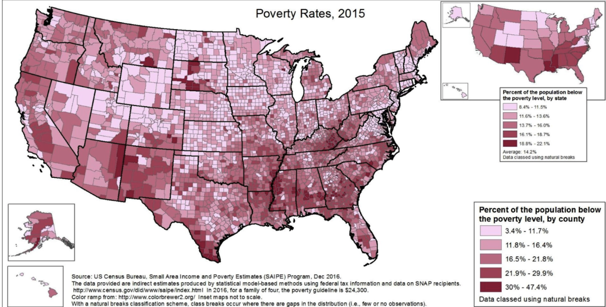

Choropleth maps can help us to start revealing spatial patterns and disparities in various health and socioeconomic indicators related to SDOH. These representations can pinpoint areas with high rates of chronic diseases, like diabetes or heart disease, and enable visual comparisons with factors like education, access to healthcare facilities, and social exclusion.

Moreover, choropleth maps are excellent for exploring potential correlations between SDOH and health outcomes. They can, for example, show how regions with limited access to healthy food options and green spaces might correlate with higher obesity rates. This visual data can inform targeted interventions and resource allocation, addressing social determinants in specific areas effectively.

Choropleth maps are also invaluable in communicating complex data to policymakers, public health officials, and community members. By visually representing intricate datasets in an accessible format, these maps can spark discussions around health disparities, resource distribution, and health equity. Given their capability to illustrate spatial patterns and the relationship between SDOH and health outcomes, choropleth maps are a vital resource for researchers, policymakers, and community organizations aiming to promote health equity and tackle the root causes of health disparities.

::: activity

**Activity** 

*Mapping the Pandemic with Choropleths*

During the COVID-19 pandemic, choropleth maps became crucial for health geographers, visually representing the virus's spread and highlighting hotspots and regional disparities. These maps, tracking trends over time, provided a deeper understanding of the pandemic's progression, supporting targeted interventions and policy-making. They not only made the pandemic's impact tangible but also emphasized the significance of spatial analysis in public health crises and showcased the practicality of geographic data visualization in research and decision-making contexts.

Now, let's create some maps to analyze the COVID-19 pandemic. We'll use QGIS for this tutorial, chosen for its flexibility in creating choropleth maps and its status as free, open-source software. 

**Note:** Other software options like R (see appendix) and GeoDa are also suitable for this task. Additionally, ArcGIS Pro and Carto are viable options, but remember they are proprietary and require a fee.

<details markdown='1'><summary>Opening a New Project in QGIS</summary>

- Start by opening a new project in QGIS.
- In the Layers panel, drag and drop the "COVID-19_pivot.xlsx" spreadsheet, as outlined in section 4.5 of this toolkit. If you don't have it, find it in the Zip folder at the start of this module.
- Joining your spreadsheet with a boundary shapefile:
Similar to the process in Module 4, join the "COVID-19_pivot.xlsx" with the boundary shapefile of Chicago's Zip codes, named “Chicago_Zipcodes.shp”.
Add “Chicago_Zipcodes.shp” to your layer panel.
- To access the join option, right click on “Chicago_Zipcodes.shp”, go to properties and select “join”. Lastly, select the “ plus icon.” 
Similar to GeoDa, you will need to specify: “the spreadsheet or layer you want to join” (e.g., COVID-19_pivot.xlsx), and the join and target fields (e.g., “zip”). Then click Okay.
- Check the attribute table on “Chicago_Zipcodes.shp.” You will see the fields from "COVID-19_pivot.xlsx" are there!
- Lastly, right click on “Chicago_Zipcodes.shp.” Select “Duplicate layer.” Right-click the new layer, Select “rename, and name it  “Chicago_COVID-19”.
Tip: If you need to review and better understand this step, go back to Module 4. 

</br></br></details>


<details markdown='1'><summary>Applying Symbology</summary>

- In the Layers panel, right-click on “Chicago_COVID-19” and select Properties, then Symbology.
- Change the top tab from Single Symbol to Graduated.
- Under the "Value" tab, select "Sum of Cases - Weekly".
- Set the Mode to “Natural Breaks (Jenks)” and Classes to “4”.
- Click Classify, Apply, and Ok. You've now created a map of the Sum of Cases of COVID-19 during a week in 2020 in Chicago.


</br></br></details>


<details markdown='1'><summary>Exploring Different Classification Methods</summary>

- From the Map option in the toolbar, explore different choropleth map options using various variables or data breaks (e.g., quantile).
- Select a classification method, set the Categories (e.g., 4), and click apply.
- Examine your maps, comparing how different data break methods display the same variables and how spatial patterns vary between different variables.

</br></br></details>

<details markdown='1'><summary>Mapping Multiple Variables Simultaneously</summary>

- To investigate multiple maps at once, use the GeoJason file “ChiZipCleaned” that you organized in Module 4.
- Create different choropleth maps using various variables from the attribute table. For example, map the percentages of Asian (asianP), Black (blackP), Hispanic/Latinx (HispP), White (WhiteP), and populations over 65 (Over65p). Use Natural Breaks and 4 classes, similar to your previous COVID-19 map.

From the exploratory results, where darker colors indicate higher population density and gray signifies data absence, we observe that cumulative COVID-19 outcomes for one week in September 2020 seem to correlate geographically with the Latinx/Hispanic community in Chicago.


</br></br></details>

To refine your analysis further, consider introducing additional variables. Options might include the percentage of essential workers, varying age groups, or internet access. Integrating health outcomes such as asthma or hypertension rates at a similar scale could also offer deeper insights.

:::

#### Cartograms 

Cartograms offer a distinctive way to analyze and display Social Determinants of Health (SDOH) data. They differ from traditional choropleth maps by altering the size of geographic areas based on a statistical variable like population.

This technique provides a clearer depiction of disparities in SDOH across regions, highlighting areas more significantly impacted by adverse social and economic conditions.

Although cartograms can distort geographic shapes and boundaries, they effectively communicate complex SDOH data, helping policymakers and the public understand underlying inequities and the necessity for focused interventions.


::: activity

**Activity**

*Cartograms in GeoDa*

To create a cartogram in GeoDa, which visually emphasizes specific variables, follow these steps:

<details markdown='1'><summary>Creating the Cartogram</summary>
      
- Open ChiZipCleaned in “GeoDa”
-  Select "Map" from the menu, then click on "Cartogram".

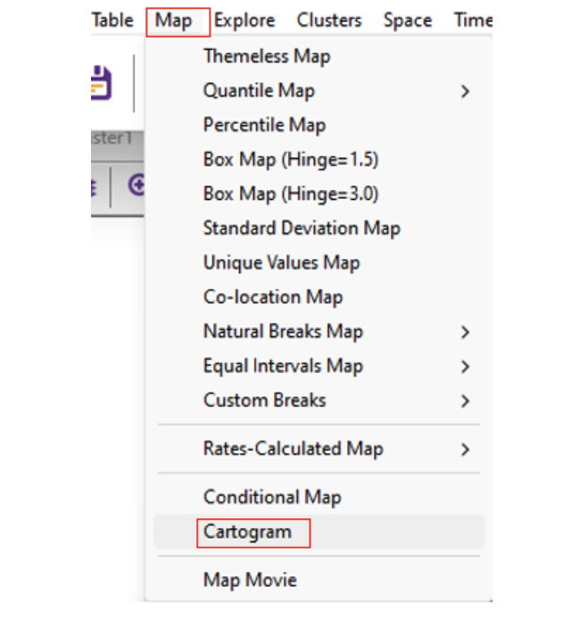

- In the "Cartogram Variables" dialog box, you'll find two columns: "Circle Size" and "Circle Color". For a simpler interpretation, select the same variable for both columns (e.g., age 18-64). 

- *Tip:* While you can choose different variables for circle size and color, this might make the cartogram more complex and potentially confusing.

</br></br></details>

<details markdown='1'><summary>Finalizing the Cartogram</summary>

- Click "OK" to generate the cartogram. This will create a map where the size of the circles represents the selected variable, providing a visual emphasis on areas with higher or lower values.


</br></br></details>

:::

### Multivariate Data Analysis

In this first steps of Exploratory Spatial Data Analysis, you may investigate data patterns one or two variables at a time to uncover relationships. Moving towards multivariate analyses, looking at multiple variables at once, can give insight into the complex processes driving the phenomenon you're interested. 

With this move, we may often begin to understand correlations across multiple variables. For example, historic segregation and decades of de-investment have tremendously influenced geodemographic patterns in Chicago.

In modern spatial epidemiology, associations must never be taken at face value. For example, we know that it is not “race” but “racism” that drives multiple health disparities – simply looking at a specific racial/ethnic group is not enough. Thus exploring multiple variables and nurturing a curiosity to understand these complex intersections will support knowledge discovery.

While we won't go through examples in depth beyond a simple thematic map panel, explore resources available to you to examine multivariate ESDA as well as increasingly complex modeling approaches.

## Cartographic Principles 

Having honed your skills in data wrangling and spatial analysis, it's time to focus on effectively communicating your findings in Social Determinants of Health (SDOH) through cartography. This phase is vital: the choices you make regarding colors, scales, and legends will significantly influence how your audience interprets your maps. In this final section, we'll discuss how to create clear and impactful SDOH maps.

Cartographic design principles form a framework of guidelines and best practices to create informative and visually appealing maps. They are key to ensuring maps not only convey spatial information accurately but are also easy to understand and aesthetically pleasing. While designing SDOH maps poses challenges, it's a crucial skill. We encourage you to delve deeper into cartographic design by exploring additional resources provided in this module.

:::tip

**Tip** 

As recommended by [Cynthia Brewer](https://www.esri.com/en-us/esri-press/browse/designing-better-maps-a-guide-for-gis-users) attempt to address the following questions at this point. Don't worry if you're uncertain of the answer, you can always revisit the previous modules for guidance.

- Who will be reading your maps? (module 3)
- What information will be mapped? (module 4)
- What are the time and budget constraints on your map production? (module 2)
- Will your map be coordinated with written text, videos, graphics, or other data visualizations? Do you have time to create or curate them? (module 2)
:::

### Effective SDOH map design entails several critical elements

#### Audience Consideration {-}

Tailor your map design to your audience's needs and preferences. Different audiences have varying abilities to interpret visual data. For instance, maps for healthcare professionals might include detailed spatial patterns and statistical analyses, whereas maps for the general public should focus on clarity and ease of understanding.
Revisit your user personas (module 3) and consider their motivations and challenges regarding cartography.
For example, The City of Chicago (see below) created a COVID-19 vaccine centers asset map for the general public.


ESRI (see below) created a dashboard for health professionals related to vaccine distribution during the pandemic. 

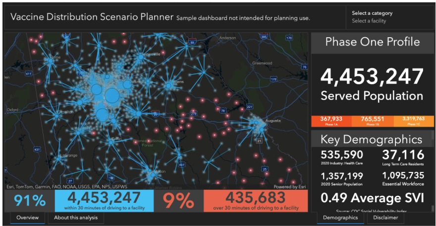

#### Visual Hierarchy {-}

Establish a visual hierarchy to guide viewers through the most important aspects of your data. This can be achieved using color, size, contrast, and the placement of map elements.
For example, ChiVes, an environmental justice dashboard may use bold colors to highlight critical areas, supported by descriptive text and a well-positioned legend.


#### Balance and Visual Arrangement {-}

Achieve balance in your map to ensure no element dominates excessively and each component is visually proportionate.
Organize elements logically and harmoniously, considering spatial relationships, grouping related features, and creating a clear flow for the viewer's eye.

The body-territory map (cuerpo-territorio) crafted by the Latinx collective Iconoclasistas serves as an exemplary showcase of balance and visual arrangement. Illustrating the detrimental impact of various industries on communities across South America, the map achieves balance by symmetrically delineating different regions and dividing them with the silhouette of a woman. Moreover, the title and sequential numbering naturally guides viewers through the map from top to bottom, facilitating intuitive reading of the cartography.


#### Simplicity {-}
Embrace simplicity for clear communication. Clear, uncluttered maps with essential elements are more accessible and easier for viewers to understand.
Focus on presenting the core message with precise use of color, symbols, and labeling.

The Anti-eviction Mapping Project developed a straightforward yet impactful dashboard illustrating evictions in LA County during the COVID-19 pandemic. Users can easily navigate through the data by utilizing the bar chart. By using the bar chart, the map displays eviction rates for each month throughout the pandemic.


Throughout these principles, the key is to present your SDOH data in a manner that is not just informative but also engaging and accessible to your intended audience. Each design decision, from the choice of color scheme to the positioning of elements, plays a role in how effectively your map communicates its message.


### Key Elements of Spatial Data Visualizations {-}

Effectively conveying spatial information in maps requires careful consideration of various elements. These elements include symbols, colors, typography, and layout, each playing a crucial role in guiding the viewer’s understanding of the geographic context and the presented data. Symbols visually represent spatial features; colors differentiate categories or highlight patterns; typography ensures legibility and informativeness of labels and annotations; and layout determines spatial relationships and influences visual hierarchy. Strategic incorporation of these elements enables cartographers to create maps that are not only aesthetically pleasing but also informative and intuitive to interpret.

#### Title {-}
A map’s title should succinctly convey its main theme or message. It should include the theme (What?), the location (Where?), and the temporal scale (When?). A clear and informative title sets the context for the map.

**Tip:** Make the title larger and bolder than other text to draw attention.

#### Legend {-}
The legend is a key component that decodes the symbols, colors, and patterns used on your map. It should be clear, concise, and understandable.

**Tip:** Place the legend near the map body and maintain a consistent color scheme and symbol style throughout your map series for coherence.

#### Scale Bar {-}
The scale bar visually represents the relationship between map distances and real-world distances. It's essential for accurately grasping the mapped area's geographic extent and proportions.

**Tip:** Choose a scale bar style that complements your map's design, including both metric and imperial units if possible.

#### Data Source and Projection Information  {-}

Providing data sources and projection information enhances your map's transparency and credibility, allowing viewers to understand the data’s origins and any potential map projection distortions or limitations.

**Tip:** Include clear citations for data sources and projection information in a designated map area.

#### North Arrow {-}

A north arrow, though not always necessary, can be helpful for orientation, especially in unfamiliar areas or when the map projection alters traditional alignments.

**Tip:** If used, ensure the **north arrow** is visible and distinct from other map elements, and choose a simple design that fits the map's overall aesthetic.


::: activity
**Activity**

*Rapid-Fire SDOH Mapping Critique*

- Spend 10 minutes critiquing a Social Determinants of Health map, focusing on elements like the title, legend, scale bar, and data sources.
- Think about the audience, hierarchy, balance, simplicity, and visual arrangement.
- Then, analyze another SDOH map, noting similarities or differences in design and effectiveness.
- Reflect on the clarity and informativeness of these elements, considering the context (what, where, when), the effectiveness of the legend, the appropriateness of the scale bar, the utility of the north arrow, and the clarity of data sources and projections.
:::

#### The Munsell Color System:


The [Munsell Color System](https://munsell.com/about-munsell-color/how-color-notation-works/), a model for describing and communicating color, is crucial in map design. It categorizes color into three dimensions: hue, value, and chroma, aiding in systematic color selection and specification. In mapping, it helps in color selection, achieving contrast, creating color harmony, and ensuring accessibility. For example, [Colorbrewer 2.0](https://colorbrewer2.org/#type=sequential&scheme=BuGn&n=3) provides options suitable for colorblind individuals.

::: activity
**Activity**

*SDOH Mapping with the Munsell Color System*

- Analyze SDOH data and assign Munsell colors to different factors.
- Develop a map legend explaining each color and its significance.
- Apply these colors to a map, creating a thematic representation of SDOH in a specific area.
- Evaluate the map’s effectiveness and adjust as necessary.
- Share and discuss your findings, interpreting the relationships between SDOH factors and geographic distribution.

This activity will enhance your understanding of applying the Munsell Color System in representing complex SDOH data, creating effective and meaningful maps that highlight community health risks or inequalities.
:::

## References {-}

- [GeoDa Documentation](https://geodacenter.github.io/documentation.html) remains an ESDA standard to uncover dozens of techniques for discovery.

- Brewer, C. (2016). Designing Better Maps: A Guide for GIS Users, 2nd Edition. ESRI press.

- D'ignazio, C., & Klein, L. F. (2023). Data feminism. MIT press.

- [Center for Spatial Data Science (2024). Scientific Reasoning in Spatial Data Science Education Project. University of Chicago: Center for Spatial Data Science.](https://spatial.uchicago.edu/education/scientific-reasoning)

- Krygier, J., & Wood, D. (2016). Making maps: a visual guide to map design for GIS. Guilford Publications.

- Peterson, G. N. (2020). GIS cartography: a guide to effective map design. CRC Press.


<!--chapter:end:05-analysis.Rmd-->

---
---

# App Development


:::objective
**Objectives**

In the module, you will:

- Explore various options for creating your map

- Create web maps using the suggested applications
:::

In this module, you will learn fundamental skills for creating asset maps, thematic maps, story maps, and data dashboards on a variety of free and/or open source platforms. Each section will include an exercise that will help you put into practice what you learn, highlighting the strengths of each map type and how they can be used to tell a well-rounded narrative with data. These exercises use data relevant to maternal health disparities in New York City and Georgia. All data required to complete each exercise can be found at [github link]. A reference file with information on variables and data sources is included.

Below is a figure that should be familar to you. You saw this in module 1! It's all coming full circle now. 

{width=95%}

:::tip
**A Note on the Software**


In this module, we’ll be introducing a number of no-code or low-code mapping software available. We’ll introduce their technical capabilities and drawbacks through each section, but there are other aspects to consider when deciding which software to use. While almost all software we’ve introduced in previous modules has been open source, many software options we’ll introduce today are free versions of paid services. These free versions may not have the full range of capabilities of the paid versions, or there may be usage limits that need to be kept in mind when choosing which software is best for your project. 
:::

| App Type           | Map Type         | Description                                                                                                                    |
|--------------------|------------------|--------------------------------------------------------------------------------------------------------------------------------|
| Asset Map          | uMap             | A web-based mapping program using OpenStreetMap, no coding required. Allows importing data for asset mapping.                   |
|                    | Leaflet with CSV | A popular open-source mapping library for creating interactive web maps. Involves some JavaScript coding for customization.   |
| Thematic Map       | ArcGIS Online    | A free version of ArcGIS for creating thematic maps. Allows customization of data display and symbology for various variables. |
|                    | Mapbox GL        | Useful for creating base maps and interactive thematic maps. Requires some basic coding for embedding in web pages.           |
| Story Map          | ArcGIS Online    | Offers flexible story map software with the ability to integrate various data visualizations and media elements.               |
|                    | Knight Lab       | Provides a straightforward, free tool for creating story maps with basic functionality. Can be integrated into existing web pages. |
| Data Dashboard    | Tableau Public   | Allows for the creation of interactive data dashboards with map visualizations, bar graphs, and filter actions.              |
|                    | R Shiny          | Enables building interactive web applications with R, suitable for creating customized data dashboards including maps.         |


## Asset Map Development 

{width=70%}

An asset map, commonly used in the public health field, is a point map of resources. It can be used to identify where resources are, and where gaps in availability exist. They may be simple, but can be quite effective for both understanding and presenting information about resource distribution. When paired with other mapping tools, they can tell us a lot about the types of communities that have access to various resources compared to those without access.

In this section, we’ll introduce two options for asset mapping, uMap and Leaflet. Both are free and open source. We’ll use a dataset of hospitals in New York City to introduce these software options.

### uMap {-}
uMap is a web based mapping program that uses OpenStreetMap to allow users to create maps. It has a simple interface, and no coding is necessary. 

<details markdown='1'><summary>Create an account on [uMap](https://umap.openstreetmap.fr/en/)</summary>

- Log in or create an account with any of the providers listed. Once logged in, you are ready to create a map.
</br></br></details>

<details markdown='1'><summary>Click “Create a map” in the top right corner.</summary>

- Familiarize yourself with the toolbar. Below is a quick cheat sheet.

{width=70%}

</br></br></details>

<details markdown='1'><summary>Import .csv file</summary>
- Click "Import data" to import “NYChospitals.csv” from the zip file linked at the start of the module.

- Then press the “Import” button.

:::tip
**Tip**

Points, lines, and polygons can be manually added to the map. Data can also be imported as a file, as a url, or pasted into the import tab. Multiple files can either be imported simultaneously to the same layer, or one by one to different layers. 

Additionally, uMap defaults to whatever layer you’ve most recently imported, so be sure that you are adding a new file to a new layer rather than replacing an existing file if you work with multiple layers in the future. 

Lastly, shapefiles are not compatible with uMap, you should instead prepare GeoJSONs if you add any.
:::

Your map should look something like this:

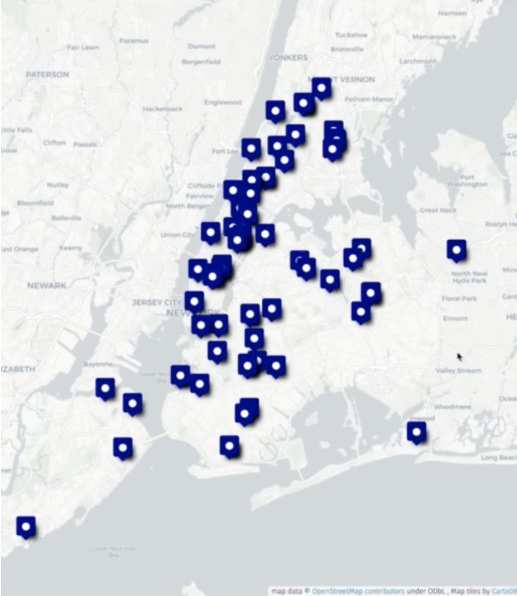{width=60%}

</br></br></details>

<details markdown='1'><summary>Edit layers</summary> 

- Click “Manage layers” on the right side of the toolbar and select the "Edit" on the right side of the toolbar to edit “Layer Properties”


:::tip
**Tip** 

Any edits will now be applied to all features. From this panel, you can change the color, shape, or symbol of the icon denoting your features. You can also change how a user interacts with features, such as whether they have to hover over a feature for a label to appear.
:::

*Optional: Selecting a feature (any point, line or polygon) will allow you to edit or delete it individually.* 

{width=40%}

- Select "Edit" to edit and it will bring up the “Feature Properties” tab. Scroll to the bottom of the “Features Properties” tab to edit the feature icon and interaction.

*Optional: Basemaps in uMap are somewhat limited, but there are a few options that can be found on the left hand toolbar by clicking "Basemap options". You may need to expand the toolbar to find these options* 

</br></br></details>

<details markdown='1'><summary>Additional data</summary>
- Add additional data (nyc-community-centers.geojson, nyc-day-care.geojson, and nyc-bjc.geojson) to create a map with multiple resources relevant to maternal health and support. 

- Edit Layer Properties to make each layer’s icons visually distinct.

</br></br></details>

<details markdown='1'><summary>Save your map</summary>

- First change the name and/or description by clicking Edit map properties". 

- Once you change the name, click on the “Save” button at the top right corner. 

- You’ll be given a URL, along with the option to download.

:::tip
**Tip**

Descriptions will need to be written using HTML formatting, but selecting the help button next to the description box will bring up all the relevant text formatting needed to do this properly. 
:::

</br></br></details>

:::activity
**Extension Exercise**

Want additional practice? Create an asset map of Georgia counties participating in the Home Visiting Program pilot. A csv file with the relevant data can be found [here], along with Georgia county boundary data.

As you create an asset map, consider the following questions: 

- Are there areas with many hospitals/resources?

- Are there areas with few or no hospitals/resources?

- What areas do you think could use more hospitals/resources?

- What may keep a population from utilizing a hospital/resource in their area?

- How might focusing solely on hospital/resource locations not tell the entire story?

:::

**Looking Forward**

In the asset map section, you explored how to identify and visualize spatial distributions of resources, facilities, or infrastructure within your area of interest.  As you continue your exploration, delve deeper into specific themes or variables by transitioning to thematic mapping in the next section. 

## Thematic Map App Development

{width=70%}

A thematic map in public health is a map that uses visual symbols, colors, and patterns to represent specific health-related data or themes within a geographic area. Data & interaction complexity generally remain more simplified, encouraging the user to inspect visualized patterns. Interactions may include selecting different variables for different maps, or clicking on an area to get information in a pop-up window. Here, we’ll introduce ArcGIS Online and Mapbox GL as two free thematic mapping options, while creating a thematic map of an SDOH or maternal health outcome variable(s) in NYC.

### ArcGIS Online {-}

ArcGIS Online is a free version of ArcGIS, a popular mapping software. Due to it being a free version, there are restrictions around usage, specifically that ArcGIS Online can only be used for non-commercial use. Keep this in mind as you decide which software to use for thematic mapping.

<details markdown='1'><summary>Access ArcGIS Online</summary>
- Open a web browser and go to https://www.arcgis.com/.

- Log in with your credentials or create a free account if you do not have one.

</br></br></details>

<details markdown='1'><summary>Start a New Map</summary>
- Click on “Map” in the toolbar at the top of the home page to open a blank map.

</br></br></details>

<details markdown='1'><summary>Add Data Layers</summary>
- Click on the “Add” button and select “Add Layer from URL” to connect a URL, or “Add Layer from File” to upload a file.

- For the tutorial, upload the NYC SDOH data (NYC_nbrhd_data) as a GeoJSON file. Make sure all the Add Layer information is correct before adding it to the map.

- Click Create and Add to Map

</br></br></details>

<details markdown='1'><summary>Modify the Basemap</summary>
- Select the "Basemap" option on the left-hand sidebar to change the underlying map style. Choose from various styles like satellite or streets to better suit your data visualization needs.
<video controls width="100%">
  <source src="./images/AGOSMbasemap.mp4" type="video/mp4" />
  Not supported
</video>

</br></br></details>

<details markdown='1'><summary>Customize Data Display</summary>
- Go to ‘Styles’ on the right-hand sidebar to select which variable(s) you wish to display.

- Under Choose Attributes. Click “+ Field” to add your variables. For this activity, we’ll add “pctblack” (for percent black). Click Add. 

- Underneath, choose your symbology, which is the method of visually representing your variable data (e.g., color, size).

- Click on ‘Style Options’ to edit aspects of your chosen symbology like color, classification method, and transparency.

- Enhance Map with Additional Features (optional):

:::tip
**Tip** 

If you display multiple variables at once, symbology options will adjust to allow for relationships between these variables to be displayed. One of the strengths of ArcGIS Online is how straightforward it can be to display multiple variables in a thematic map. However, it is still limited and it may not always be appropriate to try to use a thematic map to display multiple variables at once. In general, best practice would be to create a new field of the relationship you’re interested in during the data wrangling process so it stands as its own variable.

- Add additional variables by click the “+ Field” option. For example, add “pctwhite,” “pcthisp,” “pctapi,” and “pctother.”

- Click “Style Options,” go to Field Name, and you can edit how the name shows up on the legend.

- Use ‘Labels’ and ‘Pop-ups’ to display more information about each asset, which might not be visible through symbology alone.

- Click on ‘Add Sketch’ to manually add points, lines, polygons, or text labels to your map, creating a new feature layer.

{width=80%}

:::


</br></br></details>

<details markdown='1'><summary>Edit Features (optional)</summary>
- To modify an existing sketch, select the sketch feature layer and choose "Properties" to make changes.

</br></br></details>

<details markdown='1'><summary> Save Your Map</summary>
- Save your work by clicking on the save icon in the left-hand sidebar, ensuring you do not lose any changes.

</br></br></details>

### Mapbox GL {-}

{width=70%}

Mapbox GL is useful for creating base maps for larger projects, or standalone interactive thematic maps. In this section, we’ll walk through using Mapbox to create both. As a standalone interactive map, Mapbox does require some basic code to embed your map in your webpage, but code templates are available. 

#### Simple Basemap {-}

<details markdown='1'><summary>Start a New Map</summary>
Visit Mapbox and sign in or create an account if you haven't already.
From your account page, choose “Create a map in studio” and then select “New Style”.
You can start with a template, a blank map, or use a color palette derived from an image by choosing "Style with image". For this activity, start with “Classic Template.” Then click “Streets.”

</br></br></details>

<details markdown='1'><summary>Add Features</summary>

:::tip
**Tip** 

For the “Blank” map option, click the purple “+” at the top left to add feature layers, then click “Components.” This includes administrative boundaries, points of interest, natural features, and road networks.
For the “Classic Template,” most of the layers you may want are already added.
:::

:::tip
**Tip**

Consider the label density for each feature to maintain a balance between clarity and information density. Place labels, Points of interest, Natural features, and Road network all have label density options.
:::

{width=35%}

</br></br></details>

<details markdown='1'><summary>Style Your Basemap</summary>
Adjust the colors and typography of the features, ensuring they are distinct enough for general visibility and for those with common types of colorblindness.

</br></br></details>

<details markdown='1'><summary>Share Your Basemap</summary>
Maps can be shared from Mapbox through a style URL and access token, available under the "Share" option in the studio editor or your Styles page.

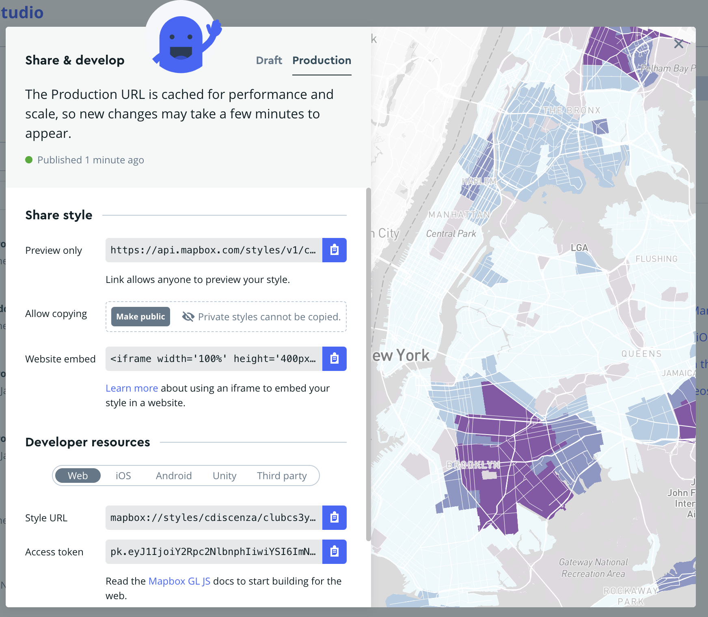{width=50%}

</br></br></details>

### Interactive Thematic Map {-}
Using the above simple basemap, let’s create a more complex map with an embedded dataset. Since our dataset is situated in New York, make sure your basemap is appropriately designed for that context.

<details markdown='1'><summary>Upload Your Data</summary>
Navigate to Add New Layer > Components > Data Visualization.
Choose "Upload Data" and select the NYC_nbrhd_data.geojson file.
Note: GeoJSON is generally more reliable than zipped shapefiles due to common zipper compatibility issues.

</br></br></details>

<details markdown='1'><summary>Add Your Data to the Map</summary>
From the Data Visualization tab, select your uploaded "NYC_nbrhd_data.geojson" as the source.
Select Data Visualization Type. Choose "Choropleth" as the data visualization type.
Zoom into “New York” if it doesn’t automatically zoom.

{width=80%}

</br></br></details>

<details markdown='1'><summary>Create Data Classifications</summary>
Select “choropleth-fill” from the Choropleth dropdown
Select "pctblack" as the variable for color mapping from the “Style Across Data Range”. 
Click “Add another stop.” Consider using a “Step” in the Rate of Change. Add 6 bins or “stops” for distinct data ranges. 

:::tip
**Tip** 

Deciding on data classification schemes - Mapbox does not have a way to decide between different classification schemes, like Jenks or quantiles. Use QGIS or R to decide on a classification scheme and identify where the breaks are, then manually set those breaks in Mapbox. For this activity, use the following stops “0, 0.01, 22.78, 45.55, 68.32, and 91.1”
Adjust the classification to visually exclude non-residential areas by setting the lowest bin to a grey color.
:::

</br></br></details>

<details markdown='1'><summary>Design Your Color Scheme</summary>
Use resources like ColorBrewer to choose an accessible and aesthetically pleasing color scheme.  Increase the number of data classes for a larger color range, and use the HEX codes or RGB values provided to add your desired colors to Mapbox.
Check the accessibility of your color scheme using Mapbox’s built-in color blindness simulator under Settings > Debug tools.


</br></br></details>

<details markdown='1'><summary>Share Your Map</summary>
Publish your map to ensure updates are visible on other applications.
In order to add your map to your web page, you’ll need to do some coding. From your account page, selecting “Install Mapbox GL JS” will lead you through the code you will need to do so. A template is also provided here that you can use to install your map.

</br></br></details>

:::activity
**Extension Exercise**

Want additional practice? Create a thematic map of an SDOH or maternal health outcome variable(s) in Georgia. A full dataset can be found [here]. 

As you create this map, consider the following questions:

- How could these variables be best presented to a user?

- What are the strengths and limitations of each software?

- Are you able to map multiple variables at once? Trends between variables?

- What trends can you see between SDOH and maternal health outcomes?

:::

**Looking Forward**

In the thematic map section, you learned how to visualize spatial patterns and distributions within your datasets. Transition to a story map to weave these insights into a compelling narrative.

## Story Map App Development

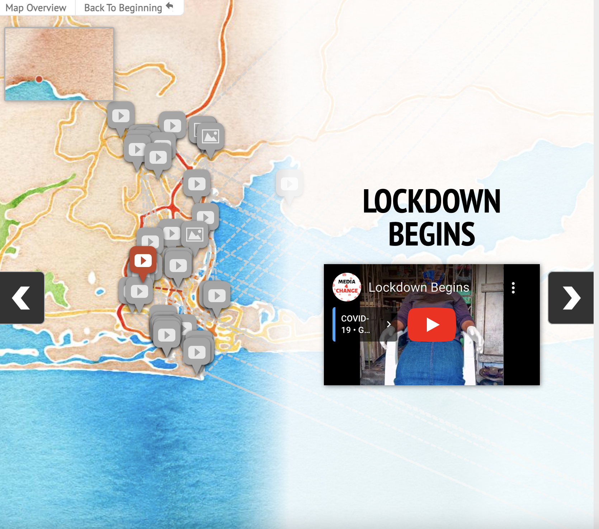{width=70%}

A story map is a tool that allows users to explore a geospatial dataset in greater detail, with more direction from the creator. You can lead users through individual points of interest, craft a narrative around your data, and ultimately tell a story. Datasets don’t need to be traditional data either. You can use photos, videos, or other media at points of interest in your story map. Effective story maps are informative, compelling, and the user will feel drawn through the narrative.

Depending on what software you use, story maps might be standalone journeys or integrated as part of a larger project. 

Check out these examples below:

*ArcGIS Online* 

- [Example 1](https://arcg.is/1bPHeK0) 

- [Example 2](https://arcg.is/0KTDX4) 

- [Example 3](https://arcg.is/0HDezC) 

*KnightLab* 

- [Example 1](https://www.georgiahumanities.org/southern-literary-trail-story-map/) 

- [Example 1](https://publications.newberry.org/time-machine/blackHawk/) 

- [Example 1](https://www.justempower.org/coronadiaries) *best example but stamen basemap :(*

Over the next few sections, you’ll be introduced to two softwares that can be used for story mapping: ArcGIS Online StoryMaps, and Knight Lab StoryMapJS. Neither requires coding, but StoryMapJS does allow for some basic coding. By the end of this section, you’ll be able to create a compelling story map while applying what you’ve learned thus far about data selection, cartographic principles, and human-centered design. 

We’ll create a story map of birth justice centers in NYC to guide you through the software. Unlike previous sections, where everything you needed was provided in the data, this section has a bit more creative freedom. An excel file of basic information (NYCBirthJusticeCenters.xlsx) will guide you, with names, addresses and websites of the birth justice centers. This will allow you to create the bones of a story map, but the content itself is up to you. Use this to explore what narrative you want to present, and what information you think is relevant or useful to constructing that narrative.

### ArcGIS Online {-}

ArcGIS Online has one of the most built-out and flexible story map softwares available. In fact, when you first open a story map, it might not look like what we’ve described above at all. ArcGIS Online StoryMaps are designed to allow for larger projects, with the “traditional” story map an element that you can add in between text, asset or thematic maps, and other media. Let’s get started with our “traditional” story map for now. 

#### Create a Traditional Story Map {-}

<details markdown='1'><summary> Set Up Your Account</summary>

- Visit ArcGIS Online and either log into your existing account or create a new one.

</br></br></details>

<details markdown='1'><summary>Access StoryMaps</summary>

- Once logged in, navigate to the StoryMaps section at https://storymaps.arcgis.com/ to access your story dashboard.

</br></br></details>

<details markdown='1'><summary>Start a New Story</summary>

- Click on “New story” and choose “Guided map tour” to begin. For future projects, you might select “Start from scratch” to fully customize your story elements.

</br></br></details>

<details markdown='1'><summary> Add Slides with Data</summary>

- Add data in StoryMaps is added one slide at a time.

*Each slide can include*

- A visual element (image or video)

- A title

- A description, which may contain text, audio, or a hyperlink button.

- Use the ‘Add location’ function to place the slide on the map.
Add new slides by clicking the ‘+’ icon at the bottom right. Rearrange slides by dragging them along the slide bar.

{width=95%}

</br></br></details>

<details markdown='1'><summary> Select and Edit Basemap</summary>

- Click ‘edit’ on your map, then select ‘Select basemap’.

- Choose from default options or click ‘Browse more maps’ for additional choices. Simpler basemaps are under ‘Living Atlas’, or use your own from the content library.

</br></br></details>

<details markdown='1'><summary> Add Maps to Your Library</summary>

- For feature layers: Open the feature layer in Map Viewer, select the folder icon, then ‘Save as’. The map will then appear under ‘My Maps’.

- For existing maps: Add the map to your favorites for easy access under ‘My Favorites’.

Tip: With these options, you can either keep your basemap simple, making largely aesthetic considerations (color, features, busyness) when choosing your basemap, or you can add a more complex basemap which displays additional data. 

</br></br></details>

<details markdown='1'><summary> Enhance Basemap and User Interaction</summary>

- For mobile users, enable ‘Current location’ to show their location on your story map.

- Opt to show ‘progress lines’ to clarify the route of your story map.

- Adjust the zoom level manually if needed, especially to set a custom spatial extent that optimizes how your data is displayed. See below for an (albeit extreme) example of the difference setting a custom zoom extent can make.

{width=95%}

</br></br></details>

<details markdown='1'><summary> Review and Publish</summary>

- Review your story map to ensure all data and visual elements are correct and effectively communicate your story.

- Once satisfied, publish your story map to make it accessible to your intended audience.

</br></br></details>

##### Integrate Other Geospatial Data Visualization {-}
The biggest strength of using ArcGIS Online is the ability to incorporate a variety of other types of data visualizations into a story map to create a larger narrative. Within an ArcGIS Online Story Map, you can find a traditional story map, but you can also include asset and thematic maps, media, timelines, and web apps. The end result can be a built out project with a story map as just one of many elements. Take your time to explore all of the available options. When you’re satisfied with how your story map is presented and contextualized, it’s time to hit publish.

### Knight Lab StoryMapJS {-}
Northwestern University’s Knight Lab has created a number of tools to help people tell stories with better visualizations. Their StoryMapJS tool is one of the most straightforward story map tools available, and it’s completely free. It doesn’t have the capacity of AGO to integrate with Knight Lab’s other tools, or its design flexibility, but it’s great for beginner story map-makers and can be integrated into existing web pages.

<details markdown='1'><summary>Create and Set Up Your StoryMap</summary>

- Go to Knight Lab's StoryMapJS to begin.

</br></br></details>

<details markdown='1'><summary>Start Your StoryMap</summary>

- Click on “Make a StoryMap”.

- Sign in with your Google account.

</br></br></details>

<details markdown='1'><summary>Name Your StoryMap</summary>

- Create a name for your StoryMap and enter it when prompted.

</br></br></details>

<details markdown='1'><summary>Configure Your Basemap</summary>

- You can chose the open streetmap for the map option. 

- For this activity, you want a customized basemap, create one using Mapbox (refer to the Mapbox section for details on creating a basemap).

- In StoryMapJS, go to Options -> Map Type, and add your Mapbox basemap using the Style URL and Access Token from Mapbox. Click close. 

Tip: If using a Mapbox thematic map as a basemap, create and add a legend via QGIS. Place the legend as media on the title slide or at the end of your story map, referencing its location on the title slide for easy navigation.

{width=50%}

Tip: The zoom feature looks wonky at first but it looks better as you add more slides.

</br></br></details>

<details markdown='1'><summary>Insert Data into Slides</summary>

Data in StoryMapJS is added one slide at a time. Use the sidebar on the left to add and arrange slides.

For each slide, you can add:

- A media element (link to media or upload an image).

- A title.

- A description. Credits and captions can be added here.

- Add location in the red box at the center of your screen.

*Example Data Entry:*

For a starting slide, add the logo of the Caribbean Women’s Health Association in the media section, along with relevant narrative information.

</br></br></details>

<details markdown='1'><summary> Customize Icons</summary>

- Change icons by selecting ‘Marker options’ at the bottom right of each slide. 

Tip: Customize the icons for each point on your story map. Use free icons from sources like The Noun Project (note attribution requirements) or upload your own.

</br></br></details>

<details markdown='1'><summary>Adjust Background and Layout</summary>

- Modify the background color or add an image behind your story elements to match your map’s theme using "Background options" at the bottom right of each slide.

- Go to “Preview” to see your Story Map so far.

- When you’re done, click "Save" at the top left side of your map.

</br></br></details>

:::activity
**Extension Exercise**
Want additional practice? Create a story map of designated maternal facilities in Georgia. A list of facilities, their locations, and their designation levels can be found below.

As you create your story map, consider the following questions:

- What media best represents each center?

- What information best supplements that piece of media?

- How do you want the user to feel over the course of this story map? At the end?

- If you use an ArcGIS Online story map, how could you include other information to contextualize this traditional-style story map?


*Georgia data*
- https://covid-hub.gio.georgia.gov/datasets/esri::acs-median-household-income-variables-boundaries/about?layer=2

- https://covid-hub.gio.georgia.gov/datasets/esri::acs-race-and-hispanic-origin-variables-centroids/about?layer=2

- https://opendata.atlantaregional.com/datasets/GARC::maternal-health-child-asthma-by-tract-2021/about

- https://dph.georgia.gov/maternal-and-neonatal-center

:::

**Looking Forward**

In the story map section, you learned how to transform your data-driven insights into compelling narratives. By combining maps, text, images, and multimedia elements, you created immersive storytelling experiences that effectively communicated your findings to a broader audience. As you move forward, consider transitioning to a data dashboard for a more dynamic and exploratory approach.

## Data Dashboard App Development


In the data dashboard section, you will learn how to create interactive interfaces for exploratory data analysis. By designing dashboards with interactive visualizations such as charts, graphs, and maps, you provided users with dynamic tools to explore and analyze their data. Through customization and interactivity, you empowered your audience to delve deeper into the data, uncovering insights and trends that drive informed decision-making.

### Tableau Public {-}
<details markdown='1'><summary>Create an Account</summary>

- Go to Tableau Public and sign up for a free account.

</br></br></details>

<details markdown='1'><summary>Start a Workbook</summary>

- Log in https://public.tableau.com/app/discover, navigate to your profile by clicking your name at the top right, and click on "Create a Viz". Upload the "NYC_nbrhd_data.geojson" file and then select "Update Now" to preview the data. Proceed by clicking on "Sheet 1" at the bottom to start visualizing.

</br></br></details>

<details markdown='1'><summary>Create a Thematic Map</summary>

- In the data pane, select "NTA Name", "Geometry", and "Pctblack" using command + click. Click "Show Me" and choose the map visualization.

- A legend will appear; switch to a stepped color scheme by selecting "Edit Color". 

Tip: You can adjust range and midpoint under "Advanced".

- Hover over settings can be adjusted in 'Tooltip' under 'Marks' to display desired information effectively.

</br></br></details>

<details markdown='1'><summary>Filter Data</summary>

- Exclude Uninhabited Areas: Right-click on "NTA Names" under Marks to set a filter. Deselect “All.” Choose "Exclude selected values" and remove areas such as parks-cemeteries, airports, and Rikers Island. Click “Okay.”

- Borough-Specific Filtering: Drag "Boro Name" from the left toolbar under “Tables” to the Filters section above “Marks,” select all, click “Okay.” Then, right-click on "Boro Name” then click “Show Filter.” On the right-side of the map,  choose “the down arrow to “Edit Filter” then choose "Single Value (dropdown)" allowing selection of individual boroughs.

{width=45%}

</br></br></details>

<details markdown='1'><summary>Add Additional Information</summary>
- Include data like severe maternal morbidity (Smmrate) as a color-coded element and adjust the legend back to a stepped color scheme. Add other demographic data as details in the tooltips.

</br></br></details>

<details markdown='1'><summary> Create a Bar Graph</summary>

- Add a new sheet, select "NTA Name" and racial demographics, then choose "side-by-side-bars" from "Show Me". Customize axes and colors as needed.

- Repeat for Economic Data: Create another bar graph for data like poverty levels and rent burden, adjusting axes and visuals similarly.

</br></br></details>

<details markdown='1'><summary>Create a Dashboard</summary>
- Navigate to Dashboard (at the top of screen) -> New Dashboard. Use 'Objects' for layout and drag your created sheets into the layout. Adjust the size of graphs to 'Standard' for readability.

</br></br></details>

<details markdown='1'><summary>Add a Filter Action</summary>

- Go to Dashboard -> Actions, add a Filter action. Configure it to update the bar graphs based on selections or hovers on the map section of the dashboard.

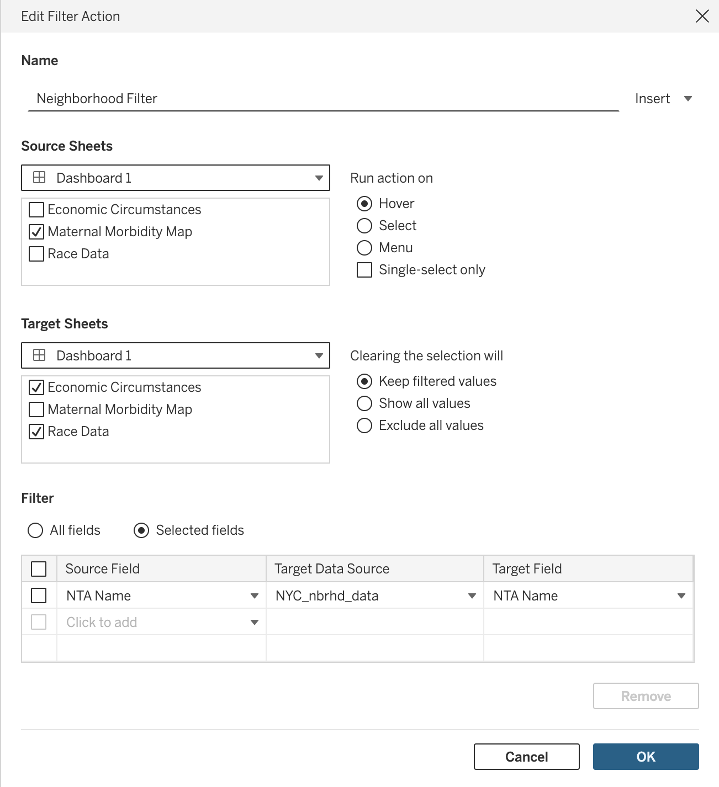{width=45%}

</br></br></details>

<details markdown='1'><summary>Finalize Your Dashboard</summary>
- Make final adjustments to legends, field names, and aesthetics. Ensure color schemes are cohesive and information is clear. 

- Edit titles within the dashboard to reflect interactive elements, like displaying the name of a highlighted neighborhood.

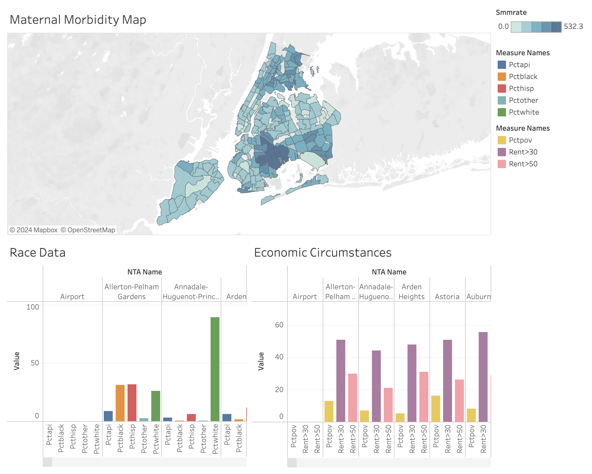{width=70%}

</br></br></details>

**Looking Forward**

In the data dashboard section, you learned how to create interactive interfaces for exploratory data analysis. By designing dashboards with interactive visualizations such as charts, graphs, and maps, you provided users with dynamic tools to explore and analyze their data. 

If you get stuck while creating your data dashboard, Tableau Public provides a number of how-to videos and community resources, including a community forum for troubleshooting. These additional resources can be found at the end of [here](https://public.tableau.com/app/learn/how-to-videos). 

:::activity
**Extension Activity**

Want additional practice? Create a dashboard on maternal health and SDOH in Georgia using the data provided [here].

:::

## Resources {-}

<!--chapter:end:06-appdev.Rmd-->

---
---
# (APPENDIX) Appendix {-} 

# Data Wrangling in R

In this part of our toolkit, we're going to learn how to do the same things we did with Chapter 4 - Spatial Data Wrangling, but this time, we'll use R code to handle our spatial data. 

### Getting Started {-}

R is a great choice for starting in data science because it's built for it. It's not just a programming language, it is a whole system with tools and libraries made to help you think and work like a data scientist easily.

We assume a basic knowledge of R and coding languages for these toolkits. For most of the tutorials in this toolkit, you’ll need to have R and RStudio downloaded and installed on your system. You should be able to install packages, know how to find the address to a folder on your computer system, and have very basic familiarity with R.

### Tutorials for R {-}

If you are new to R, we recommend the following [intro-level tutorials](https://learn.datacamp.com/courses/free-introduction-to-r) provided through [installation guides](https://rspatial.org/intr/1-introduction.html). You can also refer to this [R for Social Scientists](https://datacarpentry.org/r-socialsci/) tutorial developed by Data Carpentry for a refresher.

You can also visit the [RStudio Education](https://education.rstudio.com/learn/) page to select a learning path tailored to your experience level ([Beginners](https://education.rstudio.com/learn/beginner/), [Intermediates](https://education.rstudio.com/learn/intermediate/), [Experts](https://education.rstudio.com/learn/expert/)). They offer detailed instructions to learners at different stages of their R journey.


## Environmental Setup

Getting started with data analysis in R involves a few preliminary steps, including downloading datasets and setting up a working directory. This introduction will guide you through these essential steps to ensure a smooth start to your data analysis journey in R.

:::tools
**Download the Activity Datasets**

Please download and unzip this file to get started: [SDOHPlace-DataWrangling.zip](https://github.com/healthyregions/sdohplace-toolkit/raw/main/data/SDOHPlace-DataWrangling.zip)
:::

### Setting Up the Working Directory {-}

Setting up a working directory in R is crucial as it defines the location on your computer where your files and scripts will be saved and accessed. You can set the working directory to any folder on your system where you plan to store your datasets and R scripts. To set your working directory, use the `setwd("/path/to/your/directory")` and specify the path to your desired directory. 

### Installing & Working with R Libraries {-}

Before starting operations related to spatial data, we need to complete an environmental setup. This workshop requires several packages, which can be installed from CRAN:

- `sf`: simplifies spatial data manipulation
- `tmap`: streamlines thematic map creation
- `dplyr`: facilitates data manipulation
- `tidygeocoder`: converts addresses to coordinates easily

Uncomment to install packages with code snippet below. You only need to install packages once in an R environment.

```{r eval=FALSE}
#install.packages("sf", "tmap", "tidygeocoder", "dplyr")
```

:::tip
**Installation Tip**

For Mac users, check out https://github.com/r-spatial/sf for additional tips if you run into errors when installing the `sf` package. Using homebrew to install `gdal` usually fixes any remaining issues.
:::

Now, loading the required libraries for further steps:

```{r load-libraries, warning=FALSE, message=FALSE}
library(sf)
library(dplyr)
library(tmap)
```


## Intro to Spatial Data

Spatial data analysis in R provides a robust framework for understanding geographical information, enabling users to explore, visualize, and model spatial relationships directly within their data. Through the integration of specialized packages like sf for spatial data manipulation, ggplot2 and tmap for advanced mapping, and tidygeocoder for geocoding, R becomes a powerful tool for geographic data science. This ecosystem allows researchers and analysts to uncover spatial patterns, analyze geographic trends, and produce detailed maps that convey complex information intuitively.

### Load Spatial Data {-}

We need to load the spatial data (shapefile). Remember, this type of data is actually comprised of multiple files. All need to be present in order to read correctly. Let's use **chicagotracts.shp** for practice, which includes the census tracts boundary in Chicago.

First, we need to read the shapefile data from where you save it.

```{r load-spatial-data}
Chi_tracts = st_read("SDOHPlace-DataWrangling/chicagotracts.shp")
```

Always inspect data when loading in. Let's look at a non-spatial view.

```{r non-spatial-view}
head(Chi_tracts)
```

Check out the data structure of this file.

```{r data-structure}
str(Chi_tracts)

```

The data is no longer a shapefile but an `sf` object, comprised of polygons. The `plot()` command in R help to quickly visualizes the geometric shapes of Chicago's census tracts. The output includes multiple maps because the `sf` framework enables previews of each attribute in our spatial file. 

```{r spatial-view}
plot(Chi_tracts)
```


### Adding a Basemap

Then, we can use `tmap`, a mapping library, in interactive mode to add a basemap layer. It plots the spatial data from `Chi_tracts`, applies a minimal theme for clarity, and labels the map with a title, offering a straightforward visualization of the area's census tracts. 

We stylize the borders of the tract boundaries by making it transparent at 50% (which is equal to an alpha level of 0.5). 

```{r tmap-view}
library(tmap)

tmap_mode("view")

tm_shape(Chi_tracts) + tm_borders(alpha=0.5) +
  tm_layout(title = "Census Tract Map of Chicago")
```

Still in the interactive mode (`view'), we can switch to a different basemap. Here we bring in a "Voyager" style map from Carto, a cartographic firm. We'll make the borders less transparent by adjusting the alpha level.


```{r add-basemap}

tmap_mode("view")

tm_basemap("CartoDB.Voyager") + 
  tm_shape(Chi_tracts) + tm_borders(alpha=0.8, col = "gray40") +
  tm_layout(title = "Census Tract Map of Chicago")
```

::: tip

**Tip**

For additional options, you can preview basemaps at the [Leaflet Providers Demo](https://leaflet-extras.github.io/leaflet-providers/preview/). Some basemaps we recommend that work consistently are by:

- CartoDB (Carto)
- Open Street Map
- ESRI

Not all basemaps are available anymore, and some require keys that you'd need to add on your own.

:::


## Coordinate Reference Systems

For this exercise we will use `chicagotracts.shp` to explore how to change the projection of a spatial dataset in R. First, let's check out the current coordinate reference system.

```{r inspect-crs}
st_crs(Chi_tracts)
```

We can use the `st_transform` function to transform CRS. When projecting a dataset of Illinois, the most appropriate NAD83 projection would be NAD83 UTM zone 16N. Chicago sits within the area best covered by **NAD83 / Illinois East (ftUS)** (EPSG:3435). 

```{r }
Chi_tracts.3435 <- st_transform(Chi_tracts, "EPSG:3435")
# Chi_tracts.3435 <- st_transform(Chi_tracts, 3435)
st_crs(Chi_tracts.3435)
```

After change the projection, we can plot the map. We'll swith to the static version of tmap, using the `plot` mode.

```{r}

tmap_mode("plot")

tm_shape(Chi_tracts.3435) + tm_borders(alpha=0.5) + 
  tm_layout(main.title ="EPSG:3435 (ft)",
             main.title.position = "center")
 
```

What if we had used the wrong EPSG code, referencing the wrong projection? Here we'll transform and plot EPSG Code 3561, a coordinate reference system in Haw'aii. 


```{r transform-3561}

Chi_tracts.3561 <- st_transform(Chi_tracts, "EPSG:3561")


tm_shape(Chi_tracts.3561) + tm_borders(alpha=0.5) + 
  tm_layout(main.title ="EPSG:3561 (ft)",
             main.title.position = "center")
 
```

It's obviously not correct -- the wrong CRS can cause a load of trouble. Make sure you specify carefully!

### Refine Basic Map {-}

Let's take a deeper look at the cartographic mapping package, `tmap`. We approach mapping with one layer at a time. Always start with the object you want to map by calling it with the `tm_shape` function. Then, at least one descriptive/styling function follows. There are hundreds of variations and paramater specification.

Here we style the tracts with some semi-transparent borders.

```{r }
library(tmap)

tm_shape(Chi_tracts) + tm_borders(alpha=0.5) 
```

Next we fill the tracts with a light gray, and adjust the color and transparency of borders. We also add a scale bar, positioning it to the left and having a thickness of 0.8 units, and turn off the frame.

```{r }
tm_shape(Chi_tracts) + tm_fill(col = "gray90") + tm_borders(alpha=0.2, col = "gray10") +
  tm_scale_bar(position = ("left"), lwd = 0.8) +
  tm_layout(frame = F)
```

Check out https://rdrr.io/cran/tmap/man/tm_polygons.html for more ideas.

## Converting to Spatial Data


### Convert CSVs to Spatial Data

We are using the `Affordable_Rental_Housing_Developments.csv` in the dataset to show how to convert a csv Lat/Long data to points. First, we need to load the CSV data.

```{r load-csv-data}
housing = read.csv("SDOHPlace-DataWrangling/Affordable_Rental_Housing_Developments.csv")
```

Then, we need to ensure that no column (intended to be used as a coordinate) is entirely empty or filled with NA values.

```{r }
cleaned_housing <- na.omit(housing)
```

Inspect the data to confirm it's doing what you expect it to be doing. What columns will you use to specify the coordinates? In this dataset, we have multiple coordinate options. We'll use latitude and longitude, or rather, longitude as our X value, and latitude as our Y value.
In the data, it's specified as "Longitude" and "Latitude." 

```{r }
head(cleaned_housing)
```

Finally, we start to convert it to points. Be sure you use the CRS of the original coordinates recorded. In this case we weren't sure what CRS that was, so we use `EPSG:4326` to test.

```{r }
points_housing <- st_as_sf(cleaned_housing, coords = c("Longitude", "Latitude"), crs = 4326)
```

View the resulting sf object with a basemap to confirm they are in the right place. Overlay them on top of the tract data, to confirm they are plotting correctly.

```{r }

### First Layer
tm_shape(Chi_tracts) + tm_borders(lwd = 0.5) + 
  
  ### Second Layer
  tm_shape(points_housing) + tm_dots(size = 0.1 )

```

You can change the `tmap_mode` to "view" to add a basemap in an interactive setting, and then switch back to "plot" when complete. Because we'e plotting dots using *tmap*, we'll use the `tm_dots` parameter for styling.

```{r }

tmap_mode("view")

tm_shape(Chi_tracts) + tm_borders(lwd = 0.5) + 
  tm_shape(points_housing) + tm_dots(size = 0.01)

tmap_mode("plot")

```

We'll reproject to `EPSG:3435`, our system standard

```{r }
housing.3435 <- st_transform(points_housing, "EPSG:3435")

```

#### Write Spatial Data

Finally, we can save our points as a spatial dataset. Use 'st_write' to write your spatial object in R to a data format of your choice. Here, we'll write to a geojson file. 

Uncomment to run this line.

```{r }

#st_write(housing.3435, "housing.geojson", driver = "GeoJSON")

```

You could also save as a "housing.shapefile" to get a shapefile format, however you'll get an error noting that some column names are too long and must be shortened. Shapefile formats have a limit of 10 characters for field names. 

```{r }

#st_write(housing.3435, "housing.shp", driver = "ESRI Shapefile")

```
The file may still write, but the column names that were too long may be shortened automatically. 

To change column or field names in R objects, there are dozens of options. Try searching and "googling" different search terms to identify solutions on your own. 

### Geocode Addresses

Here, we will use `chicago_methadone_nogeometry.csv` for practice, which includes methadone centers in Chicago (center names and addresses). First we load the `tidygeocoder` to get our geocoding done. 

```{r warning=FALSE}
library(tidygeocoder)
```

Let's read in and inspect data for methadone maintenance providers. Note, these addresses were made available by SAMSHA, and are known as publicly available information. An additional analysis could call each service to check on access to medication during COVID in Septmber 2020, and the list would be updated further.

```{r}
methadoneClinics <- read.csv("SDOHPlace-DataWrangling/chicago_methadone_nogeometry.csv")

head(methadoneClinics)
```

Let's geocode one address first, just to make sure our system is working. We'll use the "cascade" method which use the US Census and OpenStreetMap geocoders. These two services are the main options with `tidygeocoder`.

```{r}
sample <- geo("2260 N. Elston Ave. Chicago, IL", lat = latitude, long = longitude, method = 'cascade')
head(sample)
```

As we prepare for geocoding, check out the structure of the dataset. The data should be a character to be read properly. 

```{r}
str(methadoneClinics)
```

We need to clean the data a bit. We'll add a new column for a full address, as required by the geocoding service. When you use a geocoding service, be sure to read the documentation and understand how the data needs to be formatted for input.

```{r}
methadoneClinics$fullAdd <- paste(as.character(methadoneClinics$Address), 
                                  as.character(methadoneClinics$City),
                                  as.character(methadoneClinics$State), 
                                  as.character(methadoneClinics$Zip))
```

We're ready to go! Batch geocode with one function, and inspect:

```{r}
geoCodedClinics <-  geocode(methadoneClinics,
address = 'fullAdd', lat = latitude, long = longitude, method = 'cascade')

head(geoCodedClinics)
```

There were two that didn't geocode correctly. You can inspect further. This could involve a quick check for spelling issues; or, searching the address and pulling the lat/long using Google Maps and inputting manually. Or, if we are concerned it's a human or unknown error, we could omit. For this exercise we'll just omit the two clinics that didn't geocode correctly.

```{r}
geoCodedClinics2 <- na.omit(geoCodedClinics)
```

## Convert to Spatial Data

This is not spatial data yet! To convert a static file to spatial data, we use the powerful `st_as_sf` function from `sf`. Indicate the x,y parameters (=longitude, latitude) and the coordinate reference system used. Our geocoding service used the standard **EPSG:4326**, so we input that here.

```{r warning = FALSE}

methadoneSf <- st_as_sf(geoCodedClinics2, 
                        coords = c( "longitude", "latitude"),
                        crs = 4326)
```

### Basic Map of Points {-}

For a really simple map of points -- to ensure they were geocoded and converted to spatial data correctly, we use `tmap`. We'll use the interactive version to view.

```{r warning = FALSE, message=FALSE}

tmap_mode("view")

tm_shape(methadoneSf) + tm_dots() 
```

If your points didn't plot correctly:

- Did you flip the longitude/latitude values?
- Did you input the correct CRS?

Those two issues are the most common errors.


## Merge Data sets

### Reshape Data {-}

Here, we are trying to use the `COVID-19_Cases__Tests__and_Deaths_by_ZIP_Code.csv` dataset to practice how to convert long data to a wide data format.

We subset to the first two columns, and the sixth column. That gives us the zip code, the reporting week, and cumalative cases of Covid-19. We want each zip code to be a unique row, with cases by week as a columns Choose whatever subset functioon you prefer best!

```{r}

covid = read.csv("SDOHPlace-DataWrangling/COVID-19_Cases__Tests__and_Deaths_by_ZIP_Code.csv")

covid_clean = covid[,c(1:2, 6)]

head(covid_clean) 
```

Now, we are trying to create a wide data set with the cumulative cases for each week for each zip code. Enter the code and you will see the new wide data format.

```{r}
covid_wide <- reshape(covid_clean, direction = "wide",
                      idvar = "ZIP.Code", timevar = "Week.Number") 
head(covid_wide)
```

### Join by Attribute {-}

Here, we’ll merge data sets with a common variable in R. Merging the cumulative case data set you created in the last section to zip code spatial data (`ChiZipMaster1.geojson`) will allow you to map the case data. You’ll be merging the case data and spatial data using the zip codes field of each dataset.

We've cleaned our covid case data already, but not all values under the zipcode column are valid. There is a row has a value of "unkown", so let's remove that.

```{r}
covid_wide_clean <- covid_wide %>%
  filter(ZIP.Code != "unknown" & !is.na(ZIP.Code))
```

Then, we need to load the zipcode data.

```{r}
zipcode <- st_read("SDOHPlace-DataWrangling/ChiZipMaster1.geojson")
```

You’ll notice that the zip codes are repeated in the zip code data set, and needs to be cleaned before we can continue with merging the data.

```{r}

zipcode_unique <- distinct(zipcode)

zipcode_unique <- zipcode %>%
  group_by(zip) %>%
  slice(1) %>%
  ungroup()
```

Now, the two datasets are ready to join together by the zipcode. Make sure to check they have been joined successully.

We'll have these joined datasets be called Chi_Zipsf, to denote a final zip code master dataset.

```{r}
Chi_Zipsf <- zipcode_unique %>%
  left_join(covid_wide_clean, by = c("zip" = "ZIP.Code"))
```

We'll reproject to EPSG:3435, the standard used in our study area.

```{r}
Chi_Zipsf.3435 <- st_transform(Chi_Zipsf, 3435)
```

### Join by Location {-}

We’ll create a spatial join with the housing and zip code data we've brought in.

In this example, we want to join zip-level data to the Rental Housing Developments, so we can identify which zips they are within.

First, let's try "sticking" all the zip code data too the housing points, intersecting zip codes with housing developments.

To do this, both datasets will need to be in the same CRS. We have already standardized both using EPSG:3435.

```{r}

Housing.f <- st_join(housing.3435, Chi_Zipsf.3435, join = st_intersects)
```

Don't forget to inspect the data. Uncomment to explore!

```{r}
#head(Housing.f)
```

We could also flip things around, and try to count how many developments intersect each zip code We can use lengths() to find out how many items are present in a vector. Here,

```{r}

Chi_Zipsf.3435$TotHousing <- lengths(st_intersects(Chi_Zipsf.3435, housing.3435))

head(Chi_Zipsf.3435)


```


## Inspect Data


### Thematic Maps

To inspect data from a spatial perspective, we can create a series of choropleth maps.


#### Example 1. Number of Affordable Housing Developments per Zip Code {-}

Choose the variable "TotHousing" to map total developments per zip coode, as we calculated previously. Here we'll map using Jenks data breaks, with a Blue to Purple palette, and four bins (or groups of data to be plotted). A histogram of the data is plotted, visualizing where breaks occured in the data to generate the map.

```{r, message=FALSE, warning=FALSE}

tmap_mode("plot")

tm_shape(Chi_Zipsf.3435) + tm_polygons("TotHousing", legend.hist = TRUE, style="jenks", pal="BuPu", n=4, title = "Housing Dev.") + 

  tm_layout(legend.outside = TRUE, legend.outside.position = "right")
```

#### Example 2. Number of COVID-19 Cases per Zip Code {-}

Let's do the same, but plut a different variable. Select a different variable name as your parameter in the 'tm_fill' parameter.

```{r, message=FALSE, warning=FALSE}

tm_shape(Chi_Zipsf.3435) + tm_polygons("Case.Rate...Cumulative",
              legend.hist = TRUE, style="jenks", 
              pal="BuPu", n=4, title = "COVID Case Rate") + 

  tm_layout(legend.outside = TRUE, legend.outside.position = "right")
```

### Map Overlay

#### Example 1. Afforfable Housing Developments & Zipcode Boundaries {-}

We previously translated the housing dataset from a CSV to a spatial object. Let's take an attribute connect with each point, the total number of units per housing development, and visualize as a graduated symbology. Points with more units will be bigger, and not all places are weighted the same visually. 

We use the "style" parameter to aadd a standard deviation data classification break. Check out tmap documentation for more options, like quantiles, natural jenks, or other options.


```{r}
tm_shape(housing.3435) + tm_bubbles("Units", col = "purple", style = "sd") 
```

Then, let's overlay that layer to the zipcode boundary.

```{r}
tm_shape(Chi_Zipsf.3435) + tm_polygons(col = "gray80") +
  
  tm_shape(housing.3435) + tm_bubbles("Units", col = "purple") 

```

You can also color-code according to the total number of units. Here, we'll add a palette using a "viridis" color scheme, as a graduate color point map. For extra style, we'll add labels to each zip code, update with a new basemap, and make the whole map interactive.

```{r}
tmap_mode("view")

#Add Basemap
tm_basemap("Esri.WorldGrayCanvas") + 
  
  #Add First Layer, Style
  tm_shape(Chi_Zipsf.3435) +  tm_borders(col = "gray10") + 
    tm_text("zip", size = 0.7) +

  #Add Second Layer, Style
  tm_shape(housing.3435) + 
    tm_bubbles( col = "Units", style = "quantile", 
                pal = "viridis", size = 0.1) 
  
```

#### Example 2. COVID-19 & Methadone {-}

In the first example, let create a map showing both COVID-19 and methadone clinic data (used in A.3). First, let's add our zipcode map.

With this overlay, we'll add a "hack" to include the methadone clinic points in a legend.

```{r}
tmap_mode("plot")

##Add and style First Layer
tm_shape(Chi_Zipsf) + tm_polygons("Case.Rate...Cumulative", 
              style="jenks", pal="BuPu", n=4, title = "COVID Rt") + 
  
  ##Add Second Layer
  tm_shape(methadoneSf) + tm_dots(size = 0.2, col = "gray20") +
  
  ##"Hack" a manual symbology for dots in the legend
  tm_add_legend("symbol", col = "gray20", size = .2, labels = "Methadone MOUD") +
  
  ##Final Cartographic Styling
  tm_layout(legend.outside = TRUE, legend.outside.position = "right")
```


## Resources {-}

- For tips on using `tmap`, check out the online text, [Elegant and informative maps with tmap](https://r-tmap.github.io/tmap-book/index.html) by Tennekes and Nowosad.

- Try out more mapping with the ggplot2 library. The [Maps](https://ggplot2-book.org/maps) chapter will give you a head start.  

- We highly recommend Chapters 3-5 as mandatory reading in this classic, [Geocomputation with R](https://r.geocompx.org/) by Lovelace, Nowosad, and Muenchow. Perfecting selections and filters in the *Attribute Data Operations* chapter will help you become a data wrangling master. Perfect distance metrics and essential GIS operations in subsequent chapters.

- The Appendix in [Gimond's Intro to GIS](https://mgimond.github.io/Spatial/introGIS.html) online book has a super overview of R examples, not to be missed.

- Another superb resource is [Analyzing US Census Data](https://walker-data.com/census-r/index.html) by Kyle Walker, with some of our favorite examples of extracing & reshaping data directly from the Census using code. Highly recommended!

<!--chapter:end:04-dataR.Rmd-->

---
---

# Research Design & Analysis in R

In this Appendix overview, we continue to delve in further to working with R to support research design, hypothesis generation, and data anlaysis. Be sure to read through Module 5 alongside these activities.

## Environment Setup

First, let's import the library needed for our analysis.

```{r warning=FALSE, message=FALSE}
library(sf)
library(tmap)
```

Let's also bring in our data, cleaned from the previous module. In this case, we'll read from saved files and load in. Grab the data for this activity and the following ones [here](:::tools
**Tools**

*Download the Activity Datasets*

While you will use your own data for your project, practice with ours. Please download and unzip this file to get started: [SDOHPlace-ResearchDesignAnalysis.zip](https://github.com/healthyregions/sdohplace-toolkit/blob/main/data/SDOHPlace-ResearchDesignAnalysis.zip)

This dataset includes data prepped and merged in the previous module.
:::
).

## Variable Calculations

### Buffers

**Activity: Farmers Markets in Chicago**

This activity focuses on utilizing data from Chicago's farmers' markets, specifically the `farmers_markets_2012` dataset. 

Farmers' markets are vital for health and well-being, providing access to fresh, locally-grown produce and supporting sustainable food systems. They offer diverse, nutritious food options, often at affordable prices, and foster community connections and local agriculture support. The presence and density of farmers' markets in a neighborhood significantly influence residents' food accessibility.

#### Add Dataset

First, read in and inspect the shapefile file.

```{r }

markets <- st_read("data/farmers_markets_2012.shp")

head(markets)

```

We can see that the point data is already in a CRS that uses feet for distance, which is great. If the dataset had a different CRS, we would need to reproject to a new CRS. (See Module 4 for a refresh.)

Just to be sure, map the data with a basemap. 

```{r }

tmap_mode("view")

tm_basemap("CartoDB.Voyager") + 
  tm_shape(markets) + tm_dots(size=0.01) 

```


When mapping points in tmap, we can use the `tm_dots` or `tm_bubble` paramter. The bubbles function can make points bigger or smaller, depending on some attribute of the points. Here, we just want to map the point on its own, so we use `tm_dots`.

#### Create Buffers

Next, we can create a buffer. We use the `st_buffer` function to calculate, passing the points and distance measure. 

To calculate a half mile buffer, we will use 2,640 feet as our input (since 2640 ft = 0.5 mile).

```{r }

markets.buffer <- st_buffer(markets, 2640)

```

Inspect right away! Map with your point data.

```{r }

tm_basemap("CartoDB.Voyager") + 
tm_shape(markets) + tm_dots(alpha=0.5) +
  tm_shape(markets.buffer) + tm_borders(alpha = 0.6)

```


You'll need to zoom in a bit to see the buffers! Let's try plotting using a standard map, with the Zip Codes we used previously.

First, read in the zips:

```{r }

zips <- st_read("data/chizips.geojson")

```
Next, let's overlay and add the buffers.

```{r }

tmap_mode("plot")

tm_shape(zips) + tm_borders(alpha=0.3) + tm_fill(col="gray90") +
  tm_shape(markets.buffer) + tm_fill(col = "turquoise1", alpha = 0.4) +
  tm_shape(markets) + tm_dots(size = 0.03) 

```

:::tip

**Tip**

To change the color in tmap, use the "col" parameter in most cases. R will recognize several standard color names, as well as codes used. Check out the [R Color Palette Cheat Sheet](https://www.nceas.ucsb.edu/sites/default/files/2020-04/colorPaletteCheatsheet.pdf) for more ideas.

:::

It's easy to add another buffer layer, and update your code with two! Let's add a 1-mile buffer as well.

```{r }

markets.buffer1 <- st_buffer(markets, 5280)

tm_shape(zips) + tm_borders(alpha=0.3) + tm_fill(col="gray90") +
  tm_shape(markets.buffer1) + tm_fill(col = "turquoise4", alpha = 0.4) +
  tm_shape(markets.buffer) + tm_fill(col = "turquoise1", alpha = 0.4) +
  tm_shape(markets) + tm_dots(size = 0.03) 

```

#### Dissolve Buffers

By viewing individual buffers distinctly, and playing with alpha (i.e. transparency) of the buffer visually, we can begin to get an idea of how intersecting areas of multiple markets look. Areas with more markets will have denser, intersecting buffers.

In some cases, the plentitude of resources nearby may not be as important as knowing whether or not a place is serviced by the resource at all.

If we consider the buffer as a service area, by dissolving boundaries of buffers, we can generate a uniform service area. To do this, we will dissolve the boundaries of buffers. It's also known as a buffer **union**.

We'll create two unions; one for the half mile buffers, and one for the mile buffers. Then, we visualize to inspect immediately.

```{r }

buffer.union <- st_union(markets.buffer)
buffer.union1 <- st_union(markets.buffer1)

tm_shape(zips) + tm_borders(alpha=0.3) + tm_fill(col="gray90") +
  tm_shape(buffer.union1) + tm_polygons(col = "turquoise4", alpha = 0.4) +
  tm_shape(buffer.union) + tm_fill(col = "turquoise1", alpha = 0.4) +
  tm_shape(markets) + tm_dots(size = 0.03) 

```

In this visualization, we switched to `tm_polygons` for the 1-mile buffer union to automatically add a border. This border cleanly highlights the union.

:::tip

**Tip**

You can use `st_union` to dissolve any other vector layers or spatial objects. It unions input geometries, merging to produce a resulting geometry with no overlaps. It's a very powerful function. 

:::

### Distance Metrics

Distance to the nearest resource is a common metric used to capture the availability of a resource, and in this tutorial we demonstrate how to calculate a minimum distance value from a ZCTA centroid to a set of resources.

Each zip code will be assigned a “minimum distance access metric” as a value that indicates access to resources from that zip code.

#### Centroid Calculation

First, let's calculate a centroid.

```{r }

zipCentroid <- st_centroid(zips)

```

Plot to confirm it looks right!

```{r }

tm_shape(zips) + tm_borders(alpha=0.3) + tm_fill(col="gray90") +
  tm_shape(zipCentroid) + tm_dots(col = "violetred1", size = 0.03) 

```

#### Standardize CRS

Next, as we will be working with two spatial datasets to generate the calculation, we need to ensure they're in the same CRS. First, inspect the CRS.

```{r }

st_crs(zipCentroid)

st_crs(markets)

```
It appears they are both using EPSG:3435 as their ID, so we should be set! If not, go back and transform to the standard CRS (that will use a meaningful distance unit).

#### Find Nearest Resource

First, we'll develop an index that identifies which market is nearest to the zip code centroid using the `st_nearest_feature` function. It will return the index of the object that is nearest, so we will subset the resources by the index to get the nearest object.

We can use the `str` or structure function to inspect the structure of the index for clarity. There are 58 items, corresponding to the 58 zip codes. In each slot, we have the row ID of the market that was identified as the nearest.

```{r }

nearestMarket_indexe <- st_nearest_feature(zipCentroid, markets)

str(nearestMarket_indexe)


nearestMarket <- markets[nearestMarket_indexe,]

```
#### Calculate Distance

Now we can calculate the distance between each zip centroid and its nearest market. Inspect.

```{r }

minDist <- st_distance(zipCentroid, nearestMarket, by_element = TRUE)

head(minDist)

```

We have distance metrics! However, they're in feet. While we can just multiple by a conversion factor to get miles, our spatial object would still indicate the unit as feet. Here, we can bring it a new package, `units`, to switch units for us.

```{r }

#install.packages("units")

library(units)

minDist_mi <- set_units(minDist, "mi")

head(minDist_mi)

```

We are ready to bind our minimum distance vector back to our Zips! Use a "column bind" function, `cbind`, to get it done. Inspect.

```{r message=FALSE}

zips_final <- cbind(zips, minDist_mi)

#head(zips_final)
```

#### Visualize 

Put it all together in a map.

```{r}
tm_shape(zips_final) +
  tm_polygons("minDist_mi", style = 'quantile', palette = "GnBu", n=5,
              title = "Min.Distance (mi)") +
    tm_shape(markets) + tm_dots(size = 0.03) +
  tm_layout(main.title = "Distance from Zip Centroid \n to Nearest Farmers Market",
            main.title.position = "center",
            main.title.size = 1)
```

If needed, write and save your merged file for later use.

```{r}

#st_write(zips_final, "data/zips-final.geojson")

```


## Statistical Mapping

**Activity: Mapping the Covid-19 Pandemic**

We've played a bit with thematic maps previously, but not gone into depth just yet. In these activities, we'll use different statistical mapping techniques to examine one week of case rates of Covid-19 in Chicago, in the first fall of the pandemic. We'll use the same zip file we've been using thus far.

### Choropleth Maps

We will be plotting the spatial distribution of our health outcome variable for the city of Chicago using three methods.

- Quantile
- Natural Breaks
- Standard Deviation

For a more detailed overview of choropleth mapping and methods, check out related [GeoDa Center Documentation]().

#### Quantiles

A quantile map is based on sorted values for the variable that are then grouped into bins such that each bin has the same number of observations. It is obtained by setting style = 'quantile' and n = no of bins arguments in tm_fill() or tm_polygons().

We generate a choropleth map of case rate data using quantile bins, and the Blue-Purple color palette. As shared in a tip above, you can find an R color cheatsheet useful for identifying palette codes [here](https://www.nceas.ucsb.edu/sites/default/files/2020-04/colorPaletteCheatsheet.pdf). Let's add a histogram of the data so we can see how the different data classifications change our map.

```{r warning = FALSE, messages=FALSE}

tm_shape(zips_final) +
  tm_polygons("Case.Rate...Cumulative", 
              style="quantile", pal="BuPu",
              legend.hist=T, n=4,
              title = "COVID Case Rate", ) + 
  tm_scale_bar(position = "left") + 
  tm_layout(legend.outside = TRUE, legend.outside.position = "right")

```

Already we can generate some insight. Areas on the far West side of the city have some of the highest case rates. 

How might changing our bins from 4 to 6 change the map?

```{r warning = FALSE, messages=FALSE}

tm_shape(zips_final) +
  tm_polygons("Case.Rate...Cumulative", 
              style="quantile", pal="BuPu",
              legend.hist=T, n=6,
              title = "COVID Case Rate", ) + 
  tm_scale_bar(position = "left") + 
  tm_layout(legend.outside = TRUE, legend.outside.position = "right")

```

There is a bit more variability when adding more bins to the quantile map, and the data classification breaks in our histogram seem more intuitive than the first version.. 

#### Natural Breaks

Natural breaks or jenks distribution uses a nonlinear algorithm to cluster data into groups such that the intra-bin similarity is maximized and inter-bin dissimilarity is minimized. It is obtained by setting style = 'jenks' and n = no. of bins.

As we can see, the jenks method generally better classifies the dataset in review than the quantile distribution. With only four bins, the algorithm has already detected an optimal break in the data.

```{r warning = FALSE, messages=FALSE}

tm_shape(zips_final) +
  tm_polygons("Case.Rate...Cumulative", 
              style="jenks", pal="BuPu",
              legend.hist=T, n=4,
              title = "COVID Case Rate", ) + 
  tm_scale_bar(position = "left") + 
  tm_layout(legend.outside = TRUE, legend.outside.position = "right")

```

#### Standard Deviation

Standard deviation is a statistical technique type of map based on how much the data differs from the mean. While you can update whatever number of bins you'd like, the standard deviation map will always have a specific set (6 bins), as the numbers will diverge from the mean systematically. 

```{r warning = FALSE, messages=FALSE}

tm_shape(zips_final) +
  tm_polygons("Case.Rate...Cumulative", 
              style="sd", pal="BuPu",
              legend.hist=T, n=4,
              title = "COVID Case Rate", ) + 
  tm_scale_bar(position = "left") + 
  tm_layout(legend.outside = TRUE, legend.outside.position = "right")

```

:::tip

**Tip**

Never, ever stop with your first choropleth map or default setting! Choropleth mapping is a statistical mapping technique and requires a careful approach, accordingly. Test at least 2-3 data classification breaks with varying number of bins. Search for consistent patterns across multiple styles, and then select the style that best characterizes that pattern.
:::

#### Thematic Map Panel

Who is being most impacted by this heightened burden of Covid in the fall of 2020? 

To facilitate data discovery, we likely want to explore multiple maps at once. In our dataset, we have multiple additional variables characterizing social, economic, and other dimensions of the Chicago environment. Here we’ll generate maps for multiple variables of social and demographic groups, and plot them as a map panel. 

First, assign maps as variables. 

```{r}

COVID <- tm_shape(zips_final) + tm_fill("Case.Rate...Cumulative", 
              style="jenks", pal="Reds", n=4, title = "COVID Rt") 

Senior <- tm_shape(zips_final) + tm_fill("ovr65P", 
              style="jenks", pal="BuPu", n=4) 

NoHS <- tm_shape(zips_final) + tm_fill("noHSP", 
              style="jenks", pal="BuPu", n=4)

BlkP <- tm_shape(zips_final) + tm_fill("blackP", 
              style="jenks", pal="BuPu", n=4) 

Latnx <- tm_shape(zips_final) + tm_fill("hispP", 
              style="jenks", pal="BuPu", n=4) 

WhiP <- tm_shape(zips_final) + tm_fill("whiteP", 
              style="jenks", pal="BuPu", n=4) 
```

Next, use the `tmap_arrange` function to map them all at once!

``` {r message= FALSE, warning = FALSE}
tmap_arrange(COVID, Senior, NoHS, BlkP, Latnx, WhiP)
```

From the results, we see that cumulative COVID outcomes for one week in September 2020 seemed to have some geographic correlation with the Latinx/Hispanic community in Chicago. At the same time, low high school diploma rates are also concentrated in these areas, and there is some intersection with other variables considered. What are additional variables you could bring in to refine your approach? Perhaps percentage of essential workers; a different age group; internet access? What about linking in health outcomes like Asthma, Hypertension, and more at a similar scale?

In modern spatial epidemiology, associations must never be taken at face value. For example, we know that it is not “race” but “racism” that drives multiple health disparities – simply looking at a specific racial/ethnic group is not enough. Thus exploring multiple variables and nurturing a curiosity to understand these complex intersections will support knowledge discovery.

### Cartograms

As a special treat, let's also look at Cartograms, another thematic mapping technique. We need to bring in a new package, `cartogram` to generate these. More details in their [documentation](https://cran.r-project.org/web/packages/cartogram/readme/README.html).

```{r}
#install.packages("cartogram")
library(cartogram)
```


#### Circles Cartogram 
First, let's create a classic cartogram, with bubbles being larger or smaller based on size. The package uses the non-overlapping Circles Cartogram (Dorling el al. 1996) algorithm. We add the zip code boundaries for reference, and can map them as a regular spatial object using tmap.

```{r}
                                
carto.Dorling <- cartogram_dorling(zips_final, "Case.Rate...Cumulative", k = 2)

tm_shape(zips_final) + tm_polygons() + 
   tm_shape(carto.Dorling) + tm_polygons("Case.Rate...Cumulative",
                                        style="jenks", pal="BuPu", legend.hist=T, n=4,) + 
  tm_layout(legend.outside = TRUE, frame = FALSE, legend.outside.position = "right")
```
 Adjust the "k" parameter to get the cartogram bubbles to a manageable size, as it may be difficult to interpret if they grow too much outside of the study area space.
 
 In this view, we can see the downtown zip code become much more obvious. Because it has a such a small area size (due to high population density), it is visually minimized in traditional view.
 
#### Distortion Algorithm

Finally, let's try the rubber sheet distortion algorithm (Dougenik et al. 1985) cartogram. We adjust the k parameter again to get the map to be readable

```{r}
                                
carto.distort <- cartogram_ncont(zips_final, "Case.Rate...Cumulative", k = 1)

tm_shape(zips_final) + tm_polygons() + 
   tm_shape(carto.distort) + tm_polygons("Case.Rate...Cumulative",
                                        style="jenks", pal="BuPu", legend.hist=T, n=4,) + 
  tm_layout(legend.outside = TRUE, frame = FALSE, legend.outside.position = "right")

```

How does this view of the data shape your understanding? 


<!--chapter:end:05-analysisR.Rmd-->

---
output:
  html_document:
    code_folding: hide
---

# Coding for app development

## Getting Started with Github and Github Pages

In these exercises we'll begin working with a code sharing platform called [Github](https://github.com) that is used by software developers, researchers, and hobbyists all around the world. With a free account on Github, you are able to upload code bases and datasets into public repositories, allowing other people to see your work, contribute to it, or build from it.

One especially useful tool that the platform provides is called Github Pages, a mechanism that allows you to turn any single repository into a publicly accessible website for free. Github Pages is a perfect way to create a personal website, blog, or portfolio site, but we can also use it to host and serve simple web maps and visualizations. The following tips will help you get started with Github.

### What is a Repository?

A repository is any collection of code or data that is stored together as a unit. For example, the entire code base for [Moodle](https://github.com/moodle/moodle), or [covid-19-data] downloads from the NY Times.

### Understanding Github's URL Structure - Naming is important!

Github is organized with a simple hierarchy: Account > Repository Name, where accounts can be either individual users, or organizational accounts. For example, our HeRoP lab organization is [healthyregions](https://github.com/healthyregions) which means that our repository "sdohplace-toolkit" (this toolkit!) is located at [https://github.com/healthyregions/sdohplace-toolkit](https://github.com/healthyregions/sdohplace-toolkit).

### Creating an Account

When you choose a username, pick something simple that can be shared easily, because, as described above, your username will be in public urls all the time. Additionally, when you publish a repository with Github Pages, that user name will become part of the URL for your page.

## Leaflet Map with CSV and GeoJSON data

Leaflet is a very popular open source mapping library used to create interactive web maps. Leaflet is written in JavaScript, a programming language that runs in all web browsers, so creating a map with Leaflet will involve at least a bit of looking at and modifying code--HMTL, CSS, and JavaScript which are the foundational components of any webpage.

:::tip
**Tip**

Our example builds from [Leaflet Maps with CSV Data](https://handsondataviz.org/leaflet-maps-with-csv.html) from [HandsOnDataViz](https://handsondataviz.org/), a fantastic collection of guides and recipes for data visualization by Jack Dougherty and Ilya Ilyankou that focus on using open source and accessible technologies. We strongly encourage you to explore all of their other content as well!
:::

Generally speaking, libraries like Leaflet create web maps by defining an area of a web page, like a canvas, and then loading various geospatial data into that area, allowing users to pan, zoom, inspect, and interact with the content. In this example, we will create and publish a very simple web map using prepared CSV and GeoJSON datasets. At the end of the exercise, you should be able to swap these datasets out with your own, and have a basic understanding of how to modify Leaflet code.

We will do all of our file storage and editing directly in [Github](https://github.com), which will also allow us to immediately make our map publicly visible.

## Thematic Map with HTML & CSS

### Getting Started {-}

You have soome experience working with Github *within* Github, the website. Now let's bring it to your own computer! 

- Set up a Code folder on your computer somwhere that is easy to navigate. This will store your Github coding projects.
- Download [Github Desktop](). Direct it to upload new repositories to this folder.
- Download a coding editor software for your computer. Popular ones are [Visual Studio](https://code.visualstudio.com/) or [Sublime Text](https://www.sublimetext.com/). When it doubt, google and research on your own! 

You could also use RStudio/Posit cloud, but it may not be optimized for all coding systems.

#### Start a New Repository  {-}

In Github (the website), create a New Repository. Give it a name, a description, and make it public. In this case, we're calling our project "NYC-Map". Add a "README" file to leave more details and descriptions for yourself later. Click on "Create Repository" at the bottom of the page.


Next, click on the big green button, "Code", and select "Open in Github Desktop.

{width=95%}


You are *cloning the repository* you just made, and adding a copy to your own computer. Select the right path to access your coding project.

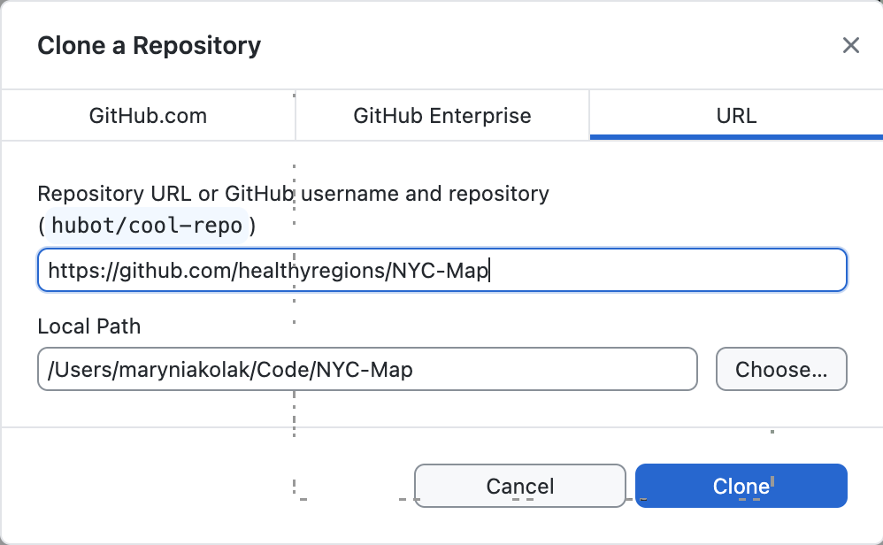

### Start Coding

- Open up your coding project folder. You'll see the README file that was initialized in the Repo.

- In your code editing software, create a new file, and name it "index.html."


### Basics of an HTML page

In our very simple application, we will use the basics of an html page: the head and body.

- In the `head`, we'll add some metadata like the title of our map. Additionally, crucial libraries for styling and functionalities will be loaded in as CSS and Javascript (JS) links. 

- In the `body`, we'll prepare to bring in two divs, or "divisions." One will be a map div, that calls the mapbox basemap we made in an earlier module. The other will overlay a transparent panel that will serve as our legend. We add a heading 1 level title, "NYC Map" to start.

Learn more about the basics of HTML using free online educational tools like [W3 Schools](https://www.w3schools.com/html/html_basic.asp). For now, it's okay to just copy and paste the information below.

<details markdown='1'><summary>Show HTML App Code</summary>
```{r eval=FALSE}

<!DOCTYPE html>
<html>

<head>

	<meta charset="utf-8" />

	<title>NYC Map </title>

	<meta name="viewport" content="initial-scale=1,maximum-scale=1,user-scalable=yes" /> 

	<!-- CSS only -->
	<link rel="stylesheet" href="https://stackpath.bootstrapcdn.com/bootstrap/4.5.0/css/bootstrap.min.css" integrity="sha384-9aIt2nRpC12Uk9gS9baDl411NQApFmC26EwAOH8WgZl5MYYxFfc+NcPb1dKGj7Sk" crossorigin="anonymous">
	<link href="https://api.mapbox.com/mapbox-gl-js/v2.14.1/mapbox-gl.css" rel="stylesheet">
	<link href="main-style.css" rel="stylesheet">
	<link rel="preconnect" href="https://fonts.googleapis.com">
	<link rel="preconnect" href="https://fonts.gstatic.com" crossorigin>
	<link href="https://fonts.googleapis.com/css2?family=Nunito+Sans:opsz,wght@6..12,200;6..12,300;6..12,400;6..12,700&family=Roboto+Slab:wght@400;500&display=swap" rel="stylesheet">

	<!-- JS only -->
	<script src="https://stackpath.bootstrapcdn.com/bootstrap/4.5.0/js/bootstrap.min.js" integrity="sha384-OgVRvuATP1z7JjHLkuOU7Xw704+h835Lr+6QL9UvYjZE3Ipu6Tp75j7Bh/kR0JKI" crossorigin="anonymous"></script>
	<script src="https://api.mapbox.com/mapbox-gl-js/v2.14.1/mapbox-gl.js"></script>

	<style> 
		body { margin: 0; padding: 0; } 
		#map { position: absolute; top: 0; bottom: 0; width: 100%; }; 
	</style> 

</head>


<body> 

	<div class="panel">
  
        <h1 > NYC Map </h1>
    	
	</div>

	<div id='map'> </div> 

</body>
```
</br></br></details>

To render the html page, simple drag and drop the .html file from your folder on your computer into a web browser. Right now, there should be nothing except a title, "NYC Map" -- we've just loaded in some libraries, and that's it!

#### Add your Mapbox Map {-}

Using the code snippet provided from Mapbox, we can add our basemap. Add this script after the map div, and within the body section.

<details markdown='1'><summary>Show Mapbox Script </summary>
```{r eval=FALSE}
	<script> 

        <!-- Temp -- Need to push to Github Environmental Secret -->
        mapboxgl.accessToken = 'pk.eyJ1IjoiY2Rpc2NlbnphIiwiYSI6ImNsbzhwb25rYjAyeGYya21rd20xZ3U1ZHgifQ.5tbPqubrrKekGR12uOHN_Q';
    
            var map = new mapboxgl.Map({ 
            container: 'map', 
            style: 'mapbox://styles/cdiscenza/clvmny7ym06yv01nug1kbefwd', 
            zoom: 10,  
            minZoom: 5.3,                                               
            center: [-74.03638858449402 , 40.68048994718785]                         
    
         }); 
    
    
        // Add zoom and rotation controls to the map.
        var nav = new mapboxgl.NavigationControl();
            
            map.addControl(nav, 'top-right');
            
    </script>
          
```
</br></br></details>

Refresh your app in your web browser! It should look like this: 

{width=95%}

:::pitfall
**Pitfall**

In this example, we are exposing an API token. This is not good practice!  Add more here...

::::

### Add a Panel Legend 

We're going to hack out a legend. The official way to do this can be found via a [mapbox tutoria](https://docs.mapbox.com/help/tutorials/choropleth-studio-gl-pt-2/). Here, let's generate a temporary option with less fuss. lUsing our panel and HTML, we'll add a description of the data we have in our map.

#### Add custom CSS {-}

Generate a new file in your coding project called "main-style.css". Copy and past the following code, and save.

<details markdown='1'><summary>Show Custom CSS Code </summary>
```{r eval=FALSE}

.panel {
    position: absolute;
    top: 50px;
    left: 40px;
    width: 380px;
    max-height: 660px; 
    opacity: .9;
    background: #fff ;
    color: #545454;
    padding: 20px 24px 12px 24px;
    height: 85%;
    overflow-x: hidden;
    overflow-y: auto;
    outline: none;
    z-index: 9092;
    border-radius: 0px 0px 10px 0px;
  }

h1 {
  font-family: 'Nunito Sans', serif;
  font-weight: 900;
}

p {
  font-family: 'Nunito Sans', sans-serif;
    font-weight: 400;

}

p.temp {
  font-family: 'Nunito Sans', serif;
    font-weight: 300;
    font-size: 12px;
    line-height: 1.2;

}

a {
  font-family: 'Nunito Sans', sans-serif;
  color: #2f5aa8;

}
```
</br></br></details>

#### "Hack" a Legend {-}

Go back to your Mapbox account, and record the intervals of each bin of your choropleth map. Take a screenshot of each corresponding color swatch; then, rename those swatched, and add to a new folder called "images" in your coding project folder.

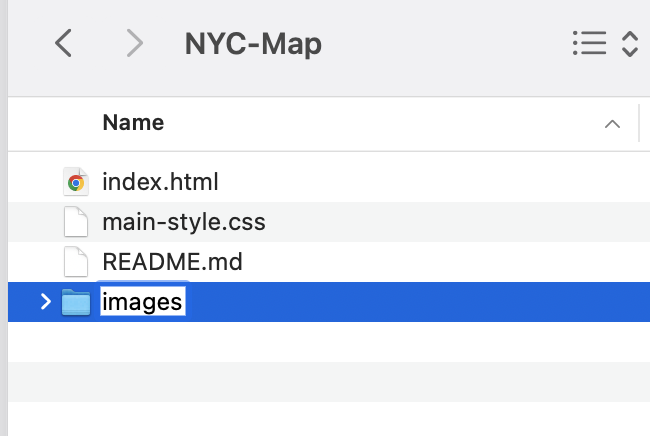{width=40%}

This is a prototype -- not a final project! The goal is to get something working quickly, and it may not be pretty when you open the hood. But, it's possible to get a working app with some HTML, CSS, and grease!

#### Add to your Panel {-}

In your main index file, you can now add more content to your panel. Give the map panel some additional helper text using the "text-muted" class, and add horizontal lines using the `<hr>` tag to keep it classy. Use the legend swatches, resized, and update the corresponding interval. 

<details markdown='1'><summary>Show index.html Panel Code </summary>
```{r eval=FALSE}

	<div class="panel">
    	
        <h1 > NYC Neighborhood & Health Map </h1>
    	
    	<p class="text-muted"> Health Equity across City Neighborhoods. See XXX for more details. </a> </p>

    	<hr>

        <h5> Proportion of Neighborhood Residents Self-Identified as Black or African American </h5>

    	<p><b> 0.0% </p>

        <p><b> 0.01 - 22.77% </p>

        <p><b> 22.78 - 45.54% </p>

        <p><b> 45.55 - 68.2% </p>    	
        
        <p><b> 68.3 - 91.0% </p>

        <p><b> 91.1% </p>

    	<hr>

    	<p class="temp"> <b>Data Sources:</b> NYC Data, 2019. </p>

    	
	</div>
```
</br></br></details>

### Finalize and Push 

Run the app in your browser as you go to ensure you can troubleshoot any bugs that come up. 


<details markdown='1'><summary>Final index.html Code </summary>
```{r eval=FALSE}

<!DOCTYPE html>
<html>

<head>

	<meta charset="utf-8" />

	<title></title>

	<meta name="viewport" content="initial-scale=1,maximum-scale=1,user-scalable=yes" /> 

	<!-- CSS only -->
	<link rel="stylesheet" href="https://stackpath.bootstrapcdn.com/bootstrap/4.5.0/css/bootstrap.min.css" integrity="sha384-9aIt2nRpC12Uk9gS9baDl411NQApFmC26EwAOH8WgZl5MYYxFfc+NcPb1dKGj7Sk" crossorigin="anonymous">
	<link href="https://api.mapbox.com/mapbox-gl-js/v2.14.1/mapbox-gl.css" rel="stylesheet">
	<link href="main-style.css" rel="stylesheet">
	<link rel="preconnect" href="https://fonts.googleapis.com">
	<link rel="preconnect" href="https://fonts.gstatic.com" crossorigin>
	<link href="https://fonts.googleapis.com/css2?family=Nunito+Sans:opsz,wght@6..12,200;6..12,300;6..12,400;6..12,700&family=Roboto+Slab:wght@400;500&display=swap" rel="stylesheet">


	<!-- JS only -->
	<script src="https://stackpath.bootstrapcdn.com/bootstrap/4.5.0/js/bootstrap.min.js" integrity="sha384-OgVRvuATP1z7JjHLkuOU7Xw704+h835Lr+6QL9UvYjZE3Ipu6Tp75j7Bh/kR0JKI" crossorigin="anonymous"></script>
	<script src="https://api.mapbox.com/mapbox-gl-js/v2.14.1/mapbox-gl.js"></script>

	<style> 
		body { margin: 0; padding: 0; } 
		#map { position: absolute; top: 0; bottom: 0; width: 100%; }; 
	</style> 

</head>


<body> 

	<div class="panel">
    	
        <h1 > NYC Neighborhood & Health Map </h1>
    	
    	<p class="text-muted"> Health Equity across City Neighborhoods. See XXX for more details. </a> </p>

    	<hr>

        <h5> Proportion of Neighborhood Residents Self-Identified as Black or African American </h5>

    	<p><b> 0.0% </p>

        <p><b> 0.01 - 22.77% </p>

        <p><b> 22.78 - 45.54% </p>

        <p><b> 45.55 - 68.2% </p>    	
        
        <p><b> 68.3 - 91.0% </p>

        <p><b> 91.1% </p>

    	<hr>

    	<p class="temp"> <b>Data Sources:</b> NYC Data, 2019. </p>

    	
	</div>

	<div id='map'> </div> 

	<script> 

        <!-- Temp -- Need to push to Github Environmental Secret -->
        mapboxgl.accessToken =   'pk.eyJ1IjoiY2Rpc2NlbnphIiwiYSI6ImNsbzhwb25rYjAyeGYya21rd20xZ3U1ZHgifQ.5tbPqubrrKekGR12uOHN_Q';
    
            var map = new mapboxgl.Map({ 
            container: 'map', 
            style: 'mapbox://styles/cdiscenza/clvmny7ym06yv01nug1kbefwd', 
            zoom: 10,  
            minZoom: 5.3,                                               
            center: [-74.03638858449402 , 40.68048994718785]                         
    
         }); 
    
    
        // Add zoom and rotation controls to the map.
        var nav = new mapboxgl.NavigationControl();
            
            map.addControl(nav, 'top-right');

            
    </script>


</body>

</html>
```
</br></details></br></br></details>

<details markdown='1'><summary> Push local code up back to Github's main servers. </summary>
- Go back to Github Desktop. Add a short comment (ex. "push initial map"), Commit to Main, and then Push to Origin.

{width=95%}
</br></details></br></br></details>

<details markdown='1'><summary> Confirm things worked, and serve your map </summary>

Return to Github's website repository. You'll see your updates live on the Github site. Finally, use what you learned previouslly to serve your map using Github Pages. 
</br></details></br></br></details>

When you're ready, work through additional [Github Tutorials]() to get more familiar with the "push and pull" process of working with code this way. This is just the beginning!

### Resources {-}
- Learning HTML & CSS: 
- Learning Javascript: 
- Learning Mapbox GL: 
- Learning Github ProcessesL: 


## Dashboards with R Shiny

### Getting Started {-}

Once you have a solid sense of R (see previous modules and recommended tutorials), you may be ready to make your first app! To develop an application quickly, we use the `shiny` package. Shiny is a web application framework for R that makes it easy to build interactive web apps straight from R. This particular application allows users to explore various demographic metrics through interactive maps and charts.

```{r eval=FALSE}
install.packages("shiny")
```


We recommend going through the [beginner lessons on Shiny applications](https://shiny.posit.co/r/getstarted/shiny-basics/lesson1/index.html) at Posit before diving into your app development directly. Get familiar with the basics, practice, and explore different example apps for ideas. 

{width=95%}

As you go through these, resist the urge to try to incorporate everything into your own app. Follow the design-thinking process, user input, and diagrams you built in previous modules!

A Shiny app can be contained in a single script, `app.R`, which will have the following three components:

- a user interface object

- a server function

- a call to the `shinyApp` function

### User Interface

You can define the layout of your application using the user inferface, defining what goes where, how it looks, and what events are triggered. Upon loading the site, a default plot may be triggered to be oupit. A user may also select specific items within the user interface, like a variable from a drop-down panel, or sliding a slider. 

Using the [example](https://shiny.posit.co/r/getstarted/shiny-basics/) from Shiny's official tutorial, copy and paste the following into a new file you'll save as `app.R` in a folder on your computer. 

To run within RStudio, click the "Knit" icon at the top of your code.

```{r class.source = 'fold-hide', eval=FALSE}
library(shiny)
library(bslib)

# Define UI ----
ui <- page_sidebar(
)

# Define server logic ----
server <- function(input, output) {
}

# Run the app ----
shinyApp(ui = ui, server = server)
```

Following the same example, add a title to your application, a sidebar, and a main section. In this example, we'll make a an on SDOH indicators in NYC.

```{r class.source = 'fold-hide', eval=FALSE}
library(shiny)
library(bslib)

# Define UI ----
ui <- 
  page_sidebar(
    title = "NYC SDOH App",
    sidebar = sidebar("sidebar"),
    "main contents"
  )

# Define server logic ----
server <- function(input, output) {
}

# Run the app ----
shinyApp(ui = ui, server = server)
```

Next, let's add a drop down variable selection for a variable of interest we'd like to explore in the app. For example, we may want to examine data by self-identified race and ethnicity, as reported by neighborhood via the Census. We'll add a drop-down widget, and "helper text" to explain what the user should do.

Try to do this on your own first. Then, check the code below! 

<details markdown='1'><summary>Show Code</summary>
```{r class.source = 'fold-hide', eval=FALSE}
library(shiny)
library(bslib)

# Define UI ----
ui <- 
  page_sidebar(
    title = "NYC SDOH App",
    sidebar = sidebar(
      
      helpText("Select different variables from the dropdown menus to explore the data."),
      
      selectInput("color", "Self-Identified Race & Ethnicity:",
                  choices = c("Percent Black" = "pctblack",
                              "Percent Hispanic" = "pcthisp",
                              "Percent White" = "pctwhite"),
                  selected = "pctblack"),
    ),
  )

# Define server logic ----
server <- function(input, output) {
}

# Run the app ----
shinyApp(ui = ui, server = server)
```
</br></br></details>

Ensure you're running each time that you add, edit, or change anything. This helps with the troubleshooting process! By now, your application will be looking like this:

{width=95%}

Continue to explore the different layouts, widgets, themes, and options available to you in the Shiny documentation.

### Server

When we're running the application, we're actually using our computer as the server. Let's connect our dropdown to data we'll load in -- NYC data -- and use the user selection to generate a map. 

We recommend getting the script to work in an R script on its own before plugging in, to confirm that it will work the way you need it to. De-bugging can be tricky in more complex applications, so anything you can do to support your process will be beneficial.

We'll jump a few steps ahead, to show what the full set up can look like for adding a map that is linked to user input:

<details markdown='1'><summary>Show Full App Code</summary>
```{r eval=FALSE}
library(shiny)
library(leaflet)
library(sf)
library(plotly)
library(dplyr)

# Load data ----
nyc_data <- st_read("NYC_nbrhd_data.geojson", quiet = TRUE)
nyc_data <- st_make_valid(nyc_data)
map_data <- st_transform(nyc_data, crs = 4326)

# Define UI ----
ui <- 
  page_sidebar(
    title = "NYC SDOH App",
    sidebar = sidebar(
      
      helpText("Select different variables from the dropdown menus to explore the data."),
      
      selectInput("color", "Self-Identified Race & Ethnicity:",
                  choices = c("Percent Black" = "pctblack",
                              "Percent Hispanic" = "pcthisp",
                              "Percent White" = "pctwhite"),
                  selected = "pctblack")),
      
      mainPanel(
        ## Add a map
        (leafletOutput("map", width = "100%")
        )))
  
# Define server logic ----
server <- function(input, output, session) {
    
    # Map output for Racial Demographics
    output$map <- renderLeaflet({

      valid_data <- map_data[!is.na(map_data[[input$color]]), ]
      
      pal <- colorQuantile("PuBuGn", valid_data[[input$color]], n = 5)
      
      leaflet(valid_data) %>%
        addProviderTiles(providers$CartoDB.Positron) %>%
        addPolygons(
          fillColor = ~pal(valid_data[[input$color]]),
          fillOpacity = 0.7, weight = 1, color = "white",
          popup = ~paste(NTAName, "<br>",
                         paste(input$color, ":", round(valid_data[[input$color]], 2), "%"))
        ) %>%
        setView(lng = -73.935242, lat = 40.730610, zoom = 10)
    })
  }

# Run the app ----
shinyApp(ui = ui, server = server)
```
</br></br></details>

Which renders the following:

{width=95%}

Inspect how the map output call was added to the UI. In the server function, the map data is slightly cleaned (from debugging in a script on its own), and a color palette is indicated using a ColorBrewer selection. Then, we use leaflet to visualize the variable selected by the user. We have found that leaflet is more responsive than tmap when using Shiny apps, though be sure to explore new options on your own!

### Expand Your Prototype

It's easier to get a basic prototype up and running. Now the fun and frustrating part begins! Start editing, updating, refining, and getting closer to your final goal. Multiple updates are included in these refinements of our expanded prototype across UI and Server settings, including:

- Addition of new tabs with addtional variables, visualizations, and content about the project.

- Integration of a new Shiny library, 'shinythemes'. After exploring how to add and update a new theme, the library was installed, and a call made in the final part of the application. (Hint: look for the 'yeti' theme in the final code.) Get more ideas at [Shiny Themes](https://rstudio.github.io/shinythemes/).

- Improvements on performance via lots of 'tinkering' and testing. A slow scatterplot was fixed by removing the spatial components of the dataset, using the `st_drop_geometry()` call in the `sf` framework. A list of neighborhood names was made alphabetical. And so much more... 

Look for some of the "easter eggs" in code snippets below, and see how you can improve and refine further! The app could get even more fine-tuned, "reactive" (and less reptitive in coding output), and styled further.

#### Updated User Interface {-}

In our extension, we want the final UI organize into three main tabs, allowing users to interactively explore different facets of the NYC neighborhood data. For this example, we'll try using tabs instead of a sidebar. Try blending both styles, and keeping the bootstrap library used in our initial example as a challenge.

##### Tab 1: Map & Racial Demographics {-}

In the first tab, we'll features a map and a demographic chart, with controls for selecting demographic variables and neighborhoods. Here are the explanation for some functions that we used below:

- `selectInput` for variable of interest: Allows users to select which `variable` statistic to visualize on the map.
- `selectInput` for neighborhood: Enables users to pick a specific neighborhood for detailed demographic breakdown in the chart.
- `leafletOutput` and `plotlyOutput`: Reserved spaces in the UI for displaying the map and the chart respectively.


<details markdown='1'><summary>Show Tab 1 UI Code </summary>
```{r eval=FALSE}
tab1_ui <- tabPanel("Self-Identified Race & Ethnicty",
                    sidebarLayout(
                      sidebarPanel(
                        p("Select different variables from the dropdown menus to explore the data."),
                        selectInput("race", "Self-Identified Race & Ethnicity:",
                                    choices = c("Percent Asian & Pacific Islander" = "pctapi",
                                                "Percent Black" = "pctblack",
                                                "Percent Hispanic" = "pcthisp",
                                                "Percent White" = "pctwhite",
                                                "Percent Other Identified Race" = "pctother"),
                                    selected = "pctblack"),
                     
                        selectInput("neighborhood", "NYC Neighborhood:",
                                    choices = str_sort(nyc_data$NTAName),
                                    selected = "Pelham Bay-Country Club-City Island"),
                        
                        helpText("Data source: NYC Neighborhood Data"),
                        
                        br(),
                        
                        h3("Racial & Ethnic Disparities"),
                        
                        p("Extensive research has shown that racial and ethnic disparities in 
                        quality of care and use of services exist and persist in the United States.
                        Disparities may emerge from unequal access to health care, critical resources
                        such as health foods, housing, and transportation."),
                        br(),
                        p("Explore racial and ethnic population distributions by NYC neighborhood in this tab,
                        and then explore socioeconomic and health trends acrosos the rest of the applications.
                        Identify locations for further analysis."),
                        
                        helpText("Read More: The Commonwealth Fund 2024 State Health Disparities Report")
                        ),
                        
                      mainPanel(
                        fluidRow(leafletOutput("map"),
                                 br(),
                        fluidRow(plotlyOutput("racialDemoChart"))
                        ))
                      )
                    )
```
</br></br></details>

##### Tab 2: Socioeconomic Demographics {-}

Similar in structure to Tab 1, now let's create the Tab 2, which focuses on socioeconomic indicators such as poverty levels and rent burden.

<details markdown='1'><summary>Show Tab 2 UI Code </summary>
```{r eval=FALSE}
tab2_ui <- tabPanel("Socioeconomic Demographics",
                    sidebarLayout(
                      sidebarPanel(
                        selectInput("color_socio", "Demographic variable:",
                                    choices = c("Percent in Poverty" = "pctpov",
                                                "Rent < 30% of Income" = "rent.30",
                                                "Rent < 50% of Income" = "rent.50"),
                                    selected = "pctpov"),
                        selectInput("neighborhood_socio", "Select Neighborhood:",
                                    choices = str_sort(nyc_data$NTAName),
                                    selected = "Pelham Bay-Country Club-City Island"),
                        
                        helpText("Data source: NYC Neighborhood Data"),
                        
                        br(),
                        
                        h3("Socioeconomic Disparities"),
                        
                        p("Nulla suscipit, purus ac varius sagittis, velit lorem condimentum ipsum, sit amet auctor sem tellus a leo. Aenean faucibus hendrerit diam non rutrum. Proin nec nisi dolor. Nam egestas dolor sapien, eget pellentesque neque tincidunt nec. Phasellus mattis pulvinar tincidunt. Phasellus eget condimentum nisl. Praesent dapibus dui elit, id fringilla quam interdum vel. Praesent vestibulum nulla et rutrum ornare. Donec cursus felis dui, et auctor nisi pulvinar ac. Suspendisse placerat ex sed arcu semper volutpat. Donec commodo consequat ornare. Aenean est lectus, semper at luctus sit amet, bibendum vitae augue. Donec risus felis, commodo eget tristique vitae, imperdiet in risus."),
                        
                        helpText("Read More: Include text here ")
                      ),
                      mainPanel(
                        fluidRow(leafletOutput("map_socio"),
                                 br(),
                        fluidRow(plotlyOutput("socioDemoChart"))
                        )
                      )
                    )
)
```
</br></br></details>

##### Tab 3: Severe Maternal Morbidity & Preterm Birth Rates {-}

In Tab 3, we want to introduces more health-related variables, displaying a map and a scatter plot. The scatter plot takes time to load, so further de-bugging may be necessary. Try alternate libraries, styles, and new approaches to refine further.

<details markdown='1'><summary>Show Tab 3 UI Code </summary>
```{r eval=FALSE}
tab3_ui <- tabPanel("Severe Maternal Morbidity & Preterm Birth Rates",
                    sidebarLayout(
                      sidebarPanel(
                        selectInput("color_health", "Health variable:",
                                    choices = c("Severe Maternal Morbidity Rate" = "smmrate",
                                                "Preterm Birth Rate" = "ptbrate"),
                                    selected = "smmrate"),
                        
                        helpText("Data source: NYC Neighborhood Data"),
                        
                        br(),
                        
                        h3("Maternal Health Outcomes"),
                        
                        p("Pellentesque nisl ipsum, bibendum non porttitor eget, lobortis sit amet arcu. Aliquam et erat nec nisi fermentum aliquet non a massa. Mauris vel sapien justo. Sed fermentum sed purus ut fringilla. Aliquam pulvinar, ligula ac ornare rutrum, est ipsum tristique metus, non imperdiet nibh ligula id elit. Proin ac dui in ligula finibus facilisis. Quisque at vulputate nulla, sit amet varius nunc. In eu cursus quam. In diam est, tristique sit amet nunc nec, vehicula hendrerit odio. Phasellus est turpis, vulputate eu suscipit sit amet, semper at enim. Vivamus sit amet risus leo. Vestibulum porttitor feugiat ipsum, ut volutpat erat pharetra quis. Suspendisse interdum ultrices nisi vel finibus. Aliquam lobortis sed arcu eget ornare."),
                        
                        helpText("Read More: Include text here ")
                      ),
                      mainPanel(
                        fluidRow(leafletOutput("map_health"),
                                 br(),
                        fluidRow(plotlyOutput("healthScatterChart"))
                        )
                      )
                    )
)
```
</br></br></details>

##### Tab 4: About {-}

Finally, we also want to include a Tab 4 that provides contextual information about the application, explaining its purpose and the data source.

We are making a prototype, so use some "Lorem Ipsum" placeholder language that we can update in the future.

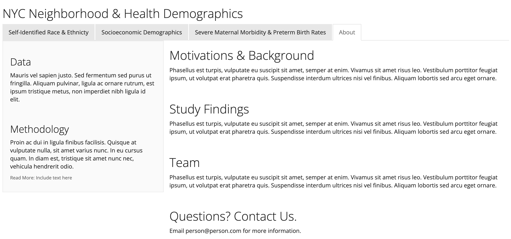

<details markdown='1'><summary>Show Tab 4 About Code </summary>
```{r eval=FALSE}
tab4_ui <- tabPanel("About",
                    sidebarLayout( 
                      sidebarPanel(
                        
                        h3("Data"),
                        
                        p("Mauris vel sapien justo. Sed fermentum sed purus ut fringilla. Aliquam pulvinar, 
                          ligula ac ornare rutrum, est ipsum tristique metus, non imperdiet nibh ligula id 
                          elit."), 
                                                           br(),
                          
                        
                        h3("Methodology"),
                        
                        p("Proin ac dui in ligula finibus facilisis. Quisque at vulputate nulla, sit
                          amet varius nunc. In eu cursus quam. In diam est, tristique sit amet nunc nec, 
                          vehicula hendrerit odio. "),
                        
                        helpText("Read More: Include text here ")
                      ),
                      mainPanel(
                        fluidRow( 
                        
                          h2("Motivations & Background"),
                          p("Phasellus est turpis, vulputate eu suscipit sit amet, 
                          semper at enim. Vivamus sit amet risus leo. Vestibulum porttitor feugiat ipsum, 
                          ut volutpat erat pharetra quis. Suspendisse interdum ultrices nisi vel finibus. 
                          Aliquam lobortis sed arcu eget ornare."),
                                
                                br(),
                        
                          h2("Study Findings"),
                          p("Phasellus est turpis, vulputate eu suscipit sit amet, 
                            semper at enim. Vivamus sit amet risus leo. Vestibulum porttitor feugiat ipsum, 
                            ut volutpat erat pharetra quis. Suspendisse interdum ultrices nisi vel finibus. 
                            Aliquam lobortis sed arcu eget ornare."),
                        
                        br(),
                        
                        h2("Team"),
                        p("Phasellus est turpis, vulputate eu suscipit sit amet, 
                          semper at enim. Vivamus sit amet risus leo. Vestibulum porttitor feugiat ipsum, 
                          ut volutpat erat pharetra quis. Suspendisse interdum ultrices nisi vel finibus. 
                          Aliquam lobortis sed arcu eget ornare."),
                        
                        br(),
                        
                        h2("Questions? Contact Us."),
                        p("Email person@person.com for more information."),
                        
                        ))))

```
</br></br></details>


#### Define Server Logic

After define the user interface, we will move on to define the server logic. It processes user inputs from the UI and updates the outputs (maps and charts). It dynamically reacts to user interactions such as selecting a neighborhood or a demographic variable.

##### Server Logic for Tabs {-}

Now, we will create server code to handle the dynamic visualization of racial demographics within New York City neighborhoods in Tab 1. It renders an interactive map and a bar chart based on user inputs, showing the distribution of different racial groups. The map highlights neighborhoods with varying demographic densities, while the bar chart provides detailed statistics for a selected neighborhood.

The server functions for other tabs follow a similar structure but focus on different data attributes. So, let's define the server logic for other three tabs.

<details markdown='1'><summary>Show Tab 1 Server Code </summary>
```{r eval=FALSE}
tab1_server <- function(input, output, session) {
  
  # Map output for Racial Demographics
  output$map <- renderLeaflet({
    
    valid_data <- nyc_data[!is.na(nyc_data[[input$race]]), ]
    pal <- colorQuantile("viridis", valid_data[[input$race]], n = 5)
    
    leaflet(valid_data) %>%
      addProviderTiles(providers$CartoDB.Positron) %>%
      addPolygons(
        fillColor = ~pal(valid_data[[input$race]]),
        fillOpacity = 0.7, weight = 1, color = "white",
        popup = ~paste(NTAName, "<br>",
                       paste(input$race, ":", round(valid_data[[input$race]], 2), "%"))
      ) %>%
      
      addLegend(
        position = "bottomright",
        pal = pal,
        values = valid_data[[input$race]],
        title = "% of population"
      )  %>%
      
      setView(lng = -73.935242, lat = 40.730610, zoom = 10)
  })
  
  # Racial Demographics chart
  output$racialDemoChart <- renderPlotly({
    chart_data <- nyc_data[nyc_data$NTAName == input$neighborhood, ]
    
    # Extract data and remove "geometry" column
    racial_data <- st_drop_geometry(chart_data)
    
    racial_data <- racial_data[, c("pctblack", "pcthisp", "pctwhite", "pctapi", "pctother")]
    
    racial_data <- t(racial_data)
    racial_data <- as.data.frame(racial_data)
    racial_data <- cbind(Race = rownames(racial_data), Percentage = racial_data[, 1])
    rownames(racial_data) <- NULL
    
    plot_ly(data = as.data.frame(racial_data), x = ~Race, y = ~Percentage, type = 'bar', color = ~Race) %>%
      layout(title = paste("Racial Demographics -", input$neighborhood),
             xaxis = list(title = "Race"),
             yaxis = list(title = "Percentage", range = c(0, 100), tickvals = seq(0, 100, 20)))
  })
}
```
</br></br></details>

<details markdown='1'><summary>Show Tab 2 Server Code </summary>
```{r eval=FALSE}
tab2_server <- function(input, output, session) {
  
  # Map output for Socioeconomic Demographics
  output$map_socio <- renderLeaflet({
    
    valid_data <- nyc_data[!is.na(nyc_data[[input$color_socio]]), ]
    pal <- colorQuantile("viridis", valid_data[[input$color_socio]], n = 5)
    
    leaflet(valid_data) %>%
      addProviderTiles(providers$CartoDB.Positron) %>%
      addPolygons(
        fillColor = ~pal(valid_data[[input$color_socio]]),
        fillOpacity = 0.7, weight = 1, color = "white",
        popup = ~paste(NTAName, "<br>",
                       paste(input$color_socio, ":", round(valid_data[[input$color_socio]], 2), "%"))
      ) %>%
      
      addLegend(
        position = "bottomright",
        pal = pal,
        values = valid_data[[input$color_socio]],
        title = "% of population"
      )  %>%
      
      setView(lng = -73.935242, lat = 40.730610, zoom = 10)
  })
  
  # Socioeconomic Demographics chart
  output$socioDemoChart <- renderPlotly({
    chart_data <- nyc_data_df[nyc_data_df$NTAName == input$neighborhood_socio, ]
    
    # Extract data and remove "geometry" column
    socio_data <- st_drop_geometry(chart_data)
    
    socio_data <- socio_data[, c("pctpov", "rent.30", "rent.50")]
    
    socio_data <- t(socio_data)
    socio_data <- as.data.frame(socio_data)
    socio_data <- cbind(Category = rownames(socio_data), Percentage = socio_data[, 1])
    rownames(socio_data) <- NULL
    
    plot_ly(data = as.data.frame(socio_data), x = ~Category, y = ~Percentage, type = 'bar', color = ~Category) %>%
      layout(title = paste("Socioeconomic Demographics -", input$neighborhood_socio),
             xaxis = list(title = "Category"),
             yaxis = list(title = "Percentage", range = c(0, 100), tickvals = seq(0, 100, 20)))
  })
}
```
</br></br></details>

<details markdown='1'><summary>Show Tab 3 Server Code </summary>
```{r eval=FALSE}
tab3_server <- function(input, output, session) {
  
  # Map output for Health Demographics
  
  output$map_health <- renderLeaflet({
    
    valid_data <- nyc_data[!is.na(nyc_data[[input$color_health]]), ]
    pal <- colorBin("viridis", valid_data[[input$color_health]], pretty = FALSE, n = 5)
    
    leaflet(valid_data) %>%
      addProviderTiles(providers$CartoDB.Positron) %>%
      addPolygons(
        fillColor = ~pal(valid_data[[input$color_health]]),
        fillOpacity = 0.7, weight = 1, color = "white",
        popup = ~paste(NTAName, "<br>",
                       paste(input$color_health, ":", round(valid_data[[input$color_health]], 2)))
      ) %>%
      
      addLegend(
        position = "bottomright",
        pal = pal,
        values = valid_data[[input$color_health]],
        title = "Rate per X,000 persons"
      )  %>%
      
      setView(lng = -73.935242, lat = 40.730610, zoom = 10)
  })
  
  # Health Demographics scatter plot
  
  output$healthScatterChart <- renderPlotly({
    
    plot_ly(nyc_data_df, x = ~smmrate, y = ~ptbrate, text = ~NTAName, type = 'scatter') %>%
      layout(title = "Severe Maternal Morbidity vs Preterm Birth Rates",
             xaxis = list(title = "Severe Maternal Morbidity Rate", zeroline = TRUE),
             yaxis = list(title = "Preterm Birth Rate", zeroline = TRUE))
  })
}
```
</br></br></details>

The goal in the third tab is to generate an interactive scatter plot to exist alongside the choropleth map selection. Here's a preview of what the final application page will look like:


#### Run the Application 

Combine all tabs into a single UI object. In a final step, we combine the server logic for all tabs and define the overall UI layout to launch the application. 

<details markdown='1'><summary>Show UI Summary Code </summary>
```{r eval=FALSE}
ui <- fluidPage(
  titlePanel("NYC Neighborhood Demographics"),
  tabsetPanel(
    tab1_ui,
    tab2_ui,
    tab3_ui,
    tab4_ui
  )
)
```
</br></br></details>

<details markdown='1'><summary>Show Server Summary Code </summary>
```{r eval=FALSE}
# Combine server logic for all tabs
server <- function(input, output, session) {
  tab1_server(input, output, session)
  tab2_server(input, output, session)
  tab3_server(input, output, session)
}

# Run the application
shinyApp(ui = ui, server = server)
```
</br></br></details>

The final application will render as the following. Inspect the full code [here](), and continue to refine to improve your prototype.

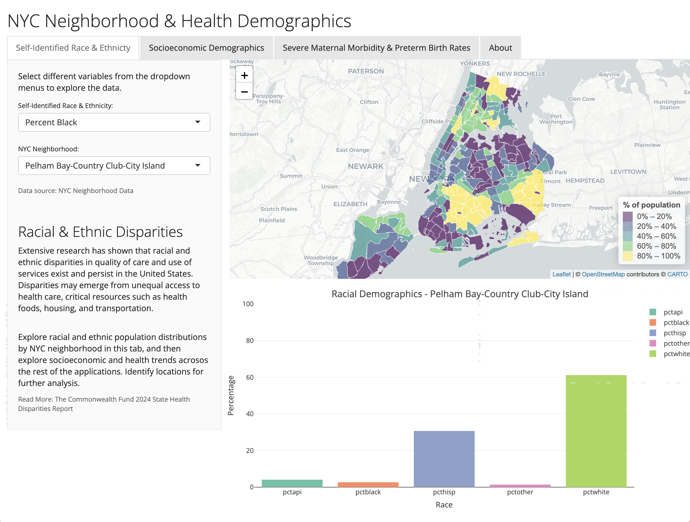

This Shiny application offers an interactive exploration of demographic data across New York City neighborhoods. Users can interactively analyze racial and socioeconomic information through dynamically updated maps and charts. The application highlights how R and Shiny can be used to build engaging and informative data visualizations.

### More Shiny Resources: {-}

- Try out new themes with x and x
- Quarto
- Once you're happy with your final application, it's time to serve it! Check out tutorials like X and X to make it public


<!--chapter:end:06-appdev-code.Rmd-->

# References {-} 

## Module 1 {-}

- Agency for Healthcare Research and Quality. (n.d.).  Data Visualizations https://www.ahrq.gov/data/data-visualization/index.html

- Appsilon. (n.d.). Air Quality vs Respiratory Disease. https://connect.appsilon.com/air-quality/

- Babinski, G. (2021).  GIS&T for Equity and Social Justice.  The Geographic Information Science & Technology Body of Knowledge (2nd Quarter 2021 Edition), John P. Wilson (ed.). DOI: 10.22224/gistbok/2021.2.2

- Centers for Disease Control and Prevention’s Division for Heart Disease and Stroke Prevention. (2017, August). Types of thematic maps. Tips for Creating Maps for Public Health. https://www.cdc.gov/dhdsp/maps/gisx/resources/thematic-maps.html

- Centers for Disease Control and Prevention’s Office of Health Equity. (2022, July). What is health equity? https://www.cdc.gov/healthequity/whatis/index.html. 

- Centers for Disease Control and Prevention’s Office of Health Equity. (2022, December) Social Determinants of Health.  https://www.cdc.gov/about/sdoh/index.html

- City Health Dashboard. (2021, July). New Video Series: Moving from Data to Action. https://www.cityhealthdashboard.com/blog-media/1501

- Chandra A, Martin LT, Acosta JD, Nelson C, Yeung D, Qureshi N, Blagg T. Equity as a Guiding Principle for the Public Health Data System. Big Data. 2022 Sep;10(S1):S3-S8. doi: 10.1089/big.2022.0204. PMID: 36070506; PMCID: PMC9508440.

- Douglas JA, Subica AM, Franks L, Johnson G, Leon C, Villanueva S, et al. Using Participatory Mapping to Diagnose Upstream Determinants of Health and Prescribe Downstream Policy-Based Interventions. Prev Chronic Dis 2020;17:200123. DOI: http://dx.doi.org/10.5888/pcd17.200123

- Golebiowska, I., Korycka-Skorupa, J., and Slomska-Przech, K. (2021). Common Thematic Map Types.  The Geographic Information Science & Technology Body of Knowledge (2nd Quarter 2021 Edition), John P. Wilson (ed.). DOI: 10.22224/gistbok/2021.2.7

- Hessler J, Discenza C, Fenn Gilman A,.(2023).The Mapping of Race in America. https://storymaps.arcgis.com/stories/ac998a8425b54e319f61d34ff1a94a0c 

- Leadership Conference Education Fund (2023). Data for Equity: A Review of Federal Agency Equity Action Plans. https://civilrights.org/wp-content/uploads/2023/04/Data-For-Equity-Report.pdf 

- Kelly, M. (2022). Narrative and Storytelling. The Geographic Information Science & Technology Body of Knowledge (2nd Quarter 2022 Edition), John P. Wilson (Ed.). DOI: 10.22224/gistbok/2022.2.12.

- Kolak M, Bhatt J, Park YH, Padrón NA, Molefe A. (2020) Quantification of Neighborhood-Level  Social Determinants of Health in the Continental United States. JAMA Network Open.;3(1):e1919928. doi:10.1001/jamanetworkopen.2019.19928

- Kolak, M., Li, X., Lin, Q., Wang, R., Menghaney, M., Yang, S., & Anguiano Jr, V. (2021). The US COVID   Atlas: A dynamic cyberinfrastructure surveillance system for interactive exploration of the pandemic. Transactions in GIS, 25(4), 1741-1765.

- Robert Wood Johnson Foundation (2023). Achieving Health Equity. https://www.rwjf.org/en/building-a-culture-of-health/focus-areas/Features/achieving-health-equity.html

- SAMHSA’s Trauma and Justice Strategic Initiative (2014, July) SAMHSA’s Concept of Trauma and Guidance for a Trauma-Informed Approach.

- The Stavros Niarchos Foundation (2021, April) Health initiative progress update. https://uploads.knightlab.com/storymapjs/ddf1b1212ec9c9aac4bebe45196b367d/hi-update-english/index.html

- Pinkus A. (2021) Mapping Climate Risks by County and Community. https://www.americancommunities.org/mapping-climate-risks-by-county-and-community/

- Prestby, T. (2021). Characterizing Storytelling in COVID-19 Cartographic Journalism. Abstracts of the ICA, 3, 245.

- Santilli A, Carroll-Scott A, Wong F, Ickovics J, “Urban Youths Go 3000 Miles: Engaging and Supporting Young Residents to Conduct Neighborhood Asset Mapping”, American Journal of Public Health 101, no. 12 (December 1, 2011): pp. 2207-2210. https://doi.org/10.2105/AJPH.2011.300351

- University of Illinois. (2023). Eat. Move. Save. https://eat-move-save.extension.illinois.edu/#food-finder

- The Urban Institute. (2024). Do No Harm Guide: Crafting Equitable Data Narratives https://www.urban.org/projects/do-no-harm-project 


## Module 2 {-}

- Centers for Disease Control and Prevention. (2022) Heart Disease Death Rates, Total Population Ages 35+

- Chiang, Y-Y. and Lin, Y. (2020). Design, Development, Testing, and Deployment of GIS Applications.  The Geographic Information Science & Technology Body of Knowledge (4th Quarter 2020 Edition), John P. Wilson (Ed.). DOI: 10.22224/gistbok/2020.4.2 

- The Data Foundation. (n.d.) Data Maturity Assessment. https://data.org/dma/ 

- HealthIT.gov (n.d.) Stakeholder Responsibilities and Role Descriptions.  https://www.healthit.gov/sites/default/files/cds/3_5_14_stakeholder_responsibilities_and_role_descriptions.pdf 

- McKinsey & Company (2019) United States of Health Dashboard. https://www.mckinsey.com/industries/public-sector/our-insights/us-public-health-dashboard

- Minnesota Department of Health. (2023). Objectives and goals: Writing meaningful goals and SMART objectives. https://www.health.state.mn.us/communities/practice/resources/phqitoolbox/objectives.html 

- NCFDD. (n.d.). The NCFDD Mentor Map. https://www.ncfdd.org/ncfddmentormap

- Santilli A, Carroll-Scott A, Wong F, Ickovics J, “Urban Youths Go 3000 Miles: Engaging and Supporting Young Residents to Conduct Neighborhood Asset Mapping”, American Journal of Public Health 101, no. 12 (December 1, 2011): pp. 2207-2210. https://doi.org/10.2105/AJPH.2011.300351

- Soma, T., Shulman, T., Li, B., Bulkan, J., & Curtis, M. (2022). Food assets for whom? Community perspectives on food asset mapping in Canada. Journal of Urbanism: International Research on Placemaking and Urban Sustainability, 15(3), 322-339.

- Tulsa Health Department.  (2024, January 30) Data and stats https://tulsa-health.org/services/public-safety-and-data-services/data-and-stats/

## Module 3 {-}

- Data Foundation (2023) Stakeholder Engagement Toolkit for Evidence Building. https://www.datafoundation.org/stakeholder-engagement-toolkit-for-evidence-building-introduction

- Figma (n.d.) How to create a persona. https://www.figma.com/resource-library/how-to-create-a-persona/

- Interaction Design Foundation (2021) How to Conduct Focus Groups. https://www.interaction-design.org/literature/article/how-to-conduct-focus-groups

- Interaction Design Foundation (2024) Card Sorting: The Ultimate Guide. https://www.interaction-design.org/literature/article/the-pros-and-cons-of-card-sorting-in-ux-research

- Nielsen Norman Group (2024) 10 Usability Heuristics for User Interface Design. https://www.nngroup.com/articles/ten-usability-heuristics/

## Module 4 {-}

- https://www.opengeomatics.ca/topology-and-geocoding.html#geocoding 

## Module 5 {-}

- [GeoDa Documentation](https://geodacenter.github.io/documentation.html) remains an ESDA standard to uncover dozens of techniques for discovery.

- Brewer, C. (2016). Designing Better Maps: A Guide for GIS Users, 2nd Edition. ESRI press.

- D'ignazio, C., & Klein, L. F. (2023). Data feminism. MIT press.

- [Center for Spatial Data Science (2024). Scientific Reasoning in Spatial Data Science Education Project. University of Chicago: Center for Spatial Data Science.](https://spatial.uchicago.edu/education/scientific-reasoning)

- Krygier, J., & Wood, D. (2016). Making maps: a visual guide to map design for GIS. Guilford Publications.

- Peterson, G. N. (2020). GIS cartography: a guide to effective map design. CRC Press.

## Module 6 {-}

<!--chapter:end:08-references.Rmd-->

